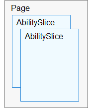
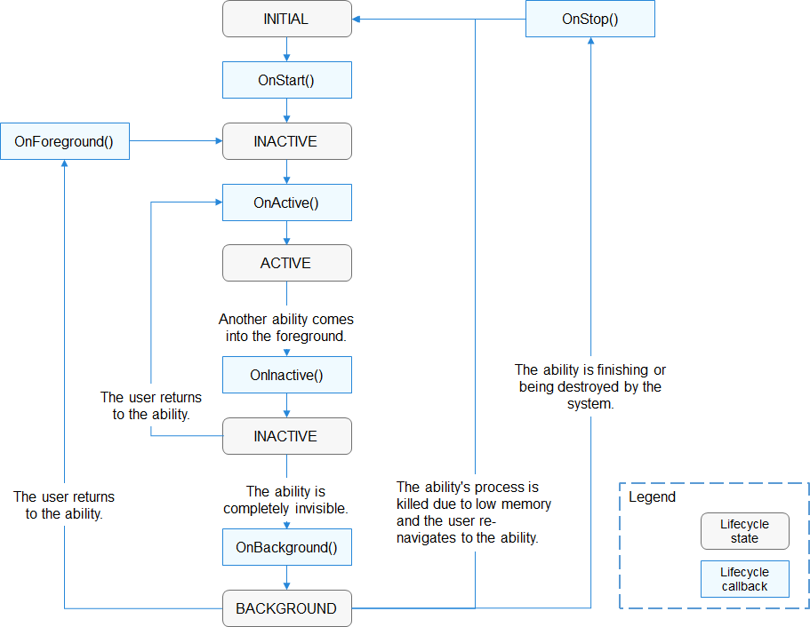
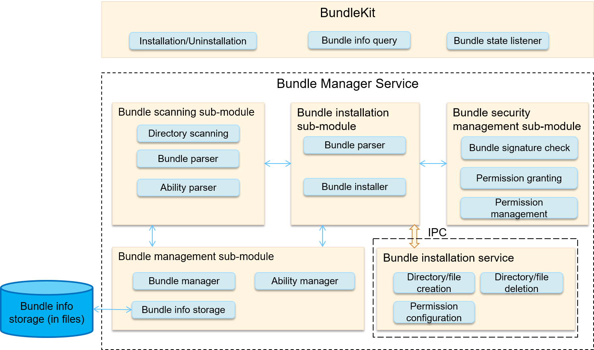
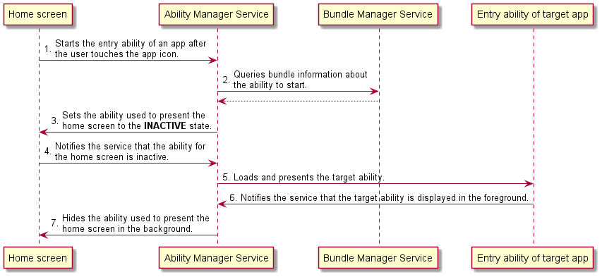

# Overview

The application framework is provided by OpenHarmony for you to develop OpenHarmony applications. It consists of two modules: ability management framework \(also called the ability framework\) and bundle management framework.

## Basic Concepts

This section describes some basic concepts for you to better understand the OpenHarmony application framework before you start development.

## Ability Management Framework

The ability management framework manages running status of OpenHarmony applications.

**Figure  1**  Architecture of the ability management framework  

-   **Ability**  is the minimum unit for the system to schedule applications. It is a component that can implement an independent functionality. An application can contain one or more  **Ability**  instances. There are two types of templates that you can use to create an  **Ability**  instance: Page and Service.
    -   An  **Ability using the Page template**  \(Page ability for short\) provides a UI for interacting with users.

    -   An  **Ability using the Service template**  does not have a UI and is used for running background tasks.

-   An  **AbilitySlice**  represents a single screen and its control logic. It is specific to Page abilities. A Page ability may contain one ability slice or multiple ability slices that provide highly relevant capabilities.

    **Figure  2**  Relationship between a Page ability and its ability slices  
    

-   **Lifecycle**  is a general term for all states of an ability, including  **INITIAL**,  **INACTIVE**,  **ACTIVE**, and  **BACKGROUND**.

    **Figure  3**  Lifecycle state transition of a Page ability  
    

    

    -   **OnStart\(\)**

        This callback is invoked when the system first creates the Page ability. After this callback is executed, the Page ability enters the  **INACTIVE**  state. This callback is triggered only once in the entire lifecycle of each Page ability. You must override this callback and set the default ability slice to be displayed.

    -   **OnActive\(\)**

        This callback is invoked when the Page ability in the  **INACTIVE**  state enters the foreground. After this callback is executed, the Page ability enters the  **ACTIVE**  state, in which it becomes interactive. The Page ability will stay in this state unless it loses focus upon a certain event, for example, when the user touches the Back button or navigates to another Page ability.

        When such an event occurs, the Page ability returns to the  **INACTIVE**  state, and the system invokes the  **OnInactive\(\)**  callback. The Page ability may move to the  **ACTIVE**  state again, and the system will then invoke the  **OnActive\(\)**  callback again. You should implement both  **OnActive\(\)**  and  **OnInactive\(\)**  for a Page ability and use  **OnActive\(\)**  to obtain the resources released in  **OnInactive\(\)**.

    -   **OnInactive\(\)**

        This callback is invoked when the Page ability loses focus, and the Page ability then becomes  **INACTIVE**. You can implement the behavior to perform after the Page ability loses focus.

    -   **OnBackground\(\)**

        This callback is invoked based on the system resource status when the Page ability becomes invisible to the user. After this callback is executed, the Page ability enters the  **BACKGROUND**  state. You should release the resources that are no longer needed after the Page ability becomes invisible or perform time-consuming save operations in this callback.

    -   **OnForeground\(\)**

        A Page ability in the  **BACKGROUND**  state still resides in memory. When the Page ability returns to the foreground \(for example, when the user navigates to this Page ability again\), the system first calls  **OnForeground\(\)**  to switch the Page ability to the  **INACTIVE**  state, and then calls  **OnActive\(\)**  to make it  **ACTIVE**. You should use the  **OnForeground\(\)**  callback to reclaim the resources released in  **OnBackground\(\)**. Currently, the  **OnForeground\(\)**  callback is unavailable to lite devices.

    -   **OnStop\(\)**

        This callback is invoked when the system is destroying a Page ability due to one of the following possible causes:

        -   The user explicitly closes the Page ability using a system management feature, for example, the task manager.
        -   The user behavior, for example, exiting an application, triggers the  **TerminateAbility\(\)**  function on the Page ability.
        -   The system needs to temporarily destroy the Page ability and re-create it due to configuration changes.
        -   The system automatically destroys a Page ability in the  **BACKGROUND**  state due to resource management purposes.

-   **AbilityKit**  is a development kit provided by the ability management framework. You can use this kit to develop applications based on the  **Ability**  component. There are two types of applications developed based on the  **Ability**  component: JS Ability developed using the JavaScript language and Native Ability developed using the C/C++ language. The JS application development framework encapsulates JavaScript UI components on the basis of the AbilityKit and is used to help you quickly develop JS Ability-based applications.
-   **AbilityLoader**  is used to register and load  **Ability**  classes. After creating an  **Ability**  class, you should first call the registration API defined in  **AbilityLoader**  to register the  **Ability**  class name with the ability management framework so that this  **Ability**  can be instantiated when being started.

-   **AbilityManager**  enables inter-process communication \(IPC\) between the AbilityKit and the Ability Manager Service.

-   **EventHandler**  is provided by the AbilityKit to enable inter-thread communication between abilities.

-   The  **Ability Manager Service**  is a system service used to coordinate the running relationships and lifecycle states of  **Ability**  instances. It consists of the following modules:

    -   The service startup module starts and registers the Ability Manager Service.
    -   The service interface management module manages external capabilities provided by the Ability Manager Service.
    -   The process management module starts and destroys processes where  **Ability**  instances are running, and maintains the process information.
    -   The ability stack management module maintains the presentation sequence of abilities in the stack.
    -   The lifecycle scheduling module changes an ability to a particular state based on the current operation of the system.
    -   The connection management module manages connections to Service abilities.

-   **AppSpawn**  is a system service used to create the process for running an ability. This service has high permissions. It sets permissions for  **Ability**  instances and pre-loads some common modules to accelerate application startup.

## Bundle Management Framework

The bundle management framework is provided by OpenHarmony for you to manage application bundles.

**Figure  4**  Architecture of the bundle management framework  

-   **BundleKit**  includes external APIs provided by the Bundle Manager Service, including the APIs for application installation and uninstallation, bundle information query, and bundle state change listeners.
-   The  **bundle scanning sub-module**  parses pre-installed or installed bundles on the local device and extracts information from them for the bundle management module to manage and make the information persistent for storage.
-   The  **bundle installation sub-module**  installs, uninstalls, and updates a bundle. The  **bundle installation service**  is an independent process that communicates with the Bundle Manager Service through IPC. It is used to create or delete installation directories and has high permissions.

-   The  **bundle management sub-module**  manages information related to application bundles and stores persistent bundle information.

-   The  **bundle security management sub-module**  verifies signatures, and grants and manages permissions.

## Working Principles

The Ability Manager Service and Bundle Manager Service are the core modules of the ability management framework and bundle management framework, respectively. The two system-level services are registered and discovered by using the system service framework SAMgr, and they are used by manage abilities and bundles for other processes. The Ability Manager Service and Bundle Manager Service are provided as open APIs in the AbilityKit and BundleKit.

**Figure  5**  Startup of the Ability Manager Service and Bundle Manager Service  

OpenHarmony applications can be installed and started after the two services are started.

**Figure  6**  Application startup process  

The home screen is the first OpenHarmony application started by the Ability Manager Service. After the home screen is started, the user can touch any installed OpenHarmony application on the home screen to start the particular application. The figure above shows the interaction process of starting an installed application from the home screen.

As shown in the figure, the Ability Manager Service is responsible for displaying or hiding an ability, and the Bundle Manager Service is responsible for storing and querying ability information.

## Limitations and Constraints

-   Language version

    -   C++ 11 or later

-   The specifications of the application framework vary depending on the System-on-a-Chip \(SoC\) and underlying OS capabilities.

    -   Cortex-M RAM and ROM

        -   RAM: greater than 20 KB \(recommended\)

        -   ROM: greater than 300 KB \(for the JS application development framework and related subsystems, such as UIKit and engine\)

    -   Cortex-A RAM and ROM

        -   RAM: greater than 2 MB \(recommended\)

        -   ROM: greater than 2 MB \(for the JS application development framework and related subsystems, such as UIKit and engine\)

