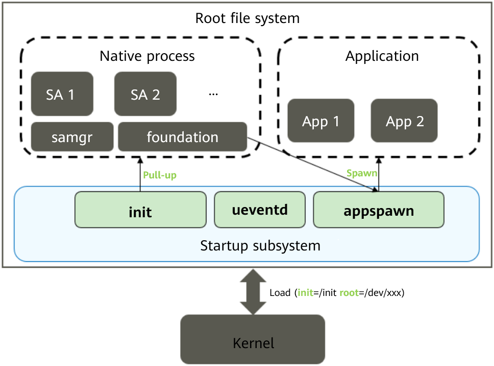

# Startup

-   [Context Structure](#section167378304212)
-   [Limitations and Constraints](#section2029921310472)

## Context Structure

The following figure shows the context structure of the Startup subsystem.

Upon completion of system power-on and kernel loading, system services and applications are started as follows:

1.  The kernel loads the init process. During kernel loading, bootloader usually sets the position of the init process by setting  **cmdline**  of the kernel.
2.  After the init process is started,  **tmpfs**  and  **procfs**  are mounted and basic  **dev**  nodes are created to establish a basic root file system.
3.  The init process starts the ueventd process to listen for device hot-swap events in the kernel and creates  **dev**  nodes for related devices as well as partitions for the block device.
4.  After mounting partitions \(**system**  and  **vendor**\) of the block device, the init process scans for the init startup script of each system service and launches the respective service ability \(SA\).
5.  Upon startup, an SA needs to register with the samgr process, which serves as the service registration center. The samgr process assigns each SA with an ID, which will be used by an application to access the desired SA.
6.  The foundation process implements application lifecycle management. It is a special SA service process that provides the user program management framework and basic services.
7.  For an application, loading of the JS running environment involves a great deal of preparations. To reduce the application startup time, the appspawn process directly spawns an application process once receiving an application startup request from the foundation process.

The Startup subsystem consists of the following modules:

-   init module

    This module corresponds to the init process, which is the first user-space process started after the kernel is initialized. Upon startup, the init process reads and parses the configuration file  **init.cfg**. Based on the parsing result, the init module executes the commands listed in Table 2 in  [init Module](subsys-boot-init.md)  and starts the key system service processes in sequence with corresponding permissions granted.

-   ueventd module

    This module listens for  **netlink**  events about hot plug of kernel device drivers and dynamically manages the  **dev**  node of the corresponding device based on the event type.

-   appspawn module

    This module spawns application processes upon receiving commands from the application framework, configures permissions for new processes, and calls the entry function of the application framework.

-   bootstrap module

    This module provides entry identifiers for starting services and features. When samgr is started, the entry function identified by boostrap is called and system services are started.

-   syspara module

    This module provides APIs for obtaining device information, such as the product name, brand name, and manufacturer name, based on the OpenHarmony Product Compatibility Specifications \(PCS\). It also provides APIs for setting and obtaining system parameters.

## Limitations and Constraints

The directories of Startup subsystem are applicable to different platforms.

**Table  1**  Directories and applicable platforms of the Startup subsystem

<table><thead align="left"><tr id="row11143184819429"><th class="cellrowborder" valign="top" width="32%" id="mcps1.2.3.1.1">
Directory

</th>
<th class="cellrowborder" valign="top" width="68%" id="mcps1.2.3.1.2">
Applicable Platform

</th>
</tr>
</thead>
<tbody><tr id="row171431248114219"><td class="cellrowborder" valign="top" width="32%" headers="mcps1.2.3.1.1 ">
base/startup/appspawn_lite

</td>
<td class="cellrowborder" valign="top" width="68%" headers="mcps1.2.3.1.2 ">
Small-system devices (reference memory ≥ 1 MB), for example, Hi3516D V300 and Hi3518E V300

</td>
</tr>
<tr id="row1814320488422"><td class="cellrowborder" valign="top" width="32%" headers="mcps1.2.3.1.1 ">
base/startup/bootstrap_lite

</td>
<td class="cellrowborder" valign="top" width="68%" headers="mcps1.2.3.1.2 ">
Mini-system devices (reference memory ≥ 128 KB), for example, Hi3861 V100

</td>
</tr>
<tr id="row1114304818420"><td class="cellrowborder" align="left" valign="top" width="32%" headers="mcps1.2.3.1.1 ">
base/startup/init_lite

</td>
<td class="cellrowborder" valign="top" width="68%" headers="mcps1.2.3.1.2 ">
Small-system devices (reference memory ≥ 1 MB), for example, Hi3516D V300 and Hi3518E V300

</td>
</tr>
<tr id="row2014324824218"><td class="cellrowborder" valign="top" width="32%" headers="mcps1.2.3.1.1 ">
base/startup/syspara_lite

</td>
<td class="cellrowborder" valign="top" width="68%" headers="mcps1.2.3.1.2 "><ul id="ul15501216165214"><li>Mini-system devices (reference memory ≥ 128 KB), for example, Hi3861 V100</li><li>Small-system devices (reference memory ≥ 1 MB), for example, Hi3516D V300 and Hi3518E V300</li></ul>
</td>
</tr>
</tbody>
</table>

-   init module
    -   To start a system service, you first need to compile a startup script file  **init.cfg**, in which you define the service name, path of executable files, permissions, etc.
    -   The startup script of each system service is installed in the  **/system/etc/init**  directory. The init process scans this directory for the startup script to execute.

-   When porting a new chip platform, you need to add the  **/vendor/etc/init/init.\{hardware\}.cfg**  file that contains the platform-level initialization configuration. This file is used to implement platform-level initialization, for example, installing the ko driver and configuring information on the related  **/proc**  nodes.
    -   The  **init.cfg**  file must be in JSON format.

-   bootstrap module: The zInit code needs to be configured in the link script.

