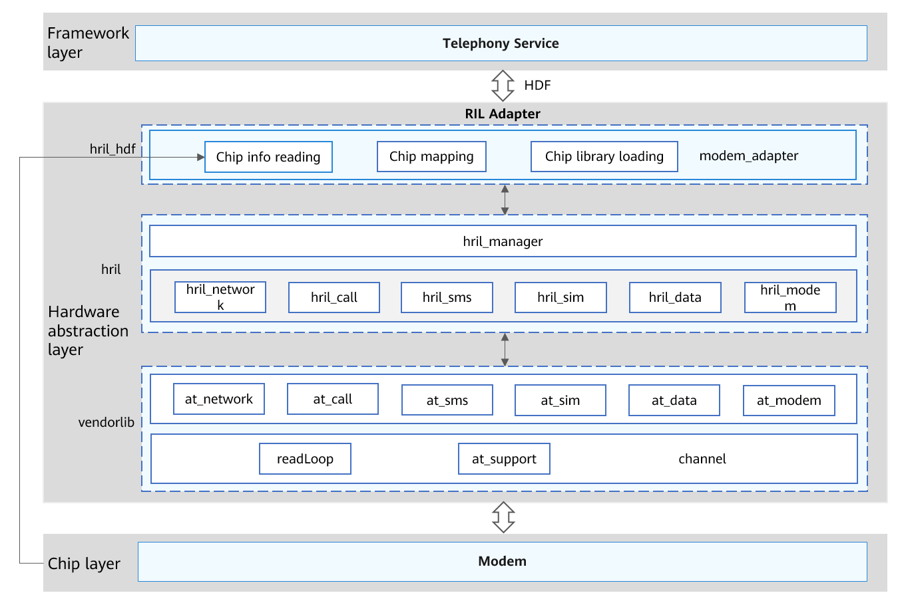

# Telephony Service

-   [Introduction](#section184mcpsimp)
-   [Basic Concepts](#section187mcpsimp)
-   [Working Principles](#section194mcpsimp)
-   [Constraints](#section205mcpsimp)

## Introduction

This document provides development guidelines related to the telephony subsystem, including modem vendor library integration, initialization, service request responding, and modem event reporting. It is intended as a reference for developers of different modem chips, helping them efficiently develop telephony service-related functions.

## Basic Concepts

-   Telephony Service: core service layer of the telephony subsystem. Its main functions are as follows:
    -   Initializes the RIL Manager module, SIM card module, and network search modules.
    -   Provides access to the RIL Adapter service, and implements communication with RIL Adapter by registering the callback service.
    -   Implements communication between modules, such as the call module and SMS module, by subscribing to callbacks.

-   RIL Adapter: RIL adaptation layer of the Telephony subsystem. This layer provides functions such as vendor library loading and service API implementation. It shields the differences of modems supplied by different vendors to provide a unified API for the telephony service layer. It communicates with the telephony service layer by registering the Hardware Driver Foundation \(HDF\) service.
-   HDF: Hardware Driver Foundation, which allows for unified access from peripheral devices and provides a framework for driver development and management.
-   hdc\_std: OpenHarmony Device Connector, a command line tool provided by OpenHarmony for developers to debug device connectivity.

## Working Principles

**Figure  1**  RIL Adapter architecture  

As shown in the preceding figure, RIL Adapter is logically divided into three layers:  **hril\_hdf**,  **hril**, and  **vendorlib**.

-   **hril\_hdf**: unique entry of RIL Adapter. The main function of this layer is to load modem vendor library files. Wherein,  **modem\_adapter**  enables a single firmware to adapt to different modems.

    Specifically,  **hril\_hdf**  obtains the modem type from the kernel and then loads the target modem vendor library based on the modem type.

-   **hril**: OpenHarmony Radio Interface Layer, which provides APIs for communication between the  **vendorlib**  and various Telephony Service modules, including the SIM card, network search, cellular call, cellular data, and SMS/MMS modules.
-   **vendorlib**: Modem vendor library file. Different modem vendor libraries are developed based on standard APIs or service request IDs provided by RIL Adapter. \(**vendorlib**  is provided by modem vendors.\)

After  **hril\_hdf**  is executed,  **vendorlib**  is dynamically loaded so that it can obtain the pointers to the response processing and event reporting functions from  **hril\_hdf**. After this process is complete,  **hril\_hdf**  can communicate with a modem through  **vendorlib**.

## Constraints

**Specifications**

At least one modem must be supported by a device vendor. If no modem is supported,  **vendorlib**  APIs do not need to be implemented.

