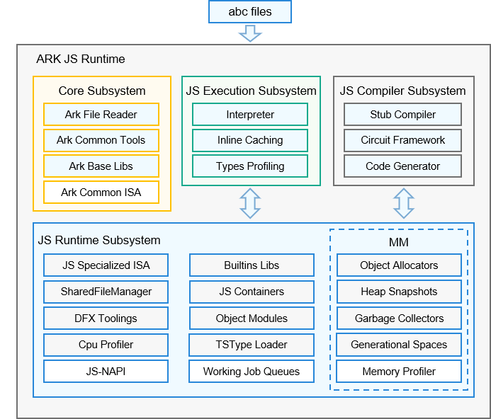

# ArkCompiler JS Runtime

Introduction

ArkCompiler is a built-in componentized and configurable multi-language compilation and runtime platform of OpenHarmony. It contains core components such as the compiler, toolchain, and runtime. It supports compilation and running of high-level programming languages on the multi-chip platform. It accelerates the running of the OpenHarmony standard operating system and its applications and services on mobile phones, PCs, tablets, TVs, automobiles, and smart wearables. ArkCompiler JS Runtime provides the capability of compiling and running the JavaScript (JS) language on the OpenHarmony operating system.

ArkCompiler JS Runtime consists of two parts: JS compiler toolchain and JS runtime. The JS compiler toolchain compiles JS source code into ArkCompiler bytecodes. The JS runtime executes the generated ArkCompiler bytecodes. Unless otherwise specified, bytecodes refer to ArkCompiler bytecodes in this document.

Figure 1 Architecture of the JS compiler toolchain


The source code compiler of ArkCompiler JS Runtime receives JS source code, based on which ts2abc generates an abc file.

Figure 2 Architecture of ArkCompiler JS Runtime



ArkCompiler JS Runtime runs ArkCompiler bytecode files to implement JS semantic logic.

ArkCompiler JS Runtime consists of four subsystems:

-   Core Subsystem

    Core Subsystem consists of basic language-irrelevant runtime libraries, including ArkCompiler File, Tooling, and ArkCompiler Base. ArkCompiler File provides bytecodes. Tooling supports Debugger. ArkCompiler Base is responsible for implementing system calls.

-   JS Execution Subsystem

    JS Execution Subsystem consists of an interpreter that executes bytecodes, inline caching that stores hidden classes, and Profiler that analyzes and records runtime types.

-   JS Compiler Subsystem

    JS Compiler Subsystem consists of the Stub compiler, optimized compilation framework based on the Circuit IR, and code generator.

-   JS Runtime subsystem
 
    JS Runtime Subsystem contains various modules related to JS runtime:
    - Memory management: object allocator and garbage collector (CMS-GC and Partial-Compressing-GC for concurrent marking and partial memory compression)
    - Analysis tools: DFX tool and CPU and heap profiling tool
    - Concurrency management: abc file manager in the actor concurrency model
    - Standard library: standard library defined by ECMAScript, efficient container library, and object model
    - Others: asynchronous work queues, TypeScript (TS) type loading, and JS native APIs (JSNAPIs) for interacting with C++ interfaces

**Design features of ArkCompiler JS Runtime:**

- ArkCompiler JS Runtime is designed to provide a JS/TS application execution engine for OpenHarmony rather than a JS execution engine for the browser.

- To improve the application execution performance and security, ArkCompiler JS Runtime statically pre-compiles JS/TS programs into ArkCompiler bytecode (with static type information) to reduce the overhead caused by compilation and type information collection during runtime. To ensure security and performance, ArkCompiler JS Runtime selects the code that supports strict but not eval.

- Native support for TS. The common way to process TS in the industry is to convert TS into JS and execute JS code with JS runtime. ts2abc is planned to analyze and obtain the TS type information when compiling the TS source code and send the information to ArkCompiler JS Runtime. ArkCompiler JS Runtime directly uses the type information to statically generate inline caching to accelerate bytecode execution. The TS Ahead of Time (AOT) compiler directly converts the source code into high-quality machine code based on the TS type information sent from ts2abc, which greatly improves the running performance.

-  Lightweight Actor concurrency model: ECMAScript does not provide concurrency specifications. The Actor concurrency model is commonly used in JS engines in the industry to implement concurrent processing. In this model, executors do not share data and communicate with each other using the messaging mechanism. The JS Actor model (web-worker) in the industry has defects such as slow startup and high memory usage. ArkCompiler JS Runtime is required to provide the Actor implementation that features fast startup and low memory usage to better leverage the device's multi-core feature to improve performance. Now ARK-JS is able to share immutable objects, methods, and bytecodes (built-in code blocks and constant strings in the future) in Actor instances based on the Actor memory isolation model to accelerate the startup of JS Actor, reduce memory overhead, and implement the lightweight Actor concurrency model.

- Cross-language interaction of TS/C++: In the API implementation, it is common for C/C++ code to access and operate TS objects in OpenHarmony. ArkCompiler JS Runtime is planned to statically generate a C/C++ header file that contains the TS object layout description and the C/C++ implementation library for operating the TS object based on the class declaration and runtime conventions in the TS program. The C/C++ code usually includes the TS object layout description header file and the corresponding implementation library to implement the direct operation on the TS object. The TS type or its internal layout is not always fixed. Therefore, in the code implementation for TS object operations, type check is used. If the object type or layout changes during runtime, the common slow path is rolled back.

## Directory Structure<a name="section161941989596"></a>

```
/ark
├── js_runtime       # JS runtime module
├── runtime_core     # Runtime common module
└── ts2abc           # JS frontend tool
```

## Usage Guidelines<a name="section18393638195820"></a>

[Ark Runtime User Guide](https://gitee.com/openharmony/ark_js_runtime/blob/master/docs/ARK-Runtime-Usage-Guide.md)

## Repositories Involved<a name="section1371113476307"></a>

[ark\_runtime\_core](https://gitee.com/openharmony/ark_runtime_core)

[ark\_js\_runtime](https://gitee.com/openharmony/ark_js_runtime)

[ark\_ts2abc](https://gitee.com/openharmony/ark_ts2abc)
