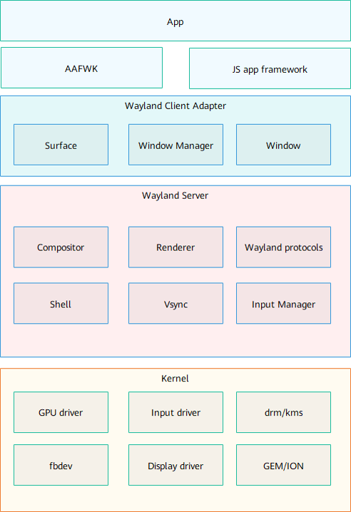

# Graphics<a name="EN-US_TOPIC_0000001115588688"></a>

The Graphics subsystem mainly consists of user interface \(UI\) components, layout, animator, font, input event, window management, and rendering and drawing modules. It is an application framework that can be built on the LiteOS to develop OpenHarmony applications for Internet of Things \(IoT\) devices with limited hardware resources or on the standard OS to develop OpenHarmony applications for standard- and large-system devices \(for example, tablet and lite smart devices\).

## 1.1 Mini System<a name="section1346303311377"></a>

### Introduction<a name="section1165992615384"></a>

The Graphics subsystem mainly consists of user interface \(UI\) components, layout, animator, font, input event, window management, and rendering and drawing modules. It is an application framework that can be built on the LiteOS to develop OpenHarmony applications for Internet of Things \(IoT\) devices with limited hardware resources.

**Figure  1**  Graphics subsystem architecture<a name="fig16488143010409"></a>  


The related modules are described as follows:

-   View: provides application components, including UIView, UIViewGroup, UIButton, UILabel, UILabelButton, UIList, and UISlider.
-   Animator: defines functions for customizing animators.
-   Layout: lays out components, including Flexlayout, GridLayout, and ListLayout.
-   Transform: rotates, translates, or scales images.
-   Event: processes basic events, including click, press, drag, and long press events.
-   Rendering engine: performs rendering and drawing operations.
-   2D graphics library: draws 2D graphical elements including lines, rectangles, circles, arcs, images, and texts. Functions of this module include software drawing and hardware acceleration capability interconnection.
-   Multi-language: processes the line feed and shaping of texts in different languages.
-   Image library: parses and operates images of different types and formats, such as PNG, JPEG, ARGB8888, and ARGB565.
-   WindowManager: manages windows, including creating, showing, hiding a window, and combining windows.
-   InputManager: processes input events.

### Directory Structure<a name="section141331948134020"></a>

```
/foundation/graphic
├── surface  # Shared memory
├── ui       # UI module, including UI components, animations, and fonts.
├── utils    # Basic graphics library and hardware adaptation layer
└── wms      # Window and input event management
```

### Constraints<a name="section15729113104112"></a>

-   The Graphics subsystem does not support multi-thread concurrent operations. You are advised to perform related operations in UI threads.
-   The  **utils/interfaces/innerkits/graphic\_config.h**  file provides the configuration information about macro switches that can be used to enable or disable graphics features. You need to configure these switches before compilation. Note that some switches are configured depending on the platform.

### Usage<a name="section812962919413"></a>

For details, see the README and  **test**  directory of each repository.

### Repositories Involved<a name="section12651205434115"></a>

**Graphics subsystem**

graphic\_surface

graphic\_ui

graphic\_wms

graphic\_utils

## 1.2 Standard System<a name="section1249610812538"></a>

### Introduction<a name="section1374615251510"></a>

The Graphics subsystem provides graphics APIs and window management capabilities, which can be invoked by using Java or JS APIs. It is applicable to all devices that run the standard system.

The following figure shows the architecture of the Graphics subsystem.



-   Surface

    Provides APIs for managing the graphics buffer and the efficient and convenient rotation buffer.

-   Vsync

    Provides APIs for managing registration and response of all vertical sync signals.

-   WindowManager

    Provides APIs for creating and managing windows.

-   WaylandProtocols

    Provides the communication protocols between the window manager and synthesizer.

-   Compositor

    Implements synthesis of layers.

-   Renderer

    Functions as the back-end rendering module of the synthesizer.

-   Wayland protocols

    Provides Wayland inter-process communication protocols.

-   Shell

    Provides multi-window capabilities.

-   Input Manager

    Functions as the multimodal input module that receives input events.


### Directory Structure<a name="section16751364713"></a>

```
foundation/graphic/standard/
├── frameworks              # Framework code
│   ├── bootanimation       # BootAnimation code
│   ├── surface             # Surface code
│   ├── vsync               # Vsync code
│   └── wm                  # WindowManager code
├── interfaces              # External APIs
│   ├── innerkits           # Native APIs
│   └── kits                # JS APIs and NAPIs
└── utils                   # Utilities
```

### Constraints<a name="section126494189715"></a>

Language version: C++ 11 or later

### Compilation and Building<a name="section883114292070"></a>

The dependent APIs include the following:

-   graphic\_standard:libwms\_client
-   graphic\_standard:libsurface
-   graphic\_standard:libvsync\_client

### Usage<a name="section1351214227564"></a>

For details, see the README and  **test**  directory of each repository.

### Repositories Involved<a name="section11578621131119"></a>

**Graphics subsystem**

graphic\_standard

ace\_ace\_engine

aafwk\_standard

multimedia\_media\_standard

multimedia\_camera\_standard

