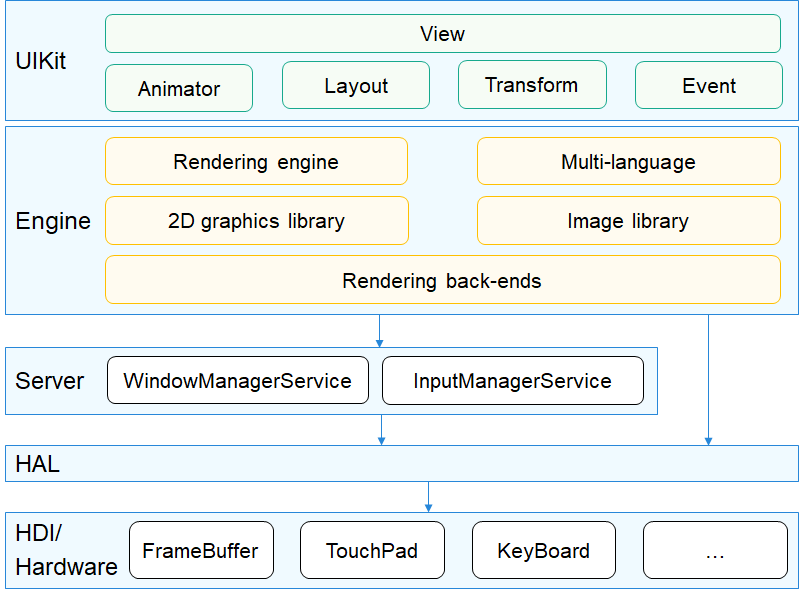

# Graphics Subsystem


The Graphics subsystem mainly consists of user interface (UI) components, layout, animator, font, input event, window management, and rendering and drawing modules. It is an application framework that can be built on the LiteOS to develop OpenHarmony applications for Internet of Things (IoT) devices with limited hardware resources or on the standard OS to develop OpenHarmony applications for standard- and large-system devices.

## Mini System

### Introduction

The Graphics subsystem mainly consists of UI components, layout, animator, font, input event, window management, and rendering and drawing modules. It is an application framework that can be built on the LiteOS to develop OpenHarmony applications for IoT devices with limited hardware resources.

**Figure 1** Graphics subsystem architecture 


The related modules are described as follows:

-   View: provides application components, including **UIView**, **UIViewGroup**, **UIButton**, **UILabel**, **UILabelButton**, **UIList**, and **UISlider**.
-   Animator: defines functions for customizing animations.
-   Layout: lays out components, including **Flexlayout**, **GridLayout**, and **ListLayout**.
-   Transform: rotates, translates, or scales images.
-   Event: processes basic events, including click, press, drag, and long press events.
-   Rendering engine: performs rendering and drawing operations.
-   2D graphics library: draws 2D graphical elements including lines, rectangles, circles, arcs, images, and texts. Functions of this module include interconnection with the software drawing and hardware acceleration capabilities.
-   Multi-language: processes the line feed and shaping of texts in different languages.
-   Image library: parses and operates images of different types and formats, such as PNG, JPEG, ARGB8888, and ARGB565.
-   WindowManager: manages windows, including creating, showing, hiding, and combining windows.
-   InputManager: processes input events.

### Directory Structure

```
/foundation/graphic
├── surface  # Shared memory
├── ui       # UI module, including UI components, animations, and fonts
├── utils    # Basic graphics library and hardware adaptation layer
└── wms      # Window and input event management
```

### Constraints

-   The Graphics subsystem does not support multi-thread concurrent operations. You are advised to perform related operations in UI threads.
-   The **utils/interfaces/innerkits/graphic\_config.h** file provides the configuration information about macro switches that can be used to enable or disable graphics features. You need to configure these switches before compilation. Note that some switches are configured depending on the platform.

### Usage

For details, see the README and **test** directory of each repository.

### Repositories Involved

**Graphics subsystem**

[graphic\_surface](https://gitee.com/openharmony/graphic_surface)

[graphic\_ui](https://gitee.com/openharmony/graphic_ui)

[graphic\_wms](https://gitee.com/openharmony/graphic_wms)

[graphic\_utils](https://gitee.com/openharmony/graphic_utils)

## Standard System

### Introduction

The Graphics subsystem provides graphics APIs.

The following figure shows the architecture of the Graphics subsystem.


The OpenHarmony graphics stack is divided into the following layers:

Interface layer: provides native APIs for the Graphics subsystem, including WebGL, native drawing, and OpenGL command-level drawing.

Framework layer: consists of the Render Service, Drawing, Animation, Effect, and Display and Memory Management modules.
| Module                    | Description                                                                                      |
|------------------------|--------------------------------------------------------------------------------------------|
| Render Service | Performs UI framework drawing. This module converts the ArkUI component description into drawing tree information and renders the optimal path based on the corresponding rendering policy. It also provides the core underlying mechanism for multi-window smoothness and spatial UI sharing.      |
| Drawing          | Provides standard internal interfaces in the Graphics subsystem to implement 2D rendering, 3D rendering, and rendering engine management.                                               |
| Animation        | Provides capabilities related to the animation engine.                                                                              |
| Effect           | Processes image effects and rendering effects, including cascading and parallel processing of multiple effects, and adding rendering effects and component interaction effects during layout.                              |
| Display and Memory Management               | Decouples the graphics stack from hardware and provides OpenHarmony display and memory management. OEMs need to adapt the HDIs defined by this module.|

Engine layer: consists of the 2D graphics library and 3D graphics engine. The 2D graphics library provides bottom-layer APIs for 2D graphics drawing (including text drawing). The 3D graphics engine capability is being developed.


### Directory Structure

```
foundation/graphic/standard/
├── figures                 # Images referenced by Markdown
├── frameworks              # Framework code
│   ├── animation_server    # Animation server code
│   ├── bootanimation       # Boot animation
│   ├── dumper              # Graphic dumper code
│   ├── fence               # Fence code
│   ├── surface             # Surface code
│   ├── vsync               # Vsync code
├── rosen                   # Framework code
│   ├── build               # Build description
│   ├── doc                 # doc
│   ├── include             # Code of external header files
│   ├── lib                 # lib
│   ├── modules             # Graphic subsystem code, organized by module
│   ├── samples             # Sample code
│   ├── test                # Development and test code
│   ├── tools               # Tool code
├── interfaces              #  Graphics APIs
│   ├── innerkits           # Native APIs
│   └── kits                # JS APIs and native APIs
└── utils                   # Utilities
```

### Constraints

Programming language version: C++ 11 or later

### Compilation and Building

### Usage

For details, see the README and **test** directory of each repository.

### Repositories Involved

**Graphics subsystem**

- [ace_ace_engine](https://gitee.com/openharmony/ace_ace_engine)
- [aafwk_standard](https://gitee.com/openharmony/aafwk_standard)
- [multimedia_media_standard](https://gitee.com/openharmony/multimedia_media_standard)
- [multimedia_camera_standard](https://gitee.com/openharmony/multimedia_camera_standard)
- [windowmanager](https://gitee.com/openharmony/windowmanager)
