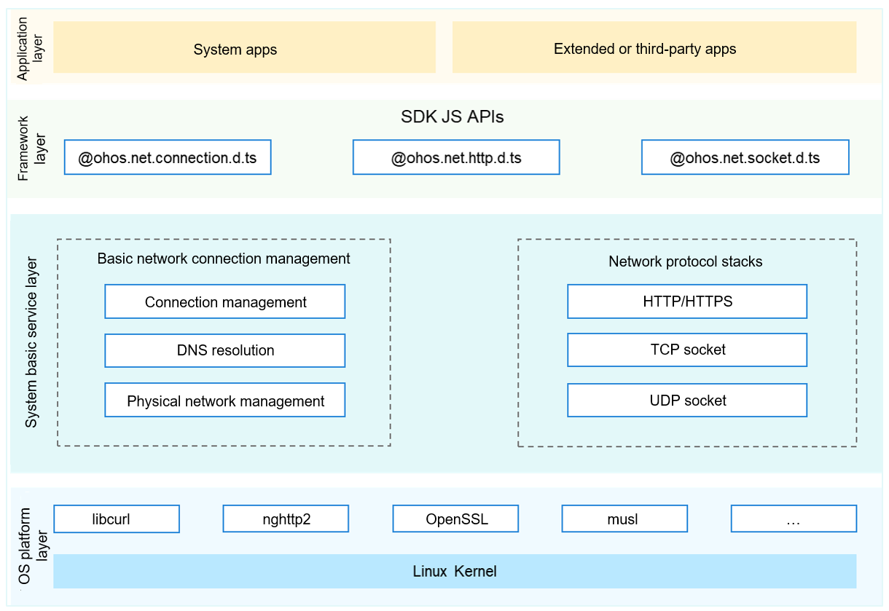

# Network Management


## Introduction

As a mandatory component for device networking, the network management subsystem manages different types of network connections in a unified manner and provides network protocol stack capabilities. An application can call APIs to obtain connection information of a data network, query and subscribe to connection status, and transfer data by using the network protocol stack.

The network management subsystem consists of the following components:

-   Basic network connection management component: provides basic network connection management and corresponding JavaScript and native APIs to implement functions, such as managing network connection priorities, querying network connection information, observing network connection status changes, performing DNS resolution, and managing physical networks.
-   Network protocol stack component: provides basic network protocol stacks including HTTP, HTTPS, TCP, and UDP stacks, and corresponding JavaScript APIs.

**Figure 1** System architecture



## Directory Structure

```
foundation/communication/
├── netmanager_base            # Basic network connection management
└── netstack                   # Network protocol stacks
```

## Usage

### Receiving Network Status Change Notifications

1. Import the **connection** namespace from **@ohos.net.connection.d.ts**.

2. Call **createNetConnection()** to create a **NetConnection** object. You can specify the network capability, network type, and timeout interval. 

3. Call the **on()** method of the object to subscribe to concerned events by specifying **type** and **callback**.

4. Call the **register()** method of the object to subscribe to status changes of the specified network.

5. When the network is available, the callback will be invoked to return the **netAvailable** event.

6. Call the **unregister()** method of the object to unsubscribe from the status changes if required.

   ```
   // Import the package name.
   import connection from '@ohos.net.connection'
   
   let netCap = {
       // Set the network type to cellular network.
       bearerTypes: [connection.NetBearType.BEARER_CELLULAR],
       // Set the network capability to Internet.
       networkCap: [connection.NetCap.NET_CAPABILITY_INTERNET],
   };
   let netSpec = {
       netCapabilities: netCap,
   };
   // Set the timeout interval to 10s.
   let timeout = 10 * 1000;
   // Create a NetConnection object.
   let conn = connection.createNetConnection(netSpec, timeout);
   // Subscribe to on_netAvailable events.
   conn.on('netAvailable', (data=> {
       console.log("net is available, netId is " + data.netId);
   }));
   // Register a listener for network status changes.
   conn.register((err, data) => {});
   // When the network is not used, call the unregister method to cancel the subscription.
   conn.unregister((err, data) => {});
   ```


### Sending a Network Request

1. Import the **http** namespace from **@ohos.net.http.d.ts**.
2. Call the **createHttp** method to create an **HttpRequest** object.
3. Call the **on()** method of the object to subscribe to the HTTP response header. This method returns a response earlier than the request. You can subscribe to HTTP response header events based on service requirements.
4. Call the **request()** method of the object with the URL and optional parameters of the HTTP request to initiate a network request.
5. Parse the returned result based on service requirements.
6. Call the **destroy()** method to destroy the request.

```
// Import the package name.
import http from '@ohos.net.http';

// Each httpRequest corresponds to an HttpRequestTask object and cannot be reused.
let httpRequest = http.createHttp();
// Subscribe to the HTTP response header, which is returned earlier than httpRequest. You can subscribe to HTTP response header events based on service requirements.
httpRequest.on('headersReceive', (data) => {
    console.info('header: ' + data.header);
});
httpRequest.request(
    // Set the URL of the HTTP request. You need to define the URL. Set the parameters of the GET request in extraData.
    "EXAMPLE_URL",
    {
        method: 'POST', // Optional. The default value is GET.
        // You can add the header field based on service requirements.
        header: {
            'Content-Type': 'application/json'
        },
        // This field is used to transfer data when the POST request is used.
        extraData: {
            "data": "data to send",
        },
        connectTimeout: 60000, // Optional. The default value is 60 seconds.
        readTimeout: 60000, // Optional. The default value is 60 seconds.
    },(err, data) => {
        if (!err) {
            // data.result contains the HTTP response. Parse the response based on service requirements.
            console.info('Result:' + data.result);
            console.info('code:' + data.responseCode);
            // data.header contains the HTTP response header. Parse the content based on service requirements.
            console.info('header:' + data.header);
            console.info('header:' + data.cookies);
        } else {
            console.info('error:' + err);
        }
        // Call the destroy() method to release resources after the call is complete.
        httpRequest.destroy();
    }
);
```


## Repositories Involved

**Network Management Subsystem**

[communication_netmanager_base](https://gitee.com/openharmony/communication_netmanager_base)

[communication_netstack](https://gitee.com/openharmony/communication_netstack)
