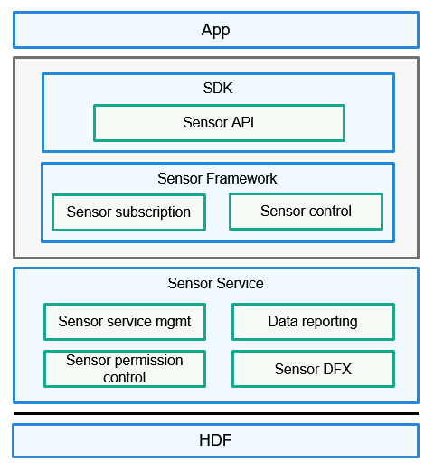

# Pan-Sensor<a name="EN-US_TOPIC_0000001078062432"></a>

-   [Introduction](#section11660541593)
-   [Directory Structure](#section161941989596)
-   [Usage](#section1312121216216)
-   [Repositories Involved](#section1371113476307)

## Introduction<a name="section11660541593"></a>

The pan-sensor service subsystem provides a lightweight sensor service framework, through which you can perform the following operations:

-   Query the sensor list.
-   Enable or disable a sensor.
-   Subscribe to or unsubscribe from sensor data.
-   Set the data reporting mode of a sensor.

The following figure shows the architecture of the pan-sensor service framework.

**Figure1**  Pan-sensor service architecture



## Directory Structure<a name="section161941989596"></a>

```
/base/sensors
├── sensor_lite          # Sensor directory
│   ├── frameworks      # Framework code
│   ├── interfaces      # Native APIs
│   └── services        # Code of services
└── miscdevice_lite      # Misc device directory
```

## Usage<a name="section1312121216216"></a>

The following modules work cooperatively to implement pan-sensor capabilities: Sensor API, Sensor Framework, and Sensor Service.

-   Sensor API: provides APIs for performing basic operations on sensors, including querying the sensor list, enabling or disabling sensors, and subscribing to or unsubscribing from sensor data.
-   Sensor Framework: manages sensor data subscription, creates and destroys data channels, subscribes to or unsubscribes from sensor data, and implements communication with the Sensor Service module.
-   Sensor Service: interacts with the HDF module to receive, parse, and distribute data, manages sensor services and sensor data reporting, and controls sensor permissions.

## Repositories Involved<a name="section1371113476307"></a>

**Pan-sensor subsystem**

hmf/sensors/sensor\_lite

hmf/sensors/miscdevice\_lite

