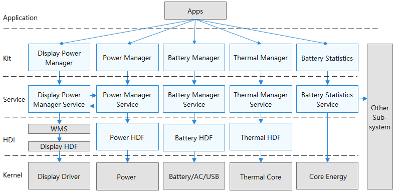

# Power Management<a name="EN-US_TOPIC_0000001121107655"></a>

## Introduction<a name="section11660541593"></a>

The power management subsystem provides the following functionalities:

1.  Rebooting the device
2.  Managing running locks
3.  Querying the power status
4.  Obtaining and reporting the charging and battery status
5.  Turning on/off the device screen and adjusting the screen brightness

**Figure  1**  Power management subsystem architecture<a name="fig7607759319"></a>  




## Directory Structure<a name="section19472752217"></a>

```
/base/powermgr
├── battery_manager            # Battery manager
│   ├── hdi                    # Hardware Driver Interfaces (HDIs)
│   ├── interfaces             # APIs
│   ├── sa_profile             # SA profile
│   ├── services               # Services
│   └── utils                  # Utilities
├── display_manager            # Display manager
│   ├── interfaces             # APIs
│   └── sa_profile             # SA profile
│   └── services               # Services
│   └── utils                  # Utilities
├── powermgr_lite              # Lite power manager
│   ├── interfaces             # APIs
│   └── services               # Services
└── power_manager              # Power manager
    ├── interfaces             # APIs
    ├── sa_profile             # SA profile
    └── services               # Services
    └── utils                  # Utilities
```

## Usage<a name="section19959125052315"></a>

You can use the APIs provided by the power management subsystem to create and release a running lock, obtain battery information, adjust the screen brightness, reboot a device, and power off a device.

## Repositories Involved<a name="section63151229062"></a>

**Power Management subsystem**

powermgr\_battery\_manager

powermgr\_power\_manager

powermgr\_display\_manager

