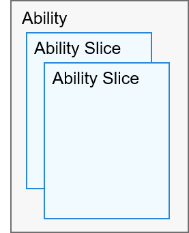
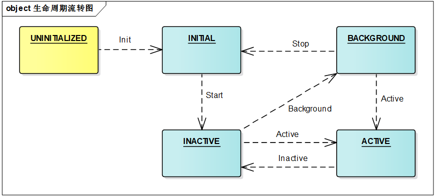
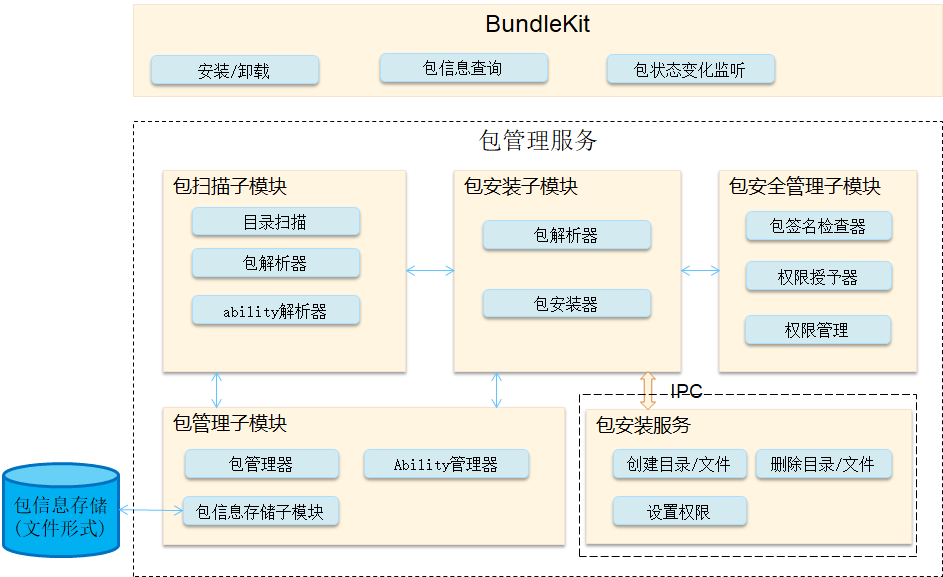

# 用户程序框架子系统<a name="ZH-CN_TOPIC_0000001052619284"></a>

## 简介<a name="section11660541593"></a>

用户程序框架子系统包含两个大的模块：**Ability子系统**和**包管理子系统**。

**1. Ability子系统**，是OpenHarmony为开发者提供的一套开发OpenHarmony应用的框架。Ability子系统各模块如下图1所示：

**图 1**  Ability子系统框架图<a name="fig18932193213292"></a>  


-   **AbilityKit**是Ability框架提供给开发者的开发包，开发者基于该开发包可以开发出基于Ability组件的应用。基于Ability组件开发的应用有两种类型：基于Javascript语言开发的Ability（**JS Ability**）和基于C/C++语言开发的Ability（**Native Ability**）。**JS应用开发框架**是开发者开发JS Ability所用到框架，是在AbilityKit基础封装的包含js UI组件的一套方便开发者能够迅速开发Ability应用的框架。
-   **Ability**是系统调度应用的最小单元，是能够完成一个独立功能的组件，一个应用可以包含一个或多个Ability。Ability分为两种类型：Page类型的Ability和Service类型的Ability
    -   **Page类型的Ability**：带有界面，为用户提供人机交互的能力。
    -   **Service类型的Ability**：不带界面，为用户提供后台任务机制。

-   **AbilitySlice**是单个页面及其控制逻辑的总和，是Page类型Ability特有的组件，一个Page类型的Ability可以包含多个AbilitySlice，此时，这些页面提供的业务能力应当是高度相关的。Page类型的Ability和AbilitySlice的关系如下图2所示：

    **图 2**  Ability与AbilitySlice的关系图<a name="fig121541746182919"></a>  
    


-   **生命周期**是Ability被调度到启动、激活、隐藏和退出等各个状态的的统称。Ability各生命周期流转如下图3所示：

    **图 3**  Ability生命周期流转图<a name="fig4915165922910"></a>  
    

    Ability生命周期各状态解析：

    -   **UNINITIALIZED**：未初始状态，为临时状态，Ability被创建后会由UNINITIALIZED状态进入INITIAL状态；

    -   **INITIAL**：初始化状态，也表示停止状态，表示当前Ability未运行，调用Start后进入INACTIVE，同时回调开发者的OnStart生命周期回调；

    -   **INACTIVE**：未激活状态，表示当前窗口已显示但是无焦点状态，由于Window暂未支持焦点的概念，当前状态与ACTIVE一致。

    -   **ACTIVE**：前台激活状态，表示当前窗口已显示，并获取焦点，Ability在退到后台之前先由ACTIVE状态进入INACTIVE状态；

    -   **BACKGROUND**: 后台状态，表示当前Ability退到后台，Ability在被销毁后由BACKGROUND状态进入INITIAL状态，或者重新被激活后由BACKGROUND状态进入ACTIVE状态。


-   **AbilityLoader**负责注册和加载开发者Ability的模块。开发者开发的Ability先要调用AbilityLoader的注册接口注册到框架中，接着Ability启动时会被实例化。
-   **AbilityManager**负责AbilityKit和Ability管理服务进行IPC的通信。
-   **EventHandler**是AbilityKit提供给开发者的用于在Ability中实现线程间通信的一个模块。
-   **Ability运行管理服务**是用于协调各Ability运行关系、及生命周期进行调度的系统服务。其中，**服务启动模块**负责Ability管理服务的启动、注册等。**服务接口管理模块**负责Ability管理服务对外能力的管理。**进程管理模块**负责Ability应用所在进程的启动和销毁、及其进程信息维护等功能。**Ability栈管理模块**负责维护各个Ability之间跳转的先后关系。**生命周期调度模块**是Ability管理服务根据系统当前的操作调度Ability进入相应的状态的模块。**连接管理模块**是Ability管理服务对Service类型Ability连接管理的模块。
-   **AppSpawn**是负责创建Ability应用所在进程的系统服务，该服务有较高的权限，为Ability应用设置相应的权限，并预加载一些通用的模块，加速应用的启动。

**2. 包管理子系统**，是OpenHarmony为开发者提供的安装包管理框架。包管理子系统的由如下图4模块组成：

**图 4**  包管理子系统框架图<a name="fig1047932418305"></a>  


-   **BundleKit**：是包管理服务对外提供的接口，有安装/卸载接口、包信息查询接口、包状态变化监听接口。
-   **包扫描器**：用来解析本地预制或者安装的安装包，提取里面的各种信息，供管理子模块进行管理，持久化。

-   **包安装子模块**：安装，卸载，升级一个包；**包安装服务**一个单独进程的用于创建删除安装目录，具有较高的权限。

-   **包管理子模块**：管理安装包相关的信息，存储持久化包信息。

-   **包安全管理子模块**：签名检查、权限授予、权限管理。

## 目录<a name="section1464106163817"></a>

用户程序框架子系统源代码目录结构如下表1所示：

**表 1**  用户程序框架子系统源代码目录结构

<a name="table2977131081412"></a>
<table><thead align="left"><tr id="row7977610131417"><th class="cellrowborder" valign="top" width="36.18%" id="mcps1.2.3.1.1"><p id="p18792459121314"><a name="p18792459121314"></a><a name="p18792459121314"></a>名称</p>
</th>
<th class="cellrowborder" valign="top" width="63.82%" id="mcps1.2.3.1.2"><p id="p77921459191317"><a name="p77921459191317"></a><a name="p77921459191317"></a>描述</p>
</th>
</tr>
</thead>
<tbody><tr id="row17977171010144"><td class="cellrowborder" valign="top" width="36.18%" headers="mcps1.2.3.1.1 "><p id="p2793159171311"><a name="p2793159171311"></a><a name="p2793159171311"></a>foundation/aafwk/frameworks/ability_lite</p>
</td>
<td class="cellrowborder" valign="top" width="63.82%" headers="mcps1.2.3.1.2 "><p id="p879375920132"><a name="p879375920132"></a><a name="p879375920132"></a>AbilityKit实现的核心代码</p>
</td>
</tr>
<tr id="row6978161091412"><td class="cellrowborder" valign="top" width="36.18%" headers="mcps1.2.3.1.1 "><p id="p0780163617556"><a name="p0780163617556"></a><a name="p0780163617556"></a>foundation/aafwk/frameworks/abilitymgr_lite</p>
</td>
<td class="cellrowborder" valign="top" width="63.82%" headers="mcps1.2.3.1.2 "><p id="p6793059171318"><a name="p6793059171318"></a><a name="p6793059171318"></a>管理AbilityKit与Ability管理服务通信的客户端代码</p>
</td>
</tr>
<tr id="row6978201031415"><td class="cellrowborder" valign="top" width="36.18%" headers="mcps1.2.3.1.1 "><p id="p991413565611"><a name="p991413565611"></a><a name="p991413565611"></a>foundation/aafwk/frameworks/want_lite</p>
</td>
<td class="cellrowborder" valign="top" width="63.82%" headers="mcps1.2.3.1.2 "><p id="p0793185971316"><a name="p0793185971316"></a><a name="p0793185971316"></a>Ability之间交互的信息载体的实现代码</p>
</td>
</tr>
<tr id="row1897841071415"><td class="cellrowborder" valign="top" width="36.18%" headers="mcps1.2.3.1.1 "><p id="p20749155715720"><a name="p20749155715720"></a><a name="p20749155715720"></a>foundation/aafwk/interfaces/kits/abilitykit_lite</p>
</td>
<td class="cellrowborder" valign="top" width="63.82%" headers="mcps1.2.3.1.2 "><p id="p14793959161317"><a name="p14793959161317"></a><a name="p14793959161317"></a>AbilityKit为开发者提供的接口</p>
</td>
</tr>
<tr id="row965423512587"><td class="cellrowborder" valign="top" width="36.18%" headers="mcps1.2.3.1.1 "><p id="p12654103516589"><a name="p12654103516589"></a><a name="p12654103516589"></a>foundation/aafwk/interfaces/innerkits/abilitymgr_lite</p>
</td>
<td class="cellrowborder" valign="top" width="63.82%" headers="mcps1.2.3.1.2 "><p id="p12658142611466"><a name="p12658142611466"></a><a name="p12658142611466"></a>Ability管理服务为其它子系统提供的接口</p>
</td>
</tr>
<tr id="row673463115813"><td class="cellrowborder" valign="top" width="36.18%" headers="mcps1.2.3.1.1 "><p id="p127343312581"><a name="p127343312581"></a><a name="p127343312581"></a>foundation/aafwk/interfaces/kits/want_lite</p>
</td>
<td class="cellrowborder" valign="top" width="63.82%" headers="mcps1.2.3.1.2 "><p id="p191041469363"><a name="p191041469363"></a><a name="p191041469363"></a>Ability之间交互的信息载体的对外接口</p>
</td>
</tr>
<tr id="row164593855812"><td class="cellrowborder" valign="top" width="36.18%" headers="mcps1.2.3.1.1 "><p id="p1864523835812"><a name="p1864523835812"></a><a name="p1864523835812"></a>foundation/aafwk/services/abilitymgr_lite</p>
</td>
<td class="cellrowborder" valign="top" width="63.82%" headers="mcps1.2.3.1.2 "><p id="p4645133805811"><a name="p4645133805811"></a><a name="p4645133805811"></a>Ability管理服务的实现代码</p>
</td>
</tr>
<tr id="row1869744111581"><td class="cellrowborder" valign="top" width="36.18%" headers="mcps1.2.3.1.1 "><p id="p10698114117583"><a name="p10698114117583"></a><a name="p10698114117583"></a>foundation/appexecfwk/interfaces/kits/bundle_lite</p>
</td>
<td class="cellrowborder" valign="top" width="63.82%" headers="mcps1.2.3.1.2 "><p id="p1169814112585"><a name="p1169814112585"></a><a name="p1169814112585"></a>BundleKit为开发者提供的接口</p>
</td>
</tr>
<tr id="row106931420217"><td class="cellrowborder" valign="top" width="36.18%" headers="mcps1.2.3.1.1 "><p id="p86931748213"><a name="p86931748213"></a><a name="p86931748213"></a>foundation/appexecfwk/interfaces/innerkits/bundlemgr_lite</p>
</td>
<td class="cellrowborder" valign="top" width="63.82%" headers="mcps1.2.3.1.2 "><p id="p12693148215"><a name="p12693148215"></a><a name="p12693148215"></a>BundleKit实现的核心代码，及包管理服务为其它子系统提供的接口</p>
</td>
</tr>
<tr id="row58381913213"><td class="cellrowborder" valign="top" width="36.18%" headers="mcps1.2.3.1.1 "><p id="p11839171152117"><a name="p11839171152117"></a><a name="p11839171152117"></a>foundation/appexecfwk/frameworks/bundle_lite</p>
</td>
<td class="cellrowborder" valign="top" width="63.82%" headers="mcps1.2.3.1.2 "><p id="p158391810217"><a name="p158391810217"></a><a name="p158391810217"></a>管理BundleKit与包管理服务通信的客户端代码</p>
</td>
</tr>
<tr id="row1786831216357"><td class="cellrowborder" valign="top" width="36.18%" headers="mcps1.2.3.1.1 "><p id="p1686820126359"><a name="p1686820126359"></a><a name="p1686820126359"></a>foundation/appexecfwk/utils/bundle_lite</p>
</td>
<td class="cellrowborder" valign="top" width="63.82%" headers="mcps1.2.3.1.2 "><p id="p88681125351"><a name="p88681125351"></a><a name="p88681125351"></a>包管理服务实现中用到的工具性的代码</p>
</td>
</tr>
<tr id="row841015115218"><td class="cellrowborder" valign="top" width="36.18%" headers="mcps1.2.3.1.1 "><p id="p14119113219"><a name="p14119113219"></a><a name="p14119113219"></a>foundation/appexecfwk/services/bundlemgr_lite</p>
</td>
<td class="cellrowborder" valign="top" width="63.82%" headers="mcps1.2.3.1.2 "><p id="p64110114210"><a name="p64110114210"></a><a name="p64110114210"></a>包管理服务的实现代码</p>
</td>
</tr>
</tbody>
</table>

## 约束<a name="section1718733212019"></a>

-   语言版本
    -   C++11版本或以上

-   框架针对不同的芯片平台和底层OS能力，规格有所区别
    -   Cortex-M RAM/ROM：
        -   RAM：建议大于20K
        -   ROM:  \> 300K （包含JS应用开发框架，UIKit及引擎等强相关子系统）

    -   Cortex-A RAM/ROM:
        -   RAM：建议大于2M
        -   ROM：\> 2M （包含JS应用开发框架，UIKit及引擎等强相关子系统）


## 编译用户程序框架子系统<a name="section6514141420509"></a>

-   添加对用户程序框架子系统的编译，以hi3516dv300\_liteos\_a为例

    -   在build/lite/platform/hi3516dv300\_liteos\_a/platform.json中的subsystems字段下面添加appexecfwk和aafwk，代码已添加如下：

    ```
    {
      "subsystem": "aafwk",
      "components": [
        {
          "component": "ability",
          "optional": "true",
          "dirs": [
            "foundation/aafwk"
          ],
          "targets": [
            "//foundation/aafwk/frameworks/ability_lite:aafwk_abilitykit_lite",
            "//foundation/aafwk/frameworks/ability_lite:aafwk_abilityMain_lite",
            "//foundation/aafwk/frameworks/abilitymgr_lite:aafwk_abilityManager_lite",
            "//foundation/aafwk/services/abilitymgr_lite:aafwk_services_lite"
          ],
          "features": [
            {"enable_ohos_appexecfwk_feature_ability": "true"}
          ],
          "deps": {
            "components": [
              "hilog_a",
              "bundle_mgr",
              "system_ability_manager",
              "distributed_schedule",
              "graphic",
              "utils",
              "ipc"
            ],
            "third_party": [
              "cjson",
              "bounds_checking_function"
            ]
          }
        }
      ]
    },

    {
      "subsystem": "appexecfwk",
      "components": [
        {
          "component": "bundle_mgr",
          "optional": "true",
          "dirs": [
            "foundation/appexecfwk"
          ],
          "targets": [
            "//foundation/appexecfwk/services/bundlemgr_lite:appexecfwk_services_lite",
            "//foundation/appexecfwk/frameworks/bundle_lite:appexecfwk_kits_lite"
          ],
          "features": [],
          "deps": {
            "components": [
              "iam",
              "app_verify",
              "hilog_a",
              "system_ability_manager",
              "global_resource_manager",
              "graphic",
              "utils"
            ],
            "third_party": [
              "cjson",
              "zlib"
            ]
          }
        }
      ]
    },

    ```

    -   在build/lite/config/subsystem/aafwk/BUILD.gn和/build/lite/config/subsystem/appexecfwk/BUILD.gn中添加对用户程序框架中具体组件的编译，代码已添加如下：

    ```

    import("//build/lite/config/subsystem/lite_subsystem.gni")

    lite_subsystem("aafwk") {
        subsystem_components = [
            "//foundation/aafwk/frameworks/ability_lite:aafwk_abilitykit_lite",
            "//foundation/aafwk/frameworks/abilitymgr_lite:aafwk_abilityManager_lite",
            "//foundation/aafwk/services/abilitymgr_lite:aafwk_services_lite",
        ]
    }

    ```

    ```
    import("//build/lite/config/subsystem/lite_subsystem.gni")
    
    lite_subsystem("appexecfwk") {
        subsystem_components = [
            "//foundation/appexecfwk/kits/appkit_lite:appexecfwk_kit_lite",
            "//foundation/appexecfwk/services/bundlemgr_lite:appexecfwk_services_lite",
        ]
    }
    ```

    -   在foundation/aafwk和foundation/appexecfwk下面添加对业务模块的编译，各个模块都有自己的BUILD.gn文件

-   添加完上述的配置后，执行如下命令编译整个系统：

    ```
    python build.py ipcamera_hi3516dv300 -b debug
    ```

## 运行用户程序框架子系统的两个服务<a name="section1048719468503"></a>

-   用户程序框架有两个系统服务ability管理服务（abilityms）和（bundlems），两系统服务运行于foundation进程中。
-   abilityms和bundlems注册到sa\_manager中，sa\_manager运行于foundation进程中，sa\_manager为abilityms和bundlems创建线程运行环境。具体创建abilityms、bundlems服务的方式以及使用该服务的方式，可参考[系统服务框架子系统](zh-cn_topic_0000001051589563.md)。
-   在foundation/distributedschedule/services/safwk\_lite/BUILD.gn中添加对abilityms和bundlems，实际代码已添加如下：

    ```

    deps = [
        "...",
    ]
    if (ohos_kernel_type == "liteos_a") {
        deps += [
            "...",
            "//foundation/aafwk/services/abilitymgr_lite:abilityms",
            "//foundation/appexecfwk/services/bundlemgr_lite:bundlems",
            "...",
        ]
    }

    ```

## 运行基于AbilityKit开发的Ability<a name="section16249444135119"></a>

-   基于AbilityKit开发的Ability的Demo代码位于foundation/aafwk/frameworks/ability\_lite/example路径下，如有需要修改其中的功能，可在entry/src/main/cpp的文件中修改代码或增加代码文件，并在BUILD.gn中做相应的修改。
-   在build/lite/product/ipcamera_hi3516dv300.json中添加对ability Demo编译配置：

    ```
    {
    
      "ohos_version": "OpenHarmony 1.0",
    
      "board": "hi3516dv300",
    
      "kernel": "liteos_a",
    
      "compiler": "clang",
    
      "subsystem": [
    
        {
    
          "name": "aafwk",
    
          "component": [
                "......",
                { "name": "ability_sample", "dir": "//foundation/aafwk/frameworks/ability_lite/example:hiability", "features": []}
            ]
    "......"
    ```

-   编译该Demo，在shell中执行如下命令，编译成功后，在out/ipcamera\_hi3516dv300\_liteos\_a/dev\_tools/example下面生成libhiability.so文件：

    ```
    python build.py ipcamera_hi3516dv300 -b debug
    ```

-   编写config.json，参见foundation/aafwk/frameworks/ability\_lite/example路径下的config.json，内容如下：

    ```
    {
        "app": {
            "bundleName": "com.huawei.hiability",
            "vendor": "huawei",
            "version": {
                "code": 1,
                "name": "1.0"
            },
           "apiVersion": {
              "compatible": 3,
              "target": 3
           }
        },
        "deviceConfig": {
            "default": {
                "keepAlive": false
            },
        },
        "module": {
            "deviceType": [
                "smartVision"
            ], 
            "distro": {
                "deliveryWithInstall": true, 
                "moduleName": "hiability", 
                "moduleType": "entry"
            },
            "abilities": [{
                "name": "MainAbility",
                "icon": "assets/entry/resources/base/media/icon.png",
                "label": "test app 1", 
                "launchType": "standard",
                "type": "page",
                "visible": true
            },
            {
                "name": "SecondAbility",
                "icon": "",
                "label": "test app 2", 
                "launchType": "standard",
                "type": "page",
                "visible": true
            },
            {
                "name": "ServiceAbility",
                "icon": "",
                "label": "test app 2", 
                "launchType": "standard",
                "type": "service",
                "visible": true
            }
            ]
        }
    }
    ```


-   生成hap包
    -   按照如下目录结构存放文件，assets/entry/resources/base/media下面放置资源文件：

        

    -   将上述文件打包生成zip包，修改后缀为.hap，例如hiability.hap

-   安装hap包

    -   将上述hap包放置到指定目录下面
    -   执行安装命令，安装hap包：

    ```
    ./bin/bm install -p /nfs/hap/hiability.hap
    ```

-   安装完成后，通过如下命令，运行Demo

    ```
    ./bin/aa start -p com.huawei.hiability -n MainAbility
    ```

## 涉及仓<a name="section93061357133720"></a>

aafwk\_frameworks\_kits\_ability\_lite

aafwk\_interfaces\_innerkits\_abilitykit\_lite

aafwk\_frameworks\_kits\_content\_lite

aafwk\_interfaces\_innerkits\_abilitymgr\_lite

aafwk\_interfaces\_innerkits\_intent\_lite

aafwk\_interfaces\_kits\_ability\_lite

aafwk\_services\_abilitymgr\_lite

appexecfwk\_frameworks\_bundle\_lite

appexecfwk\_interfaces\_innerkits\_bundlemgr\_lite

appexecfwk\_interfaces\_innerkits\_appexecfwk\_lite

appexecfwk\_services\_bundlemgr\_lite

appexecfwk\_kits\_appkit\_lite

