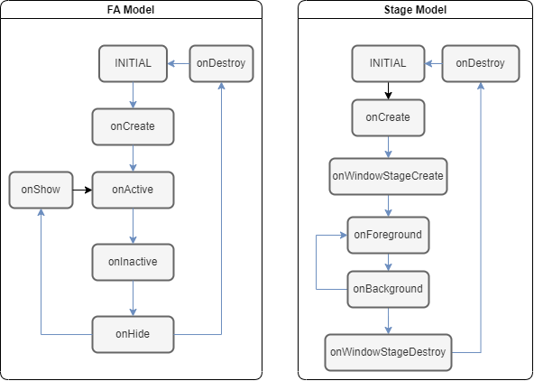

# Ability框架概述

​        Ability是应用所具备能力的抽象，也是应用程序的重要组成部分。Ability是系统调度应用的最小单元，是能够完成一个独立功能的组件，一个应用可以包含一个或多个Ability。 

​        Ability框架模型结构具有两种形态。第一种形态为FA模型，API 8及其更早版本的应用程序只能使用FA模型进行开发， FA模型将Ability分为FA（Feature Ability）和PA（Particle Ability）两种类型，其中FA支持Page Ability，PA支持Service Ability和Data Ability；从API9开始，Ability框架引入了Stage模型作为第二种应用形态，Stage模型将Ability分为PageAbility和ExtensionAbility两大类，其中ExtensionAbility又被扩展为ServiceExtensionAbility、FormExtensionAbility、DataShareExtensionAbility等等一系列ExtensionAbility，以便满足更多的使用场景。

​         Stage模型的设计，主要是为了方便开发者更加方便地开发出分布式环境下的复杂应用。对于开发者而言，两种模型的主要区别在于：

* Ability类型存在差异，接口使用上也存在一定的区别；

  

* Ability生命周期存在差异；

  

* 应用的配置文件及应用包的结构存在差异，这些差异将体现在通过IDE生成的应用包中。

​        两种模型的基本介绍，详见[FA模型综述](fa-brief.md)及[Stage模型综述](stage-brief.md)。