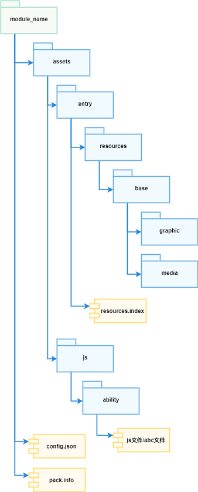
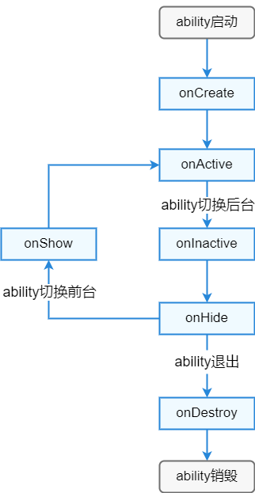

# FA模型综述

## 整体架构
OpenHarmony用户程序的开发本质上就是开发Ability。OpenHarmony系统是通过对Ability调度，结合系统提供的一致性调度契约对Ability进行生命周期管理，从而实现对用户程序的调度。

Ability框架在API 8及更早版本使用FA模型。FA模型中Ability分为PageAbility、ServiceAbility、DataAbility、FormAbility几种类型。其中：
- PageAbility是具备ArkUI实现的Ability，是用户具体可见并可以交互的Ability实例。
- ServiceAbility也是Ability一种，但是没有UI，提供其他Ability调用自定义的服务，在后台运行。
- DataAbility也是没有UI的Ability，提供其他Ability进行数据的增删查服务，在后台运行。
- FormAbility是卡片Ability，是一种界面展示形式。

## 应用包结构
**应用包结构如下图所示：**

应用包结构的配置请参见[应用包结构配置文件的说明](../quick-start/package-structure.md)。

## 生命周期

在所有Ability中，PageAbility因为具有界面，也是应用的交互入口，因此生命周期更加复杂。
**PageAbility生命周期回调如下图所示：**

其他类型Ability的生命周期可参考PageAbility生命周期去除前后台切换以及`onShow`的部分进行理解。
开发者可以在 `app.js/app.ets` 中重写生命周期函数，在对应的生命周期函数内处理应用相应逻辑。

目前`app.js`环境中仅支持onCreate和onDestroy回调，`app.ets`环境支持全量生命周期回调。

## 进程线程模型
应用独享独立进程，Ability独享独立线程，应用进程在Ability第一次启动时创建，并为启动的Ability创建线程，应用启动后再启动应用内其他Ability，会为每一个Ability创建相应的线程。每个Ability绑定一个独立的JSRuntime实例，因此Ability之间是隔离的。

