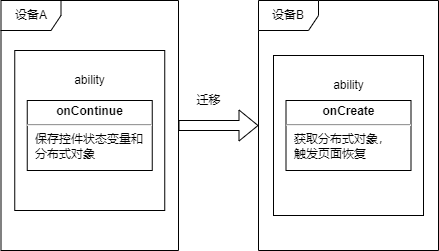

# 跨端迁移开发指导

## 场景介绍

迁移的主要工作是实现将应用当前任务，包括页面控件状态变量、分布式对象等，迁移到远端设备。页面控件状态变量用于同步页面UI数据，分布式对象用于同步内存中的数据。

## 接口说明

迁移提供的能力如下，具体的API详见[接口文档](https://gitee.com/openharmony/docs/blob/master/zh-cn/application-dev/reference/apis/js-apis-application-ability.md)。

**表1** 应用迁移API接口功能介绍

|接口名 | 描述|
|:------ | :------|
| onContinue(wantParam : {[key: string]: any}): OnContinueResult | 迁移**发起端**在该回调中保存迁移所需要的数据，同时返回是否同意迁移：AGREE表示同意，REJECT表示拒绝；MISMATCH表示版本不匹配。 |
| onCreate(want: Want, param : LaunchParam): void | 迁移**目标端**在该回调中完成数据恢复，并触发页面恢复。 |


**图1** 迁移开发示意图



迁移实际上是Ability携带数据的跨端启动。触发迁移动作时，会在A设备上通过系统回调应用的onContinue()方法，开发者需要在此方法中实现当前数据的保存。然后系统发起在B设备上的跨端启动，并将数据一同传输到B设备。B设备系统回调onCreate()方法，开发者需要在此方法中实现传输过来的数据的恢复。 

## 开发步骤

### 迁移应用

1. 配置

   - 配置应用支持迁移

     在module.json5中配置continuable字段：true表示支持迁移，false表示不支持，默认为false。配置为false的应用将被系统识别为无法迁移。
    
     ```javascript
     "continuable": true
     ```
     


   - 配置应用启动类型

     迁移当前只支持多实例应用，需要在在module.json5中配置launchType字段为standard。
     
     ```javascript
     "launchType": "standard"
     ```
     


   - 申请分布式权限

     支持跨端迁移的应用需要在module.json5申请分布式权限 DISTRIBUTED_DATASYNC。
     
     ```javascript
     "requestPermissions": [
            {
                "name": "ohos.permission.DISTRIBUTED_DATASYNC"
            },
     ```
     
     

     这个权限需要在应用首次启动的时候弹窗让用户授予，可以通过在ability的onWindowStageCreate中添加如下代码实现：
     
     ```javascript
        requestPermissions = async () => {
            let permissions: Array<string> = [
                "ohos.permission.DISTRIBUTED_DATASYNC"
            ];
            let needGrantPermission = false
            let accessManger = accessControl.createAtManager()
            Logger.info("app permission get bundle info")
            let bundleInfo = await bundle.getApplicationInfo(BUNDLE_NAME, 0, 100)
            Logger.info(`app permission query permission ${bundleInfo.accessTokenId.toString()}`)
            for (const permission of permissions) {
                Logger.info(`app permission query grant status ${permission}`)
                try {
                    let grantStatus = await accessManger.verifyAccessToken(bundleInfo.accessTokenId, permission)
                    if (grantStatus === PERMISSION_REJECT) {
                        needGrantPermission = true
                        break;
                    }
                } catch (err) {
                    Logger.error(`app permission query grant status error ${permission} ${JSON.stringify(err)}`)
                    needGrantPermission = true
                    break;
                }
            }
            if (needGrantPermission) {
                Logger.info("app permission needGrantPermission")
                try {
                    await this.context.requestPermissionsFromUser(permissions)
                } catch (err) {
                    Logger.error(`app permission ${JSON.stringify(err)}`)
                }
            } else {
                Logger.info("app permission already granted")
            }
        }
     ```
     
     


2. 实现onContinue接口

   onContinue接口在发起端被调用，主要用于在迁移发起时，通知开发者保存控件状态变量和内存中数据，准备迁移。当应用准备完成后，需要返回OnContinueResult.AGREE(0)表示同意迁移，否则返回相应的错误码拒绝迁移。如果不实现该接口，系统将默认为拒绝迁移。

   导入模块

   ```javascript
   import Ability from '@ohos.application.Ability';
   import AbilityConstant from '@ohos.application.AbilityConstant';
   ```

   要实现迁移，此接口必须实现并返回AGREE，否则默认为拒绝迁移。
   
   示例
   
   ```javascript
       onContinue(wantParam : {[key: string]: any}) {
           Logger.info("onContinue using distributedObject")
           // set user input data into want params
           wantParam["input"] = AppStorage.Get<string>('ContinueInput');
           Logger.info(`onContinue input = ${wantParam["input"]}`);
           return AbilityConstant.OnContinueResult.AGREE
       }
   ```
   
   

3. 在onCreate接口中实现迁移逻辑

   onCreate接口在迁移目标端被调用，在目标端ability被拉起时，通知开发者同步已保存的内存数据和控件状态，完成后触发页面的恢复。如果不实现该接口中迁移相关逻辑，ability将会作为普通的启动方式拉起，无法恢复页面。

   远端设备上，在onCreate中根据launchReason判断该次启动是否为迁移LaunchReason.CONTINUATION
   
   完成数据恢复后，开发者需要调用restoreWindowStage来触发页面恢复。
   
   示例

   ```javascript
       onCreate(want, launchParam) {
           Logger.info(`MainAbility onCreate ${AbilityConstant.LaunchReason.CONTINUATION}`)
           globalThis.abilityWant = want;
           if (launchParam.launchReason == AbilityConstant.LaunchReason.CONTINUATION) {
               let input = want.parameters.input // get user data from want params
               AppStorage.SetOrCreate<string>('ContinueInput', input)
               Logger.info(`onCreate for continuation sessionId:  ${this.sessionId}`)

               this.contentStorage = new ContentStorage();
               this.context.restoreWindowStage(this.contentStorage);
           }
       }
   ```


### 迁移数据

使用分布式对象

分布式数据对象提供了与本地变量类似的操作，实现两个设备的数据同步，当设备1的应用A的分布式数据对象增、删、改数据后，设备2的应用A也可以获取到对应的数据变化，同时还能监听数据变更以及对端数据对象的上下线。用法详见[分布式对象指导文档](https://gitee.com/openharmony/docs/blob/master/zh-cn/application-dev/database/database-distributedobject-guidelines.md)。

迁移场景中，分布式对象（distributedDataObject）主要用于将本机内存数据同步到目标设备。

- 发起端在onContinue中，将待迁移的数据存入分布式对象中，然后设置好session id，并通过wantParam将session id传到远端设备。

  ```javascript
     import Ability from '@ohos.application.Ability';
     import distributedObject from '@ohos.data.distributedDataObject';
  
     var g_object = distributedObject.createDistributedObject({name:undefined});
  
     export default class MainAbility extends Ability {
         contentStorage : ContenStorage
         sessionId : string;
  
      onContinue(wantParam : {[key: string]: any}) {
          Logger.info("onContinue using distributedObject")
          this.sessionId = distributedObject.genSessionId();
          //set distributed data object session id
          g_object.setSessionId(this.sessionId);
          g_object.name = "Amy";
          // set session id into want params
          wantParam["session"] = this.sessionId;
          return AbilityConstant.OnContinueResult.AGREE
      }
  ```

  

- 目标设备在onCreate中，取出发起端传过来的session id，建立分布式对象并关联该session id，这样就能实现分布式对象的同步。需要注意的是，在调用restoreWindowStage之前，迁移需要的分布式对象必须全部关联完，保证能够获取到正确的数据。

  ```javascript
     import Ability from '@ohos.application.Ability';
     import distributedObject from '@ohos.data.distributedDataObject';
  
     var g_object = distributedObject.createDistributedObject({name:undefined});
  
     export default class MainAbility extends Ability {
         contentStorage : ContentStorage
         sessionId : string;
  
         statusCallback(sessionId, networkid, status) {
             Logger.info(`continuation object status change, sessionId: ${sessionId}, status: ${status}, g_object.name: ${g_object.name}`)
         }
  
         onCreate(want, launchParam) {
             Logger.info(`MainAbility onCreate ${AbilityConstant.LaunchReason.CONTINUATION}`)
             if (launchParam.launchReason == AbilityConstant.LaunchReason.CONTINUATION) {
                 // get distributed data object session id from want params
                 this.sessionId = want.parameters.session
                 Logger.info(`onCreate for continuation sessionId:  ${this.sessionId}`)
  
                 g_object.on("status", this.statusCallback);
                 // set session id, so it will sync data from remote device
                 g_object.setSessionId(this.sessionId);
  
                 this.contentStorage = new ContentStorage();
                 this.context.restoreWindowStage(this.contentStorage);
             }
         }
     }
  ```


