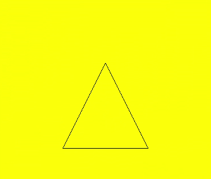
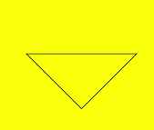
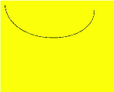

# Path2D对象<a name="ZH-CN_TOPIC_0000001163812226"></a>

路径对象，支持通过对象的接口进行路径的描述，并通过Canvas的stroke接口进行绘制。

> **说明：** 
>从 API Version 6 开始支持。

## addPath\(\)<a name="zh-cn_topic_0000001173164751_section12484748163816"></a>

将另一个路径添加到当前的路径对象中。

-   参数

    <a name="zh-cn_topic_0000001173164751_table1948454813819"></a>
    <table><thead align="left"><tr id="zh-cn_topic_0000001173164751_row17484114816383"><th class="cellrowborder" valign="top" width="21.69%" id="mcps1.1.4.1.1"><p id="zh-cn_topic_0000001173164751_p1348494853817"><a name="zh-cn_topic_0000001173164751_p1348494853817"></a><a name="zh-cn_topic_0000001173164751_p1348494853817"></a>参数</p>
    </th>
    <th class="cellrowborder" valign="top" width="34.74%" id="mcps1.1.4.1.2"><p id="zh-cn_topic_0000001173164751_p1148414873815"><a name="zh-cn_topic_0000001173164751_p1148414873815"></a><a name="zh-cn_topic_0000001173164751_p1148414873815"></a>类型</p>
    </th>
    <th class="cellrowborder" valign="top" width="43.57%" id="mcps1.1.4.1.3"><p id="zh-cn_topic_0000001173164751_p34841948133816"><a name="zh-cn_topic_0000001173164751_p34841948133816"></a><a name="zh-cn_topic_0000001173164751_p34841948133816"></a>描述</p>
    </th>
    </tr>
    </thead>
    <tbody><tr id="zh-cn_topic_0000001173164751_row1148424813816"><td class="cellrowborder" valign="top" width="21.69%" headers="mcps1.1.4.1.1 "><p id="zh-cn_topic_0000001173164751_p64848482383"><a name="zh-cn_topic_0000001173164751_p64848482383"></a><a name="zh-cn_topic_0000001173164751_p64848482383"></a>path</p>
    </td>
    <td class="cellrowborder" valign="top" width="34.74%" headers="mcps1.1.4.1.2 "><p id="zh-cn_topic_0000001173164751_p9484194817384"><a name="zh-cn_topic_0000001173164751_p9484194817384"></a><a name="zh-cn_topic_0000001173164751_p9484194817384"></a>object</p>
    </td>
    <td class="cellrowborder" valign="top" width="43.57%" headers="mcps1.1.4.1.3 "><p id="zh-cn_topic_0000001173164751_p9484144883813"><a name="zh-cn_topic_0000001173164751_p9484144883813"></a><a name="zh-cn_topic_0000001173164751_p9484144883813"></a>需要添加到当前路径的路径对象。</p>
    </td>
    </tr>
    </tbody>
    </table>

-   返回值

    无

-   示例

    

    ```
    const ctx = canvas.getContext('2d');
    var path1 = ctx.createPath2D("M250 150 L150 350 L350 350 Z");
    var path2 = ctx.createPath2D();
    path2.addPath(path1);
    ctx.stroke(path2);
    ```


## setTransform\(\)<a name="zh-cn_topic_0000001173164751_section68262045132013"></a>

依据圆弧经过的点和圆弧半径创建圆弧路径。

-   参数

    <a name="zh-cn_topic_0000001173164751_table4826104515201"></a>
    <table><thead align="left"><tr id="zh-cn_topic_0000001173164751_row58261345122010"><th class="cellrowborder" valign="top" width="33.333333333333336%" id="mcps1.1.4.1.1"><p id="zh-cn_topic_0000001173164751_p1382684562019"><a name="zh-cn_topic_0000001173164751_p1382684562019"></a><a name="zh-cn_topic_0000001173164751_p1382684562019"></a>参数</p>
    </th>
    <th class="cellrowborder" valign="top" width="33.333333333333336%" id="mcps1.1.4.1.2"><p id="zh-cn_topic_0000001173164751_p382617450202"><a name="zh-cn_topic_0000001173164751_p382617450202"></a><a name="zh-cn_topic_0000001173164751_p382617450202"></a>类型</p>
    </th>
    <th class="cellrowborder" valign="top" width="33.333333333333336%" id="mcps1.1.4.1.3"><p id="zh-cn_topic_0000001173164751_p48261945172017"><a name="zh-cn_topic_0000001173164751_p48261945172017"></a><a name="zh-cn_topic_0000001173164751_p48261945172017"></a>描述</p>
    </th>
    </tr>
    </thead>
    <tbody><tr id="zh-cn_topic_0000001173164751_row1182611454206"><td class="cellrowborder" valign="top" width="33.333333333333336%" headers="mcps1.1.4.1.1 "><p id="zh-cn_topic_0000001173164751_p178262456205"><a name="zh-cn_topic_0000001173164751_p178262456205"></a><a name="zh-cn_topic_0000001173164751_p178262456205"></a>scaleX</p>
    </td>
    <td class="cellrowborder" valign="top" width="33.333333333333336%" headers="mcps1.1.4.1.2 "><p id="zh-cn_topic_0000001173164751_p182620458203"><a name="zh-cn_topic_0000001173164751_p182620458203"></a><a name="zh-cn_topic_0000001173164751_p182620458203"></a>number</p>
    </td>
    <td class="cellrowborder" valign="top" width="33.333333333333336%" headers="mcps1.1.4.1.3 "><p id="zh-cn_topic_0000001173164751_p10751910222"><a name="zh-cn_topic_0000001173164751_p10751910222"></a><a name="zh-cn_topic_0000001173164751_p10751910222"></a>x轴的缩放比例</p>
    </td>
    </tr>
    <tr id="zh-cn_topic_0000001173164751_row168266458201"><td class="cellrowborder" valign="top" width="33.333333333333336%" headers="mcps1.1.4.1.1 "><p id="zh-cn_topic_0000001173164751_p16827445142013"><a name="zh-cn_topic_0000001173164751_p16827445142013"></a><a name="zh-cn_topic_0000001173164751_p16827445142013"></a>skewX</p>
    </td>
    <td class="cellrowborder" valign="top" width="33.333333333333336%" headers="mcps1.1.4.1.2 "><p id="zh-cn_topic_0000001173164751_p68274454204"><a name="zh-cn_topic_0000001173164751_p68274454204"></a><a name="zh-cn_topic_0000001173164751_p68274454204"></a>number</p>
    </td>
    <td class="cellrowborder" valign="top" width="33.333333333333336%" headers="mcps1.1.4.1.3 "><p id="zh-cn_topic_0000001173164751_p71155207223"><a name="zh-cn_topic_0000001173164751_p71155207223"></a><a name="zh-cn_topic_0000001173164751_p71155207223"></a>x轴的倾斜角度</p>
    </td>
    </tr>
    <tr id="zh-cn_topic_0000001173164751_row38271945122016"><td class="cellrowborder" valign="top" width="33.333333333333336%" headers="mcps1.1.4.1.1 "><p id="zh-cn_topic_0000001173164751_p7827134572011"><a name="zh-cn_topic_0000001173164751_p7827134572011"></a><a name="zh-cn_topic_0000001173164751_p7827134572011"></a>skewY</p>
    </td>
    <td class="cellrowborder" valign="top" width="33.333333333333336%" headers="mcps1.1.4.1.2 "><p id="zh-cn_topic_0000001173164751_p168275453206"><a name="zh-cn_topic_0000001173164751_p168275453206"></a><a name="zh-cn_topic_0000001173164751_p168275453206"></a>number</p>
    </td>
    <td class="cellrowborder" valign="top" width="33.333333333333336%" headers="mcps1.1.4.1.3 "><p id="zh-cn_topic_0000001173164751_p562016295229"><a name="zh-cn_topic_0000001173164751_p562016295229"></a><a name="zh-cn_topic_0000001173164751_p562016295229"></a>y轴的倾斜角度</p>
    </td>
    </tr>
    <tr id="zh-cn_topic_0000001173164751_row13827114514206"><td class="cellrowborder" valign="top" width="33.333333333333336%" headers="mcps1.1.4.1.1 "><p id="zh-cn_topic_0000001173164751_p11827745122012"><a name="zh-cn_topic_0000001173164751_p11827745122012"></a><a name="zh-cn_topic_0000001173164751_p11827745122012"></a>scaleY</p>
    </td>
    <td class="cellrowborder" valign="top" width="33.333333333333336%" headers="mcps1.1.4.1.2 "><p id="zh-cn_topic_0000001173164751_p168272459209"><a name="zh-cn_topic_0000001173164751_p168272459209"></a><a name="zh-cn_topic_0000001173164751_p168272459209"></a>number</p>
    </td>
    <td class="cellrowborder" valign="top" width="33.333333333333336%" headers="mcps1.1.4.1.3 "><p id="zh-cn_topic_0000001173164751_p19205153616222"><a name="zh-cn_topic_0000001173164751_p19205153616222"></a><a name="zh-cn_topic_0000001173164751_p19205153616222"></a>y轴的缩放比例</p>
    </td>
    </tr>
    <tr id="zh-cn_topic_0000001173164751_row482704512010"><td class="cellrowborder" valign="top" width="33.333333333333336%" headers="mcps1.1.4.1.1 "><p id="zh-cn_topic_0000001173164751_p2082713455206"><a name="zh-cn_topic_0000001173164751_p2082713455206"></a><a name="zh-cn_topic_0000001173164751_p2082713455206"></a>translateX</p>
    </td>
    <td class="cellrowborder" valign="top" width="33.333333333333336%" headers="mcps1.1.4.1.2 "><p id="zh-cn_topic_0000001173164751_p5827104512206"><a name="zh-cn_topic_0000001173164751_p5827104512206"></a><a name="zh-cn_topic_0000001173164751_p5827104512206"></a>number</p>
    </td>
    <td class="cellrowborder" valign="top" width="33.333333333333336%" headers="mcps1.1.4.1.3 "><p id="zh-cn_topic_0000001173164751_p10511942152217"><a name="zh-cn_topic_0000001173164751_p10511942152217"></a><a name="zh-cn_topic_0000001173164751_p10511942152217"></a>x轴的平移距离</p>
    </td>
    </tr>
    <tr id="zh-cn_topic_0000001173164751_row1274814215213"><td class="cellrowborder" valign="top" width="33.333333333333336%" headers="mcps1.1.4.1.1 "><p id="zh-cn_topic_0000001173164751_p574820262114"><a name="zh-cn_topic_0000001173164751_p574820262114"></a><a name="zh-cn_topic_0000001173164751_p574820262114"></a>translateY</p>
    </td>
    <td class="cellrowborder" valign="top" width="33.333333333333336%" headers="mcps1.1.4.1.2 "><p id="zh-cn_topic_0000001173164751_p1174820232117"><a name="zh-cn_topic_0000001173164751_p1174820232117"></a><a name="zh-cn_topic_0000001173164751_p1174820232117"></a>number</p>
    </td>
    <td class="cellrowborder" valign="top" width="33.333333333333336%" headers="mcps1.1.4.1.3 "><p id="zh-cn_topic_0000001173164751_p1645314484227"><a name="zh-cn_topic_0000001173164751_p1645314484227"></a><a name="zh-cn_topic_0000001173164751_p1645314484227"></a>y轴的平移距离</p>
    </td>
    </tr>
    </tbody>
    </table>

-   返回值

    无

-   示例

    

    ```
    const ctx = canvas.getContext('2d');
    var path = ctx.createPath2D("M250 150 L150 350 L350 350 Z");
    path.setTransform(0.8, 0, 0, 0.4, 0, 0);
    ctx.stroke(path);
    ```


## closePath\(\)<a name="zh-cn_topic_0000001173164751_section653891424217"></a>

将路径的当前点移回到路径的起点，当前点到起点间画一条直线。如果形状已经闭合或只有一个点，则此功能不执行任何操作。

-   参数

    无

-   返回值

    无

-   示例

    

    ```
    const ctx = canvas.getContext('2d');
    var path = ctx.createPath2D();
    path.moveTo(200, 100);
    path.lineTo(300, 100);
    path.lineTo(200, 200);
    path.closePath();
    ctx.stroke(path);
    ```


## moveTo\(\)<a name="zh-cn_topic_0000001173164751_section384917162456"></a>

将路径的当前坐标点移动到目标点，移动过程中不绘制线条。

-   参数

    <a name="zh-cn_topic_0000001173164751_table78491916124512"></a>
    <table><thead align="left"><tr id="zh-cn_topic_0000001173164751_row14850181613456"><th class="cellrowborder" valign="top" width="21.69%" id="mcps1.1.4.1.1"><p id="zh-cn_topic_0000001173164751_p11850191612454"><a name="zh-cn_topic_0000001173164751_p11850191612454"></a><a name="zh-cn_topic_0000001173164751_p11850191612454"></a>参数</p>
    </th>
    <th class="cellrowborder" valign="top" width="34.74%" id="mcps1.1.4.1.2"><p id="zh-cn_topic_0000001173164751_p9850416144514"><a name="zh-cn_topic_0000001173164751_p9850416144514"></a><a name="zh-cn_topic_0000001173164751_p9850416144514"></a>类型</p>
    </th>
    <th class="cellrowborder" valign="top" width="43.57%" id="mcps1.1.4.1.3"><p id="zh-cn_topic_0000001173164751_p1850816154519"><a name="zh-cn_topic_0000001173164751_p1850816154519"></a><a name="zh-cn_topic_0000001173164751_p1850816154519"></a>描述</p>
    </th>
    </tr>
    </thead>
    <tbody><tr id="zh-cn_topic_0000001173164751_row6850181612455"><td class="cellrowborder" valign="top" width="21.69%" headers="mcps1.1.4.1.1 "><p id="zh-cn_topic_0000001173164751_p17850161612455"><a name="zh-cn_topic_0000001173164751_p17850161612455"></a><a name="zh-cn_topic_0000001173164751_p17850161612455"></a>x</p>
    </td>
    <td class="cellrowborder" valign="top" width="34.74%" headers="mcps1.1.4.1.2 "><p id="zh-cn_topic_0000001173164751_p118501716164516"><a name="zh-cn_topic_0000001173164751_p118501716164516"></a><a name="zh-cn_topic_0000001173164751_p118501716164516"></a>number</p>
    </td>
    <td class="cellrowborder" valign="top" width="43.57%" headers="mcps1.1.4.1.3 "><p id="zh-cn_topic_0000001173164751_p3850181634517"><a name="zh-cn_topic_0000001173164751_p3850181634517"></a><a name="zh-cn_topic_0000001173164751_p3850181634517"></a>目标点X轴坐标</p>
    </td>
    </tr>
    <tr id="zh-cn_topic_0000001173164751_row12850181618452"><td class="cellrowborder" valign="top" width="21.69%" headers="mcps1.1.4.1.1 "><p id="zh-cn_topic_0000001173164751_p1185081616453"><a name="zh-cn_topic_0000001173164751_p1185081616453"></a><a name="zh-cn_topic_0000001173164751_p1185081616453"></a>y</p>
    </td>
    <td class="cellrowborder" valign="top" width="34.74%" headers="mcps1.1.4.1.2 "><p id="zh-cn_topic_0000001173164751_p98506164455"><a name="zh-cn_topic_0000001173164751_p98506164455"></a><a name="zh-cn_topic_0000001173164751_p98506164455"></a>number</p>
    </td>
    <td class="cellrowborder" valign="top" width="43.57%" headers="mcps1.1.4.1.3 "><p id="zh-cn_topic_0000001173164751_p138501116104518"><a name="zh-cn_topic_0000001173164751_p138501116104518"></a><a name="zh-cn_topic_0000001173164751_p138501116104518"></a>目标点Y轴坐标</p>
    </td>
    </tr>
    </tbody>
    </table>

-   返回值

    无

-   示例

    

    ```
    const ctx = canvas.getContext('2d');
    var path = ctx.createPath2D();
    path.moveTo(50, 100);
    path.lineTo(250, 100);
    path.lineTo(150, 200);
    path.closePath();
    ctx.stroke(path);
    ```


## lineTo\(\)<a name="zh-cn_topic_0000001173164751_section1374011322484"></a>

从当前点绘制一条直线到目标点。

-   参数

    <a name="zh-cn_topic_0000001173164751_table174093224819"></a>
    <table><thead align="left"><tr id="zh-cn_topic_0000001173164751_row187401432134818"><th class="cellrowborder" valign="top" width="21.69%" id="mcps1.1.4.1.1"><p id="zh-cn_topic_0000001173164751_p374173224817"><a name="zh-cn_topic_0000001173164751_p374173224817"></a><a name="zh-cn_topic_0000001173164751_p374173224817"></a>参数</p>
    </th>
    <th class="cellrowborder" valign="top" width="34.74%" id="mcps1.1.4.1.2"><p id="zh-cn_topic_0000001173164751_p2741183219482"><a name="zh-cn_topic_0000001173164751_p2741183219482"></a><a name="zh-cn_topic_0000001173164751_p2741183219482"></a>类型</p>
    </th>
    <th class="cellrowborder" valign="top" width="43.57%" id="mcps1.1.4.1.3"><p id="zh-cn_topic_0000001173164751_p1774112327488"><a name="zh-cn_topic_0000001173164751_p1774112327488"></a><a name="zh-cn_topic_0000001173164751_p1774112327488"></a>描述</p>
    </th>
    </tr>
    </thead>
    <tbody><tr id="zh-cn_topic_0000001173164751_row1741143284810"><td class="cellrowborder" valign="top" width="21.69%" headers="mcps1.1.4.1.1 "><p id="zh-cn_topic_0000001173164751_p19741103254812"><a name="zh-cn_topic_0000001173164751_p19741103254812"></a><a name="zh-cn_topic_0000001173164751_p19741103254812"></a>x</p>
    </td>
    <td class="cellrowborder" valign="top" width="34.74%" headers="mcps1.1.4.1.2 "><p id="zh-cn_topic_0000001173164751_p57411832154812"><a name="zh-cn_topic_0000001173164751_p57411832154812"></a><a name="zh-cn_topic_0000001173164751_p57411832154812"></a>number</p>
    </td>
    <td class="cellrowborder" valign="top" width="43.57%" headers="mcps1.1.4.1.3 "><p id="zh-cn_topic_0000001173164751_p1474119322489"><a name="zh-cn_topic_0000001173164751_p1474119322489"></a><a name="zh-cn_topic_0000001173164751_p1474119322489"></a>目标点X轴坐标</p>
    </td>
    </tr>
    <tr id="zh-cn_topic_0000001173164751_row97411532144814"><td class="cellrowborder" valign="top" width="21.69%" headers="mcps1.1.4.1.1 "><p id="zh-cn_topic_0000001173164751_p14741193212488"><a name="zh-cn_topic_0000001173164751_p14741193212488"></a><a name="zh-cn_topic_0000001173164751_p14741193212488"></a>y</p>
    </td>
    <td class="cellrowborder" valign="top" width="34.74%" headers="mcps1.1.4.1.2 "><p id="zh-cn_topic_0000001173164751_p127411332174814"><a name="zh-cn_topic_0000001173164751_p127411332174814"></a><a name="zh-cn_topic_0000001173164751_p127411332174814"></a>number</p>
    </td>
    <td class="cellrowborder" valign="top" width="43.57%" headers="mcps1.1.4.1.3 "><p id="zh-cn_topic_0000001173164751_p137412326481"><a name="zh-cn_topic_0000001173164751_p137412326481"></a><a name="zh-cn_topic_0000001173164751_p137412326481"></a>目标点Y轴坐标</p>
    </td>
    </tr>
    </tbody>
    </table>

-   返回值

    无

-   示例

    

    ```
    const ctx = canvas.getContext('2d');
    var path = ctx.createPath2D();
    path.moveTo(100, 100);
    path.lineTo(100, 200);
    path.lineTo(200, 200);
    path.lineTo(200, 100);
    path.closePath();
    ctx.stroke(path);
    ```


## bezierCurveTo\(\)<a name="zh-cn_topic_0000001173164751_section122413525494"></a>

创建三次贝赛尔曲线的路径。

-   参数

    <a name="zh-cn_topic_0000001173164751_table5241185218495"></a>
    <table><thead align="left"><tr id="zh-cn_topic_0000001173164751_row1224175215491"><th class="cellrowborder" valign="top" width="33.333333333333336%" id="mcps1.1.4.1.1"><p id="zh-cn_topic_0000001173164751_p192411529491"><a name="zh-cn_topic_0000001173164751_p192411529491"></a><a name="zh-cn_topic_0000001173164751_p192411529491"></a>参数</p>
    </th>
    <th class="cellrowborder" valign="top" width="33.333333333333336%" id="mcps1.1.4.1.2"><p id="zh-cn_topic_0000001173164751_p4241052154910"><a name="zh-cn_topic_0000001173164751_p4241052154910"></a><a name="zh-cn_topic_0000001173164751_p4241052154910"></a>类型</p>
    </th>
    <th class="cellrowborder" valign="top" width="33.333333333333336%" id="mcps1.1.4.1.3"><p id="zh-cn_topic_0000001173164751_p5241052114911"><a name="zh-cn_topic_0000001173164751_p5241052114911"></a><a name="zh-cn_topic_0000001173164751_p5241052114911"></a>描述</p>
    </th>
    </tr>
    </thead>
    <tbody><tr id="zh-cn_topic_0000001173164751_row624113524497"><td class="cellrowborder" valign="top" width="33.333333333333336%" headers="mcps1.1.4.1.1 "><p id="zh-cn_topic_0000001173164751_p6241135213493"><a name="zh-cn_topic_0000001173164751_p6241135213493"></a><a name="zh-cn_topic_0000001173164751_p6241135213493"></a>cp1x</p>
    </td>
    <td class="cellrowborder" valign="top" width="33.333333333333336%" headers="mcps1.1.4.1.2 "><p id="zh-cn_topic_0000001173164751_p22422529499"><a name="zh-cn_topic_0000001173164751_p22422529499"></a><a name="zh-cn_topic_0000001173164751_p22422529499"></a>number</p>
    </td>
    <td class="cellrowborder" valign="top" width="33.333333333333336%" headers="mcps1.1.4.1.3 "><p id="zh-cn_topic_0000001173164751_p172421052114919"><a name="zh-cn_topic_0000001173164751_p172421052114919"></a><a name="zh-cn_topic_0000001173164751_p172421052114919"></a>第一个贝塞尔参数的x坐标值。</p>
    </td>
    </tr>
    <tr id="zh-cn_topic_0000001173164751_row924225212492"><td class="cellrowborder" valign="top" width="33.333333333333336%" headers="mcps1.1.4.1.1 "><p id="zh-cn_topic_0000001173164751_p4242115213499"><a name="zh-cn_topic_0000001173164751_p4242115213499"></a><a name="zh-cn_topic_0000001173164751_p4242115213499"></a>cp1y</p>
    </td>
    <td class="cellrowborder" valign="top" width="33.333333333333336%" headers="mcps1.1.4.1.2 "><p id="zh-cn_topic_0000001173164751_p7242195234910"><a name="zh-cn_topic_0000001173164751_p7242195234910"></a><a name="zh-cn_topic_0000001173164751_p7242195234910"></a>number</p>
    </td>
    <td class="cellrowborder" valign="top" width="33.333333333333336%" headers="mcps1.1.4.1.3 "><p id="zh-cn_topic_0000001173164751_p524211522496"><a name="zh-cn_topic_0000001173164751_p524211522496"></a><a name="zh-cn_topic_0000001173164751_p524211522496"></a>第一个贝塞尔参数的y坐标值。</p>
    </td>
    </tr>
    <tr id="zh-cn_topic_0000001173164751_row1924210522498"><td class="cellrowborder" valign="top" width="33.333333333333336%" headers="mcps1.1.4.1.1 "><p id="zh-cn_topic_0000001173164751_p624214522499"><a name="zh-cn_topic_0000001173164751_p624214522499"></a><a name="zh-cn_topic_0000001173164751_p624214522499"></a>cp2x</p>
    </td>
    <td class="cellrowborder" valign="top" width="33.333333333333336%" headers="mcps1.1.4.1.2 "><p id="zh-cn_topic_0000001173164751_p15242175214914"><a name="zh-cn_topic_0000001173164751_p15242175214914"></a><a name="zh-cn_topic_0000001173164751_p15242175214914"></a>number</p>
    </td>
    <td class="cellrowborder" valign="top" width="33.333333333333336%" headers="mcps1.1.4.1.3 "><p id="zh-cn_topic_0000001173164751_p524275215490"><a name="zh-cn_topic_0000001173164751_p524275215490"></a><a name="zh-cn_topic_0000001173164751_p524275215490"></a>第二个贝塞尔参数的x坐标值。</p>
    </td>
    </tr>
    <tr id="zh-cn_topic_0000001173164751_row1024285214912"><td class="cellrowborder" valign="top" width="33.333333333333336%" headers="mcps1.1.4.1.1 "><p id="zh-cn_topic_0000001173164751_p3242175211491"><a name="zh-cn_topic_0000001173164751_p3242175211491"></a><a name="zh-cn_topic_0000001173164751_p3242175211491"></a>cp2y</p>
    </td>
    <td class="cellrowborder" valign="top" width="33.333333333333336%" headers="mcps1.1.4.1.2 "><p id="zh-cn_topic_0000001173164751_p624205215497"><a name="zh-cn_topic_0000001173164751_p624205215497"></a><a name="zh-cn_topic_0000001173164751_p624205215497"></a>number</p>
    </td>
    <td class="cellrowborder" valign="top" width="33.333333333333336%" headers="mcps1.1.4.1.3 "><p id="zh-cn_topic_0000001173164751_p124214527499"><a name="zh-cn_topic_0000001173164751_p124214527499"></a><a name="zh-cn_topic_0000001173164751_p124214527499"></a>第二个贝塞尔参数的y坐标值。</p>
    </td>
    </tr>
    <tr id="zh-cn_topic_0000001173164751_row11242175210494"><td class="cellrowborder" valign="top" width="33.333333333333336%" headers="mcps1.1.4.1.1 "><p id="zh-cn_topic_0000001173164751_p8242185217497"><a name="zh-cn_topic_0000001173164751_p8242185217497"></a><a name="zh-cn_topic_0000001173164751_p8242185217497"></a>x</p>
    </td>
    <td class="cellrowborder" valign="top" width="33.333333333333336%" headers="mcps1.1.4.1.2 "><p id="zh-cn_topic_0000001173164751_p11242125219493"><a name="zh-cn_topic_0000001173164751_p11242125219493"></a><a name="zh-cn_topic_0000001173164751_p11242125219493"></a>number</p>
    </td>
    <td class="cellrowborder" valign="top" width="33.333333333333336%" headers="mcps1.1.4.1.3 "><p id="zh-cn_topic_0000001173164751_p122428527495"><a name="zh-cn_topic_0000001173164751_p122428527495"></a><a name="zh-cn_topic_0000001173164751_p122428527495"></a>路径结束时的x坐标值。</p>
    </td>
    </tr>
    <tr id="zh-cn_topic_0000001173164751_row02433524498"><td class="cellrowborder" valign="top" width="33.333333333333336%" headers="mcps1.1.4.1.1 "><p id="zh-cn_topic_0000001173164751_p924345217491"><a name="zh-cn_topic_0000001173164751_p924345217491"></a><a name="zh-cn_topic_0000001173164751_p924345217491"></a>y</p>
    </td>
    <td class="cellrowborder" valign="top" width="33.333333333333336%" headers="mcps1.1.4.1.2 "><p id="zh-cn_topic_0000001173164751_p1243135224912"><a name="zh-cn_topic_0000001173164751_p1243135224912"></a><a name="zh-cn_topic_0000001173164751_p1243135224912"></a>number</p>
    </td>
    <td class="cellrowborder" valign="top" width="33.333333333333336%" headers="mcps1.1.4.1.3 "><p id="zh-cn_topic_0000001173164751_p3243135254915"><a name="zh-cn_topic_0000001173164751_p3243135254915"></a><a name="zh-cn_topic_0000001173164751_p3243135254915"></a>路径结束时的y坐标值。</p>
    </td>
    </tr>
    </tbody>
    </table>

-   返回值

    无

-   示例

    

    ```
    const ctx = canvas.getContext('2d');
    var path = ctx.createPath2D();
    path.moveTo(10, 10);
    path.bezierCurveTo(20, 100, 200, 100, 200, 20);
    ctx.stroke(path);
    ```


## quadraticCurveTo\(\)<a name="zh-cn_topic_0000001173164751_section16154556165015"></a>

创建二次贝赛尔曲线的路径。

-   参数

    <a name="zh-cn_topic_0000001173164751_table815416567500"></a>
    <table><thead align="left"><tr id="zh-cn_topic_0000001173164751_row915445619508"><th class="cellrowborder" valign="top" width="33.333333333333336%" id="mcps1.1.4.1.1"><p id="zh-cn_topic_0000001173164751_p1815412561507"><a name="zh-cn_topic_0000001173164751_p1815412561507"></a><a name="zh-cn_topic_0000001173164751_p1815412561507"></a>参数</p>
    </th>
    <th class="cellrowborder" valign="top" width="33.333333333333336%" id="mcps1.1.4.1.2"><p id="zh-cn_topic_0000001173164751_p3154195613509"><a name="zh-cn_topic_0000001173164751_p3154195613509"></a><a name="zh-cn_topic_0000001173164751_p3154195613509"></a>类型</p>
    </th>
    <th class="cellrowborder" valign="top" width="33.333333333333336%" id="mcps1.1.4.1.3"><p id="zh-cn_topic_0000001173164751_p6154456135016"><a name="zh-cn_topic_0000001173164751_p6154456135016"></a><a name="zh-cn_topic_0000001173164751_p6154456135016"></a>描述</p>
    </th>
    </tr>
    </thead>
    <tbody><tr id="zh-cn_topic_0000001173164751_row51543567505"><td class="cellrowborder" valign="top" width="33.333333333333336%" headers="mcps1.1.4.1.1 "><p id="zh-cn_topic_0000001173164751_p111544569503"><a name="zh-cn_topic_0000001173164751_p111544569503"></a><a name="zh-cn_topic_0000001173164751_p111544569503"></a>cpx</p>
    </td>
    <td class="cellrowborder" valign="top" width="33.333333333333336%" headers="mcps1.1.4.1.2 "><p id="zh-cn_topic_0000001173164751_p1315419563508"><a name="zh-cn_topic_0000001173164751_p1315419563508"></a><a name="zh-cn_topic_0000001173164751_p1315419563508"></a>number</p>
    </td>
    <td class="cellrowborder" valign="top" width="33.333333333333336%" headers="mcps1.1.4.1.3 "><p id="zh-cn_topic_0000001173164751_p10154105675010"><a name="zh-cn_topic_0000001173164751_p10154105675010"></a><a name="zh-cn_topic_0000001173164751_p10154105675010"></a>贝塞尔参数的x坐标值。</p>
    </td>
    </tr>
    <tr id="zh-cn_topic_0000001173164751_row4154175618504"><td class="cellrowborder" valign="top" width="33.333333333333336%" headers="mcps1.1.4.1.1 "><p id="zh-cn_topic_0000001173164751_p1615410566508"><a name="zh-cn_topic_0000001173164751_p1615410566508"></a><a name="zh-cn_topic_0000001173164751_p1615410566508"></a>cpy</p>
    </td>
    <td class="cellrowborder" valign="top" width="33.333333333333336%" headers="mcps1.1.4.1.2 "><p id="zh-cn_topic_0000001173164751_p31540568507"><a name="zh-cn_topic_0000001173164751_p31540568507"></a><a name="zh-cn_topic_0000001173164751_p31540568507"></a>number</p>
    </td>
    <td class="cellrowborder" valign="top" width="33.333333333333336%" headers="mcps1.1.4.1.3 "><p id="zh-cn_topic_0000001173164751_p8154165685013"><a name="zh-cn_topic_0000001173164751_p8154165685013"></a><a name="zh-cn_topic_0000001173164751_p8154165685013"></a>贝塞尔参数的y坐标值。</p>
    </td>
    </tr>
    <tr id="zh-cn_topic_0000001173164751_row11548564504"><td class="cellrowborder" valign="top" width="33.333333333333336%" headers="mcps1.1.4.1.1 "><p id="zh-cn_topic_0000001173164751_p41551856175018"><a name="zh-cn_topic_0000001173164751_p41551856175018"></a><a name="zh-cn_topic_0000001173164751_p41551856175018"></a>x</p>
    </td>
    <td class="cellrowborder" valign="top" width="33.333333333333336%" headers="mcps1.1.4.1.2 "><p id="zh-cn_topic_0000001173164751_p1515575685013"><a name="zh-cn_topic_0000001173164751_p1515575685013"></a><a name="zh-cn_topic_0000001173164751_p1515575685013"></a>number</p>
    </td>
    <td class="cellrowborder" valign="top" width="33.333333333333336%" headers="mcps1.1.4.1.3 "><p id="zh-cn_topic_0000001173164751_p9155115610507"><a name="zh-cn_topic_0000001173164751_p9155115610507"></a><a name="zh-cn_topic_0000001173164751_p9155115610507"></a>路径结束时的x坐标值。</p>
    </td>
    </tr>
    <tr id="zh-cn_topic_0000001173164751_row1115555665015"><td class="cellrowborder" valign="top" width="33.333333333333336%" headers="mcps1.1.4.1.1 "><p id="zh-cn_topic_0000001173164751_p18155105685012"><a name="zh-cn_topic_0000001173164751_p18155105685012"></a><a name="zh-cn_topic_0000001173164751_p18155105685012"></a>y</p>
    </td>
    <td class="cellrowborder" valign="top" width="33.333333333333336%" headers="mcps1.1.4.1.2 "><p id="zh-cn_topic_0000001173164751_p20155856135019"><a name="zh-cn_topic_0000001173164751_p20155856135019"></a><a name="zh-cn_topic_0000001173164751_p20155856135019"></a>number</p>
    </td>
    <td class="cellrowborder" valign="top" width="33.333333333333336%" headers="mcps1.1.4.1.3 "><p id="zh-cn_topic_0000001173164751_p5155156125013"><a name="zh-cn_topic_0000001173164751_p5155156125013"></a><a name="zh-cn_topic_0000001173164751_p5155156125013"></a>路径结束时的y坐标值。</p>
    </td>
    </tr>
    </tbody>
    </table>

-   返回值

    无

-   示例

    

    ```
    const ctx = canvas.getContext('2d');
    var path = ctx.createPath2D();
    path.moveTo(10, 10);
    path.quadraticCurveTo(100, 100, 200, 20);
    ctx.stroke(path);
    ```


## arc\(\)<a name="zh-cn_topic_0000001173164751_section950116919527"></a>

绘制弧线路径。

-   参数

    <a name="zh-cn_topic_0000001173164751_table1050139185219"></a>
    <table><thead align="left"><tr id="zh-cn_topic_0000001173164751_row250129165211"><th class="cellrowborder" valign="top" width="33.333333333333336%" id="mcps1.1.4.1.1"><p id="zh-cn_topic_0000001173164751_p185016935213"><a name="zh-cn_topic_0000001173164751_p185016935213"></a><a name="zh-cn_topic_0000001173164751_p185016935213"></a>参数</p>
    </th>
    <th class="cellrowborder" valign="top" width="33.333333333333336%" id="mcps1.1.4.1.2"><p id="zh-cn_topic_0000001173164751_p250111935212"><a name="zh-cn_topic_0000001173164751_p250111935212"></a><a name="zh-cn_topic_0000001173164751_p250111935212"></a>类型</p>
    </th>
    <th class="cellrowborder" valign="top" width="33.333333333333336%" id="mcps1.1.4.1.3"><p id="zh-cn_topic_0000001173164751_p7501997528"><a name="zh-cn_topic_0000001173164751_p7501997528"></a><a name="zh-cn_topic_0000001173164751_p7501997528"></a>描述</p>
    </th>
    </tr>
    </thead>
    <tbody><tr id="zh-cn_topic_0000001173164751_row850189195216"><td class="cellrowborder" valign="top" width="33.333333333333336%" headers="mcps1.1.4.1.1 "><p id="zh-cn_topic_0000001173164751_p175011099524"><a name="zh-cn_topic_0000001173164751_p175011099524"></a><a name="zh-cn_topic_0000001173164751_p175011099524"></a>x</p>
    </td>
    <td class="cellrowborder" valign="top" width="33.333333333333336%" headers="mcps1.1.4.1.2 "><p id="zh-cn_topic_0000001173164751_p14501390521"><a name="zh-cn_topic_0000001173164751_p14501390521"></a><a name="zh-cn_topic_0000001173164751_p14501390521"></a>number</p>
    </td>
    <td class="cellrowborder" valign="top" width="33.333333333333336%" headers="mcps1.1.4.1.3 "><p id="zh-cn_topic_0000001173164751_p85027935216"><a name="zh-cn_topic_0000001173164751_p85027935216"></a><a name="zh-cn_topic_0000001173164751_p85027935216"></a>弧线圆心的x坐标值。</p>
    </td>
    </tr>
    <tr id="zh-cn_topic_0000001173164751_row350216985214"><td class="cellrowborder" valign="top" width="33.333333333333336%" headers="mcps1.1.4.1.1 "><p id="zh-cn_topic_0000001173164751_p55026925210"><a name="zh-cn_topic_0000001173164751_p55026925210"></a><a name="zh-cn_topic_0000001173164751_p55026925210"></a>y</p>
    </td>
    <td class="cellrowborder" valign="top" width="33.333333333333336%" headers="mcps1.1.4.1.2 "><p id="zh-cn_topic_0000001173164751_p75021291525"><a name="zh-cn_topic_0000001173164751_p75021291525"></a><a name="zh-cn_topic_0000001173164751_p75021291525"></a>number</p>
    </td>
    <td class="cellrowborder" valign="top" width="33.333333333333336%" headers="mcps1.1.4.1.3 "><p id="zh-cn_topic_0000001173164751_p18502193521"><a name="zh-cn_topic_0000001173164751_p18502193521"></a><a name="zh-cn_topic_0000001173164751_p18502193521"></a>弧线圆心的y坐标值。</p>
    </td>
    </tr>
    <tr id="zh-cn_topic_0000001173164751_row2502169185215"><td class="cellrowborder" valign="top" width="33.333333333333336%" headers="mcps1.1.4.1.1 "><p id="zh-cn_topic_0000001173164751_p150211925210"><a name="zh-cn_topic_0000001173164751_p150211925210"></a><a name="zh-cn_topic_0000001173164751_p150211925210"></a>radius</p>
    </td>
    <td class="cellrowborder" valign="top" width="33.333333333333336%" headers="mcps1.1.4.1.2 "><p id="zh-cn_topic_0000001173164751_p550211913528"><a name="zh-cn_topic_0000001173164751_p550211913528"></a><a name="zh-cn_topic_0000001173164751_p550211913528"></a>number</p>
    </td>
    <td class="cellrowborder" valign="top" width="33.333333333333336%" headers="mcps1.1.4.1.3 "><p id="zh-cn_topic_0000001173164751_p13502169135212"><a name="zh-cn_topic_0000001173164751_p13502169135212"></a><a name="zh-cn_topic_0000001173164751_p13502169135212"></a>弧线的圆半径。</p>
    </td>
    </tr>
    <tr id="zh-cn_topic_0000001173164751_row550212975211"><td class="cellrowborder" valign="top" width="33.333333333333336%" headers="mcps1.1.4.1.1 "><p id="zh-cn_topic_0000001173164751_p1350212985217"><a name="zh-cn_topic_0000001173164751_p1350212985217"></a><a name="zh-cn_topic_0000001173164751_p1350212985217"></a>startAngle</p>
    </td>
    <td class="cellrowborder" valign="top" width="33.333333333333336%" headers="mcps1.1.4.1.2 "><p id="zh-cn_topic_0000001173164751_p85029985211"><a name="zh-cn_topic_0000001173164751_p85029985211"></a><a name="zh-cn_topic_0000001173164751_p85029985211"></a>number</p>
    </td>
    <td class="cellrowborder" valign="top" width="33.333333333333336%" headers="mcps1.1.4.1.3 "><p id="zh-cn_topic_0000001173164751_p165021920526"><a name="zh-cn_topic_0000001173164751_p165021920526"></a><a name="zh-cn_topic_0000001173164751_p165021920526"></a>弧线的起始弧度。</p>
    </td>
    </tr>
    <tr id="zh-cn_topic_0000001173164751_row25022912524"><td class="cellrowborder" valign="top" width="33.333333333333336%" headers="mcps1.1.4.1.1 "><p id="zh-cn_topic_0000001173164751_p105021912522"><a name="zh-cn_topic_0000001173164751_p105021912522"></a><a name="zh-cn_topic_0000001173164751_p105021912522"></a>endAngle</p>
    </td>
    <td class="cellrowborder" valign="top" width="33.333333333333336%" headers="mcps1.1.4.1.2 "><p id="zh-cn_topic_0000001173164751_p150219925218"><a name="zh-cn_topic_0000001173164751_p150219925218"></a><a name="zh-cn_topic_0000001173164751_p150219925218"></a>number</p>
    </td>
    <td class="cellrowborder" valign="top" width="33.333333333333336%" headers="mcps1.1.4.1.3 "><p id="zh-cn_topic_0000001173164751_p550213945213"><a name="zh-cn_topic_0000001173164751_p550213945213"></a><a name="zh-cn_topic_0000001173164751_p550213945213"></a>弧线的终止弧度。</p>
    </td>
    </tr>
    <tr id="zh-cn_topic_0000001173164751_row250218913526"><td class="cellrowborder" valign="top" width="33.333333333333336%" headers="mcps1.1.4.1.1 "><p id="zh-cn_topic_0000001173164751_p850216913520"><a name="zh-cn_topic_0000001173164751_p850216913520"></a><a name="zh-cn_topic_0000001173164751_p850216913520"></a>anticlockwise</p>
    </td>
    <td class="cellrowborder" valign="top" width="33.333333333333336%" headers="mcps1.1.4.1.2 "><p id="zh-cn_topic_0000001173164751_p1850219914524"><a name="zh-cn_topic_0000001173164751_p1850219914524"></a><a name="zh-cn_topic_0000001173164751_p1850219914524"></a>boolean</p>
    </td>
    <td class="cellrowborder" valign="top" width="33.333333333333336%" headers="mcps1.1.4.1.3 "><p id="zh-cn_topic_0000001173164751_p105031691522"><a name="zh-cn_topic_0000001173164751_p105031691522"></a><a name="zh-cn_topic_0000001173164751_p105031691522"></a>是否逆时针绘制圆弧。</p>
    </td>
    </tr>
    </tbody>
    </table>

-   返回值

    无

-   示例

    

    ```
    const ctx = canvas.getContext('2d');
    var path = ctx.createPath2D();
    path.arc(100, 75, 50, 0, 6.28);
    ctx.stroke(path);
    ```


## arcTo\(\)<a name="zh-cn_topic_0000001173164751_section98421358175219"></a>

依据圆弧经过的点和圆弧半径创建圆弧路径。

-   参数

    <a name="zh-cn_topic_0000001173164751_table584265819528"></a>
    <table><thead align="left"><tr id="zh-cn_topic_0000001173164751_row198421584521"><th class="cellrowborder" valign="top" width="33.333333333333336%" id="mcps1.1.4.1.1"><p id="zh-cn_topic_0000001173164751_p12842115815217"><a name="zh-cn_topic_0000001173164751_p12842115815217"></a><a name="zh-cn_topic_0000001173164751_p12842115815217"></a>参数</p>
    </th>
    <th class="cellrowborder" valign="top" width="33.333333333333336%" id="mcps1.1.4.1.2"><p id="zh-cn_topic_0000001173164751_p38431558175217"><a name="zh-cn_topic_0000001173164751_p38431558175217"></a><a name="zh-cn_topic_0000001173164751_p38431558175217"></a>类型</p>
    </th>
    <th class="cellrowborder" valign="top" width="33.333333333333336%" id="mcps1.1.4.1.3"><p id="zh-cn_topic_0000001173164751_p8843195812520"><a name="zh-cn_topic_0000001173164751_p8843195812520"></a><a name="zh-cn_topic_0000001173164751_p8843195812520"></a>描述</p>
    </th>
    </tr>
    </thead>
    <tbody><tr id="zh-cn_topic_0000001173164751_row148431358115213"><td class="cellrowborder" valign="top" width="33.333333333333336%" headers="mcps1.1.4.1.1 "><p id="zh-cn_topic_0000001173164751_p384345875215"><a name="zh-cn_topic_0000001173164751_p384345875215"></a><a name="zh-cn_topic_0000001173164751_p384345875215"></a>x1</p>
    </td>
    <td class="cellrowborder" valign="top" width="33.333333333333336%" headers="mcps1.1.4.1.2 "><p id="zh-cn_topic_0000001173164751_p984325805212"><a name="zh-cn_topic_0000001173164751_p984325805212"></a><a name="zh-cn_topic_0000001173164751_p984325805212"></a>number</p>
    </td>
    <td class="cellrowborder" valign="top" width="33.333333333333336%" headers="mcps1.1.4.1.3 "><p id="zh-cn_topic_0000001173164751_p178438582527"><a name="zh-cn_topic_0000001173164751_p178438582527"></a><a name="zh-cn_topic_0000001173164751_p178438582527"></a>圆弧经过的第一个点的x坐标值。</p>
    </td>
    </tr>
    <tr id="zh-cn_topic_0000001173164751_row1984385813525"><td class="cellrowborder" valign="top" width="33.333333333333336%" headers="mcps1.1.4.1.1 "><p id="zh-cn_topic_0000001173164751_p16843958185217"><a name="zh-cn_topic_0000001173164751_p16843958185217"></a><a name="zh-cn_topic_0000001173164751_p16843958185217"></a>y1</p>
    </td>
    <td class="cellrowborder" valign="top" width="33.333333333333336%" headers="mcps1.1.4.1.2 "><p id="zh-cn_topic_0000001173164751_p168431058165216"><a name="zh-cn_topic_0000001173164751_p168431058165216"></a><a name="zh-cn_topic_0000001173164751_p168431058165216"></a>number</p>
    </td>
    <td class="cellrowborder" valign="top" width="33.333333333333336%" headers="mcps1.1.4.1.3 "><p id="zh-cn_topic_0000001173164751_p12843205813522"><a name="zh-cn_topic_0000001173164751_p12843205813522"></a><a name="zh-cn_topic_0000001173164751_p12843205813522"></a>圆弧经过的第一个点的y坐标值。</p>
    </td>
    </tr>
    <tr id="zh-cn_topic_0000001173164751_row88431558115211"><td class="cellrowborder" valign="top" width="33.333333333333336%" headers="mcps1.1.4.1.1 "><p id="zh-cn_topic_0000001173164751_p88431058105211"><a name="zh-cn_topic_0000001173164751_p88431058105211"></a><a name="zh-cn_topic_0000001173164751_p88431058105211"></a>x2</p>
    </td>
    <td class="cellrowborder" valign="top" width="33.333333333333336%" headers="mcps1.1.4.1.2 "><p id="zh-cn_topic_0000001173164751_p1984315875217"><a name="zh-cn_topic_0000001173164751_p1984315875217"></a><a name="zh-cn_topic_0000001173164751_p1984315875217"></a>number</p>
    </td>
    <td class="cellrowborder" valign="top" width="33.333333333333336%" headers="mcps1.1.4.1.3 "><p id="zh-cn_topic_0000001173164751_p158431558185211"><a name="zh-cn_topic_0000001173164751_p158431558185211"></a><a name="zh-cn_topic_0000001173164751_p158431558185211"></a>圆弧经过的第二个点的x坐标值。</p>
    </td>
    </tr>
    <tr id="zh-cn_topic_0000001173164751_row198431858125217"><td class="cellrowborder" valign="top" width="33.333333333333336%" headers="mcps1.1.4.1.1 "><p id="zh-cn_topic_0000001173164751_p1484420584525"><a name="zh-cn_topic_0000001173164751_p1484420584525"></a><a name="zh-cn_topic_0000001173164751_p1484420584525"></a>y2</p>
    </td>
    <td class="cellrowborder" valign="top" width="33.333333333333336%" headers="mcps1.1.4.1.2 "><p id="zh-cn_topic_0000001173164751_p084495885213"><a name="zh-cn_topic_0000001173164751_p084495885213"></a><a name="zh-cn_topic_0000001173164751_p084495885213"></a>number</p>
    </td>
    <td class="cellrowborder" valign="top" width="33.333333333333336%" headers="mcps1.1.4.1.3 "><p id="zh-cn_topic_0000001173164751_p1684418583522"><a name="zh-cn_topic_0000001173164751_p1684418583522"></a><a name="zh-cn_topic_0000001173164751_p1684418583522"></a>圆弧经过的第二个点的y坐标值。</p>
    </td>
    </tr>
    <tr id="zh-cn_topic_0000001173164751_row11844358155211"><td class="cellrowborder" valign="top" width="33.333333333333336%" headers="mcps1.1.4.1.1 "><p id="zh-cn_topic_0000001173164751_p8844155865219"><a name="zh-cn_topic_0000001173164751_p8844155865219"></a><a name="zh-cn_topic_0000001173164751_p8844155865219"></a>radius</p>
    </td>
    <td class="cellrowborder" valign="top" width="33.333333333333336%" headers="mcps1.1.4.1.2 "><p id="zh-cn_topic_0000001173164751_p1984410581525"><a name="zh-cn_topic_0000001173164751_p1984410581525"></a><a name="zh-cn_topic_0000001173164751_p1984410581525"></a>number</p>
    </td>
    <td class="cellrowborder" valign="top" width="33.333333333333336%" headers="mcps1.1.4.1.3 "><p id="zh-cn_topic_0000001173164751_p17844155815220"><a name="zh-cn_topic_0000001173164751_p17844155815220"></a><a name="zh-cn_topic_0000001173164751_p17844155815220"></a>圆弧的圆半径值。</p>
    </td>
    </tr>
    </tbody>
    </table>

-   返回值

    无

-   示例

    

    ```
    const ctx = canvas.getContext('2d');
    var path = ctx.createPath2D();
    path.arcTo(150, 20, 150, 70, 50);
    ctx.stroke(path);
    ```


## ellipse\(\)<a name="zh-cn_topic_0000001173164751_section8146160205420"></a>

在规定的矩形区域绘制一个椭圆。

-   参数

    <a name="zh-cn_topic_0000001173164751_table51461805541"></a>
    <table><thead align="left"><tr id="zh-cn_topic_0000001173164751_row181461109541"><th class="cellrowborder" valign="top" width="33.33333333333333%" id="mcps1.1.4.1.1"><p id="zh-cn_topic_0000001173164751_p014716035415"><a name="zh-cn_topic_0000001173164751_p014716035415"></a><a name="zh-cn_topic_0000001173164751_p014716035415"></a>参数</p>
    </th>
    <th class="cellrowborder" valign="top" width="31.34343434343434%" id="mcps1.1.4.1.2"><p id="zh-cn_topic_0000001173164751_p171472055413"><a name="zh-cn_topic_0000001173164751_p171472055413"></a><a name="zh-cn_topic_0000001173164751_p171472055413"></a>类型</p>
    </th>
    <th class="cellrowborder" valign="top" width="35.323232323232325%" id="mcps1.1.4.1.3"><p id="zh-cn_topic_0000001173164751_p1814718035418"><a name="zh-cn_topic_0000001173164751_p1814718035418"></a><a name="zh-cn_topic_0000001173164751_p1814718035418"></a>描述</p>
    </th>
    </tr>
    </thead>
    <tbody><tr id="zh-cn_topic_0000001173164751_row1114714015418"><td class="cellrowborder" valign="top" width="33.33333333333333%" headers="mcps1.1.4.1.1 "><p id="zh-cn_topic_0000001173164751_p81478015543"><a name="zh-cn_topic_0000001173164751_p81478015543"></a><a name="zh-cn_topic_0000001173164751_p81478015543"></a>x</p>
    </td>
    <td class="cellrowborder" valign="top" width="31.34343434343434%" headers="mcps1.1.4.1.2 "><p id="zh-cn_topic_0000001173164751_p71470013548"><a name="zh-cn_topic_0000001173164751_p71470013548"></a><a name="zh-cn_topic_0000001173164751_p71470013548"></a>number</p>
    </td>
    <td class="cellrowborder" valign="top" width="35.323232323232325%" headers="mcps1.1.4.1.3 "><p id="zh-cn_topic_0000001173164751_p714720125410"><a name="zh-cn_topic_0000001173164751_p714720125410"></a><a name="zh-cn_topic_0000001173164751_p714720125410"></a>椭圆圆心的x轴坐标。</p>
    </td>
    </tr>
    <tr id="zh-cn_topic_0000001173164751_row1114710018548"><td class="cellrowborder" valign="top" width="33.33333333333333%" headers="mcps1.1.4.1.1 "><p id="zh-cn_topic_0000001173164751_p1214718010544"><a name="zh-cn_topic_0000001173164751_p1214718010544"></a><a name="zh-cn_topic_0000001173164751_p1214718010544"></a>y</p>
    </td>
    <td class="cellrowborder" valign="top" width="31.34343434343434%" headers="mcps1.1.4.1.2 "><p id="zh-cn_topic_0000001173164751_p314760175411"><a name="zh-cn_topic_0000001173164751_p314760175411"></a><a name="zh-cn_topic_0000001173164751_p314760175411"></a>number</p>
    </td>
    <td class="cellrowborder" valign="top" width="35.323232323232325%" headers="mcps1.1.4.1.3 "><p id="zh-cn_topic_0000001173164751_p014730105419"><a name="zh-cn_topic_0000001173164751_p014730105419"></a><a name="zh-cn_topic_0000001173164751_p014730105419"></a>椭圆圆心的y轴坐标。</p>
    </td>
    </tr>
    <tr id="zh-cn_topic_0000001173164751_row2147709540"><td class="cellrowborder" valign="top" width="33.33333333333333%" headers="mcps1.1.4.1.1 "><p id="zh-cn_topic_0000001173164751_p201478045416"><a name="zh-cn_topic_0000001173164751_p201478045416"></a><a name="zh-cn_topic_0000001173164751_p201478045416"></a>radiusX</p>
    </td>
    <td class="cellrowborder" valign="top" width="31.34343434343434%" headers="mcps1.1.4.1.2 "><p id="zh-cn_topic_0000001173164751_p14147205540"><a name="zh-cn_topic_0000001173164751_p14147205540"></a><a name="zh-cn_topic_0000001173164751_p14147205540"></a>number</p>
    </td>
    <td class="cellrowborder" valign="top" width="35.323232323232325%" headers="mcps1.1.4.1.3 "><p id="zh-cn_topic_0000001173164751_p151475013547"><a name="zh-cn_topic_0000001173164751_p151475013547"></a><a name="zh-cn_topic_0000001173164751_p151475013547"></a>椭圆x轴的半径长度。</p>
    </td>
    </tr>
    <tr id="zh-cn_topic_0000001173164751_row61474012544"><td class="cellrowborder" valign="top" width="33.33333333333333%" headers="mcps1.1.4.1.1 "><p id="zh-cn_topic_0000001173164751_p51477018543"><a name="zh-cn_topic_0000001173164751_p51477018543"></a><a name="zh-cn_topic_0000001173164751_p51477018543"></a>radiusY</p>
    </td>
    <td class="cellrowborder" valign="top" width="31.34343434343434%" headers="mcps1.1.4.1.2 "><p id="zh-cn_topic_0000001173164751_p14148150205416"><a name="zh-cn_topic_0000001173164751_p14148150205416"></a><a name="zh-cn_topic_0000001173164751_p14148150205416"></a>number</p>
    </td>
    <td class="cellrowborder" valign="top" width="35.323232323232325%" headers="mcps1.1.4.1.3 "><p id="zh-cn_topic_0000001173164751_p181481705544"><a name="zh-cn_topic_0000001173164751_p181481705544"></a><a name="zh-cn_topic_0000001173164751_p181481705544"></a>椭圆y轴的半径长度。</p>
    </td>
    </tr>
    <tr id="zh-cn_topic_0000001173164751_row201484005417"><td class="cellrowborder" valign="top" width="33.33333333333333%" headers="mcps1.1.4.1.1 "><p id="zh-cn_topic_0000001173164751_p161483075416"><a name="zh-cn_topic_0000001173164751_p161483075416"></a><a name="zh-cn_topic_0000001173164751_p161483075416"></a>rotation</p>
    </td>
    <td class="cellrowborder" valign="top" width="31.34343434343434%" headers="mcps1.1.4.1.2 "><p id="zh-cn_topic_0000001173164751_p1148502548"><a name="zh-cn_topic_0000001173164751_p1148502548"></a><a name="zh-cn_topic_0000001173164751_p1148502548"></a>number</p>
    </td>
    <td class="cellrowborder" valign="top" width="35.323232323232325%" headers="mcps1.1.4.1.3 "><p id="zh-cn_topic_0000001173164751_p514820005414"><a name="zh-cn_topic_0000001173164751_p514820005414"></a><a name="zh-cn_topic_0000001173164751_p514820005414"></a>椭圆的旋转角度，单位为弧度。</p>
    </td>
    </tr>
    <tr id="zh-cn_topic_0000001173164751_row181481704549"><td class="cellrowborder" valign="top" width="33.33333333333333%" headers="mcps1.1.4.1.1 "><p id="zh-cn_topic_0000001173164751_p1814850165416"><a name="zh-cn_topic_0000001173164751_p1814850165416"></a><a name="zh-cn_topic_0000001173164751_p1814850165416"></a>startAngle</p>
    </td>
    <td class="cellrowborder" valign="top" width="31.34343434343434%" headers="mcps1.1.4.1.2 "><p id="zh-cn_topic_0000001173164751_p1914815025414"><a name="zh-cn_topic_0000001173164751_p1914815025414"></a><a name="zh-cn_topic_0000001173164751_p1914815025414"></a>number</p>
    </td>
    <td class="cellrowborder" valign="top" width="35.323232323232325%" headers="mcps1.1.4.1.3 "><p id="zh-cn_topic_0000001173164751_p51481906547"><a name="zh-cn_topic_0000001173164751_p51481906547"></a><a name="zh-cn_topic_0000001173164751_p51481906547"></a>椭圆绘制的起始点角度，以弧度表示。</p>
    </td>
    </tr>
    <tr id="zh-cn_topic_0000001173164751_row1148150125412"><td class="cellrowborder" valign="top" width="33.33333333333333%" headers="mcps1.1.4.1.1 "><p id="zh-cn_topic_0000001173164751_p131483019542"><a name="zh-cn_topic_0000001173164751_p131483019542"></a><a name="zh-cn_topic_0000001173164751_p131483019542"></a>endAngle</p>
    </td>
    <td class="cellrowborder" valign="top" width="31.34343434343434%" headers="mcps1.1.4.1.2 "><p id="zh-cn_topic_0000001173164751_p14148190155418"><a name="zh-cn_topic_0000001173164751_p14148190155418"></a><a name="zh-cn_topic_0000001173164751_p14148190155418"></a>number</p>
    </td>
    <td class="cellrowborder" valign="top" width="35.323232323232325%" headers="mcps1.1.4.1.3 "><p id="zh-cn_topic_0000001173164751_p1114812095411"><a name="zh-cn_topic_0000001173164751_p1114812095411"></a><a name="zh-cn_topic_0000001173164751_p1114812095411"></a>椭圆绘制的结束点角度，以弧度表示。</p>
    </td>
    </tr>
    <tr id="zh-cn_topic_0000001173164751_row4148206542"><td class="cellrowborder" valign="top" width="33.33333333333333%" headers="mcps1.1.4.1.1 "><p id="zh-cn_topic_0000001173164751_p1114817035417"><a name="zh-cn_topic_0000001173164751_p1114817035417"></a><a name="zh-cn_topic_0000001173164751_p1114817035417"></a>anticlockwise</p>
    </td>
    <td class="cellrowborder" valign="top" width="31.34343434343434%" headers="mcps1.1.4.1.2 "><p id="zh-cn_topic_0000001173164751_p3148130105411"><a name="zh-cn_topic_0000001173164751_p3148130105411"></a><a name="zh-cn_topic_0000001173164751_p3148130105411"></a>number</p>
    </td>
    <td class="cellrowborder" valign="top" width="35.323232323232325%" headers="mcps1.1.4.1.3 "><p id="zh-cn_topic_0000001173164751_p914910015410"><a name="zh-cn_topic_0000001173164751_p914910015410"></a><a name="zh-cn_topic_0000001173164751_p914910015410"></a>是否以逆时针方向绘制椭圆，0为顺时针，1为逆时针。(可选参数，默认为0)</p>
    </td>
    </tr>
    </tbody>
    </table>

-   返回值

    无

-   示例

    

    ```
    const ctx = canvas.getContext('2d');
    var path = ctx.createPath2D();
    path.ellipse(200, 200, 50, 100, Math.PI * 0.25, Math.PI * 0.5, Math.PI, 1);
    ctx.stroke(path);
    ```


## rect\(\)<a name="zh-cn_topic_0000001173164751_section18565225124518"></a>

创建矩形路径。

-   参数

    <a name="zh-cn_topic_0000001173164751_table92131548185610"></a>
    <table><thead align="left"><tr id="zh-cn_topic_0000001173164751_row9238348185613"><th class="cellrowborder" valign="top" width="33.333333333333336%" id="mcps1.1.4.1.1"><p id="zh-cn_topic_0000001173164751_p723854810561"><a name="zh-cn_topic_0000001173164751_p723854810561"></a><a name="zh-cn_topic_0000001173164751_p723854810561"></a>参数</p>
    </th>
    <th class="cellrowborder" valign="top" width="33.333333333333336%" id="mcps1.1.4.1.2"><p id="zh-cn_topic_0000001173164751_p2238144885615"><a name="zh-cn_topic_0000001173164751_p2238144885615"></a><a name="zh-cn_topic_0000001173164751_p2238144885615"></a>类型</p>
    </th>
    <th class="cellrowborder" valign="top" width="33.333333333333336%" id="mcps1.1.4.1.3"><p id="zh-cn_topic_0000001173164751_p223814486561"><a name="zh-cn_topic_0000001173164751_p223814486561"></a><a name="zh-cn_topic_0000001173164751_p223814486561"></a>描述</p>
    </th>
    </tr>
    </thead>
    <tbody><tr id="zh-cn_topic_0000001173164751_row5238104813569"><td class="cellrowborder" valign="top" width="33.333333333333336%" headers="mcps1.1.4.1.1 "><p id="zh-cn_topic_0000001173164751_p1423864816566"><a name="zh-cn_topic_0000001173164751_p1423864816566"></a><a name="zh-cn_topic_0000001173164751_p1423864816566"></a>x</p>
    </td>
    <td class="cellrowborder" valign="top" width="33.333333333333336%" headers="mcps1.1.4.1.2 "><p id="zh-cn_topic_0000001173164751_p3238194814560"><a name="zh-cn_topic_0000001173164751_p3238194814560"></a><a name="zh-cn_topic_0000001173164751_p3238194814560"></a>number</p>
    </td>
    <td class="cellrowborder" valign="top" width="33.333333333333336%" headers="mcps1.1.4.1.3 "><p id="zh-cn_topic_0000001173164751_p9238204818566"><a name="zh-cn_topic_0000001173164751_p9238204818566"></a><a name="zh-cn_topic_0000001173164751_p9238204818566"></a>指定矩形的左上角x坐标值。</p>
    </td>
    </tr>
    <tr id="zh-cn_topic_0000001173164751_row1423884816562"><td class="cellrowborder" valign="top" width="33.333333333333336%" headers="mcps1.1.4.1.1 "><p id="zh-cn_topic_0000001173164751_p132383488563"><a name="zh-cn_topic_0000001173164751_p132383488563"></a><a name="zh-cn_topic_0000001173164751_p132383488563"></a>y</p>
    </td>
    <td class="cellrowborder" valign="top" width="33.333333333333336%" headers="mcps1.1.4.1.2 "><p id="zh-cn_topic_0000001173164751_p02395487560"><a name="zh-cn_topic_0000001173164751_p02395487560"></a><a name="zh-cn_topic_0000001173164751_p02395487560"></a>number</p>
    </td>
    <td class="cellrowborder" valign="top" width="33.333333333333336%" headers="mcps1.1.4.1.3 "><p id="zh-cn_topic_0000001173164751_p523934819568"><a name="zh-cn_topic_0000001173164751_p523934819568"></a><a name="zh-cn_topic_0000001173164751_p523934819568"></a>指定矩形的左上角y坐标值。</p>
    </td>
    </tr>
    <tr id="zh-cn_topic_0000001173164751_row723954815563"><td class="cellrowborder" valign="top" width="33.333333333333336%" headers="mcps1.1.4.1.1 "><p id="zh-cn_topic_0000001173164751_p182391481565"><a name="zh-cn_topic_0000001173164751_p182391481565"></a><a name="zh-cn_topic_0000001173164751_p182391481565"></a>width</p>
    </td>
    <td class="cellrowborder" valign="top" width="33.333333333333336%" headers="mcps1.1.4.1.2 "><p id="zh-cn_topic_0000001173164751_p142391648145610"><a name="zh-cn_topic_0000001173164751_p142391648145610"></a><a name="zh-cn_topic_0000001173164751_p142391648145610"></a>number</p>
    </td>
    <td class="cellrowborder" valign="top" width="33.333333333333336%" headers="mcps1.1.4.1.3 "><p id="zh-cn_topic_0000001173164751_p523919486569"><a name="zh-cn_topic_0000001173164751_p523919486569"></a><a name="zh-cn_topic_0000001173164751_p523919486569"></a>指定矩形的宽度。</p>
    </td>
    </tr>
    <tr id="zh-cn_topic_0000001173164751_row1723924885618"><td class="cellrowborder" valign="top" width="33.333333333333336%" headers="mcps1.1.4.1.1 "><p id="zh-cn_topic_0000001173164751_p1923934820561"><a name="zh-cn_topic_0000001173164751_p1923934820561"></a><a name="zh-cn_topic_0000001173164751_p1923934820561"></a>height</p>
    </td>
    <td class="cellrowborder" valign="top" width="33.333333333333336%" headers="mcps1.1.4.1.2 "><p id="zh-cn_topic_0000001173164751_p13239448135615"><a name="zh-cn_topic_0000001173164751_p13239448135615"></a><a name="zh-cn_topic_0000001173164751_p13239448135615"></a>number</p>
    </td>
    <td class="cellrowborder" valign="top" width="33.333333333333336%" headers="mcps1.1.4.1.3 "><p id="zh-cn_topic_0000001173164751_p523924819568"><a name="zh-cn_topic_0000001173164751_p523924819568"></a><a name="zh-cn_topic_0000001173164751_p523924819568"></a>指定矩形的高度。</p>
    </td>
    </tr>
    </tbody>
    </table>

-   返回值

    无

-   示例

    

    ```
    const ctx = canvas.getContext('2d');
    var path = ctx.createPath2D();
    path.rect(20, 20, 100, 100);
    ctx.stroke(path);
    ```


