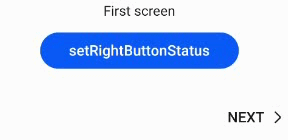

# stepper<a name="ZH-CN_TOPIC_0000001173324583"></a>

步骤导航器。当完成一个任务需要多个步骤时，可以使用步骤导航器展示当前进展。

> **说明：** 
>从API Version 5 开始支持。

## 权限列表<a name="section11257113618419"></a>

无

## 子组件<a name="section9288143101012"></a>

仅支持<stepper-item\>子组件。

> **说明：** 
>步骤导航器内的步骤顺序按照子组件<stepper-item\>的顺序进行排序。

## 属性<a name="section191521418142311"></a>

除支持[通用属性](js-components-common-attributes.md)外，还支持如下属性：

<a name="table20633101642315"></a>
<table><thead align="left"><tr id="row663331618238"><th class="cellrowborder" valign="top" width="25.040000000000003%" id="mcps1.1.5.1.1"><p id="a45273e2103004ff3bdd3375013e96a2a"><a name="a45273e2103004ff3bdd3375013e96a2a"></a><a name="a45273e2103004ff3bdd3375013e96a2a"></a>名称</p>
</th>
<th class="cellrowborder" valign="top" width="25.11%" id="mcps1.1.5.1.2"><p id="ad5b10d4a60e44bb4a8bbb3b4416d7b27"><a name="ad5b10d4a60e44bb4a8bbb3b4416d7b27"></a><a name="ad5b10d4a60e44bb4a8bbb3b4416d7b27"></a>类型</p>
</th>
<th class="cellrowborder" valign="top" width="11.18%" id="mcps1.1.5.1.3"><p id="ab2ae3d9f60d6475ab95ba095851a9d07"><a name="ab2ae3d9f60d6475ab95ba095851a9d07"></a><a name="ab2ae3d9f60d6475ab95ba095851a9d07"></a>默认值</p>
</th>
<th class="cellrowborder" valign="top" width="38.67%" id="mcps1.1.5.1.4"><p id="af5c3b773ed0a42e589819a6c8d257ca1"><a name="af5c3b773ed0a42e589819a6c8d257ca1"></a><a name="af5c3b773ed0a42e589819a6c8d257ca1"></a>描述</p>
</th>
</tr>
</thead>
<tbody><tr id="row9173122818343"><td class="cellrowborder" valign="top" width="25.040000000000003%" headers="mcps1.1.5.1.1 "><p id="p1517410284349"><a name="p1517410284349"></a><a name="p1517410284349"></a>index</p>
</td>
<td class="cellrowborder" valign="top" width="25.11%" headers="mcps1.1.5.1.2 "><p id="p1174172823415"><a name="p1174172823415"></a><a name="p1174172823415"></a>number</p>
</td>
<td class="cellrowborder" valign="top" width="11.18%" headers="mcps1.1.5.1.3 "><p id="p19174112863417"><a name="p19174112863417"></a><a name="p19174112863417"></a>-</p>
</td>
<td class="cellrowborder" valign="top" width="38.67%" headers="mcps1.1.5.1.4 "><p id="p7174328203414"><a name="p7174328203414"></a><a name="p7174328203414"></a>设置步骤导航器步骤显示第几个stepper-item子组件。</p>
</td>
</tr>
</tbody>
</table>

## 样式<a name="section72591594253"></a>

支持[通用样式](js-components-common-styles.md)。

> **说明：** 
>stepper组件默认占满父容器大小，建议父组件使用应用窗口大小（或者父组件为根节点）来优化体验。

## 事件<a name="section69611614182911"></a>

除支持[通用事件](js-components-common-events.md)外，还支持如下事件：

<a name="table836435619510"></a>
<table><thead align="left"><tr id="row153658563517"><th class="cellrowborder" valign="top" width="10.481048104810482%" id="mcps1.1.4.1.1"><p id="a0ff86a4560fa46bfbeb711d109869422"><a name="a0ff86a4560fa46bfbeb711d109869422"></a><a name="a0ff86a4560fa46bfbeb711d109869422"></a>名称</p>
</th>
<th class="cellrowborder" valign="top" width="41.91419141914191%" id="mcps1.1.4.1.2"><p id="a4c85eb8ca18b4169a25c4a9263fa63ed"><a name="a4c85eb8ca18b4169a25c4a9263fa63ed"></a><a name="a4c85eb8ca18b4169a25c4a9263fa63ed"></a>参数</p>
</th>
<th class="cellrowborder" valign="top" width="47.6047604760476%" id="mcps1.1.4.1.3"><p id="ab30b2353efa245fbad4d2aaa2ee33def"><a name="ab30b2353efa245fbad4d2aaa2ee33def"></a><a name="ab30b2353efa245fbad4d2aaa2ee33def"></a>描述</p>
</th>
</tr>
</thead>
<tbody><tr id="row990553521718"><td class="cellrowborder" valign="top" width="10.481048104810482%" headers="mcps1.1.4.1.1 "><p id="p1390619353170"><a name="p1390619353170"></a><a name="p1390619353170"></a>finish</p>
</td>
<td class="cellrowborder" valign="top" width="41.91419141914191%" headers="mcps1.1.4.1.2 "><p id="p7906113541716"><a name="p7906113541716"></a><a name="p7906113541716"></a>无</p>
</td>
<td class="cellrowborder" valign="top" width="47.6047604760476%" headers="mcps1.1.4.1.3 "><p id="p7906113531711"><a name="p7906113531711"></a><a name="p7906113531711"></a>当步骤导航器最后一个步骤完成时触发该事件。</p>
</td>
</tr>
<tr id="row24211338161718"><td class="cellrowborder" valign="top" width="10.481048104810482%" headers="mcps1.1.4.1.1 "><p id="p2421113881715"><a name="p2421113881715"></a><a name="p2421113881715"></a>skip</p>
</td>
<td class="cellrowborder" valign="top" width="41.91419141914191%" headers="mcps1.1.4.1.2 "><p id="p16421133841719"><a name="p16421133841719"></a><a name="p16421133841719"></a>无</p>
</td>
<td class="cellrowborder" valign="top" width="47.6047604760476%" headers="mcps1.1.4.1.3 "><p id="p1342113381171"><a name="p1342113381171"></a><a name="p1342113381171"></a>当通过setNextButtonStatus方法设置当前步骤导航器可跳过时，点击右侧跳过按钮触发该事件。</p>
</td>
</tr>
<tr id="row153591438186"><td class="cellrowborder" valign="top" width="10.481048104810482%" headers="mcps1.1.4.1.1 "><p id="p163591032182"><a name="p163591032182"></a><a name="p163591032182"></a>change</p>
</td>
<td class="cellrowborder" valign="top" width="41.91419141914191%" headers="mcps1.1.4.1.2 "><p id="p1535910381819"><a name="p1535910381819"></a><a name="p1535910381819"></a>{ prevIndex：prevIndex, index: index}</p>
</td>
<td class="cellrowborder" valign="top" width="47.6047604760476%" headers="mcps1.1.4.1.3 "><p id="p113602034189"><a name="p113602034189"></a><a name="p113602034189"></a>当步骤导航器点击左边或者右边文本按钮进行步骤切换时触发该事件，prevIndex表示老步骤的序号，index表示新步骤的序号。</p>
</td>
</tr>
<tr id="row6686131145112"><td class="cellrowborder" valign="top" width="10.481048104810482%" headers="mcps1.1.4.1.1 "><p id="p126879113514"><a name="p126879113514"></a><a name="p126879113514"></a>next</p>
</td>
<td class="cellrowborder" valign="top" width="41.91419141914191%" headers="mcps1.1.4.1.2 "><p id="p06871911115113"><a name="p06871911115113"></a><a name="p06871911115113"></a>{ index：index, pendingIndex: pendingIndex }</p>
</td>
<td class="cellrowborder" valign="top" width="47.6047604760476%" headers="mcps1.1.4.1.3 "><p id="p18140235202411"><a name="p18140235202411"></a><a name="p18140235202411"></a>当用户点击下一步按钮时触发该事件，index表示当前步骤序号，pendingIndex表示将于跳转的序号，该事件有返回值，返回值格式为：{ pendingIndex：pendingIndex }，可以通过指定pendingIndex来修改下一个步骤使用哪个stepper-item子组件。</p>
</td>
</tr>
<tr id="row914118186514"><td class="cellrowborder" valign="top" width="10.481048104810482%" headers="mcps1.1.4.1.1 "><p id="p1414151817510"><a name="p1414151817510"></a><a name="p1414151817510"></a>back</p>
</td>
<td class="cellrowborder" valign="top" width="41.91419141914191%" headers="mcps1.1.4.1.2 "><p id="p16910122113429"><a name="p16910122113429"></a><a name="p16910122113429"></a>{ index：index, pendingIndex: pendingIndex }</p>
</td>
<td class="cellrowborder" valign="top" width="47.6047604760476%" headers="mcps1.1.4.1.3 "><p id="p714261895119"><a name="p714261895119"></a><a name="p714261895119"></a>当用户点击上一步按钮时触发该事件，index表示当前步骤序号，pendingIndex表示将于跳转的序号，该事件有返回值，返回值格式为Object：{ pendingIndex：pendingIndex }，可以通过指定pendingIndex来修改上一个步骤使用哪个stepper-item子组件。</p>
</td>
</tr>
</tbody>
</table>

## 方法<a name="section1954212182148"></a>

除支持[通用方法](js-components-common-methods.md)外，支持如下方法：

<a name="table12793153991411"></a>
<table><thead align="left"><tr id="row15793239141412"><th class="cellrowborder" valign="top" width="19.561956195619562%" id="mcps1.1.4.1.1"><p id="p9794143915141"><a name="p9794143915141"></a><a name="p9794143915141"></a>名称</p>
</th>
<th class="cellrowborder" valign="top" width="24.102410241024103%" id="mcps1.1.4.1.2"><p id="p107942395147"><a name="p107942395147"></a><a name="p107942395147"></a>参数</p>
</th>
<th class="cellrowborder" valign="top" width="56.33563356335634%" id="mcps1.1.4.1.3"><p id="p11794133913143"><a name="p11794133913143"></a><a name="p11794133913143"></a>描述</p>
</th>
</tr>
</thead>
<tbody><tr id="row157940399145"><td class="cellrowborder" valign="top" width="19.561956195619562%" headers="mcps1.1.4.1.1 "><p id="p1479453913144"><a name="p1479453913144"></a><a name="p1479453913144"></a>setNextButtonStatus</p>
</td>
<td class="cellrowborder" valign="top" width="24.102410241024103%" headers="mcps1.1.4.1.2 "><p id="p10794163914147"><a name="p10794163914147"></a><a name="p10794163914147"></a>{ status: string, label: label }</p>
</td>
<td class="cellrowborder" valign="top" width="56.33563356335634%" headers="mcps1.1.4.1.3 "><p id="p12794143917141"><a name="p12794143917141"></a><a name="p12794143917141"></a>设置当前步骤导航器下一步文本按钮的状态，参数中status类型为string，可选值为：</p>
<a name="ol12242138121713"></a><a name="ol12242138121713"></a><ol id="ol12242138121713"><li>normal：正常状态，下一步文本按钮正常显示，可点击进入下一个步骤；</li><li>disabled：不可用状态，下一步文本按钮灰度显示，不可点击进入下一个步骤；</li><li>waiting：等待状态，下一步文本按钮不显示，使用等待进度条，不可点击进入下一个步骤。</li><li>skip：跳过状态，下一步文本按钮显示跳过按钮，点击时会跳过剩下步骤。</li></ol>
</td>
</tr>
</tbody>
</table>

## 示例<a name="section15374183712313"></a>

```
<!-- xxx.hml -->
<div class = "container">
  <stepper class="stepper" id="mystepper" index="0"  onnext="nextclick" onback="backclick">
    <stepper-item class ="stepperItem" label="{{label_1}}">
      <div class = "stepperItemContent" >
        <text class = "text">First screen</text>
      </div>
      <button type="capsule" class ="button" value="setRightButtonStatus" onclick="setRightButton"></button>
    </stepper-item>
    <stepper-item class ="stepperItem" label="{{label_2}}">
      <div class = "stepperItemContent" >
        <text class = "text">Second screen</text>
      </div>
      <button type="capsule" class ="button" value="setRightButtonStatus" onclick="setRightButton"></button>
    </stepper-item>
    <stepper-item class ="stepperItem" label="{{label_3}}">
      <div class = "stepperItemContent" >
        <text class = "text">Third screen</text>
      </div>
      <button type="capsule" class ="button" value="setRightButtonStatus" onclick="setRightButton"></button>
    </stepper-item>
  </stepper>
</div>
```

```
/* xxx.css */
.container {
  margin-top: 20px;
  flex-direction: column;
  align-items: center;
  height: 300px;
}
.stepperItem {
  flex-direction: column;
  align-items: center;
}
.stepperItemContent {
  color: #0000ff;
  font-size: 50px;
  justify-content: center;
}
.button {
  width: 60%;
  margin-top: 30px;
  justify-content: center;
}
```

```
// xxx.js
export default {
  data: {
    label_1:
    {
       prevLabel: 'BACK',
       nextLabel: 'NEXT',
       status: 'normal'
     },
     label_2:
     {
       prevLabel: 'BACK',
       nextLabel: 'NEXT',
       status: 'normal'
     },
     label_3:
     {
        prevLabel: 'BACK',
        nextLabel: 'NEXT',
        status: 'normal'
     },
  },
  setRightButton(e) {
    this.$element('mystepper').setNextButtonStatus({status: 'skip', label: 'SKIP'});
  },
  nextclick(e) {
    var index = {
      pendingIndex: e.pendingIndex
    }
    return index;
  },
  backclick(e) {
    var index = {
        pendingIndex: e.pendingIndex
    }
    return index;
  },
}
```



