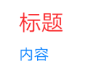

# CSS语法参考<a name="ZH-CN_TOPIC_0000001163932188"></a>

-   [尺寸单位](#zh-cn_topic_0000001127125112_section81638230913)
-   [样式导入](#zh-cn_topic_0000001127125112_section890312411592)
-   [声明样式](#zh-cn_topic_0000001127125112_section197695604215)
-   [选择器](#zh-cn_topic_0000001127125112_section381741144310)
-   [选择器优先级](#zh-cn_topic_0000001127125112_section1460102134415)
-   [伪类](#zh-cn_topic_0000001127125112_section633010213458)
-   [样式预编译](#zh-cn_topic_0000001127125112_section1690162216454)
-   [CSS样式继承6+](#zh-cn_topic_0000001127125112_section11758912154910)

CSS是描述HML页面结构的样式语言。所有组件均存在系统默认样式，也可在页面CSS样式文件中对组件、页面自定义不同的样式。

## 尺寸单位<a name="zh-cn_topic_0000001127125112_section81638230913"></a>

1.  逻辑像素px（文档中以<length\>表示）：
    1.  默认屏幕具有的逻辑宽度为720px（配置见[配置文件](js-framework-js-tag.md#ZH-CN_TOPIC_0000001164290700)中的window小节），实际显示时会将页面布局缩放至屏幕实际宽度，如100px在实际宽度为1440物理像素的屏幕上，实际渲染为200物理像素（从720px向1440物理像素，所有尺寸放大2倍）。
    2.  额外配置autoDesignWidth为true时（配置见[配置文件](js-framework-js-tag.md#ZH-CN_TOPIC_0000001164290700)中的window小节），逻辑像素px将按照屏幕密度进行缩放，如100px在屏幕密度为3的设备上，实际渲染为300物理像素。应用需要适配多种设备时，建议采用此方法。

2.  百分比（文档中以<percentage\>表示）：表示该组件占父组件尺寸的百分比，如组件的width设置为50%，代表其宽度为父组件的50%。

## 样式导入<a name="zh-cn_topic_0000001127125112_section890312411592"></a>

为了模块化管理和代码复用，CSS样式文件支持 @import 语句，导入css文件。

## 声明样式<a name="zh-cn_topic_0000001127125112_section197695604215"></a>

每个页面目录下存在一个与布局hml文件同名的css文件，用来描述该hml页面中组件的样式，决定组件应该如何显示。

1.  内部样式，支持使用style、class属性来控制组件的样式。例如：

    ```
    <!-- index.hml -->
    <div class="container">
      <text style="color: red">Hello World</text>
    </div>
    ```

    ```
    /* index.css */
    .container {
      justify-content: center;
    }
    ```

2.  文件导入，合并外部样式文件。例如，在common目录中定义样式文件style.css，并在index.css文件首行中进行导入：

    ```
    /* style.css */
    .title {
      font-size: 50px;
    }
    ```

    ```
    /* index.css */
    @import '../../common/style.css';
    .container {
      justify-content: center;
    }
    ```


## 选择器<a name="zh-cn_topic_0000001127125112_section381741144310"></a>

css选择器用于选择需要添加样式的元素，支持的选择器如下表所示：

<a name="zh-cn_topic_0000001127125112_table8917183413489"></a>
<table><thead align="left"><tr id="zh-cn_topic_0000001127125112_row1291753412489"><th class="cellrowborder" valign="top" width="15.341534153415342%" id="mcps1.1.4.1.1"><p id="zh-cn_topic_0000001127125112_p291763474818"><a name="zh-cn_topic_0000001127125112_p291763474818"></a><a name="zh-cn_topic_0000001127125112_p291763474818"></a>选择器</p>
</th>
<th class="cellrowborder" valign="top" width="24.852485248524854%" id="mcps1.1.4.1.2"><p id="zh-cn_topic_0000001127125112_p1491783412488"><a name="zh-cn_topic_0000001127125112_p1491783412488"></a><a name="zh-cn_topic_0000001127125112_p1491783412488"></a>样例</p>
</th>
<th class="cellrowborder" valign="top" width="59.805980598059804%" id="mcps1.1.4.1.3"><p id="zh-cn_topic_0000001127125112_p10917173404818"><a name="zh-cn_topic_0000001127125112_p10917173404818"></a><a name="zh-cn_topic_0000001127125112_p10917173404818"></a>样例描述</p>
</th>
</tr>
</thead>
<tbody><tr id="zh-cn_topic_0000001127125112_row2091743484810"><td class="cellrowborder" valign="top" width="15.341534153415342%" headers="mcps1.1.4.1.1 "><p id="zh-cn_topic_0000001127125112_p1891783411483"><a name="zh-cn_topic_0000001127125112_p1891783411483"></a><a name="zh-cn_topic_0000001127125112_p1891783411483"></a>.class</p>
</td>
<td class="cellrowborder" valign="top" width="24.852485248524854%" headers="mcps1.1.4.1.2 "><p id="zh-cn_topic_0000001127125112_p169174348484"><a name="zh-cn_topic_0000001127125112_p169174348484"></a><a name="zh-cn_topic_0000001127125112_p169174348484"></a>.container</p>
</td>
<td class="cellrowborder" valign="top" width="59.805980598059804%" headers="mcps1.1.4.1.3 "><p id="zh-cn_topic_0000001127125112_p991733474814"><a name="zh-cn_topic_0000001127125112_p991733474814"></a><a name="zh-cn_topic_0000001127125112_p991733474814"></a>用于选择class="container"的组件。</p>
</td>
</tr>
<tr id="zh-cn_topic_0000001127125112_row189178343481"><td class="cellrowborder" valign="top" width="15.341534153415342%" headers="mcps1.1.4.1.1 "><p id="zh-cn_topic_0000001127125112_p5917634124817"><a name="zh-cn_topic_0000001127125112_p5917634124817"></a><a name="zh-cn_topic_0000001127125112_p5917634124817"></a>#id</p>
</td>
<td class="cellrowborder" valign="top" width="24.852485248524854%" headers="mcps1.1.4.1.2 "><p id="zh-cn_topic_0000001127125112_p89231120496"><a name="zh-cn_topic_0000001127125112_p89231120496"></a><a name="zh-cn_topic_0000001127125112_p89231120496"></a>#titleId</p>
</td>
<td class="cellrowborder" valign="top" width="59.805980598059804%" headers="mcps1.1.4.1.3 "><p id="zh-cn_topic_0000001127125112_p132391416144917"><a name="zh-cn_topic_0000001127125112_p132391416144917"></a><a name="zh-cn_topic_0000001127125112_p132391416144917"></a>用于选择id="titleId"的组件。</p>
</td>
</tr>
<tr id="zh-cn_topic_0000001127125112_row12917934154811"><td class="cellrowborder" valign="top" width="15.341534153415342%" headers="mcps1.1.4.1.1 "><p id="zh-cn_topic_0000001127125112_p1041721913499"><a name="zh-cn_topic_0000001127125112_p1041721913499"></a><a name="zh-cn_topic_0000001127125112_p1041721913499"></a>tag</p>
</td>
<td class="cellrowborder" valign="top" width="24.852485248524854%" headers="mcps1.1.4.1.2 "><p id="zh-cn_topic_0000001127125112_p4917203424816"><a name="zh-cn_topic_0000001127125112_p4917203424816"></a><a name="zh-cn_topic_0000001127125112_p4917203424816"></a>text</p>
</td>
<td class="cellrowborder" valign="top" width="59.805980598059804%" headers="mcps1.1.4.1.3 "><p id="zh-cn_topic_0000001127125112_p174847365491"><a name="zh-cn_topic_0000001127125112_p174847365491"></a><a name="zh-cn_topic_0000001127125112_p174847365491"></a>用于选择text组件。</p>
</td>
</tr>
<tr id="zh-cn_topic_0000001127125112_row99179340488"><td class="cellrowborder" valign="top" width="15.341534153415342%" headers="mcps1.1.4.1.1 "><p id="zh-cn_topic_0000001127125112_p19918123424819"><a name="zh-cn_topic_0000001127125112_p19918123424819"></a><a name="zh-cn_topic_0000001127125112_p19918123424819"></a>,</p>
</td>
<td class="cellrowborder" valign="top" width="24.852485248524854%" headers="mcps1.1.4.1.2 "><p id="zh-cn_topic_0000001127125112_p7918734154817"><a name="zh-cn_topic_0000001127125112_p7918734154817"></a><a name="zh-cn_topic_0000001127125112_p7918734154817"></a>.title, .content</p>
</td>
<td class="cellrowborder" valign="top" width="59.805980598059804%" headers="mcps1.1.4.1.3 "><p id="zh-cn_topic_0000001127125112_p9240140154916"><a name="zh-cn_topic_0000001127125112_p9240140154916"></a><a name="zh-cn_topic_0000001127125112_p9240140154916"></a>用于选择class="title"和class="content"的组件。</p>
</td>
</tr>
<tr id="zh-cn_topic_0000001127125112_row1091833418485"><td class="cellrowborder" valign="top" width="15.341534153415342%" headers="mcps1.1.4.1.1 "><p id="zh-cn_topic_0000001127125112_p27744448492"><a name="zh-cn_topic_0000001127125112_p27744448492"></a><a name="zh-cn_topic_0000001127125112_p27744448492"></a>#id .class tag</p>
</td>
<td class="cellrowborder" valign="top" width="24.852485248524854%" headers="mcps1.1.4.1.2 "><p id="zh-cn_topic_0000001127125112_p0402948154911"><a name="zh-cn_topic_0000001127125112_p0402948154911"></a><a name="zh-cn_topic_0000001127125112_p0402948154911"></a>#containerId .content text</p>
</td>
<td class="cellrowborder" valign="top" width="59.805980598059804%" headers="mcps1.1.4.1.3 "><p id="zh-cn_topic_0000001127125112_p19830323135016"><a name="zh-cn_topic_0000001127125112_p19830323135016"></a><a name="zh-cn_topic_0000001127125112_p19830323135016"></a>非严格父子关系的后代选择器，选择具有id="containerId"作为祖先元素，class="content"作为次级祖先元素的所有text组件。如需使用严格的父子关系，可以使用“&gt;”代替空格，如：#containerId&gt;.content。</p>
</td>
</tr>
</tbody>
</table>

示例：

```
<!-- 页面布局xxx.hml -->
<div id="containerId" class="container">
  <text id="titleId" class="title">标题</text>
  <div class="content">
    <text id="contentId">内容</text>
  </div>
</div>
```

```
/* 页面样式xxx.css */
/* 对所有div组件设置样式 */
div {
  flex-direction: column;
}
/* 对class="title"的组件设置样式 */
.title {
  font-size: 30px;
}
/* 对id="contentId"的组件设置样式 */
#contentId {
  font-size: 20px;
}
/* 对所有class="title"以及class="content"的组件都设置padding为5px */
.title, .content {
  padding: 5px;
}
/* 对class="container"的组件下的所有text设置样式 */
.container text {
  color: #007dff;
}
/* 对class="container"的组件下的直接后代text设置样式 */
.container > text {
  color: #fa2a2d;
}
```

以上样式运行效果如下：



其中“.container text”将“标题”和“内容”设置为蓝色，而“.container \> text”直接后代选择器将“标题”设置为红色。2者优先级相同，但直接后代选择器声明顺序靠后，将前者样式覆盖（优先级计算见[选择器优先级](#zh-cn_topic_0000001127125112_section1460102134415)）。

## 选择器优先级<a name="zh-cn_topic_0000001127125112_section1460102134415"></a>

选择器的优先级计算规则与w3c规则保持一致（只支持：内联样式，id，class，tag，后代和直接后代），其中内联样式为在元素style属性中声明的样式。

当多条选择器声明匹配到同一元素时，各类选择器优先级由高到低顺序为：内联样式 \> id \> class \> tag。

## 伪类<a name="zh-cn_topic_0000001127125112_section633010213458"></a>

css伪类是选择器中的关键字，用于指定要选择元素的特殊状态。例如，:disabled状态可以用来设置元素的disabled属性变为true时的样式。

除了单个伪类之外，还支持伪类的组合，例如，:focus:checked状态可以用来设置元素的focus属性和checked属性同时为true时的样式。支持的单个伪类如下表所示，按照优先级降序排列：

<a name="zh-cn_topic_0000001127125112_table584491515455"></a>
<table><thead align="left"><tr id="zh-cn_topic_0000001127125112_row3844171516452"><th class="cellrowborder" valign="top" width="11.441144114411442%" id="mcps1.1.4.1.1"><p id="zh-cn_topic_0000001127125112_p3844151594510"><a name="zh-cn_topic_0000001127125112_p3844151594510"></a><a name="zh-cn_topic_0000001127125112_p3844151594510"></a>名称</p>
</th>
<th class="cellrowborder" valign="top" width="26.142614261426147%" id="mcps1.1.4.1.2"><p id="zh-cn_topic_0000001127125112_p11844131512458"><a name="zh-cn_topic_0000001127125112_p11844131512458"></a><a name="zh-cn_topic_0000001127125112_p11844131512458"></a>支持组件</p>
</th>
<th class="cellrowborder" valign="top" width="62.41624162416242%" id="mcps1.1.4.1.3"><p id="zh-cn_topic_0000001127125112_p78441615184511"><a name="zh-cn_topic_0000001127125112_p78441615184511"></a><a name="zh-cn_topic_0000001127125112_p78441615184511"></a>描述</p>
</th>
</tr>
</thead>
<tbody><tr id="zh-cn_topic_0000001127125112_row104936528343"><td class="cellrowborder" valign="top" width="11.441144114411442%" headers="mcps1.1.4.1.1 "><p id="zh-cn_topic_0000001127125112_p2235059193413"><a name="zh-cn_topic_0000001127125112_p2235059193413"></a><a name="zh-cn_topic_0000001127125112_p2235059193413"></a>:disabled</p>
</td>
<td class="cellrowborder" valign="top" width="26.142614261426147%" headers="mcps1.1.4.1.2 "><p id="zh-cn_topic_0000001127125112_p1323545943417"><a name="zh-cn_topic_0000001127125112_p1323545943417"></a><a name="zh-cn_topic_0000001127125112_p1323545943417"></a>支持disabled属性的组件</p>
</td>
<td class="cellrowborder" valign="top" width="62.41624162416242%" headers="mcps1.1.4.1.3 "><p id="zh-cn_topic_0000001127125112_p10235155912344"><a name="zh-cn_topic_0000001127125112_p10235155912344"></a><a name="zh-cn_topic_0000001127125112_p10235155912344"></a>表示disabled属性变为true时的元素（不支持动画样式的设置）。</p>
</td>
</tr>
<tr id="zh-cn_topic_0000001127125112_row0844121554510"><td class="cellrowborder" valign="top" width="11.441144114411442%" headers="mcps1.1.4.1.1 "><p id="zh-cn_topic_0000001127125112_p138441015144512"><a name="zh-cn_topic_0000001127125112_p138441015144512"></a><a name="zh-cn_topic_0000001127125112_p138441015144512"></a>:active</p>
</td>
<td class="cellrowborder" valign="top" width="26.142614261426147%" headers="mcps1.1.4.1.2 "><p id="zh-cn_topic_0000001127125112_p1184441511457"><a name="zh-cn_topic_0000001127125112_p1184441511457"></a><a name="zh-cn_topic_0000001127125112_p1184441511457"></a><span id="zh-cn_topic_0000001127125112_ph32264934610"><a name="zh-cn_topic_0000001127125112_ph32264934610"></a><a name="zh-cn_topic_0000001127125112_ph32264934610"></a>支持click事件的组件</span></p>
</td>
<td class="cellrowborder" valign="top" width="62.41624162416242%" headers="mcps1.1.4.1.3 "><p id="zh-cn_topic_0000001127125112_p1384471516454"><a name="zh-cn_topic_0000001127125112_p1384471516454"></a><a name="zh-cn_topic_0000001127125112_p1384471516454"></a>表示被用户激活的元素，如：被用户按下的按钮<span id="zh-cn_topic_0000001127125112_ph1265519710112"><a name="zh-cn_topic_0000001127125112_ph1265519710112"></a><a name="zh-cn_topic_0000001127125112_ph1265519710112"></a>、被激活的tab-bar页签（不支持动画样式的设置）</span>。</p>
</td>
</tr>
<tr id="zh-cn_topic_0000001127125112_row12925340193519"><td class="cellrowborder" valign="top" width="11.441144114411442%" headers="mcps1.1.4.1.1 "><p id="zh-cn_topic_0000001127125112_p134731642153511"><a name="zh-cn_topic_0000001127125112_p134731642153511"></a><a name="zh-cn_topic_0000001127125112_p134731642153511"></a>:waiting</p>
</td>
<td class="cellrowborder" valign="top" width="26.142614261426147%" headers="mcps1.1.4.1.2 "><p id="zh-cn_topic_0000001127125112_p114732420358"><a name="zh-cn_topic_0000001127125112_p114732420358"></a><a name="zh-cn_topic_0000001127125112_p114732420358"></a>button</p>
</td>
<td class="cellrowborder" valign="top" width="62.41624162416242%" headers="mcps1.1.4.1.3 "><p id="zh-cn_topic_0000001127125112_p2473742143511"><a name="zh-cn_topic_0000001127125112_p2473742143511"></a><a name="zh-cn_topic_0000001127125112_p2473742143511"></a>表示waiting属性为true的元素<span id="zh-cn_topic_0000001127125112_ph3323185819110"><a name="zh-cn_topic_0000001127125112_ph3323185819110"></a><a name="zh-cn_topic_0000001127125112_ph3323185819110"></a>（不支持动画样式的设置）</span>。</p>
</td>
</tr>
<tr id="zh-cn_topic_0000001127125112_row1884431514452"><td class="cellrowborder" valign="top" width="11.441144114411442%" headers="mcps1.1.4.1.1 "><p id="zh-cn_topic_0000001127125112_p7844161512452"><a name="zh-cn_topic_0000001127125112_p7844161512452"></a><a name="zh-cn_topic_0000001127125112_p7844161512452"></a>:checked</p>
</td>
<td class="cellrowborder" valign="top" width="26.142614261426147%" headers="mcps1.1.4.1.2 "><p id="zh-cn_topic_0000001127125112_p198451215174516"><a name="zh-cn_topic_0000001127125112_p198451215174516"></a><a name="zh-cn_topic_0000001127125112_p198451215174516"></a>input[type="checkbox"、type="radio"]<span id="zh-cn_topic_0000001127125112_ph55837371112"><a name="zh-cn_topic_0000001127125112_ph55837371112"></a><a name="zh-cn_topic_0000001127125112_ph55837371112"></a>、 switch</span></p>
</td>
<td class="cellrowborder" valign="top" width="62.41624162416242%" headers="mcps1.1.4.1.3 "><p id="zh-cn_topic_0000001127125112_p9845415164512"><a name="zh-cn_topic_0000001127125112_p9845415164512"></a><a name="zh-cn_topic_0000001127125112_p9845415164512"></a>表示checked属性为true的元素<span id="zh-cn_topic_0000001127125112_ph1476627729"><a name="zh-cn_topic_0000001127125112_ph1476627729"></a><a name="zh-cn_topic_0000001127125112_ph1476627729"></a>（不支持动画样式的设置）</span>。</p>
</td>
</tr>
</tbody>
</table>

伪类示例如下，设置按钮的:active伪类可以控制被用户按下时的样式：

```
<!-- index.hml -->
<div class="container">
  <input type="button" class="button" value="Button"></input>
</div>
```

```
/* index.css */
.button:active {
  background-color: #888888;/*按钮被激活时，背景颜色变为#888888 */
}
```

> **说明：** 
>针对弹窗类组件及其子元素不支持伪类效果，包括popup、dialog、menu、option、picker

## 样式预编译<a name="zh-cn_topic_0000001127125112_section1690162216454"></a>

预编译提供了利用特有语法生成css的程序，可以提供变量、运算等功能，令开发者更便捷地定义组件样式，目前支持less、sass和scss的预编译。使用样式预编译时，需要将原css文件后缀改为less、sass或scss，如index.css改为index.less、index.sass或index.scss。

-   当前文件使用样式预编译，例如将原index.css改为index.less：

    ```
    /* index.less */
    /* 定义变量 */
    @colorBackground: #000000;
    .container {
      background-color: @colorBackground; /* 使用当前less文件中定义的变量 */
    }
    ```


-   引用预编译文件，例如common中存在style.scss文件，将原index.css改为index.scss，并引入style.scss：

    ```
    /* style.scss */
    /* 定义变量 */
    $colorBackground: #000000;
    ```

    在index.scss中引用：

    ```
    /* index.scss */
    /* 引入外部scss文件 */
    @import '../../common/style.scss';
    .container {
      background-color: $colorBackground; /* 使用style.scss中定义的变量 */
    }
    ```

    > **说明：** 
    >引用的预编译文件建议放在common目录进行管理。


## CSS样式继承<sup>6+</sup><a name="zh-cn_topic_0000001127125112_section11758912154910"></a>

css样式继承提供了子节点继承父节点样式的能力，继承下来的样式在多选择器样式匹配的场景下，优先级排最低，当前支持以下样式的继承：

-   font-family
-   font-weight
-   font-size
-   font-style
-   text-align
-   line-height
-   letter-spacing
-   color
-   visibility

