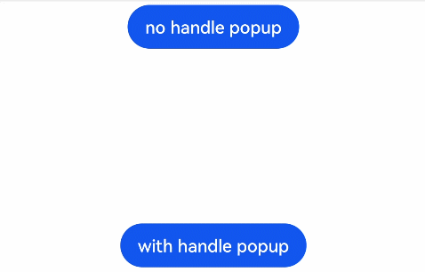

# Popup控制<a name="ZH-CN_TOPIC_0000001200011127"></a>

<a name="table1265031910316"></a>
<table><thead align="left"><tr id="row9650111916319"><th class="cellrowborder" valign="top" width="11.552520200076952%" id="mcps1.1.5.1.1"><p id="p18651919153114"><a name="p18651919153114"></a><a name="p18651919153114"></a>名称</p>
</th>
<th class="cellrowborder" valign="top" width="46.60446325509811%" id="mcps1.1.5.1.2"><p id="p965116197315"><a name="p965116197315"></a><a name="p965116197315"></a>参数类型</p>
</th>
<th class="cellrowborder" valign="top" width="8.772604848018469%" id="mcps1.1.5.1.3"><p id="p4651181953113"><a name="p4651181953113"></a><a name="p4651181953113"></a>默认值</p>
</th>
<th class="cellrowborder" valign="top" width="33.07041169680646%" id="mcps1.1.5.1.4"><p id="p6651191918319"><a name="p6651191918319"></a><a name="p6651191918319"></a>参数描述</p>
</th>
</tr>
</thead>
<tbody><tr id="row1165131943114"><td class="cellrowborder" valign="top" width="11.552520200076952%" headers="mcps1.1.5.1.1 "><p id="p122152715327"><a name="p122152715327"></a><a name="p122152715327"></a>bindPopup</p>
</td>
<td class="cellrowborder" valign="top" width="46.60446325509811%" headers="mcps1.1.5.1.2 "><p id="p94621515915"><a name="p94621515915"></a><a name="p94621515915"></a>{</p>
<p id="p1219665163810"><a name="p1219665163810"></a><a name="p1219665163810"></a>show: boolean,</p>
<p id="p1119616518385"><a name="p1119616518385"></a><a name="p1119616518385"></a>popup: {</p>
<p id="p18196115153817"><a name="p18196115153817"></a><a name="p18196115153817"></a>message: string,</p>
<p id="p04211265220"><a name="p04211265220"></a><a name="p04211265220"></a>placementOnTop: boolean,</p>
<p id="p17196205114385"><a name="p17196205114385"></a><a name="p17196205114385"></a>primaryButton?: {</p>
<p id="p161961151173816"><a name="p161961151173816"></a><a name="p161961151173816"></a>value: string,</p>
<p id="p91961851193813"><a name="p91961851193813"></a><a name="p91961851193813"></a>action: ()=&gt;void</p>
<p id="p71966510380"><a name="p71966510380"></a><a name="p71966510380"></a>},</p>
<p id="p61961251113818"><a name="p61961251113818"></a><a name="p61961251113818"></a>secondaryButton?:{</p>
<p id="p151961251143815"><a name="p151961251143815"></a><a name="p151961251143815"></a>value: string,</p>
<p id="p3196951193817"><a name="p3196951193817"></a><a name="p3196951193817"></a>action: () =&gt;void</p>
<p id="p1819635113813"><a name="p1819635113813"></a><a name="p1819635113813"></a>},</p>
<p id="p114451933135717"><a name="p114451933135717"></a><a name="p114451933135717"></a>onStateChange?: (isVisible: boolean) =&gt; void</p>
<p id="p919612516382"><a name="p919612516382"></a><a name="p919612516382"></a>}</p>
<p id="p822914920401"><a name="p822914920401"></a><a name="p822914920401"></a>}</p>
</td>
<td class="cellrowborder" valign="top" width="8.772604848018469%" headers="mcps1.1.5.1.3 "><p id="p1885914345342"><a name="p1885914345342"></a><a name="p1885914345342"></a>-</p>
</td>
<td class="cellrowborder" valign="top" width="33.07041169680646%" headers="mcps1.1.5.1.4 "><p id="p13178162312393"><a name="p13178162312393"></a><a name="p13178162312393"></a>show: 当前弹窗提示是否显示，默认值为false。</p>
<p id="p19178172343918"><a name="p19178172343918"></a><a name="p19178172343918"></a>message: 弹窗信息内容。</p>
<p id="p162121023172219"><a name="p162121023172219"></a><a name="p162121023172219"></a>placementOnTop：是否在组件上方显示，默认值为false。</p>
<p id="p1117872318392"><a name="p1117872318392"></a><a name="p1117872318392"></a>primaryButton: 第一个按钮。</p>
<p id="p131782023143911"><a name="p131782023143911"></a><a name="p131782023143911"></a>secondaryButton: 第二个按钮。</p>
<p id="p317813235395"><a name="p317813235395"></a><a name="p317813235395"></a>onStateChange: 弹窗状态变化事件回调，参数为弹窗当前的显示状态。</p>
</td>
</tr>
</tbody>
</table>

## 示例<a name="section0760145054817"></a>

```
@Entry
@Component
struct PopupExample {
  @State noHandlePopup: boolean = false
  @State handlePopup: boolean = false

  build() {
    Column({ space: 160 }) {
      Button('no handle popup')
        .onClick(() => {
          this.noHandlePopup = !this.noHandlePopup
        })
        .bindPopup(this.noHandlePopup, {
          
          message: 'content content content ...',
          placementOnTop: false,
          onStateChange: (e) => {
            console.info(e.isVisible.toString())
            if (!e.isVisible) {
              this.noHandlePopup = false
            }
          }
      })

      Button('with handle popup')
        .onClick(() => {
          this.handlePopup = !this.handlePopup
        })
        .bindPopup(this.handlePopup, {
          
          message: 'content content content ...',
          placementOnTop: true,
          secondaryButton: {
            
            value: 'ok',
            action: () => {
              this.handlePopup = !this.handlePopup
              console.info('secondaryButton click')
            }
          },
          onStateChange: (e) => {
            console.info(e.isVisible.toString())
          }
        })
    }.width('100%').padding({ top: 5 })
  }
}
```



