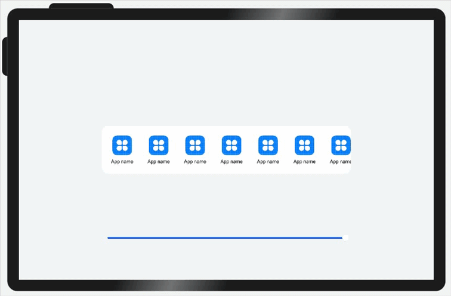

# 延伸能力


延伸能力是指容器组件内的子组件，按照其在列表中的先后顺序，随容器组件尺寸变化显示或隐藏。它可以根据显示区域的尺寸，显示不同数量的元素。


延伸能力通常有两种实现方式：


- 通过[List组件](https://gitee.com/openharmony/docs/blob/master/zh-cn/application-dev/reference/arkui-ts/ts-container-list.md)实现。

- 通过[Scroll组件](https://gitee.com/openharmony/docs/blob/master/zh-cn/application-dev/reference/arkui-ts/ts-container-scroll.md)配合[Row组件](https://gitee.com/openharmony/docs/blob/master/zh-cn/application-dev/reference/arkui-ts/ts-container-row.md)或[Column组件](https://gitee.com/openharmony/docs/blob/master/zh-cn/application-dev/reference/arkui-ts/ts-container-column.md)实现。


>  **说明：**
> List、Row或Column组件中子节点的在页面显示时就已经全部完成了布局计算及渲染，只不过受限于父容器尺寸，用户只能看到一部分。随着父容器尺寸增大，用户可以看到的子节点数目也相应的增加。用户还可以通过手指滑动触发列表滑动，查看被隐藏的子节点。


## 示例：

当父容器的尺寸发生改变时，页面中显示的图标数量随之发生改变。

分别通过List组件实现及通过Scroll组件配合Row组件实现。



（1）通过List组件实现。


```ts
@Entry
@Component
struct ExtensionCapabilitySample1 {
  @State rate: number = 0.60;
  const appList: number [] = [0, 1, 2, 3, 4, 5, 6, 7];

  // 底部滑块，可以通过拖拽滑块改变容器尺寸
  @Builder slider() {
    Slider({ value: this.rate * 100, min: 8, max: 60, style: SliderStyle.OutSet })
      .blockColor(Color.White)
      .width('60%')
      .height(50)
      .onChange((value: number) => {
        this.rate = value / 100;
      })
      .position({ x: '20%', y: '80%' })
  }

  build() {
    Flex({ alignItems: ItemAlign.Center, justifyContent: FlexAlign.Center }) {
      Row({ space: 10 }) {
        // 通过List组件实现隐藏能力
        List({ space: 10 }) {
          ForEach(this.appList, (item) => {
            ListItem() {
              Column() {
                Image($r("app.media.icon")).width(48).height(48).margin({ top: 8 })
                Text('App name')
                  .width(64)
                  .height(30)
                  .lineHeight(15)
                  .fontSize(12)
                  .textAlign(TextAlign.Center)
                  .margin({ top: 8 })
                  .padding({ bottom: 15 })
              }.width(80).height(102)
            }.width(80).height(102)
          })
        }
        .padding({ top: 16, left: 10 })
        .listDirection(Axis.Horizontal)
        .width('100%')
        .height(118)
        .borderRadius(16)
        .backgroundColor(Color.White)
      }
      .width(this.rate * 100 + '%')

      this.slider()
    }
    .width('100%')
    .height('100%')
    .backgroundColor('#F1F3F5')
  }
}
```

  （2）通过Scroll组件配合Row组件实现。

```ts
@Entry
@Component
struct ExtensionCapabilitySample2 {
  private scroller: Scroller = new Scroller()
  @State rate: number = 0.60;
  @State appList: number [] = [0, 1, 2, 3, 4, 5, 6, 7];

  // 底部滑块，可以通过拖拽滑块改变容器尺寸
  @Builder slider() {
    Slider({ value: this.rate * 100, min: 8, max: 60, style: SliderStyle.OutSet })
      .blockColor(Color.White)
      .width('60%')
      .height(50)
      .onChange((value: number) => {
        this.rate = value / 100;
      })
      .position({ x: '20%', y: '80%' })
  }

  build() {
    Flex({ alignItems: ItemAlign.Center, justifyContent: FlexAlign.Center }) {
      // 通过Scroll和Row组件实现隐藏能力
      Scroll(this.scroller) {
        Row({ space: 10 }) {
          ForEach(this.appList, () => {
            Column() {
              Image($r("app.media.icon")).width(48).height(48).margin({ top: 8 })
              Text('App name')
                .width(64)
                .height(30)
                .lineHeight(15)
                .fontSize(12)
                .textAlign(TextAlign.Center)
                .margin({ top: 8 })
                .padding({ bottom: 15 })


            }.width(80).height(102)
          })
        }
        .padding({ top: 16, left: 10 })
        .height(118)
        .borderRadius(16)
        .backgroundColor(Color.White)
      }
      .scrollable(ScrollDirection.Horizontal)
      .width(this.rate * 100 + '%')

      this.slider()
    }
    .width('100%')
    .height('100%')
    .backgroundColor('#F1F3F5')
  }
}
```
