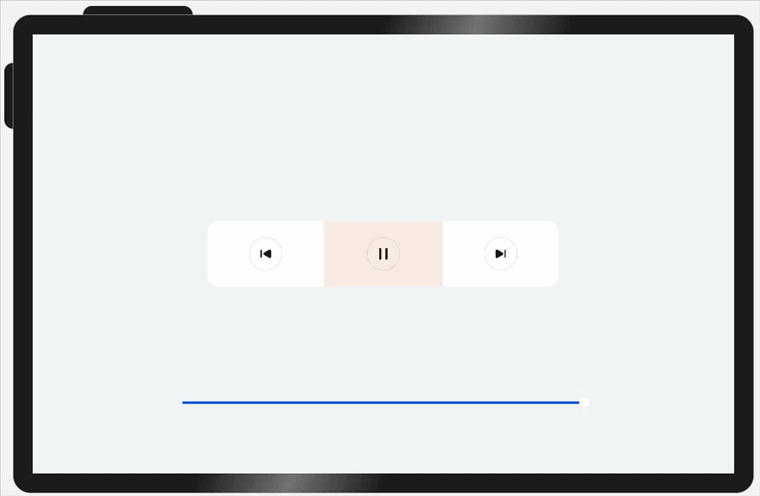

# 占比能力


占比能力是指子组件的宽高按照预设的比例，随父容器组件发生变化。


占比能力通常有两种实现方式：


- 将子组件的宽高设置为父组件宽高的百分比，详见[尺寸设置](../../reference/arkui-ts/ts-universal-attributes-size.md)及[长度类型](../../ui/ts-types.md#长度类型)。

- 通过layoutWeight属性配置互为兄弟关系的组件在父容器主轴方向的布局权重，详见[尺寸设置](../../reference/arkui-ts/ts-universal-attributes-size.md)。
  - 当父容器尺寸确定时，其子组件按照开发者配置的权重比例分配父容器中主轴方向的空间。
  - 仅当父容器是Row、Colomn或者Flex时，layoutWeight属性才会生效。
  - 设置layoutWeight属性后，组件本身的尺寸会失效。比如同时设置了.width('40%')和.layoutWeight(1)，那么只有.layoutWeight(1)会生效。


layoutWeight存在使用限制，所以实际使用过程中大多通过将子组件宽高设置为父组件的百分比来实现占比能力。


>  **说明：**
> 占比能力在实际开发中使用的非常广泛，可以通过很多不同的方式实现占比能力，如还可以通过[Grid组件](../../reference/arkui-ts/ts-container-grid.md)的columnsTemplate属性设置网格容器中列的数量及其宽度比例，或通过配置子组件在栅格（本章后文将详细介绍栅格系统)中占据不同的列数来实现占比能力。本小节仅介绍最基础和常用的实现方式，局限性较大或比非常小众的实现方式，本文不再展开介绍。


## 示例：

简单的播放控制栏，其中“上一首”、“播放/暂停”、“下一首”的layoutWeight属性都设置为1，因此它们按照“1:1:1”的比例均分父容器主轴方向的空间。

将三个按钮的.layoutWeight(1)分别替换为.width('33%')、.width('34%')、.width('33%')，也可以实现与当前同样的显示效果。




```ts
@Entry
@Component
struct ProportionCapabilitySample {
  @State rate: number = 0.5;

  // 底部滑块，可以通过拖拽滑块改变容器尺寸
  @Builder slider() {
    Slider({ value: 100, min: 25, max: 50, style: SliderStyle.OutSet })
      .blockColor(Color.White)
      .width('60%')
      .height(50)
      .onChange((value: number) => {
        this.rate = value / 100;
      })
      .position({ x: '20%', y: '80%' })
  }

  build() {
    Flex({ direction: FlexDirection.Column, justifyContent: FlexAlign.Center, alignItems: ItemAlign.Center }) {
      Column() {
        Row() {
          Flex({ justifyContent: FlexAlign.Center, alignItems: ItemAlign.Center }) {
            Image($r("app.media.down"))
              .width(48)
              .height(48)
          }
          .height(96)
          .layoutWeight(1)  // 设置子组件在父容器主轴方向的布局权重

          Flex({ justifyContent: FlexAlign.Center, alignItems: ItemAlign.Center }) {
            Image($r("app.media.pause"))
              .width(48)
              .height(48)
          }
          .height(96)
          .layoutWeight(1)  // 设置子组件在父容器主轴方向的布局权重
          .backgroundColor('#66F1CCB8')

          Flex({ justifyContent: FlexAlign.Center, alignItems: ItemAlign.Center }) {
            Image($r("app.media.next"))
              .width(48)
              .height(48)
          }
          .height(96)
          .layoutWeight(1)  // 设置子组件在父容器主轴方向的布局权重
        }
        .width(this.rate * 100 + '%')
        .height(96)
        .borderRadius(16)
        .backgroundColor('#FFFFFF')
      }

      this.slider()
    }
    .width('100%')
    .height('100%')
    .backgroundColor('#F1F3F5')
  }
}
```
