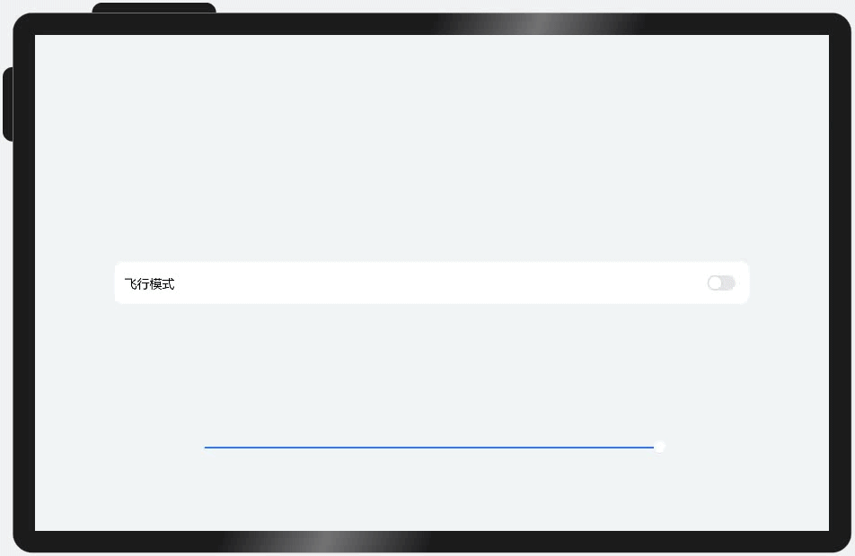

# 拉伸能力


拉伸能力是指容器组件尺寸发生变化时，增加或减小的空间全部分配给容器组件内指定区域。


拉伸能力通常通过Flex布局的flexGrow和flexShrink属性实现，详见[Flex布局](../../reference/arkui-ts/ts-universal-attributes-flex-layout.md)。


- flexGrow：仅当父容器宽度大于所有子组件宽度的总和时，该属性生效。配置了此属性的子组件，按照比例拉伸，分配父容器的多余空间。

- flexShrink：仅当父容器宽度小于所有子组件宽度的总和时，该属性生效。配置了此属性的子组件，按照比例收缩，分配父容器的不足空间。


特别的，当开发者期望将父容器的剩余空间全部分配给某空白区域时，也可以通过Blank组件实现。注意仅当父组件为Row\Column\Flex组件时，Blank组件才会生效，详见[Blank组件](../../reference/arkui-ts/ts-basic-components-blank.md)。


## 示例1：

本示例中的页面由中间的内容区（包含一张图片）以及两侧的留白区组成。

中间内容区的宽度设置为400vp，同时将flexGrow属性设置为1，flexShrink属性设置为0。

两侧留白区的宽度设置为150vp，同时将flexGrow属性设置为0，flexShrink属性设置为1。

因此父容器的基准尺寸是700vp（150vp+400vp+150vp）。

当父容器的尺寸大于700vp时，父容器中多余的空间全部分配给中间内容区。

当父容器的尺寸小于700vp时，左右两侧的留白区按照“1:1”的比例收缩（即平均分配父容器的不足空间）。


```ts
@Entry
@Component
struct FlexibleCapabilitySample1 {
  @State width: number = 402;

  // 底部滑块，可以通过拖拽滑块改变容器尺寸。
  @Builder slider() {
    Slider({ value: this.width, min: 402, max: 1000, style: SliderStyle.OutSet })
      .blockColor(Color.White)
      .width('60%')
      .onChange((value: number) => {
        this.width = value;
      })
      .position({ x: '20%', y: '80%' })
  }

  build() {
    Flex({ direction: FlexDirection.Column, justifyContent: FlexAlign.Center,
      alignItems: ItemAlign.Center }) {
      Column() {
        Flex({ direction: FlexDirection.Row, justifyContent: FlexAlign.Center,
          alignItems: ItemAlign.Center }) {
          // 通过flexGrow和flexShink属性，将多余的空间全部分配给图片，将不足的控件全部分配给两侧空白区域。
          Row().width(150).height(400).backgroundColor('#FFFFFF')
            .flexGrow(0).flexShrink(1)
          Image($r("app.media.illustrator")).width(400).height(400)
            .objectFit(ImageFit.Contain)
            .backgroundColor("#66F1CCB8")
            .flexGrow(1).flexShrink(0)
          Row().width(150).height(400).backgroundColor('#FFFFFF')
            .flexGrow(0).flexShrink(1)
        }.width(this.width)
      }

      this.slider()
    }.width('100%').height('100%').backgroundColor('#F1F3F5')
  }
}
```


## 示例2：

文字和开关的尺寸固定，仅有中间空白区域（Blank组件）随父容器尺寸变化而伸缩。




```ts
@Entry
@Component
struct FlexibleCapabilitySample2 {
  @State rate: number = 0.8;

  // 底部滑块，可以通过拖拽滑块改变容器尺寸
  @Builder slider() {
    Slider({ value: this.rate * 100, min: 30, max: 80, style: SliderStyle.OutSet })
      .blockColor(Color.White)
      .width('60%')
      .onChange((value: number) => {
        this.rate = value / 100;
      })
      .position({ x: '20%', y: '80%' })
  }

  build() {
    Flex({ direction: FlexDirection.Column, justifyContent: FlexAlign.Center,
      alignItems: ItemAlign.Center }) {
      Column() {
        Row() {
          Text('飞行模式')
            .fontSize(16)
            .width(135)
            .height(22)
            .fontWeight(FontWeight.Medium)
            .lineHeight(22)
          Blank()      // 通过Blank组件实现拉伸能力
          Toggle({ type: ToggleType.Switch })
            .width(36)
            .height(20)
        }
        .height(55)
        .borderRadius(12)
        .padding({ left: 13, right: 13 })
        .backgroundColor('#FFFFFF')
        .width(this.rate * 100 + '%')
      }

      this.slider()
    }.width('100%').height('100%').backgroundColor('#F1F3F5')
  }
}
```
