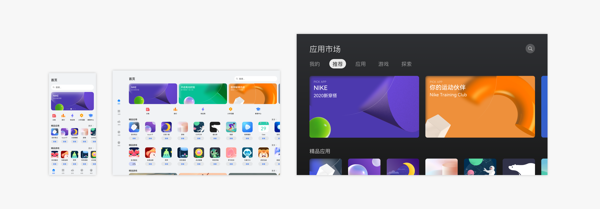
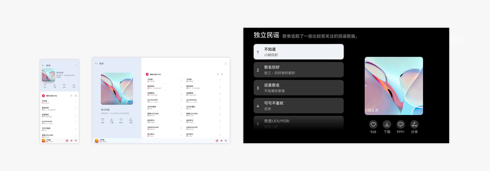
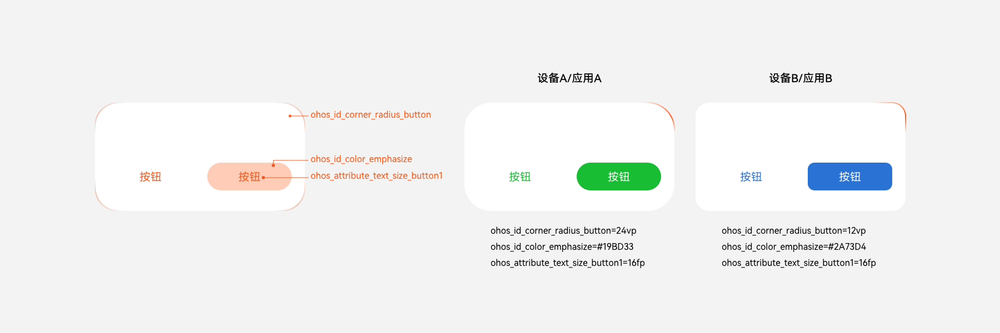

# 设计原则和要点

## 设计原则

当为多种不同的设备开发应用时，有如下设计原则：

**差异性**

充分了解所要支持的设备，包括屏幕尺寸、交互方式、使用场景、用户人群等，对设备的特性进行针对性的设计。

**一致性**

除了要考虑每个设备的特性外，还需要考虑不同设备的共性，并使用通用性设计方法提供既符合设备差异性，又具有跨设备一致性的设计，从而减少用户学习的难度，降低应用开发的成本。

**灵活性**

在硬件能力、交互方式、使用场景类似的设备上，应主要考虑布局位置、内容宽度、横向组件数量的调整，避免出现因横竖屏切换、窗口尺寸变化造成的界面元素不合理空白、模糊、变形、截断的问题。

**兼容性**

在硬件能力、交互方式、使用场景差异较大的设备上，除了考虑布局位置、内容宽度、横向组件数量，还需支持不同的输入方式、考虑功能架构的调整，避免出现输入不识别、功能不可以用、使用困难的问题。

## 设计要点

很多用户的多设备体验以默认设备为核心或从默认设备往外延伸，因此，围绕全场景体验的OpenHarmony UX设计，将优先确保用户在不同的设备上获得跟使用默认设备类似的体验，同时充分利用设备的优势使体验最大化。

在进行OpenHarmony的多设备应用设计时，需考虑应用以下内容：

### 自适应应用架构

使用自适应应用架构，可以确保应用在不同终端上，以最佳的导航形式来访问应用。OpenHarmony 在开发SDK上提供了便利，开发者可以通过简单配置轻松完成，无需从0开始构建。

例如：默认设备上的底Tab的结构，在Pad上一般使用侧边Tab来代替，在大屏上则是顶部Tab。

更多应用架构的设计内容，详见：[应用导航结构设计](navigation-design.md)和[应用页面结构设计](page-design.md)。

### 响应式界面布局

应用会在不同的场景下使用，常见的有横竖屏切换、分屏。这些场景会导致界面的尺寸和长宽比例发生变化。因此需要考虑内容的响应式布局，确保在各种场景下都有最佳的显示效果。

OpenHarmony 提供了多种布局能力，开发者通过组合运用使内容布局更符合业务需要与用户预期。

例如：默认设备上的滚动banner，在其他设备上可进行延伸，平板上露出更多banner，大屏上完全显示两张。

在不同类型的设备上，界面的尺寸和比例更为多样，再加上使用上的差异，导致设计上更为复杂。为此，可以考虑使用分栏布局、重复布局、挪移布局、缩进布局，进一步解决内容的显示问题。

例如：默认设备上上下排布的大图与列表，在长宽比例更大的设备上可挪移到左右展示。

更多界面布局的设计内容，详见：[界面布局](layout-design-intro.md)。

### 交互归一

交互归一描述了在多种交互任务或场景下，应用在触屏上和其它常用的输入方式（例如鼠标、触摸板、键盘）上分别对应的正确的交互规则。设计师和开发者应保证在当前输入方式下应用能够以正确的、符合用户习惯的交互规则进行响应。通常情况下，系统已经做好了这些事情，开发者只需正确调用。如果您的操作比较特别，您需要考虑多端上的交互归一，以确保用户体验的一致。

更多交互归一的设计内容，详见：[人机交互](interaction-basics.md)。

### 视觉参数化

通过参数，方便的调整各端的视觉，使得各端具备该设备特有的风格。在OpenHarmony中，边距、圆角、阴影、字体大小等，都可以通过参数来进行调整。

更多视觉参数化的设计内容，详见：[视觉风格](visual-style-basics.md)。

### 多态控件

应用在多设备上运行，设备也可在不同交互方式下使用。控件作为应用的基础组成部分，需要支持不同的设备，且在视觉、交互、动效等表现形式上针对设备进行必要的调整，达到最佳体验。因此，同一控件在不同的设备上会呈现出不同的形态，称为多态控件。

OpenHarmony默认提供支持多设备的控件，开发者可以直接使用并对不同状态进行自定义。例如平板可以连接蓝牙键盘和鼠标来做文字编辑工作，此时控件需要同时满足键盘和鼠标交互，需要支持获焦态和悬停态。

### 针对性优化

在上述设计内容以外，在具体设备上，推荐针对性地进行特殊的操作和布局优化，使之符合当前设备的使用习惯。

例如：在以键鼠操作的界面上，为确保用户的使用习惯，需要提供额外的设计。

| **以触控为主** | **以键鼠操作为主** |
| -------- | -------- |
| 下拉刷新 | 界面上提供“刷新”图标或适配F5快捷键 |
| 滑动多选 | 鼠标&nbsp;框选 |
| 下拉关闭 | 界面上提供“关闭”图标 |
| 长按浮起拖拽 | 鼠标直接拖拽 |
