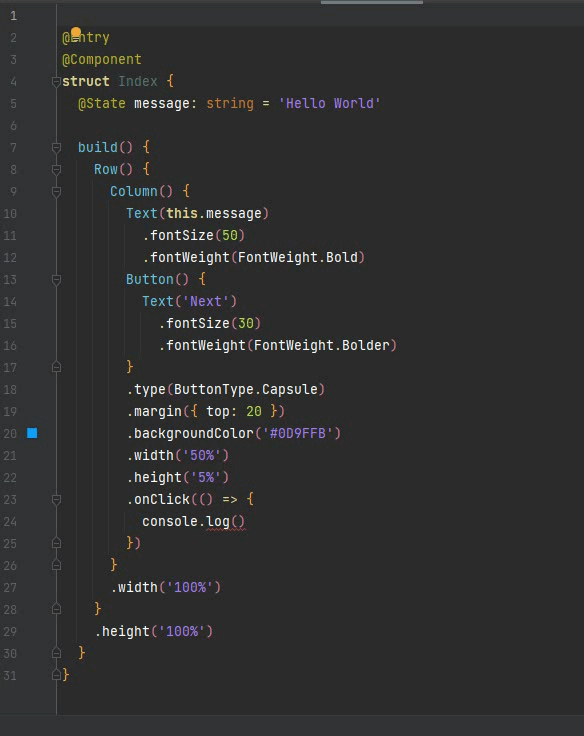

# 一多能力的功能开发介绍


应用开发至少包含两部分工作：UI页面开发和底层功能开发（部分需要联网的应用还会涉及服务端开发）。如“打开设备NFC”功能，除了开发页面，还需要调用系统API开启NFC。前面章节主要介绍了如何解决页面适配的问题，本章节主要介绍应用如何解决设备系统能力差异的兼容问题。


我们以一个简单例子说明：一个具有NFC功能的应用，如何兼容运行在有NFC和无NFC系统能力的设备上。


应用从开发到用户可以使用，一般要经历几个阶段：应用分发和下载-&gt;应用安装-&gt;应用运行，要解决上面提到的兼容问题，一般有如下几种解决思路：


1. 分发和下载：有NFC设备的用户才能在应用市场可见该应用，提供用户下载能力。

2. 安装：有NFC能力的设备才允许安装该应用。

3. 运行：在运行阶段通过动态判断方式，在NFC设备上功能运行正常，在无NFC设备上运行不发生Crash。


所以，对应的解决方案就有：


1. 在分发阶段，核心分发逻辑：上架的应用使用的系统能力是设备系统能力的子集。满足这个条件，用户才能在应用市场看到该应用。

2. 在安装阶段，核心安装逻辑：安装的应用调用的系统能力是设备系统能力的子集。满足这个条件，用户才能安装该应用。

3. If/Else的动态逻辑判断。伪代码简单示例如下：
     
   ```
   if (该设备有系统能力1) {
       运行系统能力1相关的代码;
   } else {
       提示用户该设备不支持;
   }
   ```


OpenHarmony支持的设备类型分为两大类：


1. 典型设备类型，如默认设备、平板等。系统已经定义好了这些设备的系统能力集合，对应用开发者来说，只需要感知在IDE中创建Module时设备类型的选择，如下图所示：
   

   或者module.json文件中的deviceTypes，如下图所示：

   

   简单来说，应用开发者基于典型设备类型的应用开发，仅需选择设备类型，系统完成分发或者安装的匹配逻辑。

2. 厂家自定义设备类型。由于厂家提供的系统能力千差万别，OpenHarmony允许厂家自己自定义设备的系统能力，但需要通过标准的格式形成一个ID，称为PCID（产品兼容性标识，Product Compatibility ID），并对外发布这个PCID，一般通过设备认证中心发布。应用开发者如果希望应用可以分发和安装到厂家自定义的设备上，就必须拿到对应的自定义设备PCID，否则就无法声明应用使用或调用的系统能力集（也是通过一个ID表示，称为RPCID，英文全名：Required Product Compatibility ID，中文名：要求的产品兼容性标识）。


鉴于当前OpenHarmony版本还不具备设备认证中心，本章节仅讨论典型设备类型下多设备应用开发的场景。


## 编码时的API联想

IDE中提供了API的联想功能，方便开发者使用系统能力。当开发者选择多个设备类型时，API的联想范围就是选择类型设备提供的API的并集，如同时支撑默认设备和平板，API的联想范围就是默认设备和平板支持的API的并集。API的联想效果如下：




## 动态逻辑判断

开发者可以通过canIUse接口，判断目标设备是否支持某系统能力，进而执行不同的业务逻辑。

  
```
import geolocation from'@ohos.geolocation';
 const isLocationAvailable =canIUse('SystemCapability.Location.Location');
 if (isLocationAvailable) {
   console.log('该设备支持位置信息');
   geolocation.getCurrentLocation((location) => {
     console.log(location.latitude, location.longitude);
   })
 } else {
   console.log('该设备不支持位置信息');
 }
```

>  **说明：**
> 开发者通过 import 方式导入的模块，若当前设备不支持该模块，import 的结果为 undefined。故开发者在使用 API 时，需要判断其是否存在。
