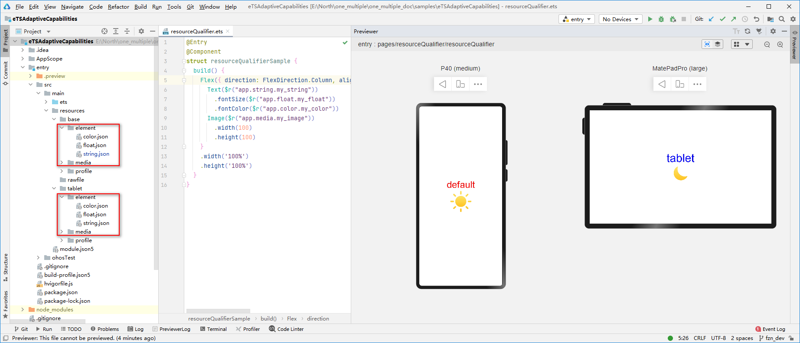

# 资源使用


在页面开发过程中，经常需要用到颜色、字体、间距、图片等资源，在不同的设备或配置中，这些资源的值可能不同。有两种方式处理：


- [自定义资源](#自定义资源)：借助资源文件能力，开发者在应用中自定义资源，自行管理这些资源在不同的设备或配置中的表现。

- [系统资源](#系统资源)：开发者直接使用系统预置的资源定义（即分层参数）。


## 自定义资源


### 资源文件介绍

开发者可以在项目工程的resources目录中创建指定类型的资源文件，通过”key-value”的形式定义资源，同时可以借助资源限定词能力，定义同一资源在不同设备（默认设备、智慧屏等）或同一设备不同配置（横竖屏、深浅色等）下的表现。工程内的resources目录按照两级目录的形式来组织：

- 一级目录为base目录、限定词目录以及rawfile目录
  - base目录是默认存在的目录。当应用的resources资源目录中没有与设备状态匹配的限定词目录时，会自动引用该目录中的资源文件。
  - 限定词目录需要开发者自行创建，其可以由一个或多个表征应用场景或设备特征的限定词组合而成，包括移动国家码和移动网络码、语言、文字、国家或地区、横竖屏、设备类型、颜色模式和屏幕密度等维度，限定词之间通过下划线（_）或者中划线（-）连接。
  - 在引用rawfile中的资源时，不会根据系统的状态去匹配，rawfile目录中可以直接存放资源文件。

- 二级目录为资源目录
  - 用于存放字符串、颜色、浮点数等基础元素，以及媒体等资源文件。
  - 当前支持的文件和资源类型如下：
       | 文件名 | 资源类型 |
     | -------- | -------- |
     | color.json | 颜色资源。 |
     | float.json | 间距、圆角、字体等资源。 |
     | string.json | 字符串资源。 |
     | plural.json | 字符串资源。 |
     | media目录 | 图片资源 |


### 资源文件使用

在工程中，通过 "$r('app.type.name')" 的形式引用应用资源。app代表是应用内resources目录中定义的资源；type 代表资源类型（或资源的存放位置），可以取 color、float、string、plural和media，name代表资源命名，由开发者定义资源时确定。

>  **说明：**
> - 可以查看[声明式开发范式资源访问](https://gitee.com/openharmony/docs/blob/master/zh-cn/application-dev/ui/ts-application-resource-access.md)，了解资源访问的更多细节。
> 
> - 类Web开发范式的资源文件路径及资源限定词的使用与声明式范式不同，详情请参考[类Web开发范式资源限定与访问](https://gitee.com/openharmony/docs/blob/master/zh-cn/application-dev/ui/js-framework-resource-restriction.md)及[类Web开发范式文件组织](https://gitee.com/openharmony/docs/blob/master/zh-cn/application-dev/ui/js-framework-file.md)。


### 示例

按照如下说明，配置工程resources目录中的json资源文件（如文件不存在，需手工创建）。另外，准备两张不同的图片，分别放置于resources/base/media/my_image.jpg及resources/tablet/media/my_image.jpg路径下。


```ts
//resources/base/element/string.json
 {
   "string":[
     {
       "name":"my_string",
       "value":"default"
     }
   ]
 }
 //resources/base/element/color.json
 {
   "color":[
     {
       "name":"my_color",
       "value":"#ff0000"
     }
   ]
 }
 //resources/base/element/float.json
 {
   "float":[
     {
       "name":"my_float",
       "value":"60vp"
     }
   ]
 }

 //resources/tablet/element/string.json
 {
   "string":[
     {
       "name":"my_string",
       "value":"tablet"
     }
   ]
 }
 //resources/tablet/element/color.json
 {
   "color":[
     {
       "name":"my_color",
       "value":"#0000ff"
     }
   ]
 }
 //resources/tablet/element/float.json
 {
   "float":[
     {
       "name":"my_float",
       "value":"80vp"
     }
   ]
 }
```



页面源码如下：


```ts
@Entry
@Component
struct Index {
  build() {
    Flex({ direction: FlexDirection.Column, alignItems: ItemAlign.Center, justifyContent: FlexAlign.Center }) {
      Text($r("app.string.my_string"))
        .fontSize($r("app.float.my_float"))
        .fontColor($r("app.color.my_color"))
      Image($r("app.media.my_image"))
        .width(100)
        .height(100)
    }
    .width('100%')
    .height('100%')
  }
}
```


## 系统资源

除了自定义资源，开发者也可以使用系统中预定义的资源（即[分层参数](visual-style-basics.md)，同一资源ID在设备类型、深浅色等不同配置下有不同的取值）。

在开发过程中，分层参数的用法与资源限定词基本一致。开发者可以通过"$r('sys.type.resource_id')"的形式引用系统资源。sys代表是系统资源；type代表资源类型，值可以取color、float、string和media；resource_id代表资源id。

可以访问本文"[资源](OHOS_资源分层设计表_V1.0.01.xlsm)"，获取OHOS上支持的系统资源ID及其在不同配置下的取值。也可以访问[OpenHarmony/resources代码仓](https://gitee.com/openharmony/resources/tree/master/systemres/main/resources)，了解OpenHarmony系统中预置的分层参数资源，可以发现这里目录结构与工程中的resources目录类似，也是通过资源限定词匹配不同的设备或设备状态。

>  **说明：**
> 仅声明式开发范式支持使用分层参数，类Web开发范式不支持。
