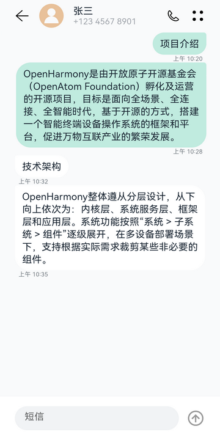
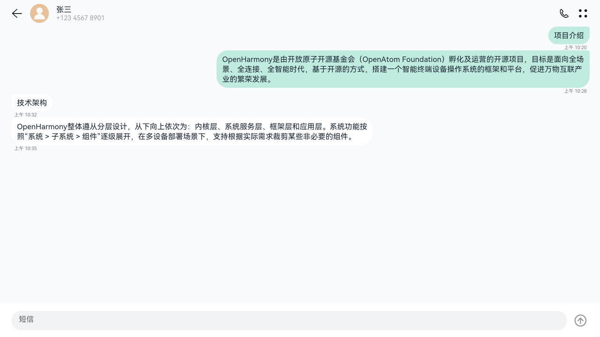

# 组合成型


现在会话详情页面的顶部标题栏、信息列表及底部输入栏都已经准备完毕，将这三部分组合起来即可得到完整的页面。


- 通过[Flex组件](../../reference/arkui-ts/ts-container-flex.md)将三个部分组合起来，注意justifyContent: FlexAlign.SpaceBetween配置项是将Flex组件中的元素按照主轴方向均匀分配，其中第一个元素与顶部对齐，最后一个元素与底部对齐。

- 通过[List组件](../../reference/arkui-ts/ts-container-list.md)和[ForEach语法](../../ui/ts-rending-control-syntax-foreach.md)，显示整个消息列表。


| 默认设备 | 平板 |
| -------- | -------- |
|  |  |


```ts
@Entry
 @Component
 struct Conversation {
   build() {
     Flex({ direction: FlexDirection.Column, alignItems: ItemAlign.Start,
       justifyContent: FlexAlign.SpaceBetween }) {
       Column() {
         TopArea()   // 顶部标题栏
         List() {    // 消息列表
           ForEach(globalMessageList, (item, index) => {
             ListItem() {
               MessageItem({
                 isReceived: item.isReceived,
                 content: item.content,
                 time: item.time
               })
           })
         }
         .listDirection(Axis.Vertical)
         .edgeEffect(EdgeEffect.Spring)
       }
       ButtomArea()  // 底部输入栏
     }
     .backgroundColor("#F1F3F5")
     .width('100%')
     .height('100%')
   }
 }
```
