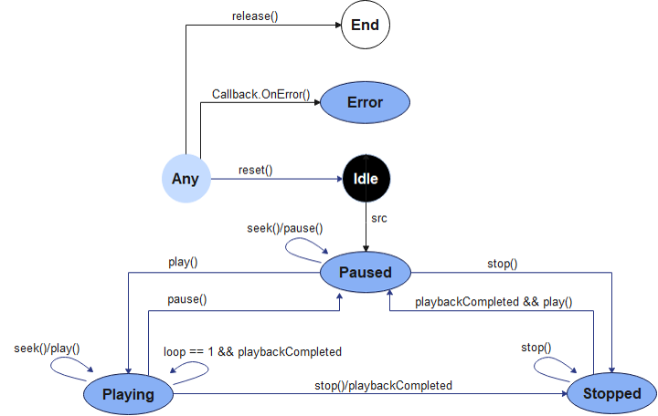
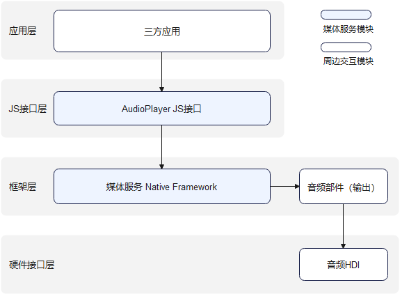

# 音频播放开发指导

## 场景介绍

音频播放的主要工作是将音频数据转码为可听见的音频模拟信号并通过输出设备进行播放，同时对播放任务进行管理。

**图1** 音频播放状态机




**图2** 音频播放零层图



## 开发步骤

详细API含义可参考：[媒体服务API文档AudioPlayer](../reference/apis/js-apis-media.md)

### 全流程场景

包含流程：创建实例，设置uri，播放音频，跳转播放位置，设置音量，暂停播放，获取轨道信息，停止播放，重置，释放资源等流程。

AudioPlayer支持的src媒体源输入类型可参考：[src属性说明](../reference/apis/js-apis-media.md#audioplayer_属性)

```js
import media from '@ohos.multimedia.media'
import fileIO from '@ohos.fileio'

function SetCallBack(audioPlayer) {
    audioPlayer.on('dataLoad', () => {              //设置'dataLoad'事件回调，src属性设置成功后，触发此回调
        console.info('audio set source success');
        //播放界面可切换至已准备好，可点击播放按钮进行播放状态
    });
    audioPlayer.on('play', () => {                  //设置'play'事件回调
        console.info('audio play success');
        //将播放按钮切换至可暂停状态
    });
    audioPlayer.on('pause', () => {                 //设置'pause'事件回调
        console.info('audio pause success');
        //将播放按钮切换至可播放状态
    });
    audioPlayer.on('stop', () => {                  //设置'stop'事件回调
        console.info('audio stop success');
        //播放停止，播放进度条归零，播放按钮切换至可播放状态
    });
    audioPlayer.on('reset', () => {                 //设置'reset'事件回调
        console.info('audio reset success');
        //需重新设置src属性后，可继续播放其他音频
    });
    audioPlayer.on('timeUpdate', (seekDoneTime) => {//设置'timeUpdate'事件回调
        if (typeof(seekDoneTime) == 'undefined') {
            console.info('audio seek fail');
            return;
        }
        console.info('audio seek success, and seek time is ' + seekDoneTime);
        //播放进度条更新到seek对应的位置
    });
    audioPlayer.on('volumeChange', () => {          //设置'volumeChange'事件回调
        console.info('audio volumeChange success');
        //更新音量显示
    });
    audioPlayer.on('finish', () => {                //设置'finish'事件回调，播放完成触发
        console.info('audio play finish');
    });
    audioPlayer.on('error', (error) => {            //设置'error'事件回调
        console.info(`audio error called, errName is ${error.name}`);
        console.info(`audio error called, errCode is ${error.code}`);
        console.info(`audio error called, errMessage is ${error.message}`);
    });
}

function printfDescription(obj) {
    for (let item in obj) {
        let property = obj[item];
        console.info('audio key is ' + item);
        console.info('audio value is ' + property);
    }
}

//1. 创建实例
let audioPlayer = media.createAudioPlayer();
SetCallBack(audioPlayer);                          //设置事件回调
//2. 用户选择音频，设置uri
let fdPath = 'fd://'
// path路径的码流可通过"hdc file send D:\xxx\01.mp3 /data/accounts/account_0/appdata" 命令，将其推送到设备上
let path = '/data/accounts/account_0/appdata/ohos.xxx.xxx.xxx/01.mp3';
await fileIO.open(path).then(fdNumber) => {
   fdPath = fdPath + '' + fdNumber;
   console.info('open fd sucess fd is' + fdPath);
}, (err) => {
   console.info('open fd failed err is' + err);
}),catch((err) => {
   console.info('open fd failed err is' + err);
});

audioPlayer.src = fdPath;                         //设置src属性，并触发'dataLoad'事件回调
//3. 播放音频
audioPlayer.play();                               //需等待'dataLoad'事件回调完成后，才可调用play进行播放，触发'play'事件回调
//4. 跳转播放位置
audioPlayer.seek(30000);                          //触发'timeUpdate'事件回调，seek到30000ms处播放
//5. 设置音量
audioPlayer.setVolume(0.5);                       //触发'volumeChange'事件回调
//6. 暂停播放
audioPlayer.pause();                              //触发'pause'事件回调，暂停播放
//7. 获取轨道信息
audioPlayer.getTrackDescription((error, arrlist) => {  //通过回调方式获取音频轨道信息
    if (typeof (arrlist) != 'undefined') {
        for (let i = 0; i < arrlist.length; i++) {
            printfDescription(arrlist[i]);
        }
    } else {
        console.log(`audio getTrackDescription fail, error:${error.message}`);
    }
});
//8. 停止播放
audioPlayer.stop();                              //触发'stop'事件回调
//9. 重置播放资源
audioPlayer.reset();                             //触发'reset'事件回调后，重新设置src属性，可完成切歌
//10. 释放资源
audioPlayer.release();                           //audioPlayer资源被销毁
audioPlayer = undefined;
```

### 正常播放场景

```js
import media from '@ohos.multimedia.media'
import fileIO from '@ohos.fileio'

function SetCallBack(audioPlayer) {
    audioPlayer.on('dataLoad', () => {              //设置'dataLoad'事件回调，src属性设置成功后，触发此回调
        console.info('audio set source success');
        audioPlayer.play();                         //调用play方法开始播放，触发'play'事件回调
    });
    audioPlayer.on('play', () => {                  //设置'play'事件回调
        console.info('audio play success');
    });
    audioPlayer.on('finish', () => {                //设置'finish'事件回调，播放完成触发
        console.info('audio play finish');
        audioPlayer.release();                      //audioPlayer资源被销毁
		audioPlayer = undefined;
    });
}

let audioPlayer = media.createAudioPlayer();       //创建一个音频播放实例
SetCallBack(audioPlayer);                          //设置事件回调
/* 用户选择音频设置fd(本地播放) */
let fdPath = 'fd://'
// path路径的码流可通过"hdc file send D:\xxx\01.mp3 /data/accounts/account_0/appdata" 命令，将其推送到设备上
let path = '/data/accounts/account_0/appdata/ohos.xxx.xxx.xxx/01.mp3';
await fileIO.open(path).then(fdNumber) => {
   fdPath = fdPath + '' + fdNumber;
   console.info('open fd sucess fd is' + fdPath);
}, (err) => {
   console.info('open fd failed err is' + err);
}),catch((err) => {
   console.info('open fd failed err is' + err);
});

audioPlayer.src = fdPath;                           //设置src属性，并触发'dataLoad'事件回调
```

### 切歌场景

```js
import media from '@ohos.multimedia.media'
import fileIO from '@ohos.fileio'

function SetCallBack(audioPlayer) {
    audioPlayer.on('dataLoad', () => {              //设置'dataLoad'事件回调，src属性设置成功后，触发此回调
        console.info('audio set source success');
        audioPlayer.play();                         //调用play方法开始播放，触发'play'事件回调
    });
    audioPlayer.on('play', () => {                  //设置'play'事件回调
        console.info('audio play success');
    });
    audioPlayer.on('finish', () => {                //设置'finish'事件回调，播放完成触发
        console.info('audio play finish');
        audioPlayer.release();                      //audioPlayer资源被销毁
		audioPlayer = undefined;
    });
}

let audioPlayer = media.createAudioPlayer();       //创建一个音频播放实例
SetCallBack(audioPlayer);                          //设置事件回调
/* 用户选择音频设置fd(本地播放) */
let fdPath = 'fd://'
// path路径的码流可通过"hdc file send D:\xxx\01.mp3 /data/accounts/account_0/appdata" 命令，将其推送到设备上
let path = '/data/accounts/account_0/appdata/ohos.xxx.xxx.xxx/01.mp3';
await fileIO.open(path).then(fdNumber) => {
   fdPath = fdPath + '' + fdNumber;
   console.info('open fd sucess fd is' + fdPath);
}, (err) => {
   console.info('open fd failed err is' + err);
}),catch((err) => {
   console.info('open fd failed err is' + err);
});

audioPlayer.src = fdPath;                           //设置src属性，并触发'dataLoad'事件回调
/* 播放一段时间后，下发切歌指令 */
audioPlayer.reset();

/* 用户选择音频设置fd(本地播放) */
let fdNextPath = 'fd://'
// path路径的码流可通过"hdc file send D:\xxx\02.mp3 /data/accounts/account_0/appdata" 命令，将其推送到设备上
let nextPath = '/data/accounts/account_0/appdata/ohos.xxx.xxx.xxx/02.mp3';
await fileIO.open(nextPath).then(fdNumber) => {
   fdNextPath = fdNextPath + '' + fdNumber;
   console.info('open fd sucess fd is' + fdNextPath);
}, (err) => {
   console.info('open fd failed err is' + err);
}),catch((err) => {
   console.info('open fd failed err is' + err);
});
audioPlayer.src = fdNextPath;
```

### 单曲循环场景

```js
import media from '@ohos.multimedia.media'
import fileIO from '@ohos.fileio'

function SetCallBack(audioPlayer) {
    audioPlayer.on('dataLoad', () => {              //设置'dataLoad'事件回调，src属性设置成功后，触发此回调
        console.info('audio set source success');
        audioPlayer.play();                         //调用play方法开始播放，触发'play'事件回调
    });
    audioPlayer.on('play', () => {                  //设置'play'事件回调
        console.info('audio play success');
    });
    audioPlayer.on('finish', () => {                //设置'finish'事件回调，播放完成触发
        console.info('audio play finish');
        audioPlayer.release();                      //audioPlayer资源被销毁
		audioPlayer = undefined;
    });
}

let audioPlayer = media.createAudioPlayer();       //创建一个音频播放实例
SetCallBack(audioPlayer);                          //设置事件回调

/* 用户选择音频设置fd(本地播放) */
let fdPath = 'fd://'
// path路径的码流可通过"hdc file send D:\xxx\01.mp3 /data/accounts/account_0/appdata" 命令，将其推送到设备上
let path = 'data/accounts/account_0/appdata/ohos.xxx.xxx.xxx/01.mp3';
await fileIO.open(path).then(fdNumber) => {
   fdPath = fdPath + '' + fdNumber;
   console.info('open fd sucess fd is' + fdPath);
}, (err) => {
   console.info('open fd failed err is' + err);
}),catch((err) => {
   console.info('open fd failed err is' + err);
});

audioPlayer.src = fdPath;                           //设置src属性，并触发'dataLoad'事件回调
audioPlayer.loop = true;                            //设置循环播放属性
```