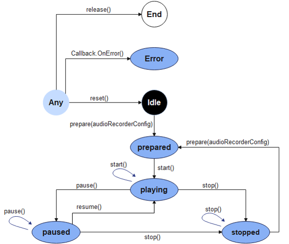

# 音频录制开发指导

## 场景介绍

音频录制的主要工作是捕获音频信号，完成音频编码并保存到文件中，帮助开发者轻松实现音频录制功能。它允许调用者指定音频录制的采样率、声道数、编码格式、封装格式、文件路径等参数。

**图1** 音频录制状态机




**图2** 音频录制零层图


## 开发步骤

详细API含义可参考：[js-apis-media.md](../reference/apis/js-apis-media.md)

### 全流程场景

包含流程：创建实例，设置录制参数，录制音频，暂停录制，恢复录制，停止录制，释放资源等流程。

```js
import media from '@ohos.multimedia.media'
import mediaLibrary from '@ohos.multimedia.mediaLibrary'

let testFdNumber;

function SetCallBack(audioRecorder) {
    audioRecorder.on('prepare', () => {              								// 设置'prepare'事件回调
        console.log('prepare success');    
        // 录制界面可切换至已准备好，可点击录制按钮进行录制
    });
    audioRecorder.on('start', () => {    		     								// 设置'start'事件回调
    	console.log('audio recorder start success');
        // 将录制按钮切换至可暂停状态
    });
    audioRecorder.on('pause', () => {    		     								// 设置'pause'事件回调
        console.log('audio recorder pause success');
        // 将录制按钮切换至可录制状态
    });
    audioRecorder.on('resume', () => {    		     								// 设置'resume'事件回调
        console.log('audio recorder resume success');
        // 将录制按钮切换至可暂停状态
    });
    audioRecorder.on('stop', () => {    		     								// 设置'stop'事件回调
        console.log('audio recorder stop success');
    });
    audioRecorder.on('release', () => {    		     								// 设置'release'事件回调
        console.log('audio recorder release success');
    });
    audioRecorder.on('reset', () => {    		     								// 设置'reset'事件回调
        console.log('audio recorder reset success');
        // 需要重新设置录制参数才能再次录制
    });
    audioRecorder.on('error', (error) => {             								// 设置'error'事件回调
        console.info(`audio error called, errName is ${error.name}`);
        console.info(`audio error called, errCode is ${error.code}`);
        console.info(`audio error called, errMessage is ${error.message}`);
    });
}

// pathName是传入的录制文件名，例如：01.mp3，生成后的文件地址：/storage/media/100/local/files/Movies/01.mp3
// 使用mediaLibrary需要添加以下权限, ohos.permission.MEDIA_LOCATION、ohos.permission.WRITE_MEDIA、ohos.permission.READ_MEDIA
async function getFd(pathName) {
    let displayName = pathName;
    const mediaTest = mediaLibrary.getMediaLibrary();
    let fileKeyObj = mediaLibrary.FileKey;
    let mediaType = mediaLibrary.MediaType.VIDEO;
    let publicPath = await mediaTest.getPublicDirectory(mediaLibrary.DirectoryType.DIR_VIDEO);
    let dataUri = await mediaTest.createAsset(mediaType, displayName, publicPath);
    if (dataUri != undefined) {
        let args = dataUri.id.toString();
        let fetchOp = {
            selections : fileKeyObj.ID + "=?",
            selectionArgs : [args],
        }
        let fetchFileResult = await mediaTest.getFileAssets(fetchOp);
        let fileAsset = await fetchFileResult.getAllObject();
        let fdNumber = await fileAsset[0].open('Rw');
        fdNumber = "fd://" + fdNumber.toString();
        testFdNumber = fdNumber;
    }
}

await getFd('01.mp3');

// 1.创建实例
let audioRecorder = media.createAudioRecorder();    
// 2.设置回调
SetCallBack(audioRecorder);    
// 3.设置录制参数
let audioRecorderConfig = {
    audioEncoder : media.AudioEncoder.AAC_LC ,
    audioEncodeBitRate : 22050,
    audioSampleRate : 22050,
    numberOfChannels : 2,
    format : media.AudioOutputFormat.AAC_ADTS,
    uri : testFdNumber,                             // testFdNumber由getFd生成
    location : { latitude : 30, longitude : 130},
}																					
audioRecorder.prepare(audioRecorderConfig);
// 4.开始录制
audioRecorder.start();                            	// 需等待'prepare'事件回调完成后，才可调用start进行录制，触发'start'事件回调
// 5.暂停录制
audioRecorder.pause();                             	// 需等待'start'事件回调完成后，才可调用pause进行暂停，触发'pause'事件回调
// 6.恢复录制
audioRecorder.resume();                             // 需等待'pause'事件回调完成后，才可调用resume进行录制，触发'resume'事件回调
// 7.停止录制
audioRecorder.stop();                             	// 需等待'start'或'resume'事件回调完成后，才可调用stop进行暂停，触发'stop'事件回调
// 8.重置录制
audioRecorder.reset();                              // 触发'reset'事件回调后，重新进行prepare，才可重新录制
// 9.释放资源
audioRecorder.release();                           	// audioRecorder资源被销毁
audioRecorder = undefined;
```

### 正常录制场景

与全流程场景不同，不包括暂停录制，恢复录制的过程。

```js
import media from '@ohos.multimedia.media'
import mediaLibrary from '@ohos.multimedia.mediaLibrary'

let testFdNumber;

function SetCallBack(audioPlayer) {
    audioRecorder.on('prepare', () => {              								// 设置'prepare'事件回调
        console.log('prepare success');    
        // 录制界面可切换至已准备好，可点击录制按钮进行录制
    });
    audioRecorder.on('start', () => {    		     								// 设置'start'事件回调
    	console.log('audio recorder start success');
        // 将录制按钮切换至可暂停状态
    });  
    audioRecorder.on('stop', () => {    		     								// 设置'stop'事件回调
        console.log('audio recorder stop success');
    });    
    audioRecorder.on('release', () => {    		     								// 设置'release'事件回调
        console.log('audio recorder release success');
    });    
}

// pathName是传入的录制文件名，例如：01.mp3，生成后的文件地址：/storage/media/100/local/files/Movies/01.mp3
// 使用mediaLibrary需要添加以下权限, ohos.permission.MEDIA_LOCATION、ohos.permission.WRITE_MEDIA、ohos.permission.READ_MEDIA
async function getFd(pathName) {
    let displayName = pathName;
    const mediaTest = mediaLibrary.getMediaLibrary();
    let fileKeyObj = mediaLibrary.FileKey;
    let mediaType = mediaLibrary.MediaType.VIDEO;
    let publicPath = await mediaTest.getPublicDirectory(mediaLibrary.DirectoryType.DIR_VIDEO);
    let dataUri = await mediaTest.createAsset(mediaType, displayName, publicPath);
    if (dataUri != undefined) {
        let args = dataUri.id.toString();
        let fetchOp = {
            selections : fileKeyObj.ID + "=?",
            selectionArgs : [args],
        }
        let fetchFileResult = await mediaTest.getFileAssets(fetchOp);
        let fileAsset = await fetchFileResult.getAllObject();
        let fdNumber = await fileAsset[0].open('Rw');
        fdNumber = "fd://" + fdNumber.toString();
        testFdNumber = fdNumber;
    }
}

await getFd('01.mp3');

// 1.创建实例
let audioRecorder = media.createAudioRecorder();   
// 2.设置回调
SetCallBack(audioRecorder);       
// 3.设置录制参数
let audioRecorderConfig = {
    audioEncoder : media.AudioEncoder.AAC_LC ,
    audioEncodeBitRate : 22050,
    audioSampleRate : 22050,
    numberOfChannels : 2,
    format : media.AudioOutputFormat.AAC_ADTS,
    uri : testFdNumber,                             // testFdNumber由getFd生成
    location : { latitude : 30, longitude : 130},
}
audioRecorder.prepare(audioRecorderConfig)
// 4.开始录制
audioRecorder.start();                            	// 需等待'prepare'事件回调完成后，才可调用start进行录制，触发'start'事件回调
// 5.停止录制
audioRecorder.stop();                             	// 需等待'start'或'resume'事件回调完成后，才可调用stop进行暂停，触发'stop'事件回调
// 6.释放资源
audioRecorder.release();                           	// audioRecorder资源被销毁
audioRecorder = undefined;
```

