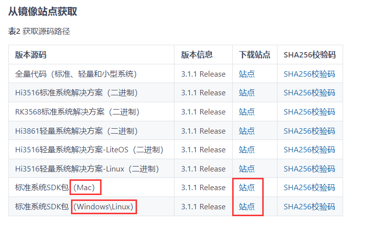
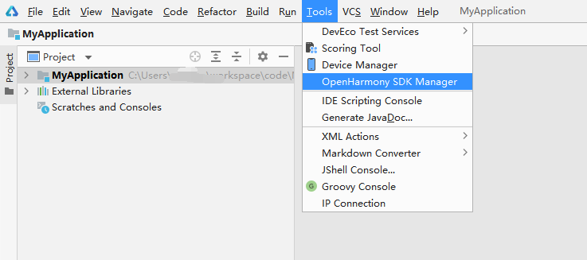
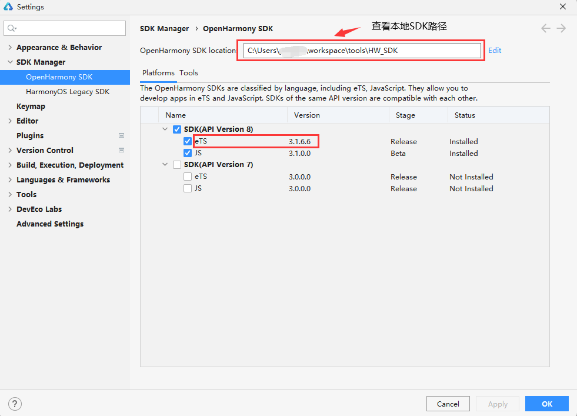
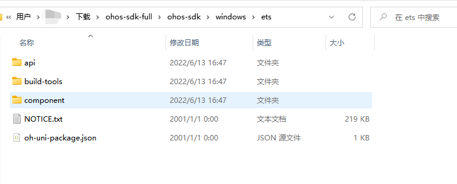
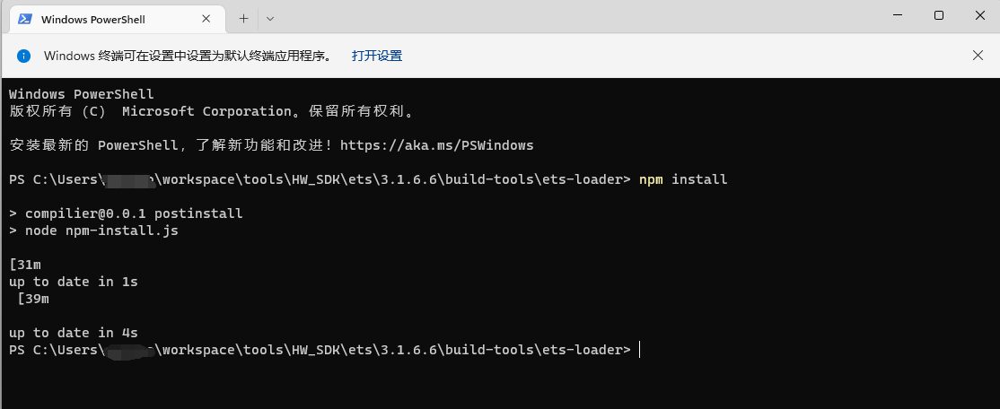

# full-SDK替换指南

**public-SDK**是提供给应用开发的工具包，跟随DevEco Studio下载，不包含系统应用所需要的高权限API

**full-SDK**是提供给OEM厂商开发应用的工具包，不能随DevEco Studio下载，包含了系统应用所需要的高权限API

三方开发者通过DevEco Studio自动下载的**API8版本**SDK均为**public版本**。public-SDK**不支持**开发者使用**所有的系统API**，包括animator组件、xcomponent组件、@ohos.application.abilityManager.d.ts、@ohos.application.formInfo.d.ts、@ohos.bluetooth.d.ts等，如工程必须依赖于系统API，请按照以下步骤替换**full-SDK**。

## 下载full-SDK(这里以3.1.1 Release版本为例)

1. 获取full-SDK

   full-SDK需要手动下载。请参考[OpenHarmony 3.1.1 Release版本说明书](https://gitee.com/openharmony/docs/blob/master/zh-cn/release-notes/OpenHarmony-v3.1.1-release.md)中的获取方式，获取所需的操作系统类型的full-SDK。

2. 选择版本：

   

   


## 查看本地SDK路径(此处以ets工程为例，1.0工程请以相同方式替换js-SDK)

打开DevEco Studio——>Tools——>OpenHarmony SDK Manager，查看本地SDK安装路径。






## 替换SDK

1. 打开上一步骤中获取到的SDK本地文件路径。
   

2. 确认下载的SDK版本是否为full-SDK

   a.检查下载文件名是否包含full-SDK字样

   

   b.检查api中是否包含系统API（@ohos.application.abilityManager.d.ts、@ohos.application.formInfo.d.ts、@ohos.bluetooth.d.ts等）

   注：系统api判定标准以发布api指导文档为主。

   

3. 替换SDK。

   以windows为例：

   a.解压`ets-windows-3.1.6.5-Release.zip`

   

   b.替换SDK文件

   **备份本地SDK**（复制并重命名ets目录下版本信息目录名，或者将ets目录拷贝至其他本地路径）

   注：版本信息目录名称只要与其下`oh-uni-package.json`配置文件的version字段不一致即可

   

   

   **删除原SDK目录中的所有文件**（否则可能会导致文件无法全部覆盖）

   

   **拷贝full-SDK至本地SDK路径**

   以public-SDK-3.1.6.6版本为例，将`ets`目录下的所有文件替换至`本地SDK路径\ets\3.1.6.6`中

   修改`oh-uni-package.json`配置文件的version字段为当前SDK版本号

   ```
   {
     "apiVersion": "8",
     "displayName": "Ets",
     "meta": {
       "metaVersion": "3.0.0"
     },
     "path": "ets",
     "releaseType": "Release",
     "version": "3.1.6.6"
   }
   ```
   
   在本地SDK路径下`\build-tools\ets-loader`目录中打开cmd/powerShell窗口，输入命令`npm install`下载**node_modules**依赖包
   
   
   
   验证系统API接口

   