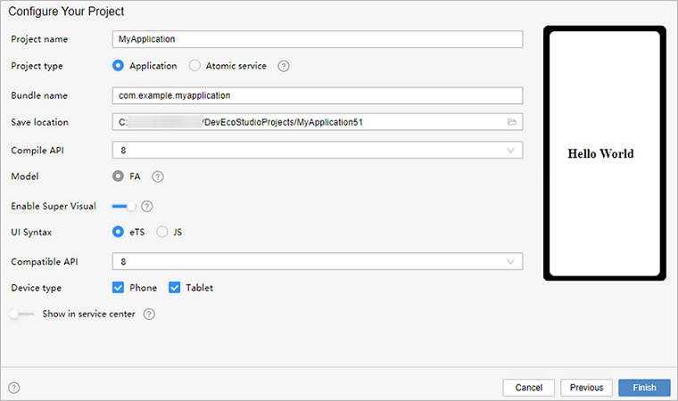
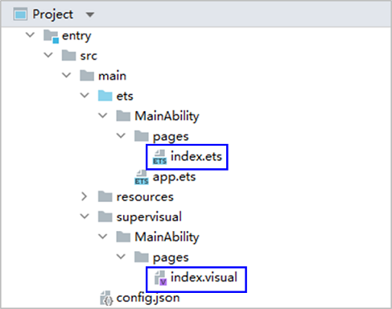
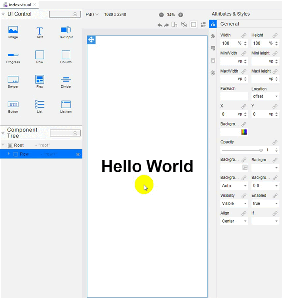
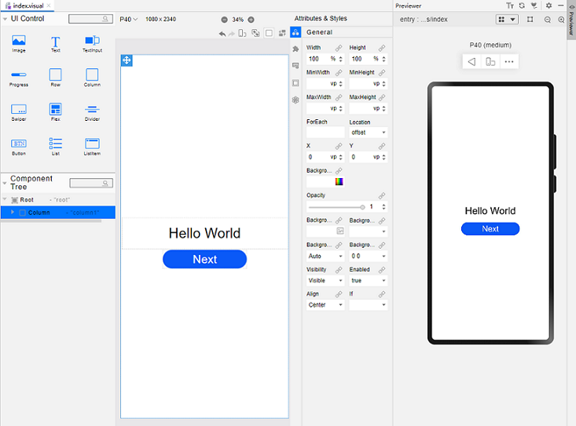
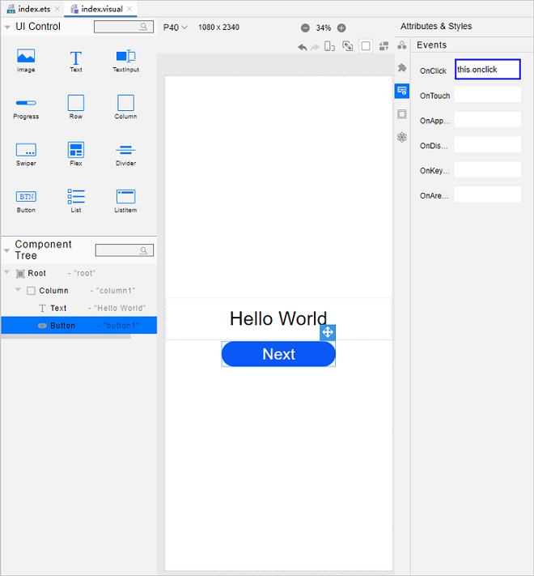
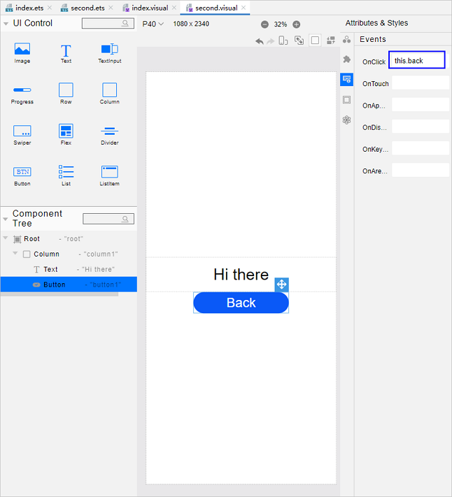

# 使用eTS语言开发（低代码方式）


>  **说明：**
> 该特性在**DevEco Studio V3.0 Beta3**及更高版本中支持。
> 
> 目前eTS低代码开发方式支持的组件较少，更多组件的支持将在后续版本中实现。
> 
> 为确保运行效果，本文以使用**DevEco Studio V3.0.0.900 Beta3**版本为例，点击[此处](https://developer.harmonyos.com/cn/develop/deveco-studio#download_beta_openharmony)获取下载链接。


OpenHarmony低代码开发方式具有丰富的UI界面编辑功能，通过可视化界面开发方式快速构建布局，可有效降低用户的上手成本并提升用户构建UI界面的效率。


使用低代码开发应用或服务有以下两种开发方式：


- 直接创建一个支持低代码开发的新工程以进行开发。本文以此方式为例进行说明。

- 在已有工程中，创建Visual文件来进行开发。


## 创建新工程支持低代码开发

1. 打开**DevEco Studio**，点击**File** &gt; **New** &gt; **Create Project**，选择模板“**Empty Ability**”，点击**Next**进行下一步配置。

   

2. 进入配置工程界面，打开“**Enable Super Visual**”开关，**UI Syntax**选择“**eTS**”，其他参数保持默认设置即可。

   

3. 点击**Finish**，工具会自动生成示例代码和相关资源，等待工程创建完成。


## 低代码开发工程项目文件

工程同步完成后，自动生成以下目录结构：



- **entry &gt; src &gt; main &gt; ets &gt; MainAbility &gt; pages &gt; index.ets**：低代码页面的逻辑描述文件，定义了页面里所用到的所有的逻辑关系，比如数据、事件等，详情请参考[TS语法糖](../ui/ts-syntactic-sugar.md)。如果创建了多个低代码页面，则pages目录下会生成多个页面文件夹及对应的ets文件。

- **entry &gt; src &gt; main &gt; supervisual &gt; MainAbility &gt; pages &gt; index.visual**：visual文件存储低代码页面的数据模型，双击该文件即可打开低代码页面，进行可视化开发设计。如果创建了多个低代码页面，则pages目录下会生成多个页面文件夹及对应的visual文件。


## 构建第一个页面

工程同步完成后，第一个页面已有一个容器、文本（Hello World）显示。为了更详细地了解低代码开发，我们将删除画布原有模板组件，从零开始完成页面的添加、设置。

第一个页面内有一个容器、文本和一个按钮，通过Column、Text和Button组件来实现。其中，Column为沿垂直方向布局的容器组件，具体使用请见[Column](../reference/arkui-ts/ts-container-column.md)。

1. **删除画布原有模板组件。**<a name="delete_origin_content"></a>
   打开index.visual文件，选中画布中的组件，单击鼠标右键，选择Delete删除画布原有模板组件。操作如下所示：

   

2. **添加容器，设置Column容器的样式和属性。**<a name="add_container"></a>
   选中UI Control中的Column组件，将其拖至画布。点击右侧属性样式栏中的图标（General），设置Column组件的高度Height为100%，使其占满屏幕；点击右侧属性样式栏中的图标（Feature），设置Column组件的AlignItems样式为center，使得其子组件在水平轴上居中显示。操作如下所示：

   

3. **添加文本。**
   选中UI Control中的Text组件，将其拖至画布，再拖至Column组件的中央区域。点击右侧属性样式栏中的图标（Feature），设置Text组件的Content属性为“this.message”（即“Hello World”）；设置组件的FontSize样式为30fp，使得其文字放大；设置组件的TextAlign样式为center，使得组件文字居中显示。再选中画布上的Text组件，拖动放大。操作如下所示：

   

4. **添加按钮。**
   选中UI Control中的Button组件，将其拖至画布，再拖至Text组件下面。点击右侧属性样式栏中的图标（General），设置Button组件的Height为40vp；点击右侧属性样式栏中的图标（Feature），设置Button组件的Label属性为“Next”；设置Button组件的FontSize样式为25fp，使得其文字放大。操作如下所示：

   

5. **在编辑窗口右上角的侧边工具栏，点击Previewer，打开预览器。** 第一个页面效果如下图所示：

   


## 构建第二个页面

1. **创建第二个页面。**
   在“**Project**”窗口，打开“**entry &gt; src &gt; main &gt; ets &gt; MainAbility**”，右键点击“**pages**”文件夹，选择“**New &gt; Visual**”，命名为“**second**”，单击“**Finish**”，即完成第二个页面的创建。可以看到文件目录结构如下：

   

2. **[删除画布原有模板组件。](#delete_origin_content)**

3. **[添加容器，设置Column容器的样式和属性。](#add_container)**

4. **添加文本。**
   
   - 在second.ets文件中，将本页面的message文本内容设置为“Hi there”，示例如下：
     
      ```ts
      @Entry
      @Component
      struct Second {
        @State message: string = 'Hi there'
      
        /**
        * In low-code mode, do not add anything to the build function, as it will be
        * overwritten by the content generated by the .visual file in the build phase.
        */
        build() {
      
        }
      }
      ```
   - 选中Text组件，将其拖至画布，再拖至Column组件的中央区域。点击右侧属性样式栏中的图标（Feature），设置Text组件的Content属性为“this.message”（即“Hi there”）；设置Text组件的FontSize样式为30fp；设置组件的TextAlign样式为center。再选中画布上的Text组件，拖动放大。操作如下所示：

        
   
5. **添加按钮。**
   选中UI Control中的Button组件，将其拖至画布，再拖至Text组件下面。点击右侧属性样式栏中的图标（General），设置Button组件的Height为40vp；点击右侧属性样式栏中的图标（Feature），设置Button组件的Value属性为“Back”；设置组件的FontSize样式为25fp，使得其文字放大。操作如下所示：

   


## 实现页面间的跳转

页面间的导航可以通过页面路由router来实现。页面路由router根据页面uri找到目标页面，从而实现跳转。使用页面路由请导入router模块。

1. **第一个页面跳转到第二个页面。**
     在第一个页面中，跳转按钮绑定onclick方法，点击按钮时跳转到第二页。需同时处理ets文件及visual文件。
   - “**index.ets**”示例如下：
     
     ```ts
     import router from '@ohos.router';
     
     @Entry
     @Component
     struct Index {
       @State message: string = 'Hello World'
     
       /**
        * In low-code mode, do not add anything to the build function, as it will be
        * overwritten by the content generated by the .visual file in the build phase.
        */
       onclick() {
         router.push({
           url: 'pages/second', // 指定要跳转的页面
         })
       }
     
       build() {
       }
     }
     ```
   
   - “**index.visual**”： 打开index.visual，选中画布上的Button组件。点击右侧属性样式栏中的事件图标（Events），鼠标点击OnClick事件的输入框，选择this.onclick，如下所示：

     

2. **第二个页面返回到第一个页面。**
   在第二个页面中，返回按钮绑定back方法，点击按钮时返回到第一页。需同时处理ets文件及visual文件。

   - “**second.ets**”示例如下：
     
      ```ts
      import router from '@ohos.router';
      
      @Entry
      @Component
      struct Second {
        @State message: string = 'Hi there'
      
        /**
        * In low-code mode, do not add anything to the build function, as it will be
        * overwritten by the content generated by the .visual file in the build phase.
        */
        back() {
          router.back()
        }
      
        build() {
      
        }
      }
      ```
   - “**second.visual**”： 打开second.visual，选中画布上的Button组件。点击右侧属性样式栏中的事件图标（Events），鼠标点击OnClick事件的输入框，选择this.back，如下所示：

      

3. **打开index.visual或index.ets文件，点击预览器中的**  **按钮进行刷新。** 效果如下图所示：

   


## 使用真机运行应用

1. 将搭载OpenHarmony标准系统的开发板与电脑连接。

2. 点击**File** &gt; **Project Structure** &gt; **Project** &gt; **Signing Configs**界面勾选“**Automatically generate signing**”，等待自动签名完成即可，点击“**OK**”。如下图所示：

   

3. 在编辑窗口右上角的工具栏，点击按钮运行。效果如下图所示：

   

恭喜您已经使用eTS语言开发（低代码方式）完成了第一个OpenHarmony应用，快来[探索更多的OpenHarmony功能](../application-dev-guide.md)吧。
