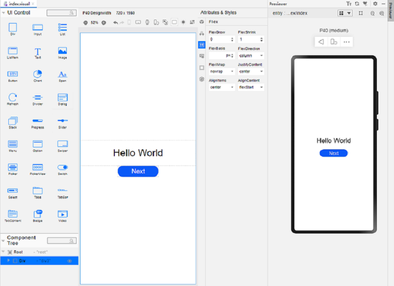
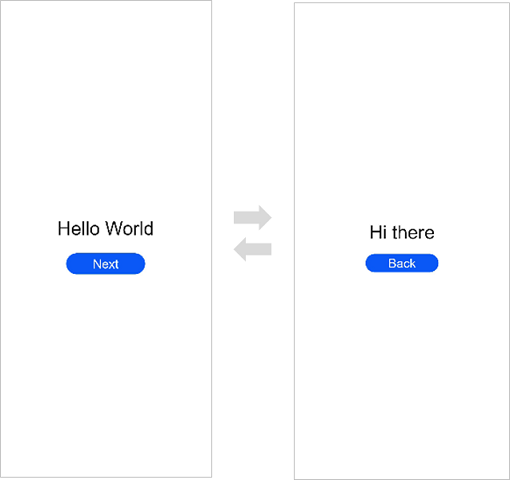

# 使用JS语言开发（低代码方式）


>  **说明：**
> 该特性在**DevEco Studio V2.2 Beta1**及更高版本中支持。
> 
> 为确保运行效果，本文以使用**DevEco Studio V3.0.0.900 Beta2**版本为例，点击[此处](https://developer.harmonyos.com/cn/develop/deveco-studio#download_beta)获取下载链接。


OpenHarmony低代码开发方式，具有丰富的UI界面编辑功能，遵循[JS开发规范](../reference/apis/)，通过可视化界面开发方式快速构建布局，可有效降低用户的上手成本并提升用户构建UI界面的效率。


使用低代码开发应用或服务有以下两种开发方式：


- 直接创建一个支持低代码开发的新工程以进行开发。本文以此方式为例进行说明。

- 在已有工程中，创建Visual文件来进行开发。


## 创建新工程支持低代码开发

>  **说明：**
> 该功能在DevEco Studio 3.0 Beta2及更高版本中支持，且compileSdkVersion必须为7或以上。

1. 打开**DevEco Studio**，点击**File** &gt; **New &gt; Create Project**，选择模板“**Empty Ability**”，点击**Next**进行下一步配置。
   

2. 进入配置工程界面，打开“**Super Visual Enable**”开关， **UI Syntax** 选择“**JS**”，其他参数保持默认设置即可。
   

3. 点击**Finish**，工具会自动生成示例代码和相关资源，等待工程创建完成。


## 低代码开发工程项目文件

工程同步完成后，自动生成以下目录结构：


- **pages &gt; index &gt; index.js**：低代码页面的逻辑描述文件，定义了页面里所用到的所有的逻辑关系，比如数据、事件等，详情请参考[JS语法参考](https://developer.harmonyos.com/cn/docs/documentation/doc-guides/js-framework-syntax-js-0000000000611432)。如果创建了多个低代码页面，则pages目录下会生成多个页面文件夹及对应的js文件。
  >  **说明：**
  > 使用低代码页面开发时，其关联js文件的同级目录中不能包含hml和css页面，例如上图中的**js &gt; MainAbility &gt; pages &gt; index**目录下不能包含hml与css文件，否则会出现编译报错。

- **pages &gt; index &gt; index.visual**：visual文件存储低代码页面的数据模型，双击该文件即可打开低代码页面，进行可视化开发设计。如果创建了多个低代码页面，则pages目录下会生成多个页面文件夹及对应的visual文件。


## 构建第一个页面

工程同步完成后，第一个页面已有一个容器、文本（Hello World）显示。为了更详细地了解低代码开发，我们将删除画布原有模板组件，从零开始完成页面的添加、设置。

第一个页面内有一个容器、文本和一个按钮，通过Div、Text和Button组件来实现。

1. **删除画布原有模板组件。**<a name= delete_origin_content></a>
   打开index.visual文件，选中画布中的组件，单击鼠标右键，选择Delete删除画布原有模板组件。操作如下所示：

   

2. **添加容器，设置Div容器的样式和属性。**<a name = add_container></a>
   选中UI Control中的Div组件，将其拖至画布。点击右侧属性样式栏中的样式图标（General），设置Div组件的高度Height为100%，使其占满屏幕；点击右侧属性样式栏中的样式图标（Flex)，设置Div组件的FlexDirection样式为column，使Div的主轴垂直；设置Div组件的JustifyContent样式为center，使得其子组件在主轴上居中显示；设置Div组件的AlignItems样式为center，使得其子组件在交叉轴上居中显示。操作如下所示：

   

3. **添加文本。**
   选中UI Control中的Text组件，将其拖至Div组件的中央区域。点击右侧属性样式栏中的属性图标（Properties），设置Text组件的Content属性为“Hello World”；点击右侧属性样式栏中的样式图标（Feature），设置组件的FontSize样式为60px，使得其文字放大；设置组件的TextAlign样式为center，使得组件文字居中显示。再选中画布上的Text组件，拖动放大。操作如下所示：

   

4. **添加按钮。**
   选中UI Control中的Button组件，将其拖至Text组件下面。点击右侧属性样式栏中的属性图标（Properties），设置Button组件的Value属性为“Next”，点击右侧属性样式栏中的样式图标（Feature），设置组件的FontSize样式为40px，使得其文字放大；再选中画布上的Button组件，拖动放大。操作如下所示：

   

5. **在编辑窗口右上角的侧边工具栏，点击Previewer，打开预览器。** 第一个页面效果如下图所示：
   


## 构建第二个页面

1. **创建第二个页面。**
   在“**Project**”窗口，打开“**entry &gt; src &gt; main &gt; js &gt; MainAbility**”，右键点击“**pages**”文件夹，选择“**New &gt; Visual**”，命名为“**second**”，单击“**Finish**”，即完成第二个页面的创建。可以看到文件目录结构如下：

   

2. **[删除画布原有模板组件。](#delete_origin_content)**

3. **[添加容器，设置Div容器的样式和属性](#add_container)**

4. **添加文本。**
   选中Text组件，拖至Div组件的中央区域。点击右侧属性样式栏中的属性图标（Properties），设置Text组件的Content属性为“Hi there”；点击右侧属性样式栏中的样式图标（Feature），设置组件的FontSize样式为60px；设置组件的TextAlign样式为center。再选中画布上的Text组件，拖动放大。操作如下所示：

   

5. **添加按钮。**
   选中UI Control中的Button组件，将其拖至Text组件下面。点击右侧属性样式栏中的属性图标（Properties），设置Button组件的Value属性为“Back”，点击右侧属性样式栏中的样式图标（Feature），设置组件的FontSize样式为40px，使得其文字放大；再选中画布上的Button组件，拖动放大。操作如下所示：

   


## 实现页面间的跳转

页面间的导航可以通过[页面路由router](https://gitee.com/openharmony/docs/blob/master/zh-cn/application-dev/ui/ui-js-building-ui-routes.md)来实现。页面路由router根据页面uri找到目标页面，从而实现跳转。使用页面路由请导入router模块。

1. **第一个页面跳转到第二个页面。**
     在第一个页面中，跳转按钮绑定onclick方法，当按钮点击时触发页面路由变化，跳转到第二页。需同时处理js文件及visual文件。
   - “**index.js**”示例如下：
     
     ```
     import router from '@system.router';  
     
     export default {     
         onclick() {         
             router.push ({             
                 uri:'pages/second/second', // 指定要跳转的页面         
             })     
         } 
     }
     ```
   
   - “**index.viusal**”： 打开index.visual，选中画布上的Button组件。点击右侧属性样式栏中的事件图标（Events），鼠标点击Click事件的输入框，选择onclick事件，如下所示：

     

2. **第二个页面返回到第一个页面。**
   在第二个页面中，返回按钮绑定onClick方法，当按钮点击时触发页面路由返回，返回到第二页。

   需同时处理js文件及visual文件。

   - “**second.js**”示例如下：
     
      ```
      import router from '@system.router';  
      
      export default {     
          back() {         
              router.back ()     
          } 
      }
      ```
   - “**second.viusal**”： 打开second.visual，选中画布上的Button组件。点击右侧属性样式栏中的事件图标（Events），鼠标点击Click事件的输入框，选择back事件，如下所示：

   

3. **打开index.visual或index.js文件，点击预览器中的**  **按钮进行刷新。** 效果如下图所示：
   


## 使用真机运行应用

1. 将搭载OpenHarmony标准系统的开发板与电脑连接。

2. 点击**File &gt;Project Structure** &gt; **Project &gt; Signing**界面勾选“**Automatically generate signing**”，等待自动签名完成即可，点击“**OK**”。如下图所示：
   

3. 在编辑窗口右上角的工具栏，点击按钮运行效果如下图所示：

   

恭喜您已经使用JS语言开发（低代码方式）完成了第一个OpenHarmony应用，赶紧探索更多的OpenHarmony功能吧。
