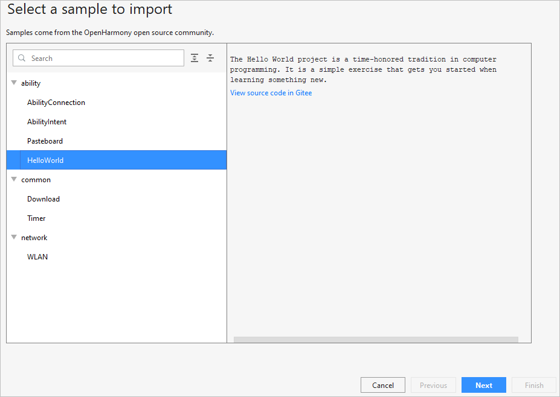

# 配置OpenHarmony SDK<a name="ZH-CN_TOPIC_0000001113561194"></a>

-   [前提条件](#section164161442154812)
-   [配置SDK信息](#section1265592425017)
-   [导入工程](#section12559415183418)

在设置OpenHarmony应用开发环境时，需要开发者在DevEco Studio中配置对应的SDK信息。

## 前提条件<a name="section164161442154812"></a>

-   已下载并安装好DevEco Studio 2.1 Release，点击[链接下载](https://developer.harmonyos.com/cn/develop/deveco-studio#download)。（ **预计6月2日21:00上线，敬请期待** ）
-   已获取OpenHarmony SDK包并解压，点击[链接下载](https://mirror.iscas.ac.cn/OpenHarmony/sdk/OpenHarmony-SDK-2.0-Canary.7z)。

## 配置SDK信息<a name="section1265592425017"></a>

DevEco Studio通过SDK Manager统一管理SDK及工具链，OpenHarmony包含如下SDK包：

<a name="table64565810577"></a>
<table><thead align="left"><tr id="row12455580576"><th class="cellrowborder" valign="top" width="24.709999999999997%" id="mcps1.1.4.1.1"><p id="p34565812572"><a name="p34565812572"></a><a name="p34565812572"></a>类别</p>
</th>
<th class="cellrowborder" valign="top" width="25.3%" id="mcps1.1.4.1.2"><p id="p104675817575"><a name="p104675817575"></a><a name="p104675817575"></a>包名</p>
</th>
<th class="cellrowborder" valign="top" width="49.99%" id="mcps1.1.4.1.3"><p id="p194610586574"><a name="p194610586574"></a><a name="p194610586574"></a>说明</p>
</th>
</tr>
</thead>
<tbody><tr id="row134615875716"><td class="cellrowborder" rowspan="2" valign="top" width="24.709999999999997%" headers="mcps1.1.4.1.1 "><p id="p8312243811"><a name="p8312243811"></a><a name="p8312243811"></a>SDK</p>
</td>
<td class="cellrowborder" valign="top" width="25.3%" headers="mcps1.1.4.1.2 "><p id="p674413467918"><a name="p674413467918"></a><a name="p674413467918"></a>Java</p>
</td>
<td class="cellrowborder" valign="top" width="49.99%" headers="mcps1.1.4.1.3 "><p id="p107441464917"><a name="p107441464917"></a><a name="p107441464917"></a>Java语言SDK包。</p>
</td>
</tr>
<tr id="row44334409916"><td class="cellrowborder" valign="top" headers="mcps1.1.4.1.1 "><p id="p1946175813574"><a name="p1946175813574"></a><a name="p1946175813574"></a>JS</p>
</td>
<td class="cellrowborder" valign="top" headers="mcps1.1.4.1.2 "><p id="p54625885713"><a name="p54625885713"></a><a name="p54625885713"></a>JS语言SDK包。</p>
</td>
</tr>
<tr id="row14474585576"><td class="cellrowborder" rowspan="2" valign="top" width="24.709999999999997%" headers="mcps1.1.4.1.1 "><p id="p124765819578"><a name="p124765819578"></a><a name="p124765819578"></a>SDK Tool</p>
</td>
<td class="cellrowborder" valign="top" width="25.3%" headers="mcps1.1.4.1.2 "><p id="p1947135818571"><a name="p1947135818571"></a><a name="p1947135818571"></a>Toolchains</p>
</td>
<td class="cellrowborder" valign="top" width="49.99%" headers="mcps1.1.4.1.3 "><p id="p7471158105711"><a name="p7471158105711"></a><a name="p7471158105711"></a>SDK工具链，OpenHarmony应用开发必备工具集，包括编译、打包、签名、数据库管理等工具的集合。</p>
</td>
</tr>
<tr id="row337931010"><td class="cellrowborder" valign="top" headers="mcps1.1.4.1.1 "><p id="p193791108"><a name="p193791108"></a><a name="p193791108"></a>Previewer</p>
</td>
<td class="cellrowborder" valign="top" headers="mcps1.1.4.1.2 "><p id="p1238951018"><a name="p1238951018"></a><a name="p1238951018"></a>OpenHarmony应用预览器，可以在应用开发过程中查看界面UI布局效果。</p>
</td>
</tr>
</tbody>
</table>

1.  运行已安装的DevEco Studio，首次使用，请选择**Do not import settings**，点击OK。
2.  接下来DevEco Studio会根据向导指示，进入到SDK下载界面，**HarmonyOS SDK Location**选择本地解压的SDK包路径，然后点击**Next**。

    

3.  SDK安装完成后，点击**Finish**，界面会进入到DevEco Studio欢迎页。

    

4.  进入**Sdk\\js\\2.2.0.0\\build-tools\\ace-loader**目录，删除node\_modules文件夹。

    

5.  然后在该目录下运行命令行工具，分别执行如下命令，直至安装完成。

    ```
    npm cache clean -f
    npm install
    ```

    


## 导入工程<a name="section12559415183418"></a>

OpenHarmony SDK配置完成后，便可以启动应用开发。针对OpenHarmony应用开发，**通过导入Sample工程的方式来创建一个新工程**。

1.  在DevEco Studio的欢迎页，点击**Import HarmonyOS Smaple**按钮，导入Sample工程。

    

2.  选择ability下的**HelloWorld**工程，然后点击**Next**。

    

3.  设置**App Name**和**Project Location**，然后点击**Finish**，等待Sample工程导入完成。

    

4.  Sample导入后，等待工程同步完成，此时工程会同步失败。请打开工程下的build.gradle，修改hap插件的版本号为“2.4.4.3-RC”。

    

5.  修改完成后，点击右上角Gradle中的按钮，重新同步工程。

    

6.  等待工程同步完成，同步成功后，便可以进行OpenHarmony应用开发了。

    


