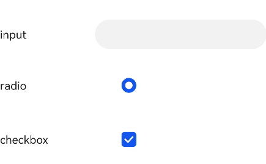

# label<a name="ZH-CN_TOPIC_0000001127284880"></a>

为input、button、textarea组件定义相应的标注，点击该标注时会触发绑定组件的点击效果。

## 权限列表<a name="section11257113618419"></a>

无

## 子组件<a name="s0cb8fdf50d8a4f78a86bb76deec468fc"></a>

不支持。

## 属性<a name="s6c8b111b1d2e40b3b356f03389dad9cf"></a>

除支持[通用属性](js-components-common-attributes.md)外，还支持如下属性：

<table><thead align="left"><tr><th class="cellrowborder" valign="top" width="23.119999999999997%" id="mcps1.1.6.1.1"><p>名称</p>
</th>
<th class="cellrowborder" valign="top" width="23.119999999999997%" id="mcps1.1.6.1.2"><p>类型</p>
</th>
<th class="cellrowborder" valign="top" width="10.48%" id="mcps1.1.6.1.3"><p>默认值</p>
</th>
<th class="cellrowborder" valign="top" width="7.5200000000000005%" id="mcps1.1.6.1.4"><p>必填</p>
</th>
<th class="cellrowborder" valign="top" width="35.76%" id="mcps1.1.6.1.5"><p>描述</p>
</th>
</tr>
</thead>
<tbody><tr><td class="cellrowborder" valign="top" width="23.119999999999997%" headers="mcps1.1.6.1.1 "><p>target</p>
</td>
<td class="cellrowborder" valign="top" width="23.119999999999997%" headers="mcps1.1.6.1.2 "><p>string</p>
</td>
<td class="cellrowborder" valign="top" width="10.48%" headers="mcps1.1.6.1.3 "><p>-</p>
</td>
<td class="cellrowborder" valign="top" width="7.5200000000000005%" headers="mcps1.1.6.1.4 "><p>否</p>
</td>
<td class="cellrowborder" valign="top" width="35.76%" headers="mcps1.1.6.1.5 "><p>目标组件的属性id值。</p>
</td>
</tr>
</tbody>
</table>

## 样式<a name="s5ed16ca4a52b4f8eb4c1a1e04ea9c2c4"></a>

除支持[通用样式](js-components-common-styles.md)外，还支持如下样式：

<table><thead align="left"><tr><th class="cellrowborder" valign="top" width="23.11768823117688%" id="mcps1.1.6.1.1"><p>名称</p>
</th>
<th class="cellrowborder" valign="top" width="14.4985501449855%" id="mcps1.1.6.1.2"><p>类型</p>
</th>
<th class="cellrowborder" valign="top" width="16.998300169983%" id="mcps1.1.6.1.3"><p>默认值</p>
</th>
<th class="cellrowborder" valign="top" width="5.369463053694631%" id="mcps1.1.6.1.4"><p>必填</p>
</th>
<th class="cellrowborder" valign="top" width="40.01599840015999%" id="mcps1.1.6.1.5"><p>描述</p>
</th>
</tr>
</thead>
<tbody><tr><td class="cellrowborder" valign="top" width="23.11768823117688%" headers="mcps1.1.6.1.1 "><p>color</p>
</td>
<td class="cellrowborder" valign="top" width="14.4985501449855%" headers="mcps1.1.6.1.2 "><p>&lt;color&gt;</p>
</td>
<td class="cellrowborder" valign="top" width="16.998300169983%" headers="mcps1.1.6.1.3 "><p>#e5000000</p>
</td>
<td class="cellrowborder" valign="top" width="5.369463053694631%" headers="mcps1.1.6.1.4 "><p>否</p>
</td>
<td class="cellrowborder" valign="top" width="40.01599840015999%" headers="mcps1.1.6.1.5 "><p>设置文本的颜色。</p>
</td>
</tr>
<tr><td class="cellrowborder" valign="top" width="23.11768823117688%" headers="mcps1.1.6.1.1 "><p>font-size</p>
</td>
<td class="cellrowborder" valign="top" width="14.4985501449855%" headers="mcps1.1.6.1.2 "><p>&lt;length&gt;</p>
</td>
<td class="cellrowborder" valign="top" width="16.998300169983%" headers="mcps1.1.6.1.3 "><p>30px</p>
</td>
<td class="cellrowborder" valign="top" width="5.369463053694631%" headers="mcps1.1.6.1.4 "><p>否</p>
</td>
<td class="cellrowborder" valign="top" width="40.01599840015999%" headers="mcps1.1.6.1.5 "><p>设置文本的尺寸。</p>
</td>
</tr>
<tr><td class="cellrowborder" valign="top" width="23.11768823117688%" headers="mcps1.1.6.1.1 "><p>allow-scale</p>
</td>
<td class="cellrowborder" valign="top" width="14.4985501449855%" headers="mcps1.1.6.1.2 "><p>boolean</p>
</td>
<td class="cellrowborder" valign="top" width="16.998300169983%" headers="mcps1.1.6.1.3 "><p>true</p>
</td>
<td class="cellrowborder" valign="top" width="5.369463053694631%" headers="mcps1.1.6.1.4 "><p>否</p>
</td>
<td class="cellrowborder" valign="top" width="40.01599840015999%" headers="mcps1.1.6.1.5 "><p>文本尺寸是否跟随系统设置字体缩放尺寸进行放大缩小。</p>
<div class="note"><span class="notetitle"> 说明： </span><div class="notebody"><p>如果需要支持动态生效，请参看config描述文件中config-changes标签。</p>
</div></div>
</td>
</tr>
<tr><td class="cellrowborder" valign="top" width="23.11768823117688%" headers="mcps1.1.6.1.1 "><p>letter-spacing</p>
</td>
<td class="cellrowborder" valign="top" width="14.4985501449855%" headers="mcps1.1.6.1.2 "><p>&lt;length&gt;</p>
</td>
<td class="cellrowborder" valign="top" width="16.998300169983%" headers="mcps1.1.6.1.3 "><p>0px</p>
</td>
<td class="cellrowborder" valign="top" width="5.369463053694631%" headers="mcps1.1.6.1.4 "><p>否</p>
</td>
<td class="cellrowborder" valign="top" width="40.01599840015999%" headers="mcps1.1.6.1.5 "><p>设置文本的字符间距。</p>
</td>
</tr>
<tr><td class="cellrowborder" valign="top" width="23.11768823117688%" headers="mcps1.1.6.1.1 "><p>font-style</p>
</td>
<td class="cellrowborder" valign="top" width="14.4985501449855%" headers="mcps1.1.6.1.2 "><p>string</p>
</td>
<td class="cellrowborder" valign="top" width="16.998300169983%" headers="mcps1.1.6.1.3 "><p>normal</p>
</td>
<td class="cellrowborder" valign="top" width="5.369463053694631%" headers="mcps1.1.6.1.4 "><p>否</p>
</td>
<td class="cellrowborder" valign="top" width="40.01599840015999%" headers="mcps1.1.6.1.5 "><p>设置文本的字体样式，可选值为：</p>
<ul><li>normal：标准的字体样式；</li><li>italic：斜体的字体样式。</li></ul>
</td>
</tr>
<tr><td class="cellrowborder" valign="top" width="23.11768823117688%" headers="mcps1.1.6.1.1 "><p>font-weight</p>
</td>
<td class="cellrowborder" valign="top" width="14.4985501449855%" headers="mcps1.1.6.1.2 "><p>number | string</p>
</td>
<td class="cellrowborder" valign="top" width="16.998300169983%" headers="mcps1.1.6.1.3 "><p>normal</p>
</td>
<td class="cellrowborder" valign="top" width="5.369463053694631%" headers="mcps1.1.6.1.4 "><p>否</p>
</td>
<td class="cellrowborder" valign="top" width="40.01599840015999%" headers="mcps1.1.6.1.5 "><p>设置文本的字体粗细，number类型取值[100, 900]，默认为400，取值越大，字体越粗。</p>
<div class="note"><span class="notetitle"> 说明： </span><div class="notebody"><p>number取值必须为100的整数倍。</p>
</div></div>
<p>string类型取值支持如下四个值：lighter、normal、bold、bolder。</p>
</td>
</tr>
<tr><td class="cellrowborder" valign="top" width="23.11768823117688%" headers="mcps1.1.6.1.1 "><p>text-decoration</p>
</td>
<td class="cellrowborder" valign="top" width="14.4985501449855%" headers="mcps1.1.6.1.2 "><p>string</p>
</td>
<td class="cellrowborder" valign="top" width="16.998300169983%" headers="mcps1.1.6.1.3 "><p>none</p>
</td>
<td class="cellrowborder" valign="top" width="5.369463053694631%" headers="mcps1.1.6.1.4 "><p>否</p>
</td>
<td class="cellrowborder" valign="top" width="40.01599840015999%" headers="mcps1.1.6.1.5 "><p>设置文本的文本修饰，可选值为：</p>
<ul><li>underline：文字下划线修饰；</li><li>line-through：穿过文本的修饰线n</li><li>none：标准文本。</li></ul>
</td>
</tr>
<tr><td class="cellrowborder" valign="top" width="23.11768823117688%" headers="mcps1.1.6.1.1 "><p>text-align</p>
</td>
<td class="cellrowborder" valign="top" width="14.4985501449855%" headers="mcps1.1.6.1.2 "><p>string</p>
</td>
<td class="cellrowborder" valign="top" width="16.998300169983%" headers="mcps1.1.6.1.3 "><p>start</p>
</td>
<td class="cellrowborder" valign="top" width="5.369463053694631%" headers="mcps1.1.6.1.4 "><p>否</p>
</td>
<td class="cellrowborder" valign="top" width="40.01599840015999%" headers="mcps1.1.6.1.5 "><p>设置文本的文本对齐方式，可选值为：</p>
<ul><li>left：文本左对齐；</li><li>center：文本居中对齐；</li><li>right：文本右对齐；</li><li>start：根据文字书写相同的方向对齐；</li><li>end：根据文字书写相反的方向对齐。</li></ul>
<div class="note"><span class="notetitle"> 说明： </span><div class="notebody"><p>如文本宽度未指定大小，文本的宽度和父容器的宽度大小相等的情况下，对齐效果可能会不明显。</p>
</div></div>
</td>
</tr>
<tr><td class="cellrowborder" valign="top" width="23.11768823117688%" headers="mcps1.1.6.1.1 "><p>line-height</p>
</td>
<td class="cellrowborder" valign="top" width="14.4985501449855%" headers="mcps1.1.6.1.2 "><p>&lt;length&gt;</p>
</td>
<td class="cellrowborder" valign="top" width="16.998300169983%" headers="mcps1.1.6.1.3 "><p>0px</p>
</td>
<td class="cellrowborder" valign="top" width="5.369463053694631%" headers="mcps1.1.6.1.4 "><p>否</p>
</td>
<td class="cellrowborder" valign="top" width="40.01599840015999%" headers="mcps1.1.6.1.5 "><p>设置文本的文本行高，设置为0px时，不限制文本行高，自适应字体大小。</p>
</td>
</tr>
<tr><td class="cellrowborder" valign="top" width="23.11768823117688%" headers="mcps1.1.6.1.1 "><p>text-overflow</p>
</td>
<td class="cellrowborder" valign="top" width="14.4985501449855%" headers="mcps1.1.6.1.2 "><p>string</p>
</td>
<td class="cellrowborder" valign="top" width="16.998300169983%" headers="mcps1.1.6.1.3 "><p>clip</p>
</td>
<td class="cellrowborder" valign="top" width="5.369463053694631%" headers="mcps1.1.6.1.4 "><p>否</p>
</td>
<td class="cellrowborder" valign="top" width="40.01599840015999%" headers="mcps1.1.6.1.5 "><p><span>在设置了最大行数的情况下生效，</span>可选值为：</p>
<ul><li>clip：将文本根据父容器大小进行裁剪显示；</li><li>ellipsis：根据父容器大小显示，显示不下的文本用省略号代替。需配合max-lines使用。</li></ul>
</td>
</tr>
<tr><td class="cellrowborder" valign="top" width="23.11768823117688%" headers="mcps1.1.6.1.1 "><p>font-family</p>
</td>
<td class="cellrowborder" valign="top" width="14.4985501449855%" headers="mcps1.1.6.1.2 "><p>string</p>
</td>
<td class="cellrowborder" valign="top" width="16.998300169983%" headers="mcps1.1.6.1.3 "><p>sans-serif</p>
</td>
<td class="cellrowborder" valign="top" width="5.369463053694631%" headers="mcps1.1.6.1.4 "><p>否</p>
</td>
<td class="cellrowborder" valign="top" width="40.01599840015999%" headers="mcps1.1.6.1.5 "><p>设置文本的字体列表，用逗号分隔，每个字体用字体名或者字体族名设置。列表中第一个系统中存在的或者通过<a href="js-components-common-customizing-font.md">自定义字体</a>指定的字体，会被选中作为文本的字体。</p>
</td>
</tr>
<tr><td class="cellrowborder" valign="top" width="23.11768823117688%" headers="mcps1.1.6.1.1 "><p>max-lines</p>
</td>
<td class="cellrowborder" valign="top" width="14.4985501449855%" headers="mcps1.1.6.1.2 "><p>number</p>
</td>
<td class="cellrowborder" valign="top" width="16.998300169983%" headers="mcps1.1.6.1.3 "><p>-</p>
</td>
<td class="cellrowborder" valign="top" width="5.369463053694631%" headers="mcps1.1.6.1.4 "><p>否</p>
</td>
<td class="cellrowborder" valign="top" width="40.01599840015999%" headers="mcps1.1.6.1.5 "><p>设置文本的最大行数。</p>
</td>
</tr>
<tr><td class="cellrowborder" valign="top" width="23.11768823117688%" headers="mcps1.1.6.1.1 "><p>min-font-size</p>
</td>
<td class="cellrowborder" valign="top" width="14.4985501449855%" headers="mcps1.1.6.1.2 "><p>&lt;length&gt;</p>
</td>
<td class="cellrowborder" valign="top" width="16.998300169983%" headers="mcps1.1.6.1.3 "><p>-</p>
</td>
<td class="cellrowborder" valign="top" width="5.369463053694631%" headers="mcps1.1.6.1.4 "><p>否</p>
</td>
<td class="cellrowborder" valign="top" width="40.01599840015999%" headers="mcps1.1.6.1.5 "><p>文本最小字号，需要和文本最大字号同时设置，支持文本字号动态变化。设置最大最小字体样式后，font-size不生效。</p>
</td>
</tr>
<tr><td class="cellrowborder" valign="top" width="23.11768823117688%" headers="mcps1.1.6.1.1 "><p>max-font-size</p>
</td>
<td class="cellrowborder" valign="top" width="14.4985501449855%" headers="mcps1.1.6.1.2 "><p>&lt;length&gt;</p>
</td>
<td class="cellrowborder" valign="top" width="16.998300169983%" headers="mcps1.1.6.1.3 "><p>-</p>
</td>
<td class="cellrowborder" valign="top" width="5.369463053694631%" headers="mcps1.1.6.1.4 "><p>否</p>
</td>
<td class="cellrowborder" valign="top" width="40.01599840015999%" headers="mcps1.1.6.1.5 "><p>文本最大字号，需要和文本最小字号同时设置，支持文本字号动态变化。设置最大最小字体样式后，font-size不生效。</p>
</td>
</tr>
<tr><td class="cellrowborder" valign="top" width="23.11768823117688%" headers="mcps1.1.6.1.1 "><p>font-size-step</p>
</td>
<td class="cellrowborder" valign="top" width="14.4985501449855%" headers="mcps1.1.6.1.2 "><p>&lt;length&gt;</p>
</td>
<td class="cellrowborder" valign="top" width="16.998300169983%" headers="mcps1.1.6.1.3 "><p>1px</p>
</td>
<td class="cellrowborder" valign="top" width="5.369463053694631%" headers="mcps1.1.6.1.4 "><p>否</p>
</td>
<td class="cellrowborder" valign="top" width="40.01599840015999%" headers="mcps1.1.6.1.5 "><p>文本动态调整字号时的步长，需要设置最小，最大字号样式生效。</p>
</td>
</tr>
<tr><td class="cellrowborder" valign="top" width="23.11768823117688%" headers="mcps1.1.6.1.1 "><p>prefer-font-sizes</p>
</td>
<td class="cellrowborder" valign="top" width="14.4985501449855%" headers="mcps1.1.6.1.2 "><p>&lt;array&gt;</p>
</td>
<td class="cellrowborder" valign="top" width="16.998300169983%" headers="mcps1.1.6.1.3 "><p>-</p>
</td>
<td class="cellrowborder" valign="top" width="5.369463053694631%" headers="mcps1.1.6.1.4 "><p>否</p>
</td>
<td class="cellrowborder" valign="top" width="40.01599840015999%" headers="mcps1.1.6.1.5 "><p>预设的字号集合，在动态尺寸调整时，优先使用预设字号集合中的字号匹配设置的最大行数，如果预设字号集合未设置，则使用最大最小和步长调整字号。针对仍然无法满足最大行数要求的情况，使用text-overflow设置项进行截断，设置预设尺寸集后，font-size、max-font-size、min-font-size和font-size-step不生效。</p>
<p>如：prefer-font-sizes: 12px,14px,16px</p>
</td>
</tr>
</tbody>
</table>

## 事件<a name="section57301035448"></a>

不支持。

## 方法<a name="section340215162812"></a>

不支持。

## 示例<a name="section1018514431132"></a>

```
<!--xxx.hml -->
<div class="container">
  <div class="row">
    <label class="label" target="textId">input</label>
    <input class="input" id="textId" type="text"></input>
  </div>
  <div class="row">
    <label class="label" target="radioId">radio</label>
    <input class="input" id="radioId" type="radio" name="group" value="group"></input>
  </div>
  <div class="row">
    <label class="label" target="checkboxId">checkbox</label>
    <input class="input" id="checkboxId" type="checkbox"></input>
  </div>
</div>
```

```
/*xxx.css */
.container {
  flex-direction: column;
  align-items: center;
}
.row {
  flex-direction: row;
}
.label {
  width: 200px;
  margin-top: 50px;
}
.input {
  margin-left: 100px;
  margin-top: 50px;
}
```



