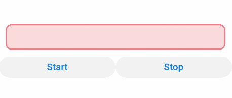

# marquee

>  **说明：**
> 从API version 4开始支持。后续版本如有新增内容，则采用上角标单独标记该内容的起始版本。<br>
> 从API version 6开始，仅当文本内容宽度超过跑马灯组件宽度时滚动。

跑马灯组件，用于展示一段单行滚动的文字。

## 权限列表

无


## 子组件

不支持。


## 属性

除支持[通用属性](../arkui-js/js-components-common-attributes.md)外，还支持如下属性：

| 名称 | 类型 | 默认值 | 必填 | 描述 |
| -------- | -------- | -------- | -------- | -------- |
| scrollamount | number | 6 | 否 | 跑马灯每次滚动时移动的最大长度。 |
| loop | number | -1 | 否 | 跑马灯滚动的次数。如果未指定，则默认值为-1，当该值小于等于零时表示marquee将连续滚动。 |
| direction | string | left | 否 | 设置跑马灯的文字滚动方向，可选值为left和right。 |


## 样式

除支持[通用样式](../arkui-js/js-components-common-styles.md)外，还支持如下样式：

| 名称 | 类型 | 默认值 | 必填 | 描述 |
| -------- | -------- | -------- | -------- | -------- |
| color | &lt;color&gt; | \#e5000000 | 否 | 设置跑马灯中文字的文本颜色。 |
| font-size | &lt;length&gt; | 37.5 | 否 | 设置跑马灯中文字的文本尺寸。 |
| allow-scale | boolean | true | 否 | 设置跑马灯中文字的文本尺寸是否跟随系统设置字体缩放尺寸进行放大缩小。<br/>>&nbsp;&nbsp;**说明：**<br/>>&nbsp;如果在config描述文件中针对ability配置了fontSize的config-changes标签，则应用不会重启而直接生效。 |
| font-weight | number&nbsp;\|&nbsp;string | normal | 否 | 设置跑马灯中文字的字体的粗细，见[text组件font-weight的样式属性](../arkui-js/js-components-basic-text.md#样式)。 |
| font-family | string | sans-serif | 否 | 设置跑马灯中文字的字体列表，用逗号分隔，每个字体用字体名或者字体族名设置。列表中第一个系统中存在的或者通过[自定义字体](../arkui-js/js-components-common-customizing-font.md)指定的字体，会被选中作为文本的字体。 |


## 事件

除支持[通用事件](../arkui-js/js-components-common-events.md)外，还支持如下事件：

| 名称 | 参数 | 描述 |
| -------- | -------- | -------- |
| bounce(Rich) | - | 当文本滚动到末尾时触发该事件。 |
| finish(Rich) | - | 当完成滚动次数时触发该事件。需要在&nbsp;loop&nbsp;属性值大于&nbsp;0&nbsp;时触发。 |
| start(Rich) | - | 当文本滚动开始时触发该事件。 |

## 方法

除支持[通用方法](../arkui-js/js-components-common-methods.md)外，还支持如下方法：

| 名称 | 参数 | 描述 |
| -------- | -------- | -------- |
| start | - | 开始滚动。 |
| stop | - | 停止滚动。 |


## 示例

```
<!-- xxx.hml -->
<div class="container">
  <marquee id="customMarquee" class="customMarquee" scrollamount="{{scrollAmount}}" loop="{{loop}}"direction="{{marqueeDir}}"
    onbounce="onMarqueeBounce" onstart="onMarqueeStart" onfinish="onMarqueeFinish">{{marqueeCustomData}}</marquee>
  <div class="content">
    <button class="controlButton" onclick="onStartClick">Start</button>
    <button class="controlButton" onclick="onStopClick">Stop</button>
  </div>
</div>
```

```
/* xxx.css */
.container {
  flex-direction: column;
  justify-content: center;
  align-items: center;
  background-color: #ffffff;
}
.customMarquee {
  width: 100%;
  height: 80px;
  padding: 10px;
  margin: 20px;
  border: 4px solid #ff8888;
  border-radius: 20px;
  font-size: 40px;
  color: #ff8888;
  font-weight: bolder;
  font-family: serif;
  background-color: #ffdddd;
}
.content {
  flex-direction: row;
}
.controlButton {
  flex-grow: 1;
  background-color: #F2F2F2;
  text-color: #0D81F2;
}
```

```
// xxx.js
export default {
  data: {
    scrollAmount: 30,
    loop: 3,
    marqueeDir: 'left',
    marqueeCustomData: 'Custom marquee',
  },
  onMarqueeBounce: function() {
    console.log("onMarqueeBounce");
  },
  onMarqueeStart: function() {
    console.log("onMarqueeStart");
  },
  onMarqueeFinish: function() {
    console.log("onMarqueeFinish");
  },
  onStartClick (evt) {
    this.$element('customMarquee').start();
  },
  onStopClick (evt) {
    this.$element('customMarquee').stop();
  }
}
```




