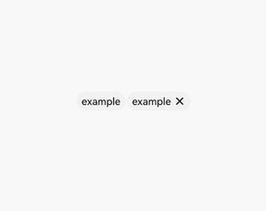

# piece<a name="ZH-CN_TOPIC_0000001173164767"></a>

一种块状的入口，可包含图片和文本。常用于展示收件人，例如：邮件收件人或信息收件人。

## 子组件<a name="section9288143101012"></a>

无

## 属性<a name="section2907183951110"></a>

除支持[通用属性](js-components-common-attributes.md)外，还支持如下属性：

<table><thead align="left"><tr><th class="cellrowborder" valign="top" width="14.5014501450145%" id="mcps1.1.6.1.1"><p>名称</p>
</th>
<th class="cellrowborder" valign="top" width="12.62126212621262%" id="mcps1.1.6.1.2"><p>类型</p>
</th>
<th class="cellrowborder" valign="top" width="8.03080308030803%" id="mcps1.1.6.1.3"><p>默认值</p>
</th>
<th class="cellrowborder" valign="top" width="6.64066406640664%" id="mcps1.1.6.1.4"><p>必填</p>
</th>
<th class="cellrowborder" valign="top" width="58.2058205820582%" id="mcps1.1.6.1.5"><p>描述</p>
</th>
</tr>
</thead>
<tbody><tr><td class="cellrowborder" valign="top" width="14.5014501450145%" headers="mcps1.1.6.1.1 "><p>content</p>
</td>
<td class="cellrowborder" valign="top" width="12.62126212621262%" headers="mcps1.1.6.1.2 "><p>string</p>
</td>
<td class="cellrowborder" valign="top" width="8.03080308030803%" headers="mcps1.1.6.1.3 "><p>-</p>
</td>
<td class="cellrowborder" valign="top" width="6.64066406640664%" headers="mcps1.1.6.1.4 "><p>是</p>
</td>
<td class="cellrowborder" valign="top" width="58.2058205820582%" headers="mcps1.1.6.1.5 "><p>操作块文本内容。</p>
</td>
</tr>
<tr><td class="cellrowborder" valign="top" width="14.5014501450145%" headers="mcps1.1.6.1.1 "><p>closable</p>
</td>
<td class="cellrowborder" valign="top" width="12.62126212621262%" headers="mcps1.1.6.1.2 "><p>boolean</p>
</td>
<td class="cellrowborder" valign="top" width="8.03080308030803%" headers="mcps1.1.6.1.3 "><p>false</p>
</td>
<td class="cellrowborder" valign="top" width="6.64066406640664%" headers="mcps1.1.6.1.4 "><p>否</p>
</td>
<td class="cellrowborder" valign="top" width="58.2058205820582%" headers="mcps1.1.6.1.5 "><p>设置当前操作块是否显示删除图标，当显示删除图标时，点击删除图标会触发close事件。</p>
</td>
</tr>
<tr><td class="cellrowborder" valign="top" width="14.5014501450145%" headers="mcps1.1.6.1.1 "><p>icon</p>
</td>
<td class="cellrowborder" valign="top" width="12.62126212621262%" headers="mcps1.1.6.1.2 "><p>string</p>
</td>
<td class="cellrowborder" valign="top" width="8.03080308030803%" headers="mcps1.1.6.1.3 "><p>-</p>
</td>
<td class="cellrowborder" valign="top" width="6.64066406640664%" headers="mcps1.1.6.1.4 "><p>否</p>
</td>
<td class="cellrowborder" valign="top" width="58.2058205820582%" headers="mcps1.1.6.1.5 "><p>操作块删除图标的url，支持本地。</p>
</td>
</tr>
</tbody>
</table>

## 样式<a name="section17756476592"></a>

支持[通用样式](js-components-common-styles.md)。

> **说明：** 
>文本和图片默认在整个piece组件中居中。

## 事件<a name="section19137152119"></a>

除支持[通用事件](js-components-common-events.md)外，还支持如下事件：

<table><thead align="left"><tr><th class="cellrowborder" valign="top" width="24.852485248524854%" id="mcps1.1.4.1.1"><p>名称</p>
</th>
<th class="cellrowborder" valign="top" width="29.552955295529554%" id="mcps1.1.4.1.2"><p>参数</p>
</th>
<th class="cellrowborder" valign="top" width="45.5945594559456%" id="mcps1.1.4.1.3"><p>描述</p>
</th>
</tr>
</thead>
<tbody><tr><td class="cellrowborder" valign="top" width="24.852485248524854%" headers="mcps1.1.4.1.1 "><p>close</p>
</td>
<td class="cellrowborder" valign="top" width="29.552955295529554%" headers="mcps1.1.4.1.2 "><p>-</p>
</td>
<td class="cellrowborder" valign="top" width="45.5945594559456%" headers="mcps1.1.4.1.3 "><p>当piece组件点击删除图标触发，此时可以通过渲染属性if删除该组件。</p>
</td>
</tr>
</tbody>
</table>

## 方法<a name="section2279124532420"></a>

支持[通用方法](js-components-common-methods.md)。

## 示例<a name="section118886119320"></a>

```
<!-- xxx.hml-->
<div class="container" >
  <piece if="{{first}}" content="example"></piece>
  <piece if="{{second}}" content="example" closable="true" onclose="closeSecond"></piece>
</div>
```

```
/* xxx.css */
.container {
  width: 100%;
  height: 100%;
  align-items: center;
  justify-content: center;
}
```

```
// xxx.js
export default {
  data: {
    first: true,
    second: true
  },
  closeSecond(e) {
    this.second = false;
  }
}
```



