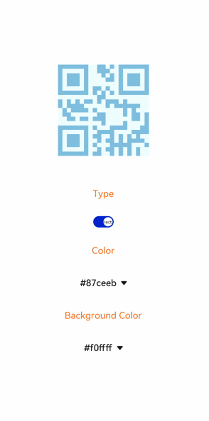

# qrcode<a name="ZH-CN_TOPIC_0000001127284846"></a>

生成并显示二维码。

## 权限列表<a name="section11257113618419"></a>

无

## 子组件<a name="section352513155564"></a>

不支持。

## 属性<a name="section5347151165210"></a>

除支持[通用属性](js-components-common-attributes.md)外，还支持如下属性：

<table><thead align="left"><tr><th class="cellrowborder" valign="top" width="23.119999999999997%" id="mcps1.1.6.1.1"><p>名称</p>
</th>
<th class="cellrowborder" valign="top" width="23.119999999999997%" id="mcps1.1.6.1.2"><p>类型</p>
</th>
<th class="cellrowborder" valign="top" width="10.48%" id="mcps1.1.6.1.3"><p>默认值</p>
</th>
<th class="cellrowborder" valign="top" width="7.5200000000000005%" id="mcps1.1.6.1.4"><p>必填</p>
</th>
<th class="cellrowborder" valign="top" width="35.76%" id="mcps1.1.6.1.5"><p>描述</p>
</th>
</tr>
</thead>
<tbody><tr><td class="cellrowborder" valign="top" width="23.119999999999997%" headers="mcps1.1.6.1.1 "><p>value</p>
</td>
<td class="cellrowborder" valign="top" width="23.119999999999997%" headers="mcps1.1.6.1.2 "><p>string</p>
</td>
<td class="cellrowborder" valign="top" width="10.48%" headers="mcps1.1.6.1.3 "><p>-</p>
</td>
<td class="cellrowborder" valign="top" width="7.5200000000000005%" headers="mcps1.1.6.1.4 "><p>是</p>
</td>
<td class="cellrowborder" valign="top" width="35.76%" headers="mcps1.1.6.1.5 "><p>用来生成二维码的内容。</p>
</td>
</tr>
<tr><td class="cellrowborder" valign="top" width="23.119999999999997%" headers="mcps1.1.6.1.1 "><p>type</p>
</td>
<td class="cellrowborder" valign="top" width="23.119999999999997%" headers="mcps1.1.6.1.2 "><p>string</p>
</td>
<td class="cellrowborder" valign="top" width="10.48%" headers="mcps1.1.6.1.3 "><p>rect</p>
</td>
<td class="cellrowborder" valign="top" width="7.5200000000000005%" headers="mcps1.1.6.1.4 "><p>否</p>
</td>
<td class="cellrowborder" valign="top" width="35.76%" headers="mcps1.1.6.1.5 "><p>二维码类型。可能选项有：</p>
<ul><li>rect：矩形二维码。</li><li>circle：圆形二维码。</li></ul>
</td>
</tr>
</tbody>
</table>

## 样式<a name="section439317598552"></a>

除支持[通用样式](js-components-common-styles.md)外，还支持如下样式：

<table><thead align="left"><tr><th class="cellrowborder" valign="top" width="23.11768823117688%" id="mcps1.1.6.1.1"><p>名称</p>
</th>
<th class="cellrowborder" valign="top" width="20.477952204779523%" id="mcps1.1.6.1.2"><p>类型</p>
</th>
<th class="cellrowborder" valign="top" width="8.869113088691131%" id="mcps1.1.6.1.3"><p>默认值</p>
</th>
<th class="cellrowborder" valign="top" width="7.519248075192481%" id="mcps1.1.6.1.4"><p>必填</p>
</th>
<th class="cellrowborder" valign="top" width="40.01599840015999%" id="mcps1.1.6.1.5"><p>描述</p>
</th>
</tr>
</thead>
<tbody><tr><td class="cellrowborder" valign="top" width="23.11768823117688%" headers="mcps1.1.6.1.1 "><p>color</p>
</td>
<td class="cellrowborder" valign="top" width="20.477952204779523%" headers="mcps1.1.6.1.2 "><p>&lt;color&gt;</p>
</td>
<td class="cellrowborder" valign="top" width="8.869113088691131%" headers="mcps1.1.6.1.3 "><p>#000000</p>
</td>
<td class="cellrowborder" valign="top" width="7.519248075192481%" headers="mcps1.1.6.1.4 "><p>否</p>
</td>
<td class="cellrowborder" valign="top" width="40.01599840015999%" headers="mcps1.1.6.1.5 "><p>二维码颜色。</p>
</td>
</tr>
<tr><td class="cellrowborder" valign="top" width="23.11768823117688%" headers="mcps1.1.6.1.1 "><p>background-color</p>
</td>
<td class="cellrowborder" valign="top" width="20.477952204779523%" headers="mcps1.1.6.1.2 "><p>&lt;color&gt;</p>
</td>
<td class="cellrowborder" valign="top" width="8.869113088691131%" headers="mcps1.1.6.1.3 "><p>#ffffff</p>
</td>
<td class="cellrowborder" valign="top" width="7.519248075192481%" headers="mcps1.1.6.1.4 "><p>否</p>
</td>
<td class="cellrowborder" valign="top" width="40.01599840015999%" headers="mcps1.1.6.1.5 "><p>二维码背景颜色。</p>
</td>
</tr>
</tbody>
</table>

> **说明：** 
>-   width和height不一致时，取二者较小值作为二维码的边长。且最终生成的二维码居中显示。
>-   width和height只设置一个时，取设置的值作为二维码的边长。都不设置时，使用200px作为默认边长。

## 事件<a name="section1948820711216"></a>

支持[通用事件](js-components-common-events.md)。

## 方法<a name="section2279124532420"></a>

支持[通用方法](js-components-common-methods.md)。

## 示例<a name="section81001951259"></a>

```
<!-- xxx.hml -->
<div class="container">
  <qrcode value="{{qr_value}}" type="{{qr_type}}"
  style="color: {{qr_col}};background-color: {{qr_bcol}};width: {{qr_size}};height: {{qr_size}};margin-bottom: 70px;"></qrcode>
  <text class="txt">Type</text>
  <switch showtext="true" checked="true" texton="rect" textoff="circle" onchange="settype"></switch>
  <text class="txt">Color</text>
  <select onchange="setcol">
    <option for="{{col_list}}" value="{{$item}}">{{$item}}</option>
  </select>
  <text class="txt">Background Color</text>
  <select onchange="setbcol">
    <option for="{{bcol_list}}" value="{{$item}}">{{$item}}</option>
  </select>
</div>
```

```
/* xxx.css */
.container {
  width: 100%;
  height: 100%;
  flex-direction: column;
  justify-content: center;
  align-items: center;
}
.txt {
  margin: 30px;
  color: orangered;
}
select{
  margin-top: 40px;
  margin-bottom: 40px;
}
```

```
/* index.js */
export default {
  data: {
    qr_type: 'rect',
    qr_size: '300px',
    qr_col: '#87ceeb',
    col_list: ['#87ceeb','#fa8072','#da70d6','#80ff00ff','#00ff00ff'],
    qr_bcol: '#f0ffff',
    bcol_list: ['#f0ffff','#ffffe0','#d8bfd8']
  },
  settype(e) {
    if (e.checked) {
      this.qr_type = 'rect'
    } else {
      this.qr_type = 'circle'
    }
  },
  setvalue(e) {
    this.qr_value = e.newValue
  },
  setcol(e) {
    this.qr_col = e.newValue
  },
  setbcol(e) {
    this.qr_bcol = e.newValue
  }
}
```



