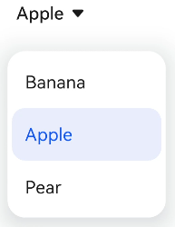

# select

>  **说明：**
>  从API version 4开始支持。后续版本如有新增内容，则采用上角标单独标记该内容的起始版本。

下拉选择按钮，可让用户在多个选项之间选择。

## 权限列表

无


## 子组件

支持&lt;[option](../arkui-js/js-components-basic-option.md)&gt;。


## 属性

支持[通用属性](../arkui-js/js-components-common-attributes.md)。


## 样式

除支持[通用样式](../arkui-js/js-components-common-styles.md)外，还支持如下样式：

| 名称          | 类型     | 默认值        | 必填   | 描述                                       |
| ----------- | ------ | ---------- | ---- | ---------------------------------------- |
| font-family | string | sans-serif | 否    | 字体列表，用逗号分隔，每个字体用字体名或者字体族名设置。列表中第一个系统中存在的或者通过[自定义字体](../arkui-js/js-components-common-customizing-font.md)指定的字体，会被选中作为文本的字体。 |


## 事件

除支持[通用事件](../arkui-js/js-components-common-events.md)外，还支持如下事件：

| 名称     | 参数                        | 描述                                       |
| ------ | ------------------------- | ---------------------------------------- |
| change | {newValue:&nbsp;newValue} | 下拉选择新值后触发该事件，newValue的值为子组件option的value属性值。 |

>  **说明：**
>
>  select组件不支持click事件。


## 方法

支持[通用方法](../arkui-js/js-components-common-methods.md)。


## 示例

```html
<!-- xxx.hml -->
<div class="container">
  <select @change="changeFruit">
    <option value="bananaValue">
      Banana
    </option>
    <option value="appleValue" selected="true">
      Apple
    </option>
    <option value="pearValue">
      Pear
    </option>
  </select>
</div>
```

```css
/* xxx.css */
.container {
  display: flex;
  justify-content: center;
  align-items: center;
}
```


