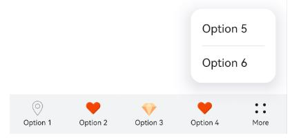

# toolbar-item

>  **说明：**
>  从API version 5开始支持。后续版本如有新增内容，则采用上角标单独标记该内容的起始版本。

工具栏子组件。作为工具栏组件的子组件，用于展示工具栏上的一个操作选项。


## 子组件

无


## 属性

除支持[通用属性](../arkui-js/js-components-common-attributes.md)外，还支持如下属性：

| 名称    | 类型     | 默认值  | 必填   | 描述                                       |
| ----- | ------ | ---- | ---- | ---------------------------------------- |
| value | string | -    | 是    | 该操作项文本内容。                                |
| icon  | string | -    | 是    | 该操作项图标资源路径，该图标展示在选项文本上，支持本地路径，格式为png，jpg和svg。 |


## 样式

仅支持如下样式：

| 名称                  | 类型                                       | 默认值          | 必填   | 描述                                       |
| ------------------- | ---------------------------------------- | ------------ | ---- | ---------------------------------------- |
| color               | &lt;color&gt;                            | \#e6000000   | 否    | 文本颜色。                                    |
| font-size           | &lt;length&gt;                           | 16px         | 否    | 文本大小。                                    |
| allow-scale         | boolean                                  | true         | 否    | 文本尺寸是否跟随系统设置字体缩放尺寸进行放大缩小。                |
| font-style          | string                                   | normal       | 否    | 文本字体样式，可选值为：<br/> -&nbsp;normal:&nbsp;标准的字体样式；<br/>- &nbsp;italic:&nbsp;斜体的字体样式。 |
| font-weight         | number\|string                           | normal       | 否    | 文本字体粗细，number类型取值[100,&nbsp;900]的整数（被100整除），默认为400，取值越大，字体越粗。string类型取值为：lighter、normal、bold、bolder。 |
| text-decoration     | string                                   | none         | 否    | 文本修饰，可选值为：<br/>- underline:&nbsp;文本下划线修饰；<br/>- &nbsp;line-through:&nbsp;穿过文本的修饰线；<br/>- &nbsp;none:&nbsp;标准文本。 |
| font-family         | string                                   | sans-serif   | 否    | 字体列表，用逗号分隔，每个字体用字体名或者字体族名设置。列表中第一个系统中存在的或者通过[自定义字体](../arkui-js/js-components-common-customizing-font.md)指定的字体，会被选中作为文本的字体。 |
| background          | &lt;linear-gradient&gt;                  | -            | 否    | 仅支持设置[渐变样式](../arkui-js/js-components-common-gradient.md)，与background-color、background-image不兼容。 |
| background-color    | &lt;color&gt;                            | -            | 否    | 设置背景颜色。                                  |
| background-image    | string                                   | -            | 否    | 设置背景图片。与background-color、background不兼容；支持网络图片资源和本地图片资源地址。 |
| background-size     | -&nbsp;string<br/>-&nbsp;&lt;length&gt;&nbsp;&lt;length&gt;<br/>-&nbsp;&lt;percentage&gt;&nbsp;&lt;percentage&gt; | auto         | 否    | 设置背景图片的大小。<br/>-&nbsp;string可选值：<br/>&nbsp;&nbsp;-&nbsp;contain：把图像扩展至最大尺寸，以使其高度和宽度完全适用内容区域。<br/>&nbsp;&nbsp;-&nbsp;cover：把背景图像扩展至足够大，以使背景图像完全覆盖背景区域；背景图像的某些部分也许无法显示在背景定位区域中。<br/>&nbsp;&nbsp;-&nbsp;auto：保持原图的比例不变。<br/>-&nbsp;length参数方式：<br/>&nbsp;&nbsp;设置背景图像的高度和宽度。第一个值设置宽度，第二个值设置高度。如果只设置一个值，则第二个值会被设置为&nbsp;"auto"。<br/>-&nbsp;百分比参数方式：<br/>以父元素的百分比来设置背景图像的宽度和高度。第一个值设置宽度，第二个值设置高度。如果只设置一个值，则第二个值会被设置为&nbsp;"auto"。 |
| background-repeat   | string                                   | repeat       | 否    | 针对重复背景图篇的样式进行设置，背景图篇默认在水平和垂直方向上重复。<br/>-&nbsp;repeat：在水平轴和竖直轴上同时重复绘制图片。<br/>-&nbsp;repeat-x：只在水平轴上重复绘制图片。<br/>-&nbsp;repeat-y：只在竖直轴上重复绘制图片。<br/>-&nbsp;no-repeat：不会重复绘制图片。 |
| background-position | -&nbsp;string&nbsp;string<br/>-&nbsp;&lt;length&gt;&nbsp;&lt;length&gt;<br/>-&nbsp;&lt;percentage&gt;&nbsp;&lt;percentage&gt; | 0px&nbsp;0px | 否    | 设置背景图片位置。<br>- 关键词方式：如果仅规定了一个关键词，那么第二个值为"center"。两个值分别定义水平方向位置和竖直方向位置。<br/>&nbsp;&nbsp;-&nbsp;left：水平方向上最左侧。<br/>&nbsp;&nbsp;-&nbsp;right：水平方向上最右侧。<br/>&nbsp;&nbsp;-&nbsp;top：竖直方向上最顶部。<br/>&nbsp;&nbsp;-&nbsp;bottom：竖直方向上最底部。<br/>&nbsp;&nbsp;-&nbsp;center：水平方向或竖直方向上中间位置。<br/>-&nbsp;length值参数方式：第一个值是水平位置，第二个值是垂直位置。&nbsp;左上角是&nbsp;0&nbsp;0。单位是像素&nbsp;(0px&nbsp;0px)&nbsp;&nbsp;。如果仅规定了一个值，另外一个值将是50%。<br/>-&nbsp;百分比参数方式：第一个值是水平位置，第二个值是垂直位置。左上角是&nbsp;0%&nbsp;0%。右下角是&nbsp;100%&nbsp;100%。如果仅规定了一个值，另外一个值为50%。<br/>-&nbsp;可以混合使用&lt;percentage&gt;和&lt;length&gt;。 |
| opacity             | number                                   | 1            | 否    | 元素的透明度，取值范围为0到1，1表示为不透明，0表示为完全透明。        |
| display             | string                                   | flex         | 否    | 确定一个元素所产生的框的类型，可选值为：<br/>-&nbsp;flex：弹性布局。<br/>-&nbsp;none：不渲染此元素。 |
| visibility          | string                                   | visible      | 否    | 是否显示元素所产生的框。不可见的框会占用布局（将'display'属性设置为'none'来完全去除框），可选值为：<br/>-&nbsp;visible：元素正常显示。<br/>-&nbsp;hidden：隐藏元素，但是其他元素的布局不改变，相当于此元素变成透明。<br/>visibility和display样式都设置时，仅display生效。 |


## 事件

支持[通用事件](../arkui-js/js-components-common-events.md)。


## 方法

不支持。


## 示例

```html
<!-- xxx.hml -->
<toolbar style="position: fixed; bottom: 0px; ">    
   <toolbar-item icon='common/Icon/location.png' value='Option 1' >   </toolbar-item>
   <toolbar-item icon='common/Icon/heart.png' value='Option 2'>   </toolbar-item>    
   <toolbar-item icon='common/Icon/diamond.png' value='Option 3'  >   </toolbar-item>    
   <toolbar-item icon='common/Icon/heart.png' value='Option 4' >   </toolbar-item>    
   <toolbar-item icon='common/Icon/heart.png' value='Option 5' >   </toolbar-item>
   <toolbar-item icon='common/Icon/heart.png' value='Option 6'>   </toolbar-item> 
</toolbar>
```


