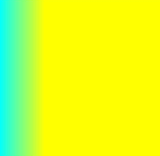

# CanvasGradient对象<a name="ZH-CN_TOPIC_0000001173164733"></a>

渐变对象。

## addColorStop<a name="section12691015917"></a>

addColorStop\(offset: number, color: string\): void

设置渐变断点值，包括偏移和颜色。

-   参数

    <table><thead align="left"><tr><th class="cellrowborder" valign="top" width="21.69%" id="mcps1.1.4.1.1"><p>参数</p>
    </th>
    <th class="cellrowborder" valign="top" width="34.74%" id="mcps1.1.4.1.2"><p>类型</p>
    </th>
    <th class="cellrowborder" valign="top" width="43.57%" id="mcps1.1.4.1.3"><p>描述</p>
    </th>
    </tr>
    </thead>
    <tbody><tr><td class="cellrowborder" valign="top" width="21.69%" headers="mcps1.1.4.1.1 "><p>offset</p>
    </td>
    <td class="cellrowborder" valign="top" width="34.74%" headers="mcps1.1.4.1.2 "><p>number</p>
    </td>
    <td class="cellrowborder" valign="top" width="43.57%" headers="mcps1.1.4.1.3 "><p>设置渐变点距离起点的位置占总体长度的比例，范围为0到1。</p>
    </td>
    </tr>
    <tr><td class="cellrowborder" valign="top" width="21.69%" headers="mcps1.1.4.1.1 "><p>color</p>
    </td>
    <td class="cellrowborder" valign="top" width="34.74%" headers="mcps1.1.4.1.2 "><p>string</p>
    </td>
    <td class="cellrowborder" valign="top" width="43.57%" headers="mcps1.1.4.1.3 "><p>设置渐变的颜色。</p>
    </td>
    </tr>
    </tbody>
    </table>

-   示例

    ```
    <!-- xxx.hml -->
    <div>
      <canvas ref="canvas" style="width: 500px; height: 500px; background-color: #ffff00;"></canvas>
      <input type="button" style="width: 180px; height: 60px;" value="fillStyle" onclick="handleClick" />
    </div>
    ```

    ```
    // xxx.js
    export default {
      handleClick() {
        const el =this.$refs.canvas;
        const ctx =el.getContext('2d');
        const gradient = ctx.createLinearGradient(0,0,100,0);
        gradient.addColorStop(0,'#00ffff');
        gradient.addColorStop(1,'#ffff00');
      }
    }
    ```

    


