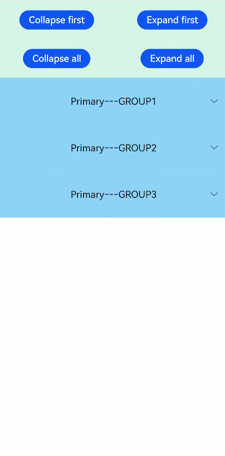

# list-item-group<a name="ZH-CN_TOPIC_0000001127284878"></a>

<[list](js-components-container-list.md)\>的子组件，用来展示分组，宽度默认充满list组件。

-   使用该组件时父元素list组件的样式columns必须为1，否则功能异常。
-   由于父元素list组件的align-items默认样式为stretch，该组件宽度默认充满list组件。设置父元素list组件的align-items样式为非stretch来生效自定义宽度。

## 权限列表<a name="section11257113618419"></a>

无

## 子组件<a name="section9288143101012"></a>

仅支持<[list-item](js-components-container-list-item.md)\>。

## 属性<a name="section2907183951110"></a>

除支持[通用属性](js-components-common-attributes.md)外，还支持如下属性：

<table><thead align="left"><tr><th class="cellrowborder" valign="top" width="23.119999999999997%" id="mcps1.1.6.1.1"><p>名称</p>
</th>
<th class="cellrowborder" valign="top" width="14.32%" id="mcps1.1.6.1.2"><p>类型</p>
</th>
<th class="cellrowborder" valign="top" width="10.83%" id="mcps1.1.6.1.3"><p>默认值</p>
</th>
<th class="cellrowborder" valign="top" width="9.55%" id="mcps1.1.6.1.4"><p>必填</p>
</th>
<th class="cellrowborder" valign="top" width="42.18%" id="mcps1.1.6.1.5"><p>描述</p>
</th>
</tr>
</thead>
<tbody><tr><td class="cellrowborder" valign="top" width="23.119999999999997%" headers="mcps1.1.6.1.1 "><p>type</p>
</td>
<td class="cellrowborder" valign="top" width="14.32%" headers="mcps1.1.6.1.2 "><p>string</p>
</td>
<td class="cellrowborder" valign="top" width="10.83%" headers="mcps1.1.6.1.3 "><p>default</p>
</td>
<td class="cellrowborder" valign="top" width="9.55%" headers="mcps1.1.6.1.4 "><p>否</p>
</td>
<td class="cellrowborder" valign="top" width="42.18%" headers="mcps1.1.6.1.5 "><p>list-item-group类型，同一list支持多种type的list-item-group，相同type的list-item-group需要确保渲染后的视图布局也完全相同，当type固定时，使用show属性代替if属性，确保视图布局不变。</p>
</td>
</tr>
</tbody>
</table>

> **说明：** 
>-   通用属性中的id用来标识一个group。list中相关的函数的入参以及事件的信息皆以此标识一个唯一的group。

## 样式<a name="section16337145611017"></a>

除支持[通用样式](js-components-common-styles.md)外，还支持如下样式：

<table><thead align="left"><tr><th class="cellrowborder" valign="top" width="23.11768823117688%" id="mcps1.1.6.1.1"><p>名称</p>
</th>
<th class="cellrowborder" valign="top" width="20.477952204779523%" id="mcps1.1.6.1.2"><p>类型</p>
</th>
<th class="cellrowborder" valign="top" width="8.869113088691131%" id="mcps1.1.6.1.3"><p>默认值</p>
</th>
<th class="cellrowborder" valign="top" width="7.519248075192481%" id="mcps1.1.6.1.4"><p>必填</p>
</th>
<th class="cellrowborder" valign="top" width="40.01599840015999%" id="mcps1.1.6.1.5"><p>描述</p>
</th>
</tr>
</thead>
<tbody><tr><td class="cellrowborder" valign="top" width="23.11768823117688%" headers="mcps1.1.6.1.1 "><p>flex-direction</p>
</td>
<td class="cellrowborder" valign="top" width="20.477952204779523%" headers="mcps1.1.6.1.2 "><p>string</p>
</td>
<td class="cellrowborder" valign="top" width="8.869113088691131%" headers="mcps1.1.6.1.3 "><p>row</p>
</td>
<td class="cellrowborder" valign="top" width="7.519248075192481%" headers="mcps1.1.6.1.4 "><p>否</p>
</td>
<td class="cellrowborder" valign="top" width="40.01599840015999%" headers="mcps1.1.6.1.5 "><p>flex容器主轴方向。可选项有：</p>
<ul><li>column：垂直方向从上到下</li><li>row：水平方向从左到右</li></ul>
</td>
</tr>
<tr><td class="cellrowborder" valign="top" width="23.11768823117688%" headers="mcps1.1.6.1.1 "><p>justify-content</p>
</td>
<td class="cellrowborder" valign="top" width="20.477952204779523%" headers="mcps1.1.6.1.2 "><p>string</p>
</td>
<td class="cellrowborder" valign="top" width="8.869113088691131%" headers="mcps1.1.6.1.3 "><p>flex-start</p>
</td>
<td class="cellrowborder" valign="top" width="7.519248075192481%" headers="mcps1.1.6.1.4 "><p>否</p>
</td>
<td class="cellrowborder" valign="top" width="40.01599840015999%" headers="mcps1.1.6.1.5 "><p>flex容器当前行的主轴对齐格式。可选项有：</p>
<ul><li>flex-start：项目位于容器的开头。</li><li>flex-end：项目位于容器的结尾。</li><li>center：项目位于容器的中心。</li><li>space-between：项目位于各行之间留有空白的容器内。</li><li>space-around：项目位于各行之前、之间、之后都留有空白的容器内。</li><li>space-evenly<sup><span>5+</span></sup>:  均匀排列每个元素，每个元素之间的间隔相等。</li></ul>
</td>
</tr>
</tbody>
</table>

## 事件<a name="section1052914819116"></a>

除支持[通用事件](js-components-common-events.md)外，还支持如下事件：

<table><thead align="left"><tr><th class="cellrowborder" valign="top" width="24.852485248524854%" id="mcps1.1.4.1.1"><p>名称</p>
</th>
<th class="cellrowborder" valign="top" width="24.21242124212421%" id="mcps1.1.4.1.2"><p>参数</p>
</th>
<th class="cellrowborder" valign="top" width="50.935093509350935%" id="mcps1.1.4.1.3"><p>描述</p>
</th>
</tr>
</thead>
<tbody><tr><td class="cellrowborder" valign="top" width="24.852485248524854%" headers="mcps1.1.4.1.1 "><p>groupclick</p>
</td>
<td class="cellrowborder" valign="top" width="24.21242124212421%" headers="mcps1.1.4.1.2 "><p>{ groupid: string }</p>
</td>
<td class="cellrowborder" valign="top" width="50.935093509350935%" headers="mcps1.1.4.1.3 "><p>group点击事件。</p>
<p>groupid：被点击的group的id。</p>
</td>
</tr>
<tr><td class="cellrowborder" valign="top" width="24.852485248524854%" headers="mcps1.1.4.1.1 "><p>groupcollapse</p>
</td>
<td class="cellrowborder" valign="top" width="24.21242124212421%" headers="mcps1.1.4.1.2 "><p>{ groupid: string }</p>
</td>
<td class="cellrowborder" valign="top" width="50.935093509350935%" headers="mcps1.1.4.1.3 "><p>group收拢事件。</p>
<p>groupid：收拢的group的id。</p>
<p>当不输入参数或者groupid为空时收拢所有分组。</p>
</td>
</tr>
<tr><td class="cellrowborder" valign="top" width="24.852485248524854%" headers="mcps1.1.4.1.1 "><p>groupexpand</p>
</td>
<td class="cellrowborder" valign="top" width="24.21242124212421%" headers="mcps1.1.4.1.2 "><p>{ groupid: string }</p>
</td>
<td class="cellrowborder" valign="top" width="50.935093509350935%" headers="mcps1.1.4.1.3 "><p>group展开事件。</p>
<p>groupid：展开的group的id。</p>
<p>当不输入参数或者groupid为空时展开所有分组。</p>
</td>
</tr>
</tbody>
</table>

## 方法<a name="section2279124532420"></a>

支持[通用方法](js-components-common-methods.md)。

## 示例<a name="section1159816598218"></a>

```
<!-- xxx.hml -->
<div class="doc-page">
  <list style="width: 100%;" id="mylist">
    <list-item class="top-list-item" clickeffect="false">
      <div class="item-div">
        <div class="item-child">
          <button type="capsule" value="Collapse first" onclick="collapseOne"></button>
          <button type="capsule" value="Expand first" onclick="expandOne"></button>
        </div>
        <div class="item-child">
          <button type="capsule" value="Collapse all" onclick="collapseAll"></button>
          <button type="capsule" value="Expand all" onclick="expandAll"></button>
        </div>
      </div>
    </list-item>
    <list-item-group for="listgroup in list" id="{{listgroup.value}}" ongroupcollapse="collapse" ongroupexpand="expand">
      <list-item type="item" style="background-color:#FFF0F5;height:95px;">
        <div class="item-group-child">
          <text>One---{{listgroup.value}}</text>
        </div>
      </list-item>
      <list-item type="item" style="background-color: #87CEFA;height:145px;" primary="true">
        <div class="item-group-child">
          <text>Primary---{{listgroup.value}}</text>
        </div>
      </list-item>
    </list-item-group>
  </list>
</div>
```

```
/* xxx.css */
.doc-page {
  flex-direction: column;
}
.top-list-item {
  width:100%;
  background-color:#D4F2E7;
}
.item-div {
  flex-direction:column;
  align-items:center;
  justify-content:space-around;
  height:240px;
}
.item-child {
  width:100%;
  height:60px;
  justify-content:space-around;
  align-items:center;
}
.item-group-child {
  justify-content: center;
  align-items: center;
  width:100%;
}
```

```
// xxx.js
import prompt from '@system.prompt';
export default {
  data: {
    direction: 'column',
    list: []
  },
  onInit() {
    this.list = []
    this.listAdd = []
    for (var i = 1; i <= 3; i++) {
      var dataItem = {
        value: 'GROUP' + i,
      };
      this.list.push(dataItem);
    }
  },
  collapseOne(e) {
    this.$element('mylist').collapseGroup({
      groupid: 'GROUP1'
    })
  },
  expandOne(e) {
    this.$element('mylist').expandGroup({
      groupid: 'GROUP1'
    })
  },
  collapseAll(e) {
    this.$element('mylist').collapseGroup()
  },
  expandAll(e) {
    this.$element('mylist').expandGroup()
  },
  collapse(e) {
    prompt.showToast({
      message: 'Close ' + e.groupid
    })
  },
  expand(e) {
    prompt.showToast({
      message: 'Open ' + e.groupid
    })
  }
}
```



