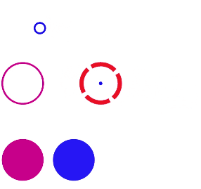

# animate<a name="ZH-CN_TOPIC_0000001127125042"></a>

设置svg组件的属性动画。

> **说明：** 
>该组件从API version 7开始支持。后续版本如有新增内容，则采用上角标单独标记该内容的起始版本。

## 权限列表<a name="section11257113618419"></a>

无

## 子组件<a name="section9288143101012"></a>

不支持。

## 属性<a name="section2907183951110"></a>

<table><thead align="left"><tr><th class="cellrowborder" valign="top" width="23.119999999999997%" id="mcps1.1.6.1.1"><p>名称</p>
</th>
<th class="cellrowborder" valign="top" width="23.119999999999997%" id="mcps1.1.6.1.2"><p>类型</p>
</th>
<th class="cellrowborder" valign="top" width="10.48%" id="mcps1.1.6.1.3"><p>默认值</p>
</th>
<th class="cellrowborder" valign="top" width="7.5200000000000005%" id="mcps1.1.6.1.4"><p>必填</p>
</th>
<th class="cellrowborder" valign="top" width="35.76%" id="mcps1.1.6.1.5"><p>描述</p>
</th>
</tr>
</thead>
<tbody><tr><td class="cellrowborder" valign="top" width="23.119999999999997%" headers="mcps1.1.6.1.1 "><p>id</p>
</td>
<td class="cellrowborder" valign="top" width="23.119999999999997%" headers="mcps1.1.6.1.2 "><p>string</p>
</td>
<td class="cellrowborder" valign="top" width="10.48%" headers="mcps1.1.6.1.3 "><p>-</p>
</td>
<td class="cellrowborder" valign="top" width="7.5200000000000005%" headers="mcps1.1.6.1.4 "><p>否</p>
</td>
<td class="cellrowborder" valign="top" width="35.76%" headers="mcps1.1.6.1.5 "><p>组件的唯一标识。</p>
</td>
</tr>
<tr><td class="cellrowborder" valign="top" width="23.119999999999997%" headers="mcps1.1.6.1.1 "><p>attributeName</p>
</td>
<td class="cellrowborder" valign="top" width="23.119999999999997%" headers="mcps1.1.6.1.2 "><p>string</p>
</td>
<td class="cellrowborder" valign="top" width="10.48%" headers="mcps1.1.6.1.3 "><p>-</p>
</td>
<td class="cellrowborder" valign="top" width="7.5200000000000005%" headers="mcps1.1.6.1.4 "><p>否</p>
</td>
<td class="cellrowborder" valign="top" width="35.76%" headers="mcps1.1.6.1.5 "><p>设置需要进行动效的属性名。</p>
</td>
</tr>
<tr><td class="cellrowborder" valign="top" width="23.119999999999997%" headers="mcps1.1.6.1.1 "><p>begin</p>
</td>
<td class="cellrowborder" valign="top" width="23.119999999999997%" headers="mcps1.1.6.1.2 "><p>&lt;time&gt;</p>
</td>
<td class="cellrowborder" valign="top" width="10.48%" headers="mcps1.1.6.1.3 "><p>0</p>
</td>
<td class="cellrowborder" valign="top" width="7.5200000000000005%" headers="mcps1.1.6.1.4 "><p>否</p>
</td>
<td class="cellrowborder" valign="top" width="35.76%" headers="mcps1.1.6.1.5 "><p>设置动效的延迟时间。</p>
<p>支持输入ms(毫秒)、s（秒）、m（分），默认为s(秒)，其他格式不支持</p>
</td>
</tr>
<tr><td class="cellrowborder" valign="top" width="23.119999999999997%" headers="mcps1.1.6.1.1 "><p>dur</p>
</td>
<td class="cellrowborder" valign="top" width="23.119999999999997%" headers="mcps1.1.6.1.2 "><p>&lt;time&gt;</p>
</td>
<td class="cellrowborder" valign="top" width="10.48%" headers="mcps1.1.6.1.3 "><p>0</p>
</td>
<td class="cellrowborder" valign="top" width="7.5200000000000005%" headers="mcps1.1.6.1.4 "><p>否</p>
</td>
<td class="cellrowborder" valign="top" width="35.76%" headers="mcps1.1.6.1.5 "><p>设置动效持续时间，如果dur没设置，按照end-begin的结果作为持续时间，小于等于0时，动效不触发。</p>
<p>支持输入ms(毫秒)、s（秒）、m（分），默认为s(秒)，其他格式不支持</p>
</td>
</tr>
<tr><td class="cellrowborder" valign="top" width="23.119999999999997%" headers="mcps1.1.6.1.1 "><p>end</p>
</td>
<td class="cellrowborder" valign="top" width="23.119999999999997%" headers="mcps1.1.6.1.2 "><p>&lt;time&gt;</p>
</td>
<td class="cellrowborder" valign="top" width="10.48%" headers="mcps1.1.6.1.3 "><p>0</p>
</td>
<td class="cellrowborder" valign="top" width="7.5200000000000005%" headers="mcps1.1.6.1.4 "><p>否</p>
</td>
<td class="cellrowborder" valign="top" width="35.76%" headers="mcps1.1.6.1.5 "><p>设置动效多久时间后结束。支持输入ms(毫秒)、s（秒）、m（分），默认为s(秒)，其他格式不支持</p>
</td>
</tr>
<tr><td class="cellrowborder" valign="top" width="23.119999999999997%" headers="mcps1.1.6.1.1 "><p>repeatCount</p>
</td>
<td class="cellrowborder" valign="top" width="23.119999999999997%" headers="mcps1.1.6.1.2 "><p>&lt;number | indefinite&gt;</p>
</td>
<td class="cellrowborder" valign="top" width="10.48%" headers="mcps1.1.6.1.3 "><p>1</p>
</td>
<td class="cellrowborder" valign="top" width="7.5200000000000005%" headers="mcps1.1.6.1.4 "><p>否</p>
</td>
<td class="cellrowborder" valign="top" width="35.76%" headers="mcps1.1.6.1.5 "><p>设置动画播放的次数，默认无限次播放(indefinite)，可通过设置为数值1仅播放一次。</p>
</td>
</tr>
<tr><td class="cellrowborder" valign="top" width="23.119999999999997%" headers="mcps1.1.6.1.1 "><p>fill</p>
</td>
<td class="cellrowborder" valign="top" width="23.119999999999997%" headers="mcps1.1.6.1.2 "><p>&lt;freeze | remove&gt;</p>
</td>
<td class="cellrowborder" valign="top" width="10.48%" headers="mcps1.1.6.1.3 "><p>remove</p>
</td>
<td class="cellrowborder" valign="top" width="7.5200000000000005%" headers="mcps1.1.6.1.4 "><p>否</p>
</td>
<td class="cellrowborder" valign="top" width="35.76%" headers="mcps1.1.6.1.5 "><p>设置动画结束时的状态。</p>
</td>
</tr>
<tr><td class="cellrowborder" valign="top" width="23.119999999999997%" headers="mcps1.1.6.1.1 "><p>calcMode</p>
</td>
<td class="cellrowborder" valign="top" width="23.119999999999997%" headers="mcps1.1.6.1.2 "><p>&lt;discrete | linear | paced | spline&gt;</p>
</td>
<td class="cellrowborder" valign="top" width="10.48%" headers="mcps1.1.6.1.3 "><p>linear</p>
</td>
<td class="cellrowborder" valign="top" width="7.5200000000000005%" headers="mcps1.1.6.1.4 "><p>否</p>
</td>
<td class="cellrowborder" valign="top" width="35.76%" headers="mcps1.1.6.1.5 "><p>设置动画的插值模式。</p>
<p>discrete：阶跃，from值直接跳转到to的值；</p>
<p>linear：线性；</p>
<p>paced：线性，设置此项后keyTimes和keyPoints值无效</p>
<p>spline：自定义贝塞尔曲线，spline点定义在keyTimes属性中，每个时间间隔控制点由keySplines定义</p>
</td>
</tr>
<tr><td class="cellrowborder" valign="top" width="23.119999999999997%" headers="mcps1.1.6.1.1 "><p>keyTimes</p>
</td>
<td class="cellrowborder" valign="top" width="23.119999999999997%" headers="mcps1.1.6.1.2 "><p>string</p>
</td>
<td class="cellrowborder" valign="top" width="10.48%" headers="mcps1.1.6.1.3 "><p>-</p>
</td>
<td class="cellrowborder" valign="top" width="7.5200000000000005%" headers="mcps1.1.6.1.4 "><p>否</p>
</td>
<td class="cellrowborder" valign="top" width="35.76%" headers="mcps1.1.6.1.5 "><p>设置关键帧动画的开始时间，值为0~1之间的数值用分号隔开，比如0;0.3;0.8;1。keyTimes、keySplines、values组合设置关键帧动画。keyTimes和values的个数保持一致。keySplines个数为keyTimes个数减一</p>
</td>
</tr>
<tr><td class="cellrowborder" valign="top" width="23.119999999999997%" headers="mcps1.1.6.1.1 "><p>keySplines</p>
</td>
<td class="cellrowborder" valign="top" width="23.119999999999997%" headers="mcps1.1.6.1.2 "><p>string</p>
</td>
<td class="cellrowborder" valign="top" width="10.48%" headers="mcps1.1.6.1.3 "><p>-</p>
</td>
<td class="cellrowborder" valign="top" width="7.5200000000000005%" headers="mcps1.1.6.1.4 "><p>否</p>
</td>
<td class="cellrowborder" valign="top" width="35.76%" headers="mcps1.1.6.1.5 "><p>与keyTimes相关联的一组贝塞尔控制点。定义每个关键帧的贝塞尔曲线，曲线之间用分号隔开。曲线内的两个控制掉格式为x1 y1 x2 y2。比如0.5 0 0.5 1; 0.5 0 0.5 1;0.5 0 0.5 1</p>
</td>
</tr>
<tr><td class="cellrowborder" valign="top" width="23.119999999999997%" headers="mcps1.1.6.1.1 "><p>by</p>
</td>
<td class="cellrowborder" valign="top" width="23.119999999999997%" headers="mcps1.1.6.1.2 "><p>number</p>
</td>
<td class="cellrowborder" valign="top" width="10.48%" headers="mcps1.1.6.1.3 "><p>-</p>
</td>
<td class="cellrowborder" valign="top" width="7.5200000000000005%" headers="mcps1.1.6.1.4 "><p>否</p>
</td>
<td class="cellrowborder" valign="top" width="35.76%" headers="mcps1.1.6.1.5 "><p>在动画中对某一指定属性，添加相对偏移值，from默认为原属性值。</p>
</td>
</tr>
<tr><td class="cellrowborder" valign="top" width="23.119999999999997%" headers="mcps1.1.6.1.1 "><p>from</p>
</td>
<td class="cellrowborder" valign="top" width="23.119999999999997%" headers="mcps1.1.6.1.2 "><p>string</p>
</td>
<td class="cellrowborder" valign="top" width="10.48%" headers="mcps1.1.6.1.3 "><p>-</p>
</td>
<td class="cellrowborder" valign="top" width="7.5200000000000005%" headers="mcps1.1.6.1.4 "><p>否</p>
</td>
<td class="cellrowborder" valign="top" width="35.76%" headers="mcps1.1.6.1.5 "><p>设置需要进行动画的属性的开始值。</p>
<p>如果已经设置了values属性，则from失效。</p>
</td>
</tr>
<tr><td class="cellrowborder" valign="top" width="23.119999999999997%" headers="mcps1.1.6.1.1 "><p>to</p>
</td>
<td class="cellrowborder" valign="top" width="23.119999999999997%" headers="mcps1.1.6.1.2 "><p>string</p>
</td>
<td class="cellrowborder" valign="top" width="10.48%" headers="mcps1.1.6.1.3 "><p>-</p>
</td>
<td class="cellrowborder" valign="top" width="7.5200000000000005%" headers="mcps1.1.6.1.4 "><p>否</p>
</td>
<td class="cellrowborder" valign="top" width="35.76%" headers="mcps1.1.6.1.5 "><p>设置需要进行动画的属性的结束值。</p>
<p>如果已经设置了values属性，则to都失效。</p>
</td>
</tr>
<tr><td class="cellrowborder" valign="top" width="23.119999999999997%" headers="mcps1.1.6.1.1 "><p>values</p>
</td>
<td class="cellrowborder" valign="top" width="23.119999999999997%" headers="mcps1.1.6.1.2 "><p>string</p>
</td>
<td class="cellrowborder" valign="top" width="10.48%" headers="mcps1.1.6.1.3 "><p>-</p>
</td>
<td class="cellrowborder" valign="top" width="7.5200000000000005%" headers="mcps1.1.6.1.4 "><p>否</p>
</td>
<td class="cellrowborder" valign="top" width="35.76%" headers="mcps1.1.6.1.5 "><p>设置一组动画的变化值。格式为value1;value2;value3。</p>
</td>
</tr>
</tbody>
</table>

## 示例<a name="section360556124815"></a>

```
<!-- xxx.hml -->
<div class="container">
  <svg width="400" height="400">
    <rect x="20" y="20" width="100" height="100" fill="red" rx="0" ry="20">
      <animate attributeName="rx" values="0;10;30;0" keyTimes="0;0.25;0.75;1" keySplines="0.5 0 0.5 1; 0.5 0 0.5 1; 0.5 0 0.5 1" dur="1000" repeatCount="indefinite">
      </animate>
    </rect>
  </svg>
</div>
```


```
<!-- xxx.hml -->
<div class="container">
  <svg width="400" height="400">
    <rect x="20" y="20" width="100" height="100" fill="red" rx="0" ry="20">
      <animate attributeName="fill" from="red" to="blue" dur="1000" repeatCount="indefinite"></animate>
      <animate attributeName="height" from="50" to="150" begin="500" end="1000" repeatCount="indefinite">  </animate>
    </rect>
  </svg>
</div>
```


```
<!-- xxx.hml -->
<div class="container">
  <svg width="400" height="400">
    <rect x="20" y="20" width="100" height="100" fill="red" rx="0" ry="20">
      <animate attributeName="rx" values="0;30" dur="1000" repeatCount="10" fill="freeze" calcMode="linear"></animate>
    </rect>
  </svg>
</div>
```


```
<!-- xxx.hml -->
<div class="container">
  <svg fill="white" width="600" height="600">
    <circle cx="60" cy="70" r="50" stroke-width="4" fill="white" stroke="blue">
      <animate attributeName="r" from="0" to="50" dur="2000" repeatCount="indefinite"></animate>
      <animate attributeName="cx" from="60" to="200" dur="2000" repeatCount="indefinite"></animate>
    </circle>
    <circle cx="60" cy="200" r="50" stroke-width="4" fill="white" stroke="blue">
      <animate attributeName="stroke-width" from="4" to="10" calcMode="discrete" dur="2000" repeatCount="indefinite"></animate>
      <animate attributeName="stroke" values="red;blue" dur="2000" repeatCount="indefinite"></animate>
    </circle>
    <circle cx="180" cy="200" r="50" stroke-width="10" stroke="red" stroke-dasharray="60 10" stroke-dashoffset="3">
      <animate attributeName="stroke-opacity" from="1.0" to="0.5" dur="2000" repeatCount="indefinite"></animate>
      <animate attributeName="stroke-dashoffset" values="30;0;30" dur="500" repeatCount="indefinite"></animate>
     <animate attributeName="cx" from="180" to="400" dur="2000" repeatCount="indefinite"></animate>
    </circle>
    <circle cx="180" cy="200" r="5" fill="blue">
      <animate attributeName="cx" from="180" to="400" dur="2000" repeatCount="indefinite"></animate>
    </circle>
    <circle cx="60" cy="380" r="50"  fill="blue">
      <animate attributeName="fill" values="red;blue" dur="2000" repeatCount="indefinite"></animate>
    </circle>
    <circle cx="180" cy="380" r="50"  fill="blue">
      <animate attributeName="fill-opacity" from="1.0" to="0.5" dur="2000" repeatCount="indefinite"></animate>
    </circle>
    </svg>
</div>
```



