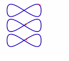

# animateMotion<a name="ZH-CN_TOPIC_0000001173324621"></a>

路径动效。

> **说明：** 
>该组件从API version 7开始支持。后续版本如有新增内容，则采用上角标单独标记该内容的起始版本。

## 权限列表<a name="section11257113618419"></a>

无

## 子组件<a name="section9288143101012"></a>

不支持。

## 属性<a name="section2907183951110"></a>

支持animate属性\(values不生效\)和以下表格中的属性。

<table><thead align="left"><tr><th class="cellrowborder" valign="top" width="23.119999999999997%" id="mcps1.1.6.1.1"><p>名称</p>
</th>
<th class="cellrowborder" valign="top" width="23.119999999999997%" id="mcps1.1.6.1.2"><p>类型</p>
</th>
<th class="cellrowborder" valign="top" width="10.48%" id="mcps1.1.6.1.3"><p>默认值</p>
</th>
<th class="cellrowborder" valign="top" width="7.5200000000000005%" id="mcps1.1.6.1.4"><p>必填</p>
</th>
<th class="cellrowborder" valign="top" width="35.76%" id="mcps1.1.6.1.5"><p>描述</p>
</th>
</tr>
</thead>
<tbody><tr><td class="cellrowborder" valign="top" width="23.119999999999997%" headers="mcps1.1.6.1.1 "><p>keyPoints</p>
</td>
<td class="cellrowborder" valign="top" width="23.119999999999997%" headers="mcps1.1.6.1.2 "><p>string</p>
</td>
<td class="cellrowborder" valign="top" width="10.48%" headers="mcps1.1.6.1.3 "><p>-</p>
</td>
<td class="cellrowborder" valign="top" width="7.5200000000000005%" headers="mcps1.1.6.1.4 "><p>是</p>
</td>
<td class="cellrowborder" valign="top" width="35.76%" headers="mcps1.1.6.1.5 "><p>一组关键帧的点位置，每帧的值为对象沿路径的距离比例。功能与animate属性中的values相同。</p>
</td>
</tr>
<tr><td class="cellrowborder" valign="top" width="23.119999999999997%" headers="mcps1.1.6.1.1 "><p>path</p>
</td>
<td class="cellrowborder" valign="top" width="23.119999999999997%" headers="mcps1.1.6.1.2 "><p>string</p>
</td>
<td class="cellrowborder" valign="top" width="10.48%" headers="mcps1.1.6.1.3 "><p>-</p>
</td>
<td class="cellrowborder" valign="top" width="7.5200000000000005%" headers="mcps1.1.6.1.4 "><p>是</p>
</td>
<td class="cellrowborder" valign="top" width="35.76%" headers="mcps1.1.6.1.5 "><p>定义运动的路径，使用与path组件d属性相同的语法。</p>
</td>
</tr>
<tr><td class="cellrowborder" valign="top" width="23.119999999999997%" headers="mcps1.1.6.1.1 "><p>rotate</p>
</td>
<td class="cellrowborder" valign="top" width="23.119999999999997%" headers="mcps1.1.6.1.2 "><p>[auto | auto-reverse | &lt;number&gt;]</p>
</td>
<td class="cellrowborder" valign="top" width="10.48%" headers="mcps1.1.6.1.3 "><p>auto</p>
</td>
<td class="cellrowborder" valign="top" width="7.5200000000000005%" headers="mcps1.1.6.1.4 "><p>-</p>
</td>
<td class="cellrowborder" valign="top" width="35.76%" headers="mcps1.1.6.1.5 "><p>设置动画对象的旋转方向</p>
</td>
</tr>
</tbody>
</table>

## 示例<a name="section360556124815"></a>

```
<!-- xxx.hml -->
<div class="container">
  <svg fill="white" width="400" height="400">
    <path fill="none" stroke="blue" stroke-width="3" d="m40,60 c0,-100 160,100 160,0 c0,-100 -160,100 -160,0 z"></path>
    <path fill="none" stroke="blue" stroke-width="3" d="m40,130 c0,-100 160,100 160,0 c0,-100 -160,100 -160,0 z"></path>
    <path fill="none" stroke="blue" stroke-width="3" d="m40,200 c0,-100 160,100 160,0 c0,-100 -160,100 -160,0 z"></path>
    <path fill="red" d="M-5,-5 L10,0 L-5,5 L0,0 Z">
      <animateMotion dur="2000" repeatCount="indefinite" rotate="auto" keyPoints="0;0.2;0.4;0.6;0.8;1" path="m40,60 c0,-100 160,160,100 160,0 c0,-100,-160,100 -160,0 z">
      </animateMotion>
    </path>
    <path fill="red" d="M-5,-5 L10,0 L-5,5 L0,0 Z">
      <animateMotion dur="2000" repeatCount="indefinite" rotate="auto-reverse"path="m40,130 c0,-100 160,100 160,0 c0,-100,-160,100 -160,0 z">
      </animateMotion>
    </path>
    <path fill="red" d="M-5,-5 L10,0 L-5,5 L0,0 Z">
      <animateMotion dur="2000" repeatCount="indefinite" rotate="45"path="m40,200 c0,-100 160,100 160,0 c0,-100 -160,100 -160,0 z"></animateMotion>
    </path>
  </svg>
</div>
```



