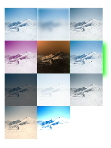
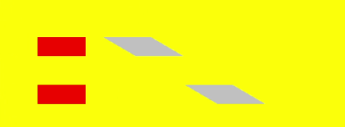

# OffscreenCanvasRenderingContext2D对象<a name="ZH-CN_TOPIC_0000001180864495"></a>

> **说明：** 
>从API version 7开始支持。后续版本如有新增内容，则采用上角标单独标记该内容的起始版本。

使用OffscreenCanvasRenderingContext2D在offscreen canvas上进行绘制，绘制对象可以是矩形、文本、图片等

## 属性<a name="section661391987"></a>

除支持与CanvasRenderingContext2D对象相同的属性外，还支持如下属性：

<table><thead align="left"><tr><th class="cellrowborder" valign="top" width="22.872287228722872%" id="mcps1.1.4.1.1"><p>属性</p>
</th>
<th class="cellrowborder" valign="top" width="29.352935293529352%" id="mcps1.1.4.1.2"><p>类型</p>
</th>
<th class="cellrowborder" valign="top" width="47.774777477747776%" id="mcps1.1.4.1.3"><p>描述</p>
</th>
</tr>
</thead>
<tbody><tr><td class="cellrowborder" valign="top" width="22.872287228722872%" headers="mcps1.1.4.1.1 "><p>filter</p>
</td>
<td class="cellrowborder" valign="top" width="29.352935293529352%" headers="mcps1.1.4.1.2 "><p>string</p>
</td>
<td class="cellrowborder" valign="top" width="47.774777477747776%" headers="mcps1.1.4.1.3 "><p>设置图像的滤镜。</p>
<p>支持的滤镜效果如下：</p>
<ul><li>blur：给图像设置高斯模糊</li><li>brightness：给图片应用一种线性乘法，使其看起来更亮或更暗</li><li>contrast：调整图像的对比度</li><li>drop-shadow：给图像设置一个阴影效果</li><li>grayscale：将图像转换为灰度图像</li><li>hue-rotate：给图像应用色相旋转</li><li>invert：反转输入图像</li><li>opacity：转化图像的透明程度</li><li>saturate：转换图像饱和度</li><li>sepia：将图像转换为深褐色</li></ul>
</td>
</tr>
</tbody>
</table>

-   示例

    ```
    <!-- xxx.hml -->
    <div style="width: 180px; height: 60px;">
      <canvas ref="canvasId" style="width: 500px; height: 500px; background-color: #ffff00;"></canvas>
    </div>
    ```

    ```
    //xxx.js
    export default {
      onShow(){
        var ctx = this.$refs.canvasId.getContext('2d');
        var offscreen = new OffscreenCanvas(360, 500);
        var offCanvas2 = offscreen.getContext("2d");
        var img = new Image();
        img.src = 'common/images/flower.jpg';
        offCanvas2.drawImage(img, 0, 0, 100, 100);
        offCanvas2.filter = 'blur(5px)';
        offCanvas2.drawImage(img, 100, 0, 100, 100);
    
        offCanvas2.filter = 'grayscale(50%)';
        offCanvas2.drawImage(img, 200, 0, 100, 100);
    
        offCanvas2.filter = 'hue-rotate(90deg)';
        offCanvas2.drawImage(img, 0, 100, 100, 100);
    
        offCanvas2.filter = 'invert(100%)';
        offCanvas2.drawImage(img, 100, 100, 100, 100);
    
        offCanvas2.filter = 'drop-shadow(8px 8px 10px green)';
        offCanvas2.drawImage(img, 200, 100, 100, 100);
    
        offCanvas2.filter = 'brightness(0.4)';
        offCanvas2.drawImage(img, 0, 200, 100, 100);
    
        offCanvas2.filter = 'opacity(25%)';
        offCanvas2.drawImage(img, 100, 200, 100, 100);
    
        offCanvas2.filter = 'saturate(30%)';
        offCanvas2.drawImage(img, 200, 200, 100, 100);
    
        offCanvas2.filter = 'sepia(60%)';
        offCanvas2.drawImage(img, 0, 300, 100, 100);
    
        offCanvas2.filter = 'contrast(200%)';
        offCanvas2.drawImage(img, 100, 300, 100, 100);
        var bitmap = offscreen.transferToImageBitmap();
        ctx.transferFromImageBitmap(bitmap);
      }
    }
    ```

    


## 方法<a name="section47669296127"></a>

除支持与CanvasRenderingContext2D对象相同的方法外，还支持如下方法：

### isPointInPath<a name="section12576152143713"></a>

isPointInPath\(path?: Path2D, x: number, y: number\): boolean

判断指定点是否在路径的区域内。

-   参数

    <table><thead align="left"><tr><th class="cellrowborder" valign="top" width="21.04%" id="mcps1.1.5.1.1"><p>参数名</p>
    </th>
    <th class="cellrowborder" valign="top" width="15.260000000000002%" id="mcps1.1.5.1.2"><p>参数类型</p>
    </th>
    <th class="cellrowborder" valign="top" width="7.5200000000000005%" id="mcps1.1.5.1.3"><p>必填</p>
    </th>
    <th class="cellrowborder" valign="top" width="56.18%" id="mcps1.1.5.1.4"><p>描述</p>
    </th>
    </tr>
    </thead>
    <tbody><tr><td class="cellrowborder" valign="top" width="21.04%" headers="mcps1.1.5.1.1 "><p>path</p>
    </td>
    <td class="cellrowborder" valign="top" width="15.260000000000002%" headers="mcps1.1.5.1.2 "><p>Path2D</p>
    </td>
    <td class="cellrowborder" valign="top" width="7.5200000000000005%" headers="mcps1.1.5.1.3 "><p>否</p>
    </td>
    <td class="cellrowborder" valign="top" width="56.18%" headers="mcps1.1.5.1.4 "><p>可选对象，指定用来判断的路径。若没有设置，则使用当前路径。</p>
    </td>
    </tr>
    <tr><td class="cellrowborder" valign="top" width="21.04%" headers="mcps1.1.5.1.1 "><p>x</p>
    </td>
    <td class="cellrowborder" valign="top" width="15.260000000000002%" headers="mcps1.1.5.1.2 "><p>number</p>
    </td>
    <td class="cellrowborder" valign="top" width="7.5200000000000005%" headers="mcps1.1.5.1.3 "><p>是</p>
    </td>
    <td class="cellrowborder" valign="top" width="56.18%" headers="mcps1.1.5.1.4 "><p>待判断点的x轴坐标。</p>
    </td>
    </tr>
    <tr><td class="cellrowborder" valign="top" width="21.04%" headers="mcps1.1.5.1.1 "><p>y</p>
    </td>
    <td class="cellrowborder" valign="top" width="15.260000000000002%" headers="mcps1.1.5.1.2 "><p>number</p>
    </td>
    <td class="cellrowborder" valign="top" width="7.5200000000000005%" headers="mcps1.1.5.1.3 "><p>是</p>
    </td>
    <td class="cellrowborder" valign="top" width="56.18%" headers="mcps1.1.5.1.4 "><p>待判断点的y轴坐标。</p>
    </td>
    </tr>
    </tbody>
    </table>

-   返回值

    <table><thead align="left"><tr><th class="cellrowborder" valign="top" width="19.77%" id="mcps1.1.3.1.1"><p>类型</p>
    </th>
    <th class="cellrowborder" valign="top" width="80.23%" id="mcps1.1.3.1.2"><p>说明</p>
    </th>
    </tr>
    </thead>
    <tbody><tr><td class="cellrowborder" valign="top" width="19.77%" headers="mcps1.1.3.1.1 "><p>boolean</p>
    </td>
    <td class="cellrowborder" valign="top" width="80.23%" headers="mcps1.1.3.1.2 "><p>指定点是否在路径的区域内。</p>
    </td>
    </tr>
    </tbody>
    </table>

-   示例

    ```
    <!-- xxx.hml -->
    <div style="width: 180px; height: 60px;">
      <text>In path:{{textValue}}</text>
      <canvas ref="canvas" style="width: 500px; height: 500px; background-color: #ffff00;"></canvas>
    </div>
    ```

    ```
    // xxx.js
    export default {
      data: {
        textValue: 0
      },
      onShow(){
        var canvas = this.$refs.canvas.getContext('2d');
        var offscreen = new OffscreenCanvas(500,500);
        var offscreenCanvasCtx = offscreen.getContext("2d");
    
        offscreenCanvasCtx.rect(10, 10, 100, 100);
        offscreenCanvasCtx.fill();
        this.textValue = offscreenCanvasCtx.isPointInPath(30, 70);
    
        var bitmap = offscreen.transferToImageBitmap();
        canvas.transferFromImageBitmap(bitmap);
      }
    }
    ```

    


### isPointInStroke<a name="section18889155054014"></a>

isPointInStroke\(path?: Path2D, x: number, y: number\): boolean

判断指定点是否在路径的边缘线上。

-   参数

    <table><thead align="left"><tr><th class="cellrowborder" valign="top" width="21.04%" id="mcps1.1.5.1.1"><p>参数名</p>
    </th>
    <th class="cellrowborder" valign="top" width="15.260000000000002%" id="mcps1.1.5.1.2"><p>参数类型</p>
    </th>
    <th class="cellrowborder" valign="top" width="7.5200000000000005%" id="mcps1.1.5.1.3"><p>必填</p>
    </th>
    <th class="cellrowborder" valign="top" width="56.18%" id="mcps1.1.5.1.4"><p>描述</p>
    </th>
    </tr>
    </thead>
    <tbody><tr><td class="cellrowborder" valign="top" width="21.04%" headers="mcps1.1.5.1.1 "><p>path</p>
    </td>
    <td class="cellrowborder" valign="top" width="15.260000000000002%" headers="mcps1.1.5.1.2 "><p>Path2D</p>
    </td>
    <td class="cellrowborder" valign="top" width="7.5200000000000005%" headers="mcps1.1.5.1.3 "><p>否</p>
    </td>
    <td class="cellrowborder" valign="top" width="56.18%" headers="mcps1.1.5.1.4 "><p>可选对象，指定用来判断的路径。若没有设置，则使用当前路径。</p>
    </td>
    </tr>
    <tr><td class="cellrowborder" valign="top" width="21.04%" headers="mcps1.1.5.1.1 "><p>x</p>
    </td>
    <td class="cellrowborder" valign="top" width="15.260000000000002%" headers="mcps1.1.5.1.2 "><p>number</p>
    </td>
    <td class="cellrowborder" valign="top" width="7.5200000000000005%" headers="mcps1.1.5.1.3 "><p>是</p>
    </td>
    <td class="cellrowborder" valign="top" width="56.18%" headers="mcps1.1.5.1.4 "><p>待判断点的x轴坐标。</p>
    </td>
    </tr>
    <tr><td class="cellrowborder" valign="top" width="21.04%" headers="mcps1.1.5.1.1 "><p>y</p>
    </td>
    <td class="cellrowborder" valign="top" width="15.260000000000002%" headers="mcps1.1.5.1.2 "><p>number</p>
    </td>
    <td class="cellrowborder" valign="top" width="7.5200000000000005%" headers="mcps1.1.5.1.3 "><p>是</p>
    </td>
    <td class="cellrowborder" valign="top" width="56.18%" headers="mcps1.1.5.1.4 "><p>待判断点的y轴坐标。</p>
    </td>
    </tr>
    </tbody>
    </table>

-   返回值

    <table><thead align="left"><tr><th class="cellrowborder" valign="top" width="19.77%" id="mcps1.1.3.1.1"><p>类型</p>
    </th>
    <th class="cellrowborder" valign="top" width="80.23%" id="mcps1.1.3.1.2"><p>说明</p>
    </th>
    </tr>
    </thead>
    <tbody><tr><td class="cellrowborder" valign="top" width="19.77%" headers="mcps1.1.3.1.1 "><p>boolean</p>
    </td>
    <td class="cellrowborder" valign="top" width="80.23%" headers="mcps1.1.3.1.2 "><p>指定点是否在路径的区域内。</p>
    </td>
    </tr>
    </tbody>
    </table>

-   示例

    ```
    <!-- xxx.hml -->
    <div style="width: 180px; height: 60px;">
      <text>In path:{{textValue}}</text>
      <canvas ref="canvas" style="width: 500px; height: 500px; background-color: #ffff00;"></canvas>
    </div>
    ```

    ```
    // xxx.js
    export default {
      data: {
        textValue: 0
      },
      onShow(){
        var canvas = this.$refs.canvas.getContext('2d');
        var offscreen = new OffscreenCanvas(500,500);
        var offscreenCanvasCtx = offscreen.getContext("2d");
    
        offscreenCanvasCtx.rect(10, 10, 100, 100);
        offscreenCanvasCtx.stroke();
        this.textValue = offscreenCanvasCtx.isPointInStroke(50, 10);
    
        var bitmap = offscreen.transferToImageBitmap();
        canvas.transferFromImageBitmap(bitmap);
      }
    }
    ```

    


### resetTransform<a name="section1098812560426"></a>

resetTransform\(\): void

-   示例

    ```
    <!-- xxx.hml -->
    <div style="width: 180px; height: 60px;">
      <text>In path:{{textValue}}</text>
      <canvas ref="canvas" style="width: 500px; height: 500px; background-color: #ffff00;"></canvas>
    </div>
    ```

    ```
    //xxx.js
    export default {
      data:{
       textValue:0
      },
      onShow(){
       var canvas = this.$refs.canvas.getContext('2d');
       var offscreen = new OffscreenCanvas(500,500);
       var offscreenCanvasCtx = offscreen.getContext("2d");
    
       offscreenCanvasCtx.transform(1, 0, 1.7, 1, 0, 0);
       offscreenCanvasCtx.fillStyle = 'gray';
       offscreenCanvasCtx.fillRect(40, 40, 50, 20);
       offscreenCanvasCtx.fillRect(40, 90, 50, 20);
    
       // Non-skewed rectangles
       offscreenCanvasCtx.resetTransform();
       offscreenCanvasCtx.fillStyle = 'red';
       offscreenCanvasCtx.fillRect(40, 40, 50, 20);
       offscreenCanvasCtx.fillRect(40, 90, 50, 20);
    
       var bitmap = offscreen.transferToImageBitmap();
       canvas.transferFromImageBitmap(bitmap);
      } 
    }
    ```

    


