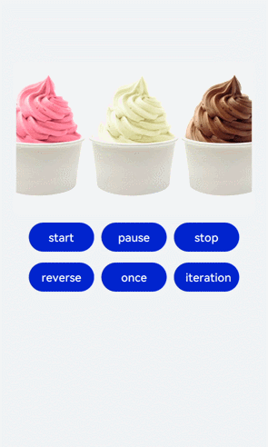

# ImageAnimator<a name="ZH-CN_TOPIC_0000001192595166"></a>

> **说明：** 
>该组件从API Version 7开始支持。后续版本如有新增内容，则采用上角标单独标记该内容的起始版本。

提供帧动画组件来实现逐帧播放图片的能力，可以配置需要播放的图片列表，每张图片可以配置时长。

## 权限列表<a name="section781125411508"></a>

无

## 子组件<a name="section1848323814535"></a>

无

## 接口<a name="section195458521537"></a>

ImageAnimator\(\)

## 属性<a name="section792713805418"></a>

<table><thead align="left"><tr><th class="cellrowborder" valign="top" width="16.939999999999998%" id="mcps1.1.6.1.1"><p>参数名称</p>
</th>
<th class="cellrowborder" valign="top" width="23.06%" id="mcps1.1.6.1.2"><p>参数类型</p>
</th>
<th class="cellrowborder" valign="top" width="13.87%" id="mcps1.1.6.1.3"><p>默认值</p>
</th>
<th class="cellrowborder" valign="top" width="8.34%" id="mcps1.1.6.1.4"><p>必填</p>
</th>
<th class="cellrowborder" valign="top" width="37.79%" id="mcps1.1.6.1.5"><p>参数描述</p>
</th>
</tr>
</thead>
<tbody><tr><td class="cellrowborder" valign="top" width="16.939999999999998%" headers="mcps1.1.6.1.1 "><p>images</p>
</td>
<td class="cellrowborder" valign="top" width="23.06%" headers="mcps1.1.6.1.2 "><p>Array&lt;{</p>
<p>src:string,</p>
<p>width?:Length,</p>
<p>height?:Length,</p>
<p>top?:Length,</p>
<p>left?:Length,</p>
<p>duration?:number</p>
<p>}&gt;</p>
</td>
<td class="cellrowborder" valign="top" width="13.87%" headers="mcps1.1.6.1.3 "><p>[]</p>
</td>
<td class="cellrowborder" valign="top" width="8.34%" headers="mcps1.1.6.1.4 "><p>是</p>
</td>
<td class="cellrowborder" valign="top" width="37.79%" headers="mcps1.1.6.1.5 "><p>设置图片帧信息集合。每一帧的帧信息包含图片路径、图片大小、图片位置和图片播放时长信息。详细说明如下：</p>
<p>src：图片路径，图片格式为svg，png和jpg。</p>
<p>width：图片宽度。</p>
<p>height：图片高度。</p>
<p>top：图片相对于组件左上角的纵向坐标。</p>
<p>left：图片相对于组件左上角的横向坐标。</p>
<p>duration：每一帧图片的播放时长，单位毫秒。</p>
</td>
</tr>
<tr><td class="cellrowborder" valign="top" width="16.939999999999998%" headers="mcps1.1.6.1.1 "><p>state</p>
</td>
<td class="cellrowborder" valign="top" width="23.06%" headers="mcps1.1.6.1.2 "><p>AnimationStatus</p>
</td>
<td class="cellrowborder" valign="top" width="13.87%" headers="mcps1.1.6.1.3 "><p>Initial</p>
</td>
<td class="cellrowborder" valign="top" width="8.34%" headers="mcps1.1.6.1.4 "><p>否</p>
</td>
<td class="cellrowborder" valign="top" width="37.79%" headers="mcps1.1.6.1.5 "><p>默认为初始状态，用于控制播放状态。</p>
</td>
</tr>
<tr><td class="cellrowborder" valign="top" width="16.939999999999998%" headers="mcps1.1.6.1.1 "><p>duration</p>
</td>
<td class="cellrowborder" valign="top" width="23.06%" headers="mcps1.1.6.1.2 "><p>number</p>
</td>
<td class="cellrowborder" valign="top" width="13.87%" headers="mcps1.1.6.1.3 "><p>1000</p>
</td>
<td class="cellrowborder" valign="top" width="8.34%" headers="mcps1.1.6.1.4 "><p>否</p>
</td>
<td class="cellrowborder" valign="top" width="37.79%" headers="mcps1.1.6.1.5 "><p>单位为毫秒，默认时长为1000ms；duration为0时，不播放图片；值的改变只会在下一次循环开始时生效；当images中设置了单独的duration后，该属性设置无效。</p>
</td>
</tr>
<tr><td class="cellrowborder" valign="top" width="16.939999999999998%" headers="mcps1.1.6.1.1 "><p>reverse</p>
</td>
<td class="cellrowborder" valign="top" width="23.06%" headers="mcps1.1.6.1.2 "><p>boolean</p>
</td>
<td class="cellrowborder" valign="top" width="13.87%" headers="mcps1.1.6.1.3 "><p>false</p>
</td>
<td class="cellrowborder" valign="top" width="8.34%" headers="mcps1.1.6.1.4 "><p>否</p>
</td>
<td class="cellrowborder" valign="top" width="37.79%" headers="mcps1.1.6.1.5 "><p>设置播放顺序。false表示从第1张图片播放到最后1张图片； true表示从最后1张图片播放到第1张图片。</p>
</td>
</tr>
<tr><td class="cellrowborder" valign="top" width="16.939999999999998%" headers="mcps1.1.6.1.1 "><p>fixedSize</p>
</td>
<td class="cellrowborder" valign="top" width="23.06%" headers="mcps1.1.6.1.2 "><p>boolean</p>
</td>
<td class="cellrowborder" valign="top" width="13.87%" headers="mcps1.1.6.1.3 "><p>true</p>
</td>
<td class="cellrowborder" valign="top" width="8.34%" headers="mcps1.1.6.1.4 "><p>否</p>
</td>
<td class="cellrowborder" valign="top" width="37.79%" headers="mcps1.1.6.1.5 "><p>设置图片大小是否固定为组件大小。 true表示图片大小与组件大小一致，此时设置图片的width 、height 、top 和left属性是无效的。false表示每一张图片的 width 、height 、top和left属性都要单独设置。</p>
</td>
</tr>
<tr><td class="cellrowborder" valign="top" width="16.939999999999998%" headers="mcps1.1.6.1.1 "><p>preDecode</p>
</td>
<td class="cellrowborder" valign="top" width="23.06%" headers="mcps1.1.6.1.2 "><p>number</p>
</td>
<td class="cellrowborder" valign="top" width="13.87%" headers="mcps1.1.6.1.3 "><p>0</p>
</td>
<td class="cellrowborder" valign="top" width="8.34%" headers="mcps1.1.6.1.4 "><p>否</p>
</td>
<td class="cellrowborder" valign="top" width="37.79%" headers="mcps1.1.6.1.5 "><p>是否启用预解码，默认值为0，即不启用预解码，如该值设为2，则播放当前页时会提前加载后面两张图片至缓存以提升性能。</p>
</td>
</tr>
<tr><td class="cellrowborder" valign="top" width="16.939999999999998%" headers="mcps1.1.6.1.1 "><p>fillMode</p>
</td>
<td class="cellrowborder" valign="top" width="23.06%" headers="mcps1.1.6.1.2 "><p>FillMode</p>
</td>
<td class="cellrowborder" valign="top" width="13.87%" headers="mcps1.1.6.1.3 "><p>Forwards</p>
</td>
<td class="cellrowborder" valign="top" width="8.34%" headers="mcps1.1.6.1.4 "><p>否</p>
</td>
<td class="cellrowborder" valign="top" width="37.79%" headers="mcps1.1.6.1.5 "><p>设置动画开始前和结束后的状态，可选值参见FillMode说明。</p>
</td>
</tr>
<tr><td class="cellrowborder" valign="top" width="16.939999999999998%" headers="mcps1.1.6.1.1 "><p>iterations</p>
</td>
<td class="cellrowborder" valign="top" width="23.06%" headers="mcps1.1.6.1.2 "><p>number</p>
</td>
<td class="cellrowborder" valign="top" width="13.87%" headers="mcps1.1.6.1.3 "><p>1</p>
</td>
<td class="cellrowborder" valign="top" width="8.34%" headers="mcps1.1.6.1.4 "><p>否</p>
</td>
<td class="cellrowborder" valign="top" width="37.79%" headers="mcps1.1.6.1.5 "><p>默认播放一次，设置为-1时表示无限次播放。</p>
</td>
</tr>
</tbody>
</table>

-   AnimationStatus枚举说明

    <table><thead align="left"><tr><th class="cellrowborder" valign="top" width="25.2%" id="mcps1.1.3.1.1"><p><strong>名称</strong></p>
    </th>
    <th class="cellrowborder" valign="top" width="74.8%" id="mcps1.1.3.1.2"><p><strong>描述</strong></p>
    </th>
    </tr>
    </thead>
    <tbody><tr><td class="cellrowborder" valign="top" width="25.2%" headers="mcps1.1.3.1.1 "><p>Initial</p>
    </td>
    <td class="cellrowborder" valign="top" width="74.8%" headers="mcps1.1.3.1.2 "><p>动画初始状态<strong>。</strong></p>
    </td>
    </tr>
    <tr><td class="cellrowborder" valign="top" width="25.2%" headers="mcps1.1.3.1.1 "><p>Running</p>
    </td>
    <td class="cellrowborder" valign="top" width="74.8%" headers="mcps1.1.3.1.2 "><p>动画处于播放状态。</p>
    </td>
    </tr>
    <tr><td class="cellrowborder" valign="top" width="25.2%" headers="mcps1.1.3.1.1 "><p>Paused</p>
    </td>
    <td class="cellrowborder" valign="top" width="74.8%" headers="mcps1.1.3.1.2 "><p>动画处于暂停状态。</p>
    </td>
    </tr>
    <tr><td class="cellrowborder" valign="top" width="25.2%" headers="mcps1.1.3.1.1 "><p>Stopped</p>
    </td>
    <td class="cellrowborder" valign="top" width="74.8%" headers="mcps1.1.3.1.2 "><p>动画处于停止状态。</p>
    </td>
    </tr>
    </tbody>
    </table>


-   FillMode枚举值说明

    <table><thead align="left"><tr><th class="cellrowborder" valign="top" width="25.2%" id="mcps1.1.3.1.1"><p>名称</p>
    </th>
    <th class="cellrowborder" valign="top" width="74.8%" id="mcps1.1.3.1.2"><p>描述</p>
    </th>
    </tr>
    </thead>
    <tbody><tr><td class="cellrowborder" valign="top" width="25.2%" headers="mcps1.1.3.1.1 "><p>None</p>
    </td>
    <td class="cellrowborder" valign="top" width="74.8%" headers="mcps1.1.3.1.2 "><p>播放完成后恢复初始状态。</p>
    </td>
    </tr>
    <tr><td class="cellrowborder" valign="top" width="25.2%" headers="mcps1.1.3.1.1 "><p>Forwards</p>
    </td>
    <td class="cellrowborder" valign="top" width="74.8%" headers="mcps1.1.3.1.2 "><p>播放完成后保持动画结束时的状态。</p>
    </td>
    </tr>
    <tr><td class="cellrowborder" valign="top" width="25.2%" headers="mcps1.1.3.1.1 "><p>Backwards</p>
    </td>
    <td class="cellrowborder" valign="top" width="74.8%" headers="mcps1.1.3.1.2 "><p>在animation-delay所指定的一段时间内，在动画显示之前，应用开始属性值。</p>
    </td>
    </tr>
    <tr><td class="cellrowborder" valign="top" width="25.2%" headers="mcps1.1.3.1.1 "><p>Both</p>
    </td>
    <td class="cellrowborder" valign="top" width="74.8%" headers="mcps1.1.3.1.2 "><p>向前和向后填充模式都被应用。</p>
    </td>
    </tr>
    </tbody>
    </table>


## 事件<a name="section8249161475516"></a>

<table><thead align="left"><tr><th class="cellrowborder" colspan="2" valign="top" id="mcps1.1.4.1.1"><p>名称</p>
</th>
<th class="cellrowborder" valign="top" id="mcps1.1.4.1.2"><p>功能描述</p>
</th>
</tr>
</thead>
<tbody><tr><td class="cellrowborder" colspan="2" valign="top" headers="mcps1.1.4.1.1 "><p>onStart() =&gt; void</p>
</td>
<td class="cellrowborder" valign="top" headers="mcps1.1.4.1.2 "><p>状态回调，动画开始播放时触发。</p>
</td>
</tr>
<tr><td class="cellrowborder" colspan="2" valign="top" headers="mcps1.1.4.1.1 "><p>onPause() =&gt; void</p>
</td>
<td class="cellrowborder" valign="top" headers="mcps1.1.4.1.2 "><p>状态回调，动画暂停播放时触发。</p>
</td>
</tr>
<tr><td class="cellrowborder" colspan="2" valign="top" headers="mcps1.1.4.1.1 "><p>onRepeat() =&gt; void</p>
</td>
<td class="cellrowborder" valign="top" headers="mcps1.1.4.1.2 "><p>状态回调，动画重新播放时触发。</p>
</td>
</tr>
<tr><td class="cellrowborder" colspan="2" valign="top" headers="mcps1.1.4.1.1 "><p>onCancel() =&gt; void</p>
</td>
<td class="cellrowborder" valign="top" headers="mcps1.1.4.1.2 "><p>状态回调，动画取消播放时触发。</p>
</td>
</tr>
<tr><td class="cellrowborder" colspan="2" valign="top" headers="mcps1.1.4.1.1 "><p>onFinish() =&gt; void</p>
</td>
<td class="cellrowborder" valign="top" headers="mcps1.1.4.1.2 "><p>状态回调，动画播放完成时触发。</p>
</td>
</tr>
</tbody>
</table>

## 示例<a name="section4459736105512"></a>

```
@Entry
@Component
struct ImageAnimatorExample {
  @State state: AnimationStatus = AnimationStatus.Initial
  @State reverse: boolean = false
  @State iterations: number = 1

  build() {
    Column({ space:5 }) {
      ImageAnimator()
        .images([
          {
            src: '/comment/bg1.jpg',
            duration: 500,
            width: 325,
            height: 200,
            top: 0,
            left: 0
          },
          {
            src: '/comment/bg2.jpg',
            duration: 500,
            width: 325,
            height: 200,
            top: 0,
            left: 0
          },
          {
            src: '/comment/bg3.jpg',
            duration: 500,
            width: 325,
            height: 200,
            top: 0,
            left: 0
          },
          {
            src: '/comment/bg4.jpg',
            duration: 500,
            width: 325,
            height: 200,
            top: 0,
            left: 0
          }
        ])
        .state(this.state).reverse(this.reverse).fixedSize(false).preDecode(2)
        .fillMode(FillMode.None).iterations(this.iterations).width(325).height(210)
        .margin({top:100})
        .onStart(() => { // 当帧动画开始播放后触发
          console.info('Start')
        })
        .onPause(() => {
          console.info('Pause')
        })
        .onRepeat(() => {
          console.info('Repeat')
        })
        .onCancel(() => {
          console.info('Cancel')
        })
        .onFinish(() => { // 当帧动画播放完成后触发
          console.info('Finish')
        })
      Row() {
        Button('start').width(100).padding(5).onClick(() => {
          this.state = AnimationStatus.Running
        })
        Button('pause').width(100).padding(5).onClick(() => {
          this.state = AnimationStatus.Paused
        })
        Button('stop').width(100).padding(5).onClick(() => {
          this.state = AnimationStatus.Stopped
        })
      }
      Row() {
        Button('reverse').width(100).padding(5).onClick(() => {
          this.reverse = !this.reverse
        })
        Button('once').width(100).padding(5).onClick(() => {
          this.iterations = 1
        })
        Button('iteration').width(100).padding(5).onClick(() => {
          this.iterations = -1
        })
      }
    }.width('100%').height('100%').backgroundColor(0xF1F3F5)
  }
}
```



