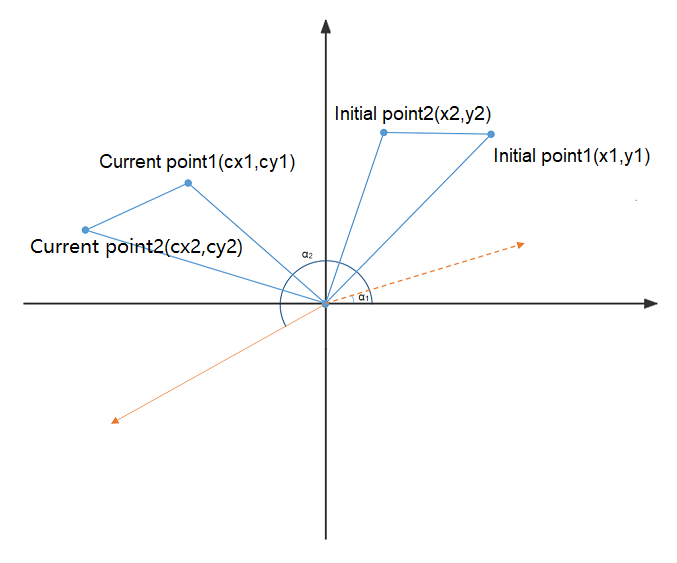

# SwipeGesture

>  **说明：**
> 从API Version 8开始支持。后续版本如有新增内容，则采用上角标单独标记该内容的起始版本。


## 权限列表

无


## 接口

SwipeGesture(value?: { fingers?: number; direction?: SwipeDirection; speed?: number })

- 参数
  | 参数名称 | 参数类型 | 必填 | 默认值 | 参数描述 |
  | -------- | -------- | -------- | -------- | -------- |
  | fingers | number | 否 | 1 | 触发滑动的最少手指数，默认为1，最小为1指，最大为10指。 |
  | direction | SwipeDirection | 否 | SwipeDirection.All | 滑动方向。 |
  | speed | number | 否 | 100 | 识别滑动的最小速度（100VP/秒）。 |

- SwipeDirection枚举说明
  | 名称 | 描述 | 
  | -------- | -------- |
  | All | 所有方向。 | 
  | Horizontal | 水平方向。 | 
  | Vertical | 竖直方向。 | 


## 事件

| 名称 | 功能描述 | 
| -------- | -------- |
| onAction(callback:(event?:&nbsp;GestureEvent)&nbsp;=&gt;&nbsp;void) | 滑动手势识别成功回调。 | 


- GestureEvent对象中与Swipe手势相关的属性
  | 参数名 | 类型 | 说明 | 
  | -------- | -------- | -------- |
  | angle | number | 滑动手势的角度，即两根手指间的线段与水平方向的夹角变化的度数。<br/>>&nbsp;&nbsp;**说明：**<br/>>&nbsp;角度计算方式：滑动手势被识别到后，连接两根手指之间的线被识别为起始线条，随着手指的滑动，手指之间的线条会发生旋转，根据起始线条两端点和当前线条两端点的坐标，使用反正切函数分别计算其相对于水平方向的夹角，最后arctan2(cy2-cy1,cx2-cx1)-arctan2(y2-y1,x2-x1)为旋转的角度。以起始线条为坐标系，顺时针旋转为0到180度，逆时针旋转为-180到0度。 | 
  | speed | number | 滑动手势的速度，是所有手指滑动的平均速度，单位为VP/秒。 | 


## 示例

```
@Entry
@Component
struct SwipeGestureExample {
  @State rotateAngle : number = 0
  @State speed : number = 1

  build() {
    Column() {
      Text("SwipGesture speed ： " + this.speed)
      Text("SwipGesture angle ： " + this.rotateAngle)
    }
    .position({x: 80, y: 200})
    .border({width:2})
    .width(260).height(260)
    .rotate({x: 0, y: 0, z: 1, angle: this.rotateAngle})
    .gesture(
      SwipeGesture({fingers: 1, direction:SwipeDirection.Vertical})
        .onAction((event: GestureEvent) => {
          this.speed = event.speed
          this.rotateAngle = event.angle
      })
    )
  }
}
```


