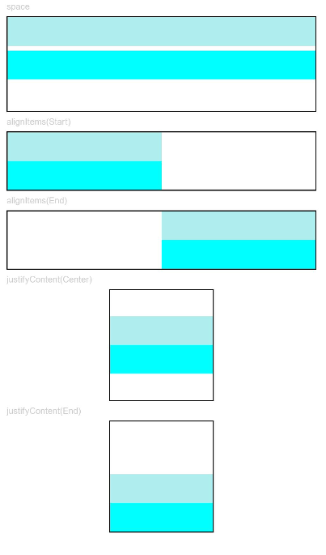

# Column<a name="ZH-CN_TOPIC_0000001192915096"></a>

> **说明：**
>该组件从API Version 7开始支持。后续版本如有新增内容，则采用上角标单独标记该内容的起始版本。

沿垂直方向布局的容器。

## 权限列表<a name="section11841179295"></a>

无

## 子组件<a name="section87974157296"></a>

可以包含子组件。

## 接口<a name="section14196162892911"></a>

Column\(value:\{space?: Length\}\)

-   参数

    <table><thead align="left"><tr><th class="cellrowborder" valign="top" width="16.11%" id="mcps1.1.6.1.1"><p>参数名</p>
    </th>
    <th class="cellrowborder" valign="top" width="22.99%" id="mcps1.1.6.1.2"><p>参数类型</p>
    </th>
    <th class="cellrowborder" valign="top" width="10.65%" id="mcps1.1.6.1.3"><p>必填</p>
    </th>
    <th class="cellrowborder" valign="top" width="10.24%" id="mcps1.1.6.1.4"><p>默认值</p>
    </th>
    <th class="cellrowborder" valign="top" width="40.01%" id="mcps1.1.6.1.5"><p>参数描述</p>
    </th>
    </tr>
    </thead>
    <tbody><tr><td class="cellrowborder" valign="top" width="16.11%" headers="mcps1.1.6.1.1 "><p>space</p>
    </td>
    <td class="cellrowborder" valign="top" width="22.99%" headers="mcps1.1.6.1.2 "><p>Length</p>
    </td>
    <td class="cellrowborder" valign="top" width="10.65%" headers="mcps1.1.6.1.3 "><p>否</p>
    </td>
    <td class="cellrowborder" valign="top" width="10.24%" headers="mcps1.1.6.1.4 "><p>0</p>
    </td>
    <td class="cellrowborder" valign="top" width="40.01%" headers="mcps1.1.6.1.5 "><p>纵向布局元素间距。</p>
    </td>
    </tr>
    </tbody>
    </table>


## 属性<a name="section358284262918"></a>

<table><thead align="left"><tr><th class="cellrowborder" valign="top" width="13%" id="mcps1.1.5.1.1"><p>名称</p>
</th>
<th class="cellrowborder" valign="top" width="19%" id="mcps1.1.5.1.2"><p>参数类型</p>
</th>
<th class="cellrowborder" valign="top" width="9%" id="mcps1.1.5.1.3"><p>默认值</p>
</th>
<th class="cellrowborder" valign="top" width="59%" id="mcps1.1.5.1.4"><p>描述</p>
</th>
</tr>
</thead>
<tbody><tr><td class="cellrowborder" valign="top" width="13%" headers="mcps1.1.5.1.1 "><p>alignItems</p>
</td>
<td class="cellrowborder" valign="top" width="19%" headers="mcps1.1.5.1.2 "><p><a href="#li8105435144314">HorizontalAlign</a></p>
</td>
<td class="cellrowborder" valign="top" width="9%" headers="mcps1.1.5.1.3 "><p>Center</p>
</td>
<td class="cellrowborder" valign="top" width="59%" headers="mcps1.1.5.1.4 "><p>设置子组件在水平方向上的对齐格式。</p>
</td>
</tr>
</tbody>
<tbody><tr><td class="cellrowborder" valign="top" width="13%" headers="mcps1.1.5.1.1 "><p>justifyContent<sup>8+</sup></p>
</td>
<td class="cellrowborder" valign="top" width="19%" headers="mcps1.1.5.1.2 "><p><a href="ts-container-flex.md#li1540916112452">FlexAlign</a></p>
</td>
<td class="cellrowborder" valign="top" width="9%" headers="mcps1.1.5.1.3 "><p>Start</p>
</td>
<td class="cellrowborder" valign="top" width="59%" headers="mcps1.1.5.1.4 "><p>设置子组件在垂直方向上的对齐格式。</p>
</td>
</tr>
</tbody>
</table>

-   <a name="li8105435144314"></a>HorizontalAlign枚举说明

    <table><thead align="left"><tr><th class="cellrowborder" valign="top" width="25.2%" id="mcps1.1.3.1.1"><p>名称</p>
    </th>
    <th class="cellrowborder" valign="top" width="74.8%" id="mcps1.1.3.1.2"><p>描述</p>
    </th>
    </tr>
    </thead>
    <tbody><tr><td class="cellrowborder" valign="top" width="25.2%" headers="mcps1.1.3.1.1 "><p>Start</p>
    </td>
    <td class="cellrowborder" valign="top" width="74.8%" headers="mcps1.1.3.1.2 "><p>按照语言方向起始端对齐。</p>
    </td>
    </tr>
    <tr><td class="cellrowborder" valign="top" width="25.2%" headers="mcps1.1.3.1.1 "><p>Center</p>
    </td>
    <td class="cellrowborder" valign="top" width="74.8%" headers="mcps1.1.3.1.2 "><p>居中对齐，默认对齐方式。</p>
    </td>
    </tr>
    <tr><td class="cellrowborder" valign="top" width="25.2%" headers="mcps1.1.3.1.1 "><p>End</p>
    </td>
    <td class="cellrowborder" valign="top" width="74.8%" headers="mcps1.1.3.1.2 "><p>按照语言方向末端对齐。</p>
    </td>
    </tr>
    </tbody>
    </table>


## 示例<a name="section14441203783118"></a>

```
@Entry
@Component
struct ColumnExample {
  build() {
    Column() {
        Text('space').fontSize(9).fontColor(0xCCCCCC).width('90%')
        Column({ space: 5 }) {
          Column().width('100%').height(30).backgroundColor(0xAFEEEE)
          Column().width('100%').height(30).backgroundColor(0x00FFFF)
        }.width('90%').height(100).border({ width: 1 })

        Text('alignItems(Start)').fontSize(9).fontColor(0xCCCCCC).width('90%')
        Column() {
          Column().width('50%').height(30).backgroundColor(0xAFEEEE)
          Column().width('50%').height(30).backgroundColor(0x00FFFF)
        }.alignItems(HorizontalAlign.Start).width('90%').border({ width: 1 })

        Text('alignItems(End)').fontSize(9).fontColor(0xCCCCCC).width('90%')
        Column() {
          Column().width('50%').height(30).backgroundColor(0xAFEEEE)
          Column().width('50%').height(30).backgroundColor(0x00FFFF)
        }.alignItems(HorizontalAlign.End).width('90%').border({ width: 1 })

        Text('justifyContent(Center)').fontSize(9).fontColor(0xCCCCCC).width('90%')
        Column() {
          Column().width('30%').height(30).backgroundColor(0xAFEEEE)
          Column().width('30%').height(30).backgroundColor(0x00FFFF)
        }.height('15%').border({ width: 1 }).justifyContent(FlexAlign.Center)

        Text('justifyContent(End)').fontSize(9).fontColor(0xCCCCCC).width('90%')
        Column() {
          Column().width('30%').height(30).backgroundColor(0xAFEEEE)
          Column().width('30%').height(30).backgroundColor(0x00FFFF)
        }.height('15%').border({ width: 1 }).justifyContent(FlexAlign.End)
    }.width('100%').padding({ top: 5 })
  }
}
```



