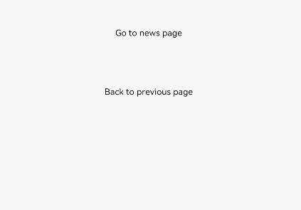

# Navigator<a name="ZH-CN_TOPIC_0000001192915106"></a>

> **说明：** 
>该组件从API Version 7开始支持。后续版本如有新增内容，则采用上角标单独标记该内容的起始版本。

路由容器组件，提供路由跳转能力。

## 权限列表<a name="section1933872716571"></a>

无

## 子组件<a name="section1146935319579"></a>

可以包含子组件。

## 接口<a name="section5861121019581"></a>

Navigator\(value?: \{target: string, type?: NavigationType\}\)

创建路由组件。

-   参数

    <table><thead align="left"><tr><th class="cellrowborder" valign="top" width="16.11%" id="mcps1.1.6.1.1"><p>参数名</p>
    </th>
    <th class="cellrowborder" valign="top" width="18%" id="mcps1.1.6.1.2"><p>参数类型</p>
    </th>
    <th class="cellrowborder" valign="top" width="8.25%" id="mcps1.1.6.1.3"><p>必填</p>
    </th>
    <th class="cellrowborder" valign="top" width="21.42%" id="mcps1.1.6.1.4"><p>默认值</p>
    </th>
    <th class="cellrowborder" valign="top" width="36.22%" id="mcps1.1.6.1.5"><p>参数描述</p>
    </th>
    </tr>
    </thead>
    <tbody><tr><td class="cellrowborder" valign="top" width="16.11%" headers="mcps1.1.6.1.1 "><p>target</p>
    </td>
    <td class="cellrowborder" valign="top" width="18%" headers="mcps1.1.6.1.2 "><p>string</p>
    </td>
    <td class="cellrowborder" valign="top" width="8.25%" headers="mcps1.1.6.1.3 "><p>是</p>
    </td>
    <td class="cellrowborder" valign="top" width="21.42%" headers="mcps1.1.6.1.4 "><p>-</p>
    </td>
    <td class="cellrowborder" valign="top" width="36.22%" headers="mcps1.1.6.1.5 "><p>指定跳转目标页面的路径。</p>
    </td>
    </tr>
    <tr><td class="cellrowborder" valign="top" width="16.11%" headers="mcps1.1.6.1.1 "><p>type</p>
    </td>
    <td class="cellrowborder" valign="top" width="18%" headers="mcps1.1.6.1.2 "><p><a href="#table3452114216394">NavigationType</a></p>
    </td>
    <td class="cellrowborder" valign="top" width="8.25%" headers="mcps1.1.6.1.3 "><p>否</p>
    </td>
    <td class="cellrowborder" valign="top" width="21.42%" headers="mcps1.1.6.1.4 "><p>Push</p>
    </td>
    <td class="cellrowborder" valign="top" width="36.22%" headers="mcps1.1.6.1.5 "><p>指定路由方式。</p>
    </td>
    </tr>
    </tbody>
    </table>

-   NavigationType枚举说明

    <a name="table3452114216394"></a>
    <table><thead align="left"><tr><th class="cellrowborder" valign="top" width="25.2%" id="mcps1.1.3.1.1"><p>名称</p>
    </th>
    <th class="cellrowborder" valign="top" width="74.8%" id="mcps1.1.3.1.2"><p>描述</p>
    </th>
    </tr>
    </thead>
    <tbody><tr><td class="cellrowborder" valign="top" width="25.2%" headers="mcps1.1.3.1.1 "><p>Push</p>
    </td>
    <td class="cellrowborder" valign="top" width="74.8%" headers="mcps1.1.3.1.2 "><p>跳转到应用内的指定页面。</p>
    </td>
    </tr>
    <tr><td class="cellrowborder" valign="top" width="25.2%" headers="mcps1.1.3.1.1 "><p>Replace</p>
    </td>
    <td class="cellrowborder" valign="top" width="74.8%" headers="mcps1.1.3.1.2 "><p>用应用内的某个页面替换当前页面，并销毁被替换的页面。</p>
    </td>
    </tr>
    <tr><td class="cellrowborder" valign="top" width="25.2%" headers="mcps1.1.3.1.1 "><p>Back</p>
    </td>
    <td class="cellrowborder" valign="top" width="74.8%" headers="mcps1.1.3.1.2 "><p>返回上一页面或指定的页面。</p>
    </td>
    </tr>
    </tbody>
    </table>


## 属性<a name="section187781816826"></a>

<table><thead align="left"><tr><th class="cellrowborder" valign="top" width="11.871187118711871%" id="mcps1.1.5.1.1"><p>名称</p>
</th>
<th class="cellrowborder" valign="top" width="16.291629162916294%" id="mcps1.1.5.1.2"><p>参数</p>
</th>
<th class="cellrowborder" valign="top" width="12.73127312731273%" id="mcps1.1.5.1.3"><p>默认值</p>
</th>
<th class="cellrowborder" valign="top" width="59.10591059105911%" id="mcps1.1.5.1.4"><p>描述</p>
</th>
</tr>
</thead>
<tbody><tr><td class="cellrowborder" valign="top" width="11.871187118711871%" headers="mcps1.1.5.1.1 "><p>active</p>
</td>
<td class="cellrowborder" valign="top" width="16.291629162916294%" headers="mcps1.1.5.1.2 "><p>boolean</p>
</td>
<td class="cellrowborder" valign="top" width="12.73127312731273%" headers="mcps1.1.5.1.3 "><p>-</p>
</td>
<td class="cellrowborder" valign="top" width="59.10591059105911%" headers="mcps1.1.5.1.4 "><p>当前路由组件是否处于激活状态，处于激活状态时，会生效相应的路由操作。</p>
</td>
</tr>
<tr><td class="cellrowborder" valign="top" width="11.871187118711871%" headers="mcps1.1.5.1.1 "><p>params</p>
</td>
<td class="cellrowborder" valign="top" width="16.291629162916294%" headers="mcps1.1.5.1.2 "><p>Object</p>
</td>
<td class="cellrowborder" valign="top" width="12.73127312731273%" headers="mcps1.1.5.1.3 "><p>undefined</p>
</td>
<td class="cellrowborder" valign="top" width="59.10591059105911%" headers="mcps1.1.5.1.4 "><p>跳转时要同时传递到目标页面的数据，可在目标页面使用router.getParams()获得。</p>
</td>
</tr>
</tbody>
</table>

## 示例<a name="section186436131831"></a>

```
// Navigator Page
@Entry
@Component
struct NavigatorExample {
  @State active: boolean = false
  @State Text: string = 'news'

  build() {
    Flex({ direction: FlexDirection.Column, alignItems: ItemAlign.Start, justifyContent: FlexAlign.SpaceBetween }) {
      Navigator({ target: 'pages/container/navigator/Detail', type: NavigationType.Push }) {
        Text('Go to ' + this.Text + ' page').width('100%').textAlign(TextAlign.Center)
      }.params({ text: this.Text })

      Navigator() {
        Text('Back to previous page').width('100%').textAlign(TextAlign.Center)
      }.active(this.active)
      .onClick(() => {
        this.active = true
      })
    }.height(150).width(350).padding(35)
  }
}
```

```
// Detail Page
import router from '@system.router'

@Entry
@Component
struct DetailExample {
  @State text: string = router.getParams().text

  build() {
    Flex({ direction: FlexDirection.Column, alignItems: ItemAlign.Start, justifyContent: FlexAlign.SpaceBetween }) {
      Navigator({ target: 'pages/container/navigator/Back', type: NavigationType.Push }) {
        Text('Go to back page').width('100%').height(20)
      }

      Text('This is ' + this.text + ' page').width('100%').textAlign(TextAlign.Center)
    }
    .width('100%').height(200).padding({ left: 35, right: 35, top: 35 })
  }
}

```

```
// Back Page
@Entry
@Component
struct BackExample {
  build() {
    Column() {
      Navigator({ target: 'pages/container/navigator/Navigator', type: NavigationType.Back }) {
        Text('Return to Navigator Page').width('100%').textAlign(TextAlign.Center)
      }
    }.width('100%').height(200).padding({ left: 35, right: 35, top: 35 })
  }
}
```



