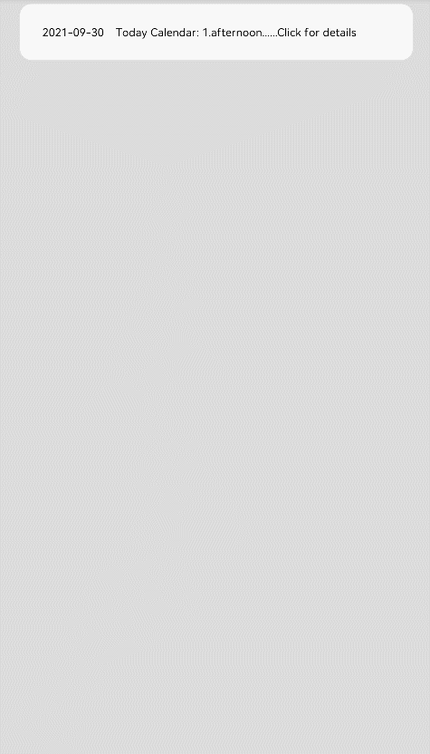

# Panel<a name="ZH-CN_TOPIC_0000001192755104"></a>

> **说明：** 
>该组件从API Version 7开始支持。后续版本如有新增内容，则采用上角标单独标记该内容的起始版本。

可滑动面板。提供一种轻量的内容展示的窗口，可方便的在不同尺寸中切换，属于弹出式组件。

## 权限列表<a name="section36946188511"></a>

无

## 子组件<a name="section897517591357"></a>

可以包含子组件。

## 接口<a name="section14655428254"></a>

Panel\(value:\{show：boolean\}\)

-   参数

    <table><thead align="left"><tr><th class="cellrowborder" valign="top" width="16.11%" id="mcps1.1.6.1.1"><p>参数名</p>
    </th>
    <th class="cellrowborder" valign="top" width="16.580000000000002%" id="mcps1.1.6.1.2"><p>参数类型</p>
    </th>
    <th class="cellrowborder" valign="top" width="9.67%" id="mcps1.1.6.1.3"><p>必填</p>
    </th>
    <th class="cellrowborder" valign="top" width="21.42%" id="mcps1.1.6.1.4"><p>默认值</p>
    </th>
    <th class="cellrowborder" valign="top" width="36.22%" id="mcps1.1.6.1.5"><p>参数描述</p>
    </th>
    </tr>
    </thead>
    <tbody><tr><td class="cellrowborder" valign="top" width="16.11%" headers="mcps1.1.6.1.1 "><p>show</p>
    </td>
    <td class="cellrowborder" valign="top" width="16.580000000000002%" headers="mcps1.1.6.1.2 "><p>boolean</p>
    </td>
    <td class="cellrowborder" valign="top" width="9.67%" headers="mcps1.1.6.1.3 "><p>是</p>
    </td>
    <td class="cellrowborder" valign="top" width="21.42%" headers="mcps1.1.6.1.4 "><p>-</p>
    </td>
    <td class="cellrowborder" valign="top" width="36.22%" headers="mcps1.1.6.1.5 "><p>控制Panel显示或隐藏。</p>
    </td>
    </tr>
    </tbody>
    </table>


## 属性<a name="section1398913481251"></a>

<table><thead align="left"><tr><th class="cellrowborder" valign="top" width="18.81188118811881%" id="mcps1.1.5.1.1"><p>名称</p>
</th>
<th class="cellrowborder" valign="top" width="18.81188118811881%" id="mcps1.1.5.1.2"><p>参数类型</p>
</th>
<th class="cellrowborder" valign="top" width="14.85148514851485%" id="mcps1.1.5.1.3"><p>默认值</p>
</th>
<th class="cellrowborder" valign="top" width="47.52475247524753%" id="mcps1.1.5.1.4"><p>描述</p>
</th>
</tr>
</thead>
<tbody><tr><td class="cellrowborder" valign="top" width="18.81188118811881%" headers="mcps1.1.5.1.1 "><p>type</p>
</td>
<td class="cellrowborder" valign="top" width="18.81188118811881%" headers="mcps1.1.5.1.2 "><p><a href="#li188691730162810">PanelType</a></p>
</td>
<td class="cellrowborder" valign="top" width="14.85148514851485%" headers="mcps1.1.5.1.3 "><p>Foldable</p>
</td>
<td class="cellrowborder" valign="top" width="47.52475247524753%" headers="mcps1.1.5.1.4 "><p>设置可滑动面板的类型。</p>
</td>
</tr>
<tr><td class="cellrowborder" valign="top" width="18.81188118811881%" headers="mcps1.1.5.1.1 "><p>mode</p>
</td>
<td class="cellrowborder" valign="top" width="18.81188118811881%" headers="mcps1.1.5.1.2 "><p><a href="#li1476011321286">PanelMode</a></p>
</td>
<td class="cellrowborder" valign="top" width="14.85148514851485%" headers="mcps1.1.5.1.3 "><p>-</p>
</td>
<td class="cellrowborder" valign="top" width="47.52475247524753%" headers="mcps1.1.5.1.4 "><p>设置可滑动面板的初始状态。</p>
</td>
</tr>
<tr><td class="cellrowborder" valign="top" width="18.81188118811881%" headers="mcps1.1.5.1.1 "><p>dragBar</p>
</td>
<td class="cellrowborder" valign="top" width="18.81188118811881%" headers="mcps1.1.5.1.2 "><p>boolean</p>
</td>
<td class="cellrowborder" valign="top" width="14.85148514851485%" headers="mcps1.1.5.1.3 "><p>true</p>
</td>
<td class="cellrowborder" valign="top" width="47.52475247524753%" headers="mcps1.1.5.1.4 "><p>设置是否存在dragbar，true表示存在，false表示不存在。</p>
</td>
</tr>
<tr><td class="cellrowborder" valign="top" width="18.81188118811881%" headers="mcps1.1.5.1.1 "><p>fullHeight</p>
</td>
<td class="cellrowborder" valign="top" width="18.81188118811881%" headers="mcps1.1.5.1.2 "><p>Length</p>
</td>
<td class="cellrowborder" valign="top" width="14.85148514851485%" headers="mcps1.1.5.1.3 "><p>-</p>
</td>
<td class="cellrowborder" valign="top" width="47.52475247524753%" headers="mcps1.1.5.1.4 "><p>指定PanelMode.Full状态下的高度。</p>
</td>
</tr>
<tr><td class="cellrowborder" valign="top" width="18.81188118811881%" headers="mcps1.1.5.1.1 "><p>halfHeight</p>
</td>
<td class="cellrowborder" valign="top" width="18.81188118811881%" headers="mcps1.1.5.1.2 "><p>Length</p>
</td>
<td class="cellrowborder" valign="top" width="14.85148514851485%" headers="mcps1.1.5.1.3 "><p>-</p>
</td>
<td class="cellrowborder" valign="top" width="47.52475247524753%" headers="mcps1.1.5.1.4 "><p>指定PanelMode.Half状态下的高度，默认为屏幕尺寸的一半。</p>
</td>
</tr>
<tr><td class="cellrowborder" valign="top" width="18.81188118811881%" headers="mcps1.1.5.1.1 "><p>miniHeight</p>
</td>
<td class="cellrowborder" valign="top" width="18.81188118811881%" headers="mcps1.1.5.1.2 "><p>Length</p>
</td>
<td class="cellrowborder" valign="top" width="14.85148514851485%" headers="mcps1.1.5.1.3 "><p>-</p>
</td>
<td class="cellrowborder" valign="top" width="47.52475247524753%" headers="mcps1.1.5.1.4 "><p>指定PanelMode.Mini状态下的高度。</p>
</td>
</tr>
</tbody>
</table>

-   <a name="li188691730162810"></a>PanelType枚举说明

    <table><thead align="left"><tr><th class="cellrowborder" valign="top" width="22.919999999999998%" id="mcps1.1.3.1.1"><p>名称</p>
    </th>
    <th class="cellrowborder" valign="top" width="77.08%" id="mcps1.1.3.1.2"><p>描述</p>
    </th>
    </tr>
    </thead>
    <tbody><tr><td class="cellrowborder" valign="top" width="22.919999999999998%" headers="mcps1.1.3.1.1 "><p>Minibar</p>
    </td>
    <td class="cellrowborder" valign="top" width="77.08%" headers="mcps1.1.3.1.2 "><p>提供minibar和类全屏展示切换效果。</p>
    </td>
    </tr>
    <tr><td class="cellrowborder" valign="top" width="22.919999999999998%" headers="mcps1.1.3.1.1 "><p>Foldable</p>
    </td>
    <td class="cellrowborder" valign="top" width="77.08%" headers="mcps1.1.3.1.2 "><p>内容永久展示类，提供大（类全屏）、中（类半屏）、小三种尺寸展示切换效果。</p>
    </td>
    </tr>
    <tr><td class="cellrowborder" valign="top" width="22.919999999999998%" headers="mcps1.1.3.1.1 "><p>Temporary</p>
    </td>
    <td class="cellrowborder" valign="top" width="77.08%" headers="mcps1.1.3.1.2 "><p>内容临时展示区，提供大（类全屏）、中（类半屏）两种尺寸展示切换效果。</p>
    </td>
    </tr>
    </tbody>
    </table>


-   <a name="li1476011321286"></a>PanelMode枚举说明

    <table><thead align="left"><tr><th class="cellrowborder" valign="top" width="25.2%" id="mcps1.1.3.1.1"><p>名称</p>
    </th>
    <th class="cellrowborder" valign="top" width="74.8%" id="mcps1.1.3.1.2"><p>描述</p>
    </th>
    </tr>
    </thead>
    <tbody><tr><td class="cellrowborder" valign="top" width="25.2%" headers="mcps1.1.3.1.1 "><p>Mini</p>
    </td>
    <td class="cellrowborder" valign="top" width="74.8%" headers="mcps1.1.3.1.2 "><p>类型为minibar和foldable时，为最小状态；类型为temporary，则不生效。</p>
    </td>
    </tr>
    <tr><td class="cellrowborder" valign="top" width="25.2%" headers="mcps1.1.3.1.1 "><p>Half</p>
    </td>
    <td class="cellrowborder" valign="top" width="74.8%" headers="mcps1.1.3.1.2 "><p>类型为foldable和temporary时，为类半屏状态；类型为minibar，则不生效。</p>
    </td>
    </tr>
    <tr><td class="cellrowborder" valign="top" width="25.2%" headers="mcps1.1.3.1.1 "><p>Full</p>
    </td>
    <td class="cellrowborder" valign="top" width="74.8%" headers="mcps1.1.3.1.2 "><p>类全屏状态。</p>
    </td>
    </tr>
    </tbody>
    </table>


## 事件<a name="section142174333711"></a>

<table><thead align="left"><tr><th class="cellrowborder" colspan="2" valign="top" id="mcps1.1.4.1.1"><p>名称</p>
</th>
<th class="cellrowborder" valign="top" id="mcps1.1.4.1.2"><p>功能描述</p>
</th>
</tr>
</thead>
<tbody><tr><td class="cellrowborder" colspan="2" valign="top" headers="mcps1.1.4.1.1 "><p>onChange(callback: (width: number, height: number, mode: PanelMode) =&gt; void)</p>
</td>
<td class="cellrowborder" valign="top" headers="mcps1.1.4.1.2 "><p>当可滑动面板发生状态变化时触发， 返回的height值为内容区高度值，当dragbar属性为true时，panel本身的高度值为dragbar高度加上内容区高度。</p>
</td>
</tr>
</tbody>
</table>

## 示例<a name="section758722018820"></a>

```
@Entry
@Component
struct PanelExample {
  @State show: boolean = false

  build() {
    Column() {
      Text('2021-09-30    Today Calendar: 1.afternoon......Click for details')
        .width('90%').height(50).borderRadius(10)
        .backgroundColor(0xFFFFFF).padding({ left: 20 })
        .onClick(() => {
          this.show = !this.show
        })
      Panel(this.show) { // 展示日程
        Column() {
          Text('Today Calendar')
          Divider()
          Text('1. afternoon 4:00 The project meeting')
        }
      }
      .type(PanelType.Foldable).mode(PanelMode.Half)
      .dragBar(true) // 默认开启
      .halfHeight(500) // 默认一半
      .onChange((value: any) => {
        console.info(`width:${value.width},height:${value.height},mode:${value.mode}`)
      })
    }.width('100%').height('100%').backgroundColor(0xDCDCDC).padding({ top: 5 })
  }
}
```



