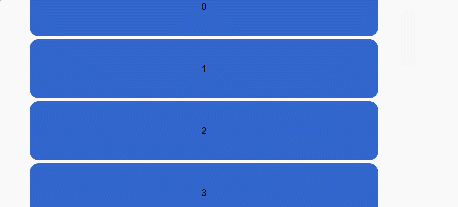

# ScrollBar<a name="ZH-CN_TOPIC_0000001237715099"></a>

> **说明：** 
>该组件从API Version 8开始支持。后续版本如有新增内容，则采用上角标单独标记该内容的起始版本。

滚动条组件ScrollBar，用于配合可滚动组件使用，如List、Grid、Scroll。

## 权限列表<a name="section9776134617382"></a>

无

## 子组件<a name="section6691716153919"></a>

可以包含单个子组件。

## 接口<a name="section5475917144111"></a>

ScrollBar\(value: ScrollBarOption\)

-   ScrollBarOption的参数描述

    <table><thead align="left"><tr><th class="cellrowborder" valign="top" width="19.37%" id="mcps1.1.6.1.1"><p>参数名</p>
    </th>
    <th class="cellrowborder" valign="top" width="20.630000000000003%" id="mcps1.1.6.1.2"><p>参数类型</p>
    </th>
    <th class="cellrowborder" valign="top" width="20%" id="mcps1.1.6.1.3"><p>必填</p>
    </th>
    <th class="cellrowborder" valign="top" width="20%" id="mcps1.1.6.1.4"><p>默认值</p>
    </th>
    <th class="cellrowborder" valign="top" width="20%" id="mcps1.1.6.1.5"><p>参数描述</p>
    </th>
    </tr>
    </thead>
    <tbody><tr><td class="cellrowborder" valign="top" width="19.37%" headers="mcps1.1.6.1.1 "><p>scroller</p>
    </td>
    <td class="cellrowborder" valign="top" width="20.630000000000003%" headers="mcps1.1.6.1.2 "><p><a href="ts-container-scroll.md#section123902548458">Scroller</a></p>
    </td>
    <td class="cellrowborder" valign="top" width="20%" headers="mcps1.1.6.1.3 "><p>是</p>
    </td>
    <td class="cellrowborder" valign="top" width="20%" headers="mcps1.1.6.1.4 "><p>-</p>
    </td>
    <td class="cellrowborder" valign="top" width="20%" headers="mcps1.1.6.1.5 "><p>可滚动组件的控制器。用于与可滚动组件进行绑定。</p>
    </td>
    </tr>
    <tr><td class="cellrowborder" valign="top" width="19.37%" headers="mcps1.1.6.1.1 "><p>direction</p>
    </td>
    <td class="cellrowborder" valign="top" width="20.630000000000003%" headers="mcps1.1.6.1.2 "><p><a href="#li3339655172412">ScrollBarDirection</a></p>
    </td>
    <td class="cellrowborder" valign="top" width="20%" headers="mcps1.1.6.1.3 "><p>否</p>
    </td>
    <td class="cellrowborder" valign="top" width="20%" headers="mcps1.1.6.1.4 "><p>ScrollBarDirection.Vertical</p>
    </td>
    <td class="cellrowborder" valign="top" width="20%" headers="mcps1.1.6.1.5 "><p>滚动条的方向，控制可滚动组件对应方向的滚动。</p>
    </td>
    </tr>
    <tr><td class="cellrowborder" valign="top" width="19.37%" headers="mcps1.1.6.1.1 "><p>state</p>
    </td>
    <td class="cellrowborder" valign="top" width="20.630000000000003%" headers="mcps1.1.6.1.2 "><p><a href="#li719411322578">BarState</a></p>
    </td>
    <td class="cellrowborder" valign="top" width="20%" headers="mcps1.1.6.1.3 "><p>否</p>
    </td>
    <td class="cellrowborder" valign="top" width="20%" headers="mcps1.1.6.1.4 "><p>BarState.Auto</p>
    </td>
    <td class="cellrowborder" valign="top" width="20%" headers="mcps1.1.6.1.5 "><p>滚动条状态。</p>
    </td>
    </tr>
    </tbody>
    </table>

    > **说明：** 
    >ScrollBar组件负责定义可滚动区域的行为样式，ScrollBar的子节点负责定义滚动条的行为样式。
    >滚动条组件与可滚动组件通过Scroller进行绑定，且只有当两者方向相同时，才能联动，ScrollBar与可滚动组件仅支持一对一绑定。

-   <a name="li3339655172412"></a>ScrollBarDirection枚举说明

    <table><thead align="left"><tr><th class="cellrowborder" valign="top" width="50%" id="mcps1.1.3.1.1"><p>名称</p>
    </th>
    <th class="cellrowborder" valign="top" width="50%" id="mcps1.1.3.1.2"><p>描述</p>
    </th>
    </tr>
    </thead>
    <tbody><tr><td class="cellrowborder" valign="top" width="50%" headers="mcps1.1.3.1.1 "><p>Vertical</p>
    </td>
    <td class="cellrowborder" valign="top" width="50%" headers="mcps1.1.3.1.2 "><p>纵向滚动条。</p>
    </td>
    </tr>
    <tr><td class="cellrowborder" valign="top" width="50%" headers="mcps1.1.3.1.1 "><p>Horizontal</p>
    </td>
    <td class="cellrowborder" valign="top" width="50%" headers="mcps1.1.3.1.2 "><p>横向滚动条。</p>
    </td>
    </tr>
    </tbody>
    </table>

-   <a name="li719411322578"></a>BarState枚举说明

    <table><thead align="left"><tr><th class="cellrowborder" valign="top" width="50%" id="mcps1.1.3.1.1"><p>名称</p>
    </th>
    <th class="cellrowborder" valign="top" width="50%" id="mcps1.1.3.1.2"><p>描述</p>
    </th>
    </tr>
    </thead>
    <tbody><tr><td class="cellrowborder" valign="top" width="50%" headers="mcps1.1.3.1.1 "><p>On</p>
    </td>
    <td class="cellrowborder" valign="top" width="50%" headers="mcps1.1.3.1.2 "><p>常驻显示。</p>
    </td>
    </tr>
    <tr><td class="cellrowborder" valign="top" width="50%" headers="mcps1.1.3.1.1 "><p>Off</p>
    </td>
    <td class="cellrowborder" valign="top" width="50%" headers="mcps1.1.3.1.2 "><p>不显示。</p>
    </td>
    </tr>
    <tr><td class="cellrowborder" valign="top" width="50%" headers="mcps1.1.3.1.1 "><p>Auto</p>
    </td>
    <td class="cellrowborder" valign="top" width="50%" headers="mcps1.1.3.1.2 "><p>按需显示(触摸时显示，无操作2s后消失)。</p>
    </td>
    </tr>
    </tbody>
    </table>


## 示例<a name="section12159163318014"></a>

```
@Entry
@Component
struct ScrollBarExample {
  private scroller: Scroller = new Scroller()
  private arr: number[] = [0, 1, 2, 3, 4, 5, 6, 7, 8, 9]

  build() {
    Column() {
      Stack({ alignContent: Alignment.End }) {
        Scroll(this.scroller) {
          Flex({ direction: FlexDirection.Column }) {
            ForEach(this.arr, (item) => {
              Row() {
                Text(item.toString())
                  .width('90%')
                  .height(100)
                  .backgroundColor('#3366CC')
                  .borderRadius(15)
                  .fontSize(16)
                  .textAlign(TextAlign.Center)
                  .margin({ top: 5 })
              }
            }, item => item)
          }.margin({ left: 52 })
        }
        .scrollBar(BarState.Off)
        .scrollable(ScrollDirection.Vertical)
        ScrollBar({ scroller: this.scroller, direction: ScrollBarDirection.Vertical,state: BarState.Auto }) {
          Text()
            .width(30)
            .height(100)
            .borderRadius(10)
            .backgroundColor('#C0C0C0')
        }.width(30).backgroundColor('#ededed')
      }
    }
  }
}
```



