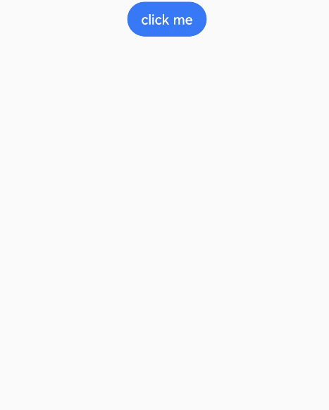

# 自定义弹窗<a name="ZH-CN_TOPIC_0000001237355055"></a>

> **说明：** 
>从API Version 7开始支持。后续版本如有新增内容，则采用上角标单独标记该内容的起始版本。

通过CustomDialogController类显示自定义弹窗。

## 接口<a name="section14945157165212"></a>

CustomDialogController\(value:\{builder: CustomDialog, cancel?: \(\) =\> void, autoCancel?: boolean\}\)

-   参数

    <table><thead align="left"><tr><th class="cellrowborder" valign="top" width="13.16%" id="mcps1.1.6.1.1"><p>参数名</p>
    </th>
    <th class="cellrowborder" valign="top" width="20.75%" id="mcps1.1.6.1.2"><p>参数类型</p>
    </th>
    <th class="cellrowborder" valign="top" width="5.680000000000001%" id="mcps1.1.6.1.3"><p>必填</p>
    </th>
    <th class="cellrowborder" valign="top" width="24.14%" id="mcps1.1.6.1.4"><p>默认值</p>
    </th>
    <th class="cellrowborder" valign="top" width="36.27%" id="mcps1.1.6.1.5"><p>参数描述</p>
    </th>
    </tr>
    </thead>
    <tbody><tr><td class="cellrowborder" valign="top" width="13.16%" headers="mcps1.1.6.1.1 "><p>builder</p>
    </td>
    <td class="cellrowborder" valign="top" width="20.75%" headers="mcps1.1.6.1.2 "><p><a href="217.md">CustomDialog</a></p>
    </td>
    <td class="cellrowborder" valign="top" width="5.680000000000001%" headers="mcps1.1.6.1.3 "><p>是</p>
    </td>
    <td class="cellrowborder" valign="top" width="24.14%" headers="mcps1.1.6.1.4 "><p>-</p>
    </td>
    <td class="cellrowborder" valign="top" width="36.27%" headers="mcps1.1.6.1.5 "><p>自定义弹窗内容构造器。</p>
    </td>
    </tr>
    <tr><td class="cellrowborder" valign="top" width="13.16%" headers="mcps1.1.6.1.1 "><p>cancel</p>
    </td>
    <td class="cellrowborder" valign="top" width="20.75%" headers="mcps1.1.6.1.2 "><p>() =&gt; void</p>
    </td>
    <td class="cellrowborder" valign="top" width="5.680000000000001%" headers="mcps1.1.6.1.3 "><p>否</p>
    </td>
    <td class="cellrowborder" valign="top" width="24.14%" headers="mcps1.1.6.1.4 "><p>-</p>
    </td>
    <td class="cellrowborder" valign="top" width="36.27%" headers="mcps1.1.6.1.5 "><p>点击遮障层退出时的回调。</p>
    </td>
    </tr>
    <tr><td class="cellrowborder" valign="top" width="13.16%" headers="mcps1.1.6.1.1 "><p>autoCancel</p>
    </td>
    <td class="cellrowborder" valign="top" width="20.75%" headers="mcps1.1.6.1.2 "><p>boolean</p>
    </td>
    <td class="cellrowborder" valign="top" width="5.680000000000001%" headers="mcps1.1.6.1.3 "><p>否</p>
    </td>
    <td class="cellrowborder" valign="top" width="24.14%" headers="mcps1.1.6.1.4 "><p>true</p>
    </td>
    <td class="cellrowborder" valign="top" width="36.27%" headers="mcps1.1.6.1.5 "><p>是否允许点击遮障层退出。</p>
    </td>
    </tr>
    <tr><td class="cellrowborder" valign="top" width="13.16%" headers="mcps1.1.6.1.1 "><p>alignment</p>
    </td>
    <td class="cellrowborder" valign="top" width="20.75%" headers="mcps1.1.6.1.2 "><p><a href="#li46304184186">DialogAlignment</a></p>
    </td>
    <td class="cellrowborder" valign="top" width="5.680000000000001%" headers="mcps1.1.6.1.3 "><p>否</p>
    </td>
    <td class="cellrowborder" valign="top" width="24.14%" headers="mcps1.1.6.1.4 "><p><a href="#li46304184186">DialogAlignment</a>.Default</p>
    </td>
    <td class="cellrowborder" valign="top" width="36.27%" headers="mcps1.1.6.1.5 "><p>弹窗在竖直方向上的对齐方式。</p>
    </td>
    </tr>
    <tr><td class="cellrowborder" valign="top" width="13.16%" headers="mcps1.1.6.1.1 "><p>offset</p>
    </td>
    <td class="cellrowborder" valign="top" width="20.75%" headers="mcps1.1.6.1.2 "><p>{</p>
    <p>dx: Length | Resource,</p>
    <p>dy: Length  | Resource</p>
    <p>}</p>
    </td>
    <td class="cellrowborder" valign="top" width="5.680000000000001%" headers="mcps1.1.6.1.3 "><p>否</p>
    </td>
    <td class="cellrowborder" valign="top" width="24.14%" headers="mcps1.1.6.1.4 "><p>-</p>
    </td>
    <td class="cellrowborder" valign="top" width="36.27%" headers="mcps1.1.6.1.5 "><p>弹窗相对alignment所在位置的偏移量。</p>
    </td>
    </tr>
    <tr><td class="cellrowborder" valign="top" width="13.16%" headers="mcps1.1.6.1.1 "><p>customStyle</p>
    </td>
    <td class="cellrowborder" valign="top" width="20.75%" headers="mcps1.1.6.1.2 "><p>boolean</p>
    </td>
    <td class="cellrowborder" valign="top" width="5.680000000000001%" headers="mcps1.1.6.1.3 "><p>否</p>
    </td>
    <td class="cellrowborder" valign="top" width="24.14%" headers="mcps1.1.6.1.4 "><p>false</p>
    </td>
    <td class="cellrowborder" valign="top" width="36.27%" headers="mcps1.1.6.1.5 "><p>弹窗容器样式是否自定义。</p>
    </td>
    </tr>
    </tbody>
    </table>

-   <a name="li46304184186"></a>DialogAlignment枚举说明

    <table><thead align="left"><tr><th class="cellrowborder" valign="top" width="25.2%" id="mcps1.1.3.1.1"><p>名称</p>
    </th>
    <th class="cellrowborder" valign="top" width="74.8%" id="mcps1.1.3.1.2"><p>描述</p>
    </th>
    </tr>
    </thead>
    <tbody><tr><td class="cellrowborder" valign="top" width="25.2%" headers="mcps1.1.3.1.1 "><p>Top</p>
    </td>
    <td class="cellrowborder" valign="top" width="74.8%" headers="mcps1.1.3.1.2 "><p>垂直顶部对齐。</p>
    </td>
    </tr>
    <tr><td class="cellrowborder" valign="top" width="25.2%" headers="mcps1.1.3.1.1 "><p>Center</p>
    </td>
    <td class="cellrowborder" valign="top" width="74.8%" headers="mcps1.1.3.1.2 "><p>垂直居中对齐。</p>
    </td>
    </tr>
    <tr><td class="cellrowborder" valign="top" width="25.2%" headers="mcps1.1.3.1.1 "><p>Bottom</p>
    </td>
    <td class="cellrowborder" valign="top" width="74.8%" headers="mcps1.1.3.1.2 "><p>垂直底部对齐。</p>
    </td>
    </tr>
    <tr><td class="cellrowborder" valign="top" width="25.2%" headers="mcps1.1.3.1.1 "><p>Default</p>
    </td>
    <td class="cellrowborder" valign="top" width="74.8%" headers="mcps1.1.3.1.2 "><p>默认对齐。</p>
    </td>
    </tr>
    </tbody>
    </table>


### CustomDialogController<a name="section8664549161612"></a>

创建对象

```
dialogController : CustomDialogController = new CustomDialogController(value:{builder: CustomDialog, cancel?: () => void, autoCancel?: boolean})
```

open\(\)

显示自定义弹窗内容，若已显示，则不生效。

close\(\)

关闭显示的自定义弹窗，若已关闭，则不生效。

## 示例<a name="section1033712576815"></a>

```
@CustomDialog
struct CustomDialogExample {
  controller: CustomDialogController
  cancel: () => void
  confirm: () => void

  build() {
    Column() {
      Text('Software uninstall').width('70%').fontSize(20).margin({ top: 10, bottom: 10 })
      Image($r('app.media.icon')).width(80).height(80)
      Text('Whether to uninstall a software?').fontSize(16).margin({ bottom: 10 })
      Flex({ justifyContent: FlexAlign.SpaceAround }) {
        Button('cancel')
          .onClick(() => {
            this.controller.close()
            this.cancel()
          }).backgroundColor(0xffffff).fontColor(Color.Black)
        Button('confirm')
          .onClick(() => {
            this.controller.close()
            this.confirm()
          }).backgroundColor(0xffffff).fontColor(Color.Red)
      }.margin({ bottom: 10 })
    }
  }
}

@Entry
@Component
struct CustomDialogUser {
  dialogController: CustomDialogController = new CustomDialogController({
    builder: CustomDialogExample({ cancel: this.onCancel, confirm: this.onAccept }),
    cancel: this.existApp,
    autoCancel: true
  })

  onCancel() {
    console.info('Callback when the first button is clicked')
  }
  onAccept() {
    console.info('Callback when the second button is clicked')
  }
  existApp() {
    console.info('Click the callback in the blank area')
  }

  build() {
    Column() {
      Button('click me')
        .onClick(() => {
          this.dialogController.open()
        }).backgroundColor(0x317aff)
    }.width('100%').margin({ top: 5 })
  }
}
```



