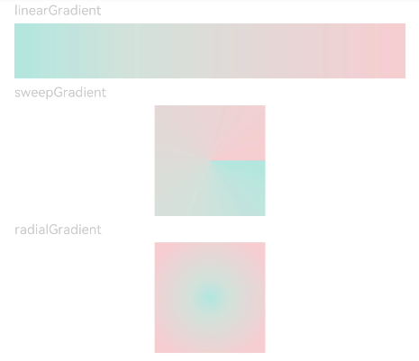

# 颜色渐变<a name="ZH-CN_TOPIC_0000001237355083"></a>

> **说明：** 
>从API Version 7开始支持。后续版本如有新增内容，则采用上角标单独标记该内容的起始版本。

## 权限列表<a name="section781125411508"></a>

无

## 属性<a name="section6820191711316"></a>

<table><thead align="left"><tr><th class="cellrowborder" valign="top" width="17.86%" id="mcps1.1.5.1.1"><p>名称</p>
</th>
<th class="cellrowborder" valign="top" width="35.92%" id="mcps1.1.5.1.2"><p>参数类型</p>
</th>
<th class="cellrowborder" valign="top" width="9.4%" id="mcps1.1.5.1.3"><p>默认值</p>
</th>
<th class="cellrowborder" valign="top" width="36.82%" id="mcps1.1.5.1.4"><p>描述</p>
</th>
</tr>
</thead>
<tbody><tr><td class="cellrowborder" valign="top" width="17.86%" headers="mcps1.1.5.1.1 "><p>linearGradient</p>
</td>
<td class="cellrowborder" valign="top" width="35.92%" headers="mcps1.1.5.1.2 "><p>{</p>
<p>angle?: <a href="../../toctopics/zh-cn_topic_0000001237475069.md#section1530915545289">Angle</a>,</p>
<p>direction?:<a href="#li1798245810543">GradientDirection</a>,</p>
<p>colors: Array&lt;<a href="../../toctopics/zh-cn_topic_0000001237475069.md#section5633640161413">ColorStop</a>&gt;</p>
<p>repeating?: boolean</p>
<p>}</p>
</td>
<td class="cellrowborder" valign="top" width="9.4%" headers="mcps1.1.5.1.3 "><p>-</p>
</td>
<td class="cellrowborder" valign="top" width="36.82%" headers="mcps1.1.5.1.4 "><p>线性渐变。</p>
<p>angle: 线性渐变的角度。</p>
<p>direction: 线性渐变的方向。</p>
<p>colors: 为渐变的颜色描述。</p>
<p>repeating: 为渐变的颜色重复着色。</p>
</td>
</tr>
<tr><td class="cellrowborder" valign="top" width="17.86%" headers="mcps1.1.5.1.1 "><p>sweepGradient</p>
</td>
<td class="cellrowborder" valign="top" width="35.92%" headers="mcps1.1.5.1.2 "><p>{</p>
<p>center: Point,</p>
<p>start?: angle,</p>
<p>end?: angle,</p>
<p>colors: Array&lt;<a href="../../toctopics/zh-cn_topic_0000001237475069.md#section5633640161413">ColorStop</a>&gt;</p>
<p>repeating?: boolean</p>
<p>}</p>
</td>
<td class="cellrowborder" valign="top" width="9.4%" headers="mcps1.1.5.1.3 "><p>-</p>
</td>
<td class="cellrowborder" valign="top" width="36.82%" headers="mcps1.1.5.1.4 "><p>角度渐变。</p>
<p>center：为角度渐变的中心点。</p>
<p>start：角度渐变的起点。</p>
<p>end：角度渐变的终点。</p>
<p>colors: 为渐变的颜色描述。</p>
<p>repeating: 为渐变的颜色重复着色。</p>
</td>
</tr>
<tr><td class="cellrowborder" valign="top" width="17.86%" headers="mcps1.1.5.1.1 "><p>radialGradient</p>
</td>
<td class="cellrowborder" valign="top" width="35.92%" headers="mcps1.1.5.1.2 "><p>{</p>
<p>center: Point,</p>
<p>radius: Length,</p>
<p>colors: Array&lt;<a href="../../toctopics/zh-cn_topic_0000001237475069.md#section5633640161413">ColorStop</a>&gt;</p>
<p>repeating: boolean</p>
<p>}</p>
</td>
<td class="cellrowborder" valign="top" width="9.4%" headers="mcps1.1.5.1.3 "><p>-</p>
</td>
<td class="cellrowborder" valign="top" width="36.82%" headers="mcps1.1.5.1.4 "><p>径向渐变。</p>
<p>center：径向渐变的中心点。</p>
<p>radius：径向渐变的半径。</p>
<p>colors: 为渐变的颜色描述。</p>
<p>repeating: 为渐变的颜色重复着色。</p>
</td>
</tr>
</tbody>
</table>

-   <a name="li1798245810543"></a>GradientDirection枚举说明

    GradientDirection用于描述渐变方向。

    <table><thead align="left"><tr><th class="cellrowborder" valign="top" width="41.68%" id="mcps1.1.3.1.1"><p>名称</p>
    </th>
    <th class="cellrowborder" valign="top" width="58.32000000000001%" id="mcps1.1.3.1.2"><p>描述</p>
    </th>
    </tr>
    </thead>
    <tbody><tr><td class="cellrowborder" valign="top" width="41.68%" headers="mcps1.1.3.1.1 "><p>Left</p>
    </td>
    <td class="cellrowborder" valign="top" width="58.32000000000001%" headers="mcps1.1.3.1.2 "><p>从右向左。</p>
    </td>
    </tr>
    <tr><td class="cellrowborder" valign="top" width="41.68%" headers="mcps1.1.3.1.1 "><p>Top</p>
    </td>
    <td class="cellrowborder" valign="top" width="58.32000000000001%" headers="mcps1.1.3.1.2 "><p>从下向上。</p>
    </td>
    </tr>
    <tr><td class="cellrowborder" valign="top" width="41.68%" headers="mcps1.1.3.1.1 "><p>Right</p>
    </td>
    <td class="cellrowborder" valign="top" width="58.32000000000001%" headers="mcps1.1.3.1.2 "><p>从左向右。</p>
    </td>
    </tr>
    <tr><td class="cellrowborder" valign="top" width="41.68%" headers="mcps1.1.3.1.1 "><p>Bottom</p>
    </td>
    <td class="cellrowborder" valign="top" width="58.32000000000001%" headers="mcps1.1.3.1.2 "><p>从上向下。</p>
    </td>
    </tr>
    <tr><td class="cellrowborder" valign="top" width="41.68%" headers="mcps1.1.3.1.1 "><p>LeftTop</p>
    </td>
    <td class="cellrowborder" valign="top" width="58.32000000000001%" headers="mcps1.1.3.1.2 "><p>左上。</p>
    </td>
    </tr>
    <tr><td class="cellrowborder" valign="top" width="41.68%" headers="mcps1.1.3.1.1 "><p>LeftBottom</p>
    </td>
    <td class="cellrowborder" valign="top" width="58.32000000000001%" headers="mcps1.1.3.1.2 "><p>左下。</p>
    </td>
    </tr>
    <tr><td class="cellrowborder" valign="top" width="41.68%" headers="mcps1.1.3.1.1 "><p>RightTop</p>
    </td>
    <td class="cellrowborder" valign="top" width="58.32000000000001%" headers="mcps1.1.3.1.2 "><p>右上。</p>
    </td>
    </tr>
    <tr><td class="cellrowborder" valign="top" width="41.68%" headers="mcps1.1.3.1.1 "><p>RightBottom</p>
    </td>
    <td class="cellrowborder" valign="top" width="58.32000000000001%" headers="mcps1.1.3.1.2 "><p>右下。</p>
    </td>
    </tr>
    <tr><td class="cellrowborder" valign="top" width="41.68%" headers="mcps1.1.3.1.1 "><p>None</p>
    </td>
    <td class="cellrowborder" valign="top" width="58.32000000000001%" headers="mcps1.1.3.1.2 "><p>无。</p>
    </td>
    </tr>
    </tbody>
    </table>


## 示例<a name="section5724154094916"></a>

```
@Entry
@Component
struct ColorGradientExample {
  build() {
    Column({ space: 5 }) {
      Text('linearGradient').fontSize(12).width('90%').fontColor(0xCCCCCC)
      Row()
        .width('90%')
        .height(50)
        .linearGradient({
          angle: 90,
          direction: GradientDirection.Left,
          colors: [[0xAEE1E1, 0.0], [0xD3E0DC, 0.3], [0xFCD1D1, 1.0]]
        })
      Text('sweepGradient').fontSize(12).width('90%').fontColor(0xCCCCCC)
      Row()
        .width(100)
        .height(100)
        .sweepGradient({
          center: [50, 50],
          start: 0,
          end: 359,
          colors: [[0xAEE1E1, 0.0], [0xD3E0DC, 0.3], [0xFCD1D1, 1.0]]
        })
      Text('radialGradient').fontSize(12).width('90%').fontColor(0xCCCCCC)
      Row()
        .width(100)
        .height(100)
        .radialGradient({
          center: [50, 50],
          radius: 60,
          colors:[[0xAEE1E1, 0.0], [0xD3E0DC, 0.3], [0xFCD1D1, 1.0]]
        })
    }
    .width('100%')
    .padding({ top: 5 })
  }
}
```



