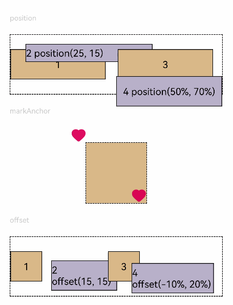

# 位置设置<a name="ZH-CN_TOPIC_0000001193075116"></a>

> **说明：** 
>从API Version 7开始支持。后续版本如有新增内容，则采用上角标单独标记该内容的起始版本。

## 权限列表<a name="section781125411508"></a>

无

## 属性<a name="section8832145623"></a>

<table><thead align="left"><tr><th class="cellrowborder" valign="top" width="17.341734173417343%" id="mcps1.1.5.1.1"><p>名称</p>
</th>
<th class="cellrowborder" valign="top" width="28.672867286728675%" id="mcps1.1.5.1.2"><p>参数类型</p>
</th>
<th class="cellrowborder" valign="top" width="14.35143514351435%" id="mcps1.1.5.1.3"><p>默认值</p>
</th>
<th class="cellrowborder" valign="top" width="39.63396339633963%" id="mcps1.1.5.1.4"><p>描述</p>
</th>
</tr>
</thead>
<tbody><tr><td class="cellrowborder" valign="top" width="17.341734173417343%" headers="mcps1.1.5.1.1 "><p>align</p>
</td>
<td class="cellrowborder" valign="top" width="28.672867286728675%" headers="mcps1.1.5.1.2 "><p><a href="ts-appendix-enums.md#section1145418513159">Alignment</a></p>
</td>
<td class="cellrowborder" valign="top" width="14.35143514351435%" headers="mcps1.1.5.1.3 "><p>Center</p>
</td>
<td class="cellrowborder" valign="top" width="39.63396339633963%" headers="mcps1.1.5.1.4 "><p>设置元素内容的对齐方式，只有当设置的width和height大小超过元素本身内容大小时生效。</p>
</td>
</tr>
<tr><td class="cellrowborder" valign="top" width="17.341734173417343%" headers="mcps1.1.5.1.1 "><p>direction</p>
</td>
<td class="cellrowborder" valign="top" width="28.672867286728675%" headers="mcps1.1.5.1.2 "><p><a href="#li12312485585">Direction</a></p>
</td>
<td class="cellrowborder" valign="top" width="14.35143514351435%" headers="mcps1.1.5.1.3 "><p>Auto</p>
</td>
<td class="cellrowborder" valign="top" width="39.63396339633963%" headers="mcps1.1.5.1.4 "><p>设置元素水平方向的布局，可选值参照<a href="#li12312485585">Direction</a>枚举说明。</p>
</td>
</tr>
<tr><td class="cellrowborder" valign="top" width="17.341734173417343%" headers="mcps1.1.5.1.1 "><p>position</p>
</td>
<td class="cellrowborder" valign="top" width="28.672867286728675%" headers="mcps1.1.5.1.2 "><p>{</p>
<p>x: Length,</p>
<p>y: Length</p>
<p>}</p>
</td>
<td class="cellrowborder" valign="top" width="14.35143514351435%" headers="mcps1.1.5.1.3 "><p>-</p>
</td>
<td class="cellrowborder" valign="top" width="39.63396339633963%" headers="mcps1.1.5.1.4 "><p>使用绝对定位，设置元素锚点相对于父容器顶部起点偏移位置。在布局容器中，设置该属性不影响父容器布局，仅在绘制时进行位置调整。</p>
</td>
</tr>
<tr><td class="cellrowborder" valign="top" width="17.341734173417343%" headers="mcps1.1.5.1.1 "><p>markAnchor</p>
</td>
<td class="cellrowborder" valign="top" width="28.672867286728675%" headers="mcps1.1.5.1.2 "><p>{</p>
<p>x: Length,</p>
<p>y: Length</p>
<p>}</p>
</td>
<td class="cellrowborder" valign="top" width="14.35143514351435%" headers="mcps1.1.5.1.3 "><p>{</p>
<p>x: 0,</p>
<p>y: 0</p>
<p>}</p>
</td>
<td class="cellrowborder" valign="top" width="39.63396339633963%" headers="mcps1.1.5.1.4 "><p>设置元素在位置定位时的锚点，以元素顶部起点作为基准点进行偏移。</p>
</td>
</tr>
<tr><td class="cellrowborder" valign="top" width="17.341734173417343%" headers="mcps1.1.5.1.1 "><p>offset</p>
</td>
<td class="cellrowborder" valign="top" width="28.672867286728675%" headers="mcps1.1.5.1.2 "><p>{</p>
<p>x: Length,</p>
<p>y: Length</p>
<p>}</p>
</td>
<td class="cellrowborder" valign="top" width="14.35143514351435%" headers="mcps1.1.5.1.3 "><p>{</p>
<p>x: 0,</p>
<p>y: 0</p>
<p>}</p>
</td>
<td class="cellrowborder" valign="top" width="39.63396339633963%" headers="mcps1.1.5.1.4 "><p>相对布局完成位置坐标偏移量，设置该属性，不影响父容器布局，仅在绘制时进行位置调整。</p>
</td>
</tr>
</tbody>
</table>

-   <a name="li12312485585"></a>Direction枚举说明

    <table><thead align="left"><tr><th class="cellrowborder" valign="top" width="25.2%" id="mcps1.1.3.1.1"><p>名称</p>
    </th>
    <th class="cellrowborder" valign="top" width="74.8%" id="mcps1.1.3.1.2"><p>描述</p>
    </th>
    </tr>
    </thead>
    <tbody><tr><td class="cellrowborder" valign="top" width="25.2%" headers="mcps1.1.3.1.1 "><p>Ltr</p>
    </td>
    <td class="cellrowborder" valign="top" width="74.8%" headers="mcps1.1.3.1.2 "><p>元素从左到右布局。</p>
    </td>
    </tr>
    <tr><td class="cellrowborder" valign="top" width="25.2%" headers="mcps1.1.3.1.1 "><p>Rtl</p>
    </td>
    <td class="cellrowborder" valign="top" width="74.8%" headers="mcps1.1.3.1.2 "><p>元素从右到左布局。</p>
    </td>
    </tr>
    <tr><td class="cellrowborder" valign="top" width="25.2%" headers="mcps1.1.3.1.1 "><p>Auto</p>
    </td>
    <td class="cellrowborder" valign="top" width="74.8%" headers="mcps1.1.3.1.2 "><p>使用系统默认布局方向。</p>
    </td>
    </tr>
    </tbody>
    </table>


## 示例<a name="section12073184715"></a>

```
@Entry
@Component
struct PositionExample {
  build() {
    Column() {
      Column({space: 10}) {
        Text('align').fontSize(9).fontColor(0xCCCCCC).width('90%')
        Text('top start')
          .align(Alignment.TopStart)
          .height(50)
          .width('90%')
          .fontSize(16)
          .backgroundColor(0xFFE4C4)

        Text('direction').fontSize(9).fontColor(0xCCCCCC).width('90%')
        Row() {
          Text('1').height(50).width('25%').fontSize(16).backgroundColor(0xF5DEB3)
          Text('2').height(50).width('25%').fontSize(16).backgroundColor(0xD2B48C)
          Text('3').height(50).width('25%').fontSize(16).backgroundColor(0xF5DEB3)
          Text('4').height(50).width('25%').fontSize(16).backgroundColor(0xD2B48C)
        }
        .width('90%')
        .direction(Direction.Rtl)
      }
    }
    .width('100%').margin({ top: 5 }).direction(Direction.Rtl)
  }
}
```


```
@Entry
@Component
struct PositionExample2 {
  build() {
    Column({ space: 20 }) {
      Text('position').fontSize(12).fontColor(0xCCCCCC).width('90%')
      Row({ space: 20 }) {
        Text('1').size({ width: '45%', height: '50' }).backgroundColor(0xdeb887).border({ width: 1 }) .fontSize(16)
        Text('2 position(25, 15)')
          .size({ width: '60%', height: '30' }).backgroundColor(0xbbb2cb).border({ width: 1 })
          .fontSize(16).align(Alignment.Start)
          .position({ x: 25, y: 15 })
        Text('3').size({ width: '45%', height: '50' }).backgroundColor(0xdeb887).border({ width: 1 }).fontSize(16)
        Text('4 position(50%, 70%)')
          .size({ width: '50%', height: '50' }).backgroundColor(0xbbb2cb).border({ width: 1 }).fontSize(16)
          .position({ x: '50%', y: '70%' })
      }.width('90%').height(100).border({ width: 1, style: BorderStyle.Dashed })

      Text('markAnchor').fontSize(12).fontColor(0xCCCCCC).width('90%')
      Stack({ alignContent: Alignment.TopStart }) {
        Row()
          .size({ width: '100', height: '100' })
          .backgroundColor(0xdeb887)
        Image($r('app.media.ic_health_heart'))
          .size({ width: 25, height: 25 })
          .markAnchor({ x: 25, y: 25 })
        Image($r('app.media.ic_health_heart'))
          .size({ width: 25, height: 25 })
          .markAnchor({ x: 25, y: 25 })
          .position({ x: '100%', y: '100%' })
      }.margin({ top: 25 }).border({ width: 1, style: BorderStyle.Dashed })

      Text('offset').fontSize(12).fontColor(0xCCCCCC).width('90%')
      Row() {
        Text('1').size({ width: '15%', height: '50' }).backgroundColor(0xdeb887).border({ width: 1 }).fontSize(16)
        Text('2\noffset(15, 15)')
          .size({ width: 120, height: '50' }).backgroundColor(0xbbb2cb).border({ width: 1 })
          .fontSize(16).align(Alignment.Start)
          .offset({ x: 15, y: 15 })
        Text('3').size({ width: '15%', height: '50' }).backgroundColor(0xdeb887).border({ width: 1 }).fontSize(16)
        Text('4\noffset(-10%, 20%)')
          .size({ width: 150, height: '50' }) .backgroundColor(0xbbb2cb).border({ width: 1 }).fontSize(16)
          .offset({ x: '-10%', y: '20%' })
      }.width('90%').height(100).border({ width: 1, style: BorderStyle.Dashed })
    }
    .width('100%').margin({ top: 25 })
  }
}
```



